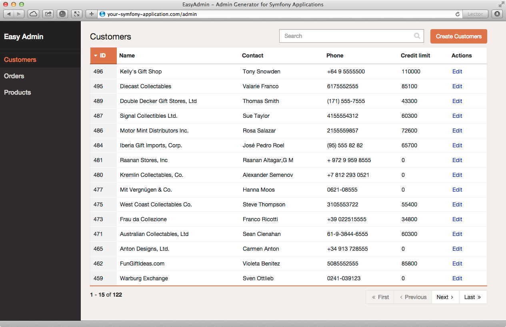

EasyAdmin
=========


EasyAdmin lets you create administration backends for Symfony applications
with unprecedented simplicity.

**Features**

  * **CRUD** operations on Doctrine entities (create, edit, list, delete).
  * Full-text **search**, **pagination** and column **sorting**.
  * Fully **responsive** design with four break points.
  * **Fast**, **simple** and **smart** where appropriate.

**Requirements**

  * Symfony 2.3+ applications (Silex not supported).
  * Doctrine ORM entities (Doctrine ODM and Propel not supported).
  * Entities with simple primary keys (composite keys not supported).
  * All kinds of entity associations are supported, except `many-to-many`.
  * Entities using inheritance are not supported.

Installation
------------

In order to install EasyAdmin you have to edit two files and execute two
console commands, as explained in the following steps.

### Step 1: Download the Bundle

Open a command console, enter your project directory and execute the
following command to download the latest stable version of this bundle:

```bash
$ composer require javiereguiluz/easyadmin-bundle
```

This command requires you to have Composer installed globally, as explained
in the [installation chapter](https://getcomposer.org/doc/00-intro.md)
of the Composer documentation.

### Step 2: Enable the Bundle

Then, enable the bundle by adding the following line in the `app/AppKernel.php`
file of your project:

```php
<?php
// app/AppKernel.php

// ...
class AppKernel extends Kernel
{
    public function registerBundles()
    {
        $bundles = array(
            // ...
            new JavierEguiluz\Bundle\EasyAdminBundle\EasyAdminBundle(),
        );
    }

    // ...
}
```

### Step 3: Load the Routes of the Bundle

Open your main routing configuration file (usually `app/config/routing.yml`)
and add the following four lines at the very beginning of it:

```yaml
# app/config/routing.yml
easy_admin_bundle:
    resource: "@EasyAdminBundle/Controller/"
    type:     annotation
    prefix:   /admin

# ...
```

### Step 4: Prepare the Web Assets of the Bundle

This bundles includes several CSS, JavaScript and font files used to display
its interface. In order to add those files to your application, execute the
following command:

```cli
php app/console assets:install --symlink
```

That's it! Now everything is ready to create your first admin backend.

Your First Backend
------------------

In order to create your first backend, you have to edit just one file. The
entire process will take you around 30 seconds.

Assuming that you already have defined three Doctrine ORM entities called
`Customer`, `Order` and `Product`, open your main application configuration
file (usually `app/config/config.yml`) and add the following configuration:

```yaml
# app/config/config.yml
easy_admin:
    entities:
        - AppBundle\Entity\Customer
        - AppBundle\Entity\Order
        - AppBundle\Entity\Product
```

**Congratulations! You've just created your first fully-featured backend!**
Browse the `/admin` URL in your Symfony application and you'll get access to
the admin backend:




EasyAdmin doesn't generate any code, not even for the templates. All resources
are served on-the-fly to ensure an exceptional developer experience.

Without any further configuration, EasyAdmin guesses the best settings to make
your admin backend look "good enough". This may be acceptable for simple
backends and rapid prototypes, but most of the times, you need to customize
some parts of the backend. Keep reading to learn how to do it.

Custom Backends
---------------

### Customize the URL Prefix Used to Access the Backend

By default, your backend will be accessible at the `/admin` URI of your Symfony
application. This value is defined in the `prefix` option used when loading
the routes of the bundle. You are free to change its value to meet your own
backend requirements:

```yaml
# app/config/routing.yml
easy_admin_bundle:
    resource: "@EasyAdminBundle/Controller/"
    type:     annotation
    prefix:   /_secret_backend  # <-- change this value

# ...
```

### Customize the Order of the Main Menu Items

Main menu items follow the same order of the entities defined in the admin
configuration file. So you just have to reorder the list of entities to
reorder the main menu elements.

### Customize the Label of the Main Menu Items

By default, main menu items are called after the entities that they represent.
You can define a custom label for each menu item using this alternative
configuration format:

```yaml
# app/config/config.yml
easy_admin:
    entities:
        Clients: AppBundle\Entity\Customer
        Orders: AppBundle\Entity\Order
        Inventory: AppBundle\Entity\Product
```

The keys defined under the `entities` key (in this case, `Clients`, `Orders`
and `Inventory`) will be used as the labels of the main menu items. If the
keys include white spaces or any reserved YAML character, enclose them with
quotes:

```yaml
# app/config/config.yml
easy_admin:
    entities:
        'Active Clients': AppBundle\Entity\Customer
        'Pending Orders': AppBundle\Entity\Order
        'Inventory (2015)': AppBundle\Entity\Product
```

### Customize the Name of the Backend

By default, the backend will display `Easy Admin` as its name. Use the
`site_name` option to change this value:

```yaml
# app/config/config.yml
easy_admin:
    site_name: 'ACME Megacorp.'
    # ...
```

Companies and organizations needs can be so different, that the contents of
this option are not restricted. In fact, the contents are displayed with
the `raw` Twig filter. This means that you can use any HTML markup to display
the name exactly as you are required:

```yaml
# app/config/config.yml
easy_admin:
    site_name: 'ACME <em style="font-size: 80%; color: yellow">Megacorp.</em>'
    # ...
```

If you want to display an image of your logo, use an `` HTML element as
the site name. The following example would show the beautiful Symfony logo as
the name of your backend:

```yaml
# app/config/config.yml
easy_admin:
    site_name: ''
    # ...
```

### Customize the Number of Items Displayed in Listings

By default, listings display a maximum of `15` items. Define the
`list_max_results` option to change this value:

```yaml
# app/config/config.yml
easy_admin:
    list_max_results: 30
    # ...
```

### Customize the Actions Displayed for Each Listing Item

By default, listings just display the `Edit` action for each item. If you also
want to add the popular `Show` action, define the `list_actions` option:

```yaml
# app/config/config.yml
easy_admin:
    list_actions: ['edit', 'show']
    # ...
```

In the current version of EasyAdmin you cannot define custom actions.

### Customize the Labels of the Columns Displayed in Listings

By default, listing column labels are a "humanized" version of the original
name of the related Doctrine entity property. If your property is called
`published`, the column label will be `Published` and if your property is
called `dateOfBirth`, the column label will be `Date of birth`.

In case you want to define a custom label for one or all columns, just use the
following expanded configuration:

```yaml
# app/config/config.yml
easy_admin:
    entities:
        Customer:
            class: AppBundle\Entity\Customer
            list:
                fields: ['id', 'name', { property: 'email', label: 'Contact' }]
    # ...
```

Instead of using a string to define the name of the property (e.g. `email`) you
have to define a hash with the name of the property (`property: 'email'`) and
the custom label you want to display (`label: 'Contact'`).

If your listings contain lots of properties and most of them define their own
custom label, consider using the alternative YAML syntax for sequences to
improve the legibility of your backend configuration. The following example is
equivalent to the above example:

```yaml
# app/config/config.yml
easy_admin:
    entities:
        Customer:
            class: AppBundle\Entity\Customer
            list:
                fields:
                    - 'id'
                    - 'name'
                    - { property: 'email', label: 'Contact' }
    # ...
```

### Customize the Columns Displayed in Listings

By default, the backend makes some "smart guesses" to decide which columns to
display in each entity listing to make it look "good enough". If you want to
override this behavior for some entity, define the fields to show using the
`list` option as follows:

```yaml
# app/config/config.yml
easy_admin:
    entities:
        Customer:
            class: AppBundle\Entity\Customer
            list:
                fields: ['id', 'firstName', 'lastName', 'phone', 'email']
    # ...
```

Please note that defining the `list` option (or any of the other options
explained in the sections below) requires you to also add the `class` option
to indicate the PHP class associated with the entity.

In other words, **the following configuration IS NOT VALID and it will result
in application errors**:

```yaml
# app/config/config.yml
easy_admin:
    entities:
        # THIS CONFIGURATION IS NOT VALID. Use the configuration showed above
        Customer: AppBundle\Entity\Customer
            list:
                fields: ['id', 'firstName', 'lastName', 'phone', 'email']
    # ...
```

#### Virtual Entity Fields

Sometimes, it's useful to include in listings values which are not entity
properties. For example, if your `Customer` entity defines `firstName` and
`lastName` properties, you may want to just display a column called `Name`
with both information merged. These columns are called `virtual fields`
because they don't really exist as real Doctrine entity fields.

First, add this new virtual field to the entity configuration:

```yaml
easy_admin:
    entities:
        Customer:
            class: AppBundle\Entity\Customer
            list:
                fields: ['id', 'name', 'phone', 'email']
    # ...
```

If you reload the backend, you'll see that the virtual field only displays
`Inaccessible` as its value. The reason is that virtual field `name` does not
match any of the entity's properties. To fix this issue, add a new public
method in your entity called `getXxx()` or `xxx()`, where `xxx` is the name of
the virtual field (in this case the field is called `name`, so the method must
be called `getName()` or `name()`):

```php
namespace AppBundle\Entity;

use Doctrine\ORM\Mapping as ORM;

/**
 * @ORM\Entity
 */
class Customer
{
    // ...

    public function getName()
    {
        return $this->getFirstName().' '.$this->getLastName();
    }
}
```

That's it. Reload your backend and now you'll see the real values of this
virtual field. By default, virtual fields are displayed as text contents. If
your virtual field is a *boolean* value or a date, define its time using the
`type` option:

```yaml
# in this example, the virtual fields 'is_eligible' and 'last_contact' will
# be considered strings, even if they return boolean and DateTime values
# respectively
easy_admin:
    entities:
        Customer:
            class: AppBundle\Entity\Customer
            list:
                fields: ['id', 'is_eligible', 'last_contact']
    # ...

# in this example, the virtual fields 'is_eligible' and 'last_contact' will
# be displayed as a boolean and a DateTime value respectively
easy_admin:
    entities:
        Customer:
            class: AppBundle\Entity\Customer
            list:
                fields:
                    - 'id'
                    - { property: 'is_eligible', type: 'boolean' }
                    - { property: 'last_contact', type: 'datetime' }
    # ...
```

The only current limitation of virtual fields is that you cannot reorder
listings using these fields.

### Customize the Format of the Dates and Numbers Displayed in Listings

By default, these are the formats applied to date related fields (read the
[date configuration options](http://php.net/manual/en/function.date.php) PHP
manual page in case you don't know the meaning of these options):

  * `date`: `Y-m-d`
  * `time`:  `H:i:s`
  * `datetime`: `F j, Y H:i`

EasyAdmin lets you configure your own date formats in two ways: default formats
for all fields of all entities and custom format for each entity field. The
default formats are defined in the global `formats` option (define any or all
the `date`, `time` and `datetime` options):

```yaml
easy_admin:
    formats:
        date:     'd/m/Y'
        time:     'H:i'
        datetime: 'd/m/Y H:i:s'
    entities:
        # ...
```

The value of the `format` option is directly applied to the `format()` method
of the `DateTime` class, so you can use any of the
[date configuration options](http://php.net/manual/en/function.date.php)
defined by PHP.

In order to define the date/time format explicitly for a given entity field,
use the `format` option for that specific field:

```yaml
easy_admin:
    entities:
        Customer:
            class: AppBundle\Entity\Customer
            list:
                fields:
                    - { property: 'dateOfBirth', format: 'j/n/Y' }
                    # ...
    # ...
```

Meanwhile, number related fields (`bigint`, `integer`, `smallint`, `decimal`,
`float`) are displayed using the appropriate formatting for the locale of the
Symfony application. Again, you can use the `format` option to explicitly set
the format to use for numeric fields.

Use the global `formats` option to apply the same formatting for all numeric
values:

```yaml
easy_admin:
    formats:
        # ...
        number: '%.2f'
    entities:
        # ...
```

In this case, the value of the `format` option is applied directly to the
`sprintf()` function, so you can use any of its
[format specifiers](http://php.net/manual/en/function.sprintf.php).

In order to define the number format explicitly for a given entity field,
use the `format` option for that specific field:

```yaml
easy_admin:
    entities:
        Product:
            class: AppBundle\Entity\Product
            list:
                fields:
                    - { property: 'serialNumber', format: '%010s' }
                    - { property: 'margin', format: '%01.2f' }
                    # ...
    # ...
```

The `format` option of an entity field always overrides the value of the global
`format` option.

### Customize which Fields are Displayed in the Show Action

By default, the `show` action displays all the entity fields and their
values. Use the `fields` option under the `show` key to restrict the fields to
display:

```yaml
easy_admin:
    entities:
        Customer:
            class: AppBundle\Entity\Customer
            show:
                fields: ['id', 'firstName', 'secondName', 'phone', 'email']
    # ...
```

### Customize the Order of the Fields Displayed in the Show Action

By default, the `show` action displays the entity properties in the same order
as they were defined in the associated entity class. You could customize the
`show` action contents just by reordering the entity properties, but it's more
convenient to just define the order using the `fields` option of the `show`
option:

```yaml
easy_admin:
    entities:
        Customer:
            class: AppBundle\Entity\Customer
            show:
                fields: ['id', 'phone', 'email', 'firstName', 'secondName']
    # ...
```

### Customize the Labels of the Values Displayed in the Show Action

By default, `show` action labels are a "humanized" version of the original
name of the related Doctrine entity property. If your property is called
`published`, the label will be `Published` and if your property is called
`dateOfBirth`, the label will be `Date of birth`.

In case you want to define a custom label for one or all properties, just use
the following expanded configuration:

```yaml
# app/config/config.yml
easy_admin:
    entities:
        Customer:
            class: AppBundle\Entity\Customer
            show:
                fields: ['id', 'name', { property: 'email', label: 'Contact' }]
    # ...
```

Instead of using a string to define the name of the property (e.g. `email`) you
have to define a hash with the name of the property (`property: 'email'`) and
the custom label you want to display (`label: 'Contact'`).

### Customize which Fields are Displayed in Forms

By default, the forms used to create and edit entities display all their
properties. Customize any of these forms for any of your entities using the
`new` and `edit` options:

```yaml
easy_admin:
    entities:
        Customer:
            class: AppBundle\Entity\Customer
            edit:
                fields: ['firstName', 'secondName', 'phone', 'email']
            new:
                fields: ['firstName', 'secondName', 'phone', 'email', 'creditLimit']
    # ...
```

If any of the fields is an association with another entity, the form will
display it as a `<select>` list. The values displayed in this list will be the
values returned by the special `__toString()` method. Define this method in all
your entities to avoid errors and to define the textual representation of the
entity.

### Customize the Order of the Fields Displayed in Forms

By default, forms show their fields in the same order as they were defined in
the associated entities. You could customize the fields order just by
reordering the entity properties, but it's more convenient to just define the
order using the `fields` option of the `new` and `edit` options:

```yaml
easy_admin:
    entities:
        Customer:
            class: AppBundle\Entity\Customer
            edit:
                fields: ['firstName', 'secondName', 'phone', 'email']
            new:
                fields: ['firstName', 'secondName', 'phone', 'email']
    # ...
```

### Customize the Fields Displayed in Forms

By default, all form fields are displayed with the same visual style, they
don't show any help message, and their label and field type are inferred from
their associated Doctrine property.

In case you want to customize any or all form fields, use the extended form
field configuration showed below:

```yaml
easy_admin:
    entities:
        Customer:
            class: AppBundle\Entity\Customer
            edit:
                fields:
                    - 'id'
                    - { property: 'email', type: 'email', label: 'Contact' }
                    - { property: 'code', type: 'number', label: 'Customer Code', class: 'input-lg' }
                    - { property: 'notes', help: 'Use this field to add private notes and comments about the client' }
                    - { property: 'zone', type: 'country' }
    # ...
```

These are the options that you can define for form fields:

  * `property`: it's the name of the associated Doctrine entity property. It
    can be a real property or a "virtual property" based on an entity method.
    This is the only mandatory option.
  * `type`: it's the type of form field that will be displayed. If you don't
    specify a type, EasyAdmin will guess the best type for it. For now, you
    can only use any of the valid [Symfony Form Types](http://symfony.com/doc/current/reference/forms/types.html).
  * `label`: it's the title that will be displayed for the form field. The
    default title is the "humanized" version of the property name.
  * `help`: it's the help message that will be displayed below the form field.
  * `class`: it's the CSS class that will be applied to the form field widget.
    For example, to display a big input field, use the Bootstrap 3 class called
    `input-lg`.

Even if you can define different options for the fields used in the `new` and
`edit` action, most of the times they will be exactly the same. If that's your
case, define the options in the special `form` action instead of duplicating
the `new` and `edit` configuration:

```yaml
easy_admin:
    entities:
        Customer:
            class: AppBundle\Entity\Customer
            form:  # <-- 'form' is applied to both 'new' and 'edit' actions
                fields:
                    - 'id'
                    - { property: 'email', type: 'email', label: 'Contact' }
                    # ...
    # ...
```

If `new` or `edit` options are defined, they will always be used, regardless
of the `form` option. In other words, `form` and `new`/`edit` are mutually
exclusive options.

### Adding Custom Doctrine Types to Forms

When your application defines custom Doctrine DBAL types, you must define a
related custom form type before using them as form fields. Imagine that your
application defines a `UTCDateTime` type to convert the timezone of datetime
values to UTC before saving them in the database.

If you add that type in a form field as follows, you'll get an error message
saying that the `utcdatetime` type couldn't be loaded:

```yaml
easy_admin:
    entities:
        Customer:
            class: AppBundle\Entity\Customer
            form:
                fields:
                    - { property: 'createdAt', type: 'utcdatetime' }
                    # ...
    # ...
```

This problem is solved defining a custom `utcdatetime` Form Type related to
this custom Doctrine DBAL type. Read the
[How to Create a Custom Form Field Type](http://symfony.com/doc/current/cookbook/form/create_custom_field_type.html)
article of the official Symfony documentation to learn how to define custom
form types.

### Customize the Visual Design of the Backend

The current version of EasyAdmin doesn't support the concept of themes, but you
can fully customize its design using CSS and JavaScript files. Define the
`assets` option to load your own web assets:

```yaml
easy_admin:
    assets:
        css:
            - 'bundles/app/css/admin1.css'
            - 'bundles/acmedemo/css/admin2.css'
        js:
            - 'bundles/app/js/admin1.js'
            - 'bundles/acmedemo/js/admin2.js'
    # ...
```

EasyAdmin supports any kind of web asset (internal, external, relative and
absolute) and links to them accordingly:

```yaml
easy_admin:
    assets:
        css:
            # HTTP protocol-relative URL
            - '//example.org/css/admin1.css'
            # absolute non-secure URL
            - 'http://example.org/css/admin2.css'
            # absolute secure URL
            - 'https://example.org/css/admin3.css'
            # absolute internal bundle URL
            - '/bundles/acmedemo/css/admin4.css'
            # relative internal bundle URL
            - 'bundles/app/css/admin5.css'
        js:
            # this option works exactly the same as the 'css' option
            - '//example.org/js/admin1.js'
            - 'http://example.org/js/admin2.js'
            - 'https://example.org/js/admin3.js'
            - '/bundles/acmedemo/js/admin4.js'
            - 'bundles/app/js/admin5.js'
    # ...
```

#### Unloading the Default JavaScript and Stylesheets

Backend templates use Bootstrap CSS and jQuery frameworks to display their
contents. In case you want to unload these files in addition to loading your
own assets, override the value of the `head_stylesheets` and `body_javascripts`
template blocks.

To do so, you'll have to create your own templates and override default ones,
as explained in the next section.

### Customize the Templates of the Backend

In addition to loading your own stylesheets and scripts, you can also override
the templates used to build the backend interface. To do so, follow the well-
known Symfony bundle [inheritance mechanism](http://symfony.com/doc/current/book/templating.html#overriding-bundle-templates).

The most important templates used by EasyAdmin are the following:

  * `layout.html.twig`
  * `new.html.twig`
  * `show.html.twig`
  * `edit.html.twig`
  * `list.html.twig`
  * `_list_paginator.html.twig`
  * `_flashes.html.twig`

Suppose you want to modify the paginator displayed at the bottom of each
listing. This element is built with the `_list_paginator.html.twig` template,
so you have to create the following new template to override it:

```
your-project/
├─ app/
│  ├─ ...
│  └─ Resources/
│     └─ EasyAdminBundle/
│        └─ views/
│           └─ _list_paginator.html.twig
├─ src/
├─ vendor/
└─ web/
```

Be careful to use those exact folder and file names. If you do, the backend
will use your template instead of the default one. Please note that when
adding a template in a new location, **you may need to clear your cache** (with
the command `php app/console cache:clear`), **even if you are in debug mode**.

### Customize the Actions Used to Create and Edit Entities

By default, new and edited entities are persisted without any further
modification. In case you want to manipulate the entity before persisting it,
you can override the methods used by EasyAdmin.

Similarly to customizing templates, you need to use the Symfony bundle
[inheritance mechanism](http://symfony.com/doc/current/book/templating.html#overriding-bundle-templates)
to override the controller used to generate the backend. Among many other
methods, this controller contains two methods which are called just before the
entity is persisted:

```php
protected function prepareEditEntityForPersist($entity)
{
    return $entity;
}

protected function prepareNewEntityForPersist($entity)
{
    return $entity;
}
```

Suppose you want to automatically set the slug of some entity called `Article`
whenever the entity is persisted. First, create a new controller inside any of
your own bundles. Make this controller extend the `AdminController` provided by
EasyAdmin and include, at least, the following contents:

```php
// src/AppBundle/Controller/AdminController.php
namespace AppBundle\Controller;

use Symfony\Component\HttpFoundation\Request;
use Sensio\Bundle\FrameworkExtraBundle\Configuration\Route;
use JavierEguiluz\Bundle\EasyAdminBundle\Controller\AdminController as EasyAdminController;

class AdminController extends EasyAdminController
{
    /**
     * @Route("/admin/", name="admin")
     */
    public function indexAction(Request $request)
    {
        return parent::indexAction($request);
    }
}
```

Now you can add in this new controller any of the original controller's
methods to override them. Let's add `prepareEditEntityForPersist()` and
`prepareNewEntityForPersist()` to set the `slug` of the `Article` entity:

```php
// src/AppBundle/Controller/AdminController.php
namespace AppBundle\Controller;

use Symfony\Component\HttpFoundation\Request;
use Sensio\Bundle\FrameworkExtraBundle\Configuration\Route;
use JavierEguiluz\Bundle\EasyAdminBundle\Controller\AdminController as EasyAdminController;
use AppBundle\Entity\Article;

class AdminController extends EasyAdminController
{
    /**
     * @Route("/admin/", name="admin")
     */
    public function indexAction(Request $request)
    {
        return parent::indexAction($request);
    }

    protected function prepareEditEntityForPersist($entity)
    {
        if ($entity instanceof Article) {
            return $this->updateSlug($entity);
        }
    }
   
    protected function prepareNewEntityForPersist($entity)
    {
        if ($entity instanceof Article) {
            return $this->updateSlug($entity);
        }
    }

    private function updateSlug($entity)
    {
        $slug = $this->get('app.slugger')->slugify($entity->getTitle());
        $entity->setSlug($slug);

        return $entity;
    }
}
```

The example above is trivial, but your custom admin controller can be as
complex as needed. In fact, you can override any of the original controller's
methods to customize the backend as much as you need.

### Advanced Customization of the Fields Displayed in Forms

The previous sections showed how to tweak the fields displayed in the `edit`
and `new` forms using some simple options. When the field customization is
more  deep, you should override the `configureEditForm()` method in your own
admin controller.

In this example, the form of the `Event` entity is tweaked to change the
regular `city` field by a `choice` form field with custom and limited choices:

```php
// src/AppBundle/Controller/AdminController.php
namespace AppBundle\Controller;

use Symfony\Component\HttpFoundation\Request;
use Sensio\Bundle\FrameworkExtraBundle\Configuration\Route;
use JavierEguiluz\Bundle\EasyAdminBundle\Controller\AdminController as EasyAdminController;
use AppBundle\Entity\Event;

class AdminController extends EasyAdminController
{
    /**
     * @Route("/admin/", name="admin")
     */
    public function indexAction(Request $request)
    {
        return parent::indexAction($request);
    }

    public function createEditForm($entity, array $entityProperties)
    {
        $editForm = parent::createEditForm($entity, $entityProperties);

        if ($entity instanceof Event) {
            // the trick is to remove the default field and then
            // add the customized field
            $editForm->remove('city');
            $editForm->add('city', 'choice', array('choices' => array(
                'London', 'New York', 'Paris', 'Tokyo'
            )));
        }

        return $editForm;
    }
}
```

### Customize the Translation of the Backend Interface

The interface of the backend is pretty minimal, but it includes several text
contents in the form of buttons, titles and links. These contents are displayed
in the same language as the default locale configured in the Symfony
application. The `locale` option value is usually configured in the
`app/config/parameters.yml` file.

The current version of EasyAdmin is translated into English (`en`), Spanish
(`es`), French (`fr`), Russian (`ru`), Polish (`pl`), Dutch (`nl`) and Basque
(`eu`). We're actively looking for more translations contributed by the
community.

### Customize the Security of the Backend Interface

EasyAdmin relies on the built-in Symfony security features to restrict the
access to the backend. In case you need it, checkout the
[Security Chapter](http://symfony.com/doc/current/book/security.html) of the
official Symfony documentation to learn how to restrict the access to the
backend section of your application.

In addition, when accessing a protected backend, EasyAdmin will display the
name of user who is logged in the application.

Configuration Reference
-----------------------

Depending on the complexity and the customization of your backend, you can use
different configuration formats.

### Simple Configuration with No Custom Labels

This is the simplest configuration and is best used to create a prototype in a
few seconds. Just list the classes of the entities to manage in the backend:

```yaml
easy_admin:
    entities:
        - AppBundle\Entity\Customer
        - AppBundle\Entity\Product
```

### Simple Configuration with Custom Labels

This configuration format allows to set the labels displayed in the main menu
of the backend. Just list the entities but use a text-based key for each
entity:

```yaml
easy_admin:
    entities:
        Customer:  AppBundle\Entity\Customer
        Inventory: AppBundle\Entity\Product
```

### Advanced Configuration with no Field Configuration

This configuration format allows to control which fields, and in which order,
are shown in the listings and in the forms. Just use the `list`, `edit` and
`new` options and define the fields to display in the `fields` option:

```yaml
easy_admin:
    entities:
        Customer:
            class: AppBundle\Entity\Customer
            list:
                fields: ['id', 'name', 'email']
        Inventory:
            class: AppBundle\Entity\Product
            list:
                fields: ['id', 'code', 'description', 'price']
            edit:
                fields: ['code', 'description', 'price', 'category']
            new:
                fields: ['code', 'description', 'price', 'category']
```

If the `edit` and `new` configuration is the same, use instead the special
`form` option, which will be applied to both of them:

```yaml
easy_admin:
    entities:
        Customer:
            class: AppBundle\Entity\Customer
            list:
                fields: ['id', 'name', 'email']
        Inventory:
            class: AppBundle\Entity\Product
            list:
                fields: ['id', 'code', 'description', 'price']
            form:
                fields: ['code', 'description', 'price', 'category']
```

### Advanced Configuration with Custom Field Configuration

This is the most advanced configuration format and it allows you to control the
type, style, help message and label displayed for each field. Customize any
field just by replacing its name with a hash with its properties:

```yaml
easy_admin:
    entities:
        Customer:
            class: AppBundle\Entity\Customer
            list:
                fields: ['id', 'name', { property: 'email', label: 'Contact Info' }]
        Inventory:
            class: AppBundle\Entity\Product
            list:
                fields: ['id', 'code', 'description', 'price']
            form:
                fields:
                    - { property: 'code', help: 'Alphanumeric characters only' }
                    - { property: 'description', type: 'textarea' }
                    - { property: 'price', type: 'number', class: 'input-lg' }
                    - { property: 'category', label: 'Commercial Category' }
```

### Combining Different Configuration Formats

The previous configuration formats can also be combined. This is useful to use
the default configuration when it's convenient and to customize it when needed:

```yaml
easy_admin:
    entities:
        Customer:  AppBundle\Entity\Customer
        Inventory:
            class: AppBundle\Entity\Product
            list:
                fields: ['id', 'code', 'description', 'price']
            form:
                fields:
                    - { property: 'code', help: 'Alphanumeric characters only' }
                    - { property: 'description', type: 'textarea' }
                    - { property: 'price', type: 'number', class: 'input-lg' }
                    - { property: 'category', label: 'Commercial Category' }
```

Advanced Techniques for Complex Backends
----------------------------------------

### Better Organizing Backend Configuration

The recommended way to start configuring your backend is to use the
`app/config/config.yml` file and put your configuration under the `easy_admin`
key. However, for large backends this configuration can be very long.

In those cases, it's better to create a new `app/config/admin.yml` file to
define all the configuration related to the backend and then, import that
file from the general `config.yml` file:

```yaml
# app/config/config.yml
imports:
    - { resource: parameters.yml }
    - { resource: security.yml }
    - { resource: services.yml }
    - { resource: admin.yml }  # <-- add this line

# app/config/admin.yml
easy_admin:
    # ...
    # copy all the configuration originally defined in config.yml
    # ...
```

### Improving Backend Performance

EasyAdmin does an intense use of Doctrine metadata instrospection to generate
the backend on the fly without generating any file or resource. For complex
backends, this process can add a noticeable performance overhead.

Fortunately, Doctrine provides a simple caching mechanism for entity metadata.
If your server has APC installed, enable this cache just by adding the
following configuration:

```yaml
# app/config/config_prod.yml
doctrine:
    orm:
        metadata_cache_driver: apc
```

In addition to `apc`, Doctrine metadata cache supports `memcache`, `memcached`,
`xcache` and `service` (for using a custom cache service). Read the
documentation about [Doctrine caching drivers](http://symfony.com/doc/current/reference/configuration/doctrine.html#caching-drivers).

Note that the previous example configures metadata caching in `config_prod.yml`
file, which is the configuration used for the production environment. It's not
recommended to enable this cache in the development environment to avoid having
to clear APC cache or restart the web server whenever you make any change to
your Doctrine entities.

This simple metadata cache configuration can improve your backend performance
between 20% and 30% depending on the complexity and number of your entities.

About this project
------------------

The main author of this bundle works for SensioLabs, the company behind the
Symfony framework. However, this bundle is not promoted, endorsed or sponsored
by SensioLabs in any way. **This is not the official Symfony admin generator**.

### Our philosophy

EasyAdmin is an open source project with a very **opinionated development**. We
don't make decisions by committee and we're not afraid to refuse the feature
requests proposed by our users.

We are a very young project and therefore, our resources and community are
still very limited. In order to survive as a project, we must focus on as few
features as possible and we must keep the original vision of the project.

These are some of our **development principles**:

  * Developers and backend users are our priorities. We'll always prioritize
    UX (user experience) and DX (developer experience) over code purity.
  * Backend customization is balanced between configuration options and code.
    We'll add new options when they are easy and make sense. Otherwise, we'll
    provide code extension points.
  * Features will only be added if they are useful for a majority of users and
    they don't overcomplicate the application code.
  * Documentation is more important than code. Everything must be documented
    and documentation must be always up-to-date.

### Our roadmap

Our **short-term roadmap** of features that will be added soon is available in
[the list of project issues](https://github.com/javiereguiluz/EasyAdminBundle/issues).

**Long-term roadmap**

These are the features that we'll implement in the future when we find a
generic and simple way to do it:

  * Complete Doctrine association support (all kinds of associations: one-to-
    one, including self-referencing, one-to-many, many-to-one and many-to-many)
  * Allow to configure the main color used in the backend (to match the
    company's brand color)
  * Nested main menu items (two-level only)
  * Support for exporting the list or search results to CSV and/or Excel
  * Full theme support (not just changing the main color of the backend)
  * FOSUserBundle integration
  * Form field grouping
  * Custom actions for list/search records (in addition to the default `edit`
    and `show` actions).

**Features that we'll never implement**

From time to time we review the list of features requested by users. This means
that some of the following features may be included in EasyAdmin sometime in
the future. However, it's safe to consider that they'll never be implemented:

  * Support for Symfony-based applications built without the Symfony full-
    stack framework (Silex, Laravel, custom Symfony developments, etc.)
  * Support for anything different from Doctrine ORM (Propel, Doctrine ODM,
    etc.)
  * Support for fine-grained security control over entity actions (instead,
    use Symfony's built-in security features, such as voters or ACLs).
  * Dashboards for backend homepages (with widgets, charts, etc.)
  * Breadcrumbs that show the hierarchical navigation to the given page.
  * Batch actions to apply the same action to more than one list record
    simultaneously.
  * CMS-like features.
  * Assetic or frontend-tools-based (gulp, grunt, bower) asset processing.
  * Support for AngularJS or any other JavaScript-based client-side technology.

### How to Collaborate in this Project

**1.** Ideas, Feature Requests, Issues, Bug Reports and Comments (positive or
negative) are more than welcome.

**2.** Unsolicited Pull Requests are currently not accepted.

EasyAdmin is a very young project. In order to protect the original vision of
the project, we don't accept unsolicited Pull Requests. This decision will of
course be revised in the near term, once we fully realize how the project is
being used and what do users expect from us.

### Alternative Projects

EasyAdmin deliberately discards the most complex and customized backends,
focusing on the simplest 80% of the backend projects. In case you encounter an
unavoidable limitation to develop your backend with EasyAdmin, consider using
any of the following alternative admin generators:

  * [AdmingeneratorGeneratorBundle](https://github.com/symfony2admingenerator/AdmingeneratorGeneratorBundle),
    a project similar to EasyAdmin and based on YAML configuration files. It
    provides support for Propel, Doctrine ORM and Doctrine ODM models.
  * [SonataAdminBundle](https://github.com/sonata-project/SonataAdminBundle),
    the most advanced and most customizable admin generator for Symfony
    applications. There's nothing you can't do with Sonata.
  * [ng-admin](https://github.com/marmelab/ng-admin), an AngularJS-based admin
    generator compatible with any Symfony project that provides a RESTFul API.

LEGAL DISCLAIMER
----------------

This software is published under the MIT License, which states that:

> THE SOFTWARE IS PROVIDED "AS IS", WITHOUT WARRANTY OF ANY KIND, EXPRESS OR
> IMPLIED, INCLUDING BUT NOT LIMITED TO THE WARRANTIES OF MERCHANTABILITY,
> FITNESS FOR A PARTICULAR PURPOSE AND NONINFRINGEMENT. IN NO EVENT SHALL THE
> AUTHORS OR COPYRIGHT HOLDERS BE LIABLE FOR ANY CLAIM, DAMAGES OR OTHER
> LIABILITY, WHETHER IN AN ACTION OF CONTRACT, TORT OR OTHERWISE, ARISING FROM,
> OUT OF OR IN CONNECTION WITH THE SOFTWARE OR THE USE OR OTHER DEALINGS IN THE
> SOFTWARE.

-----

EasyAdmin, the missing admin generator for Symfony applications.
