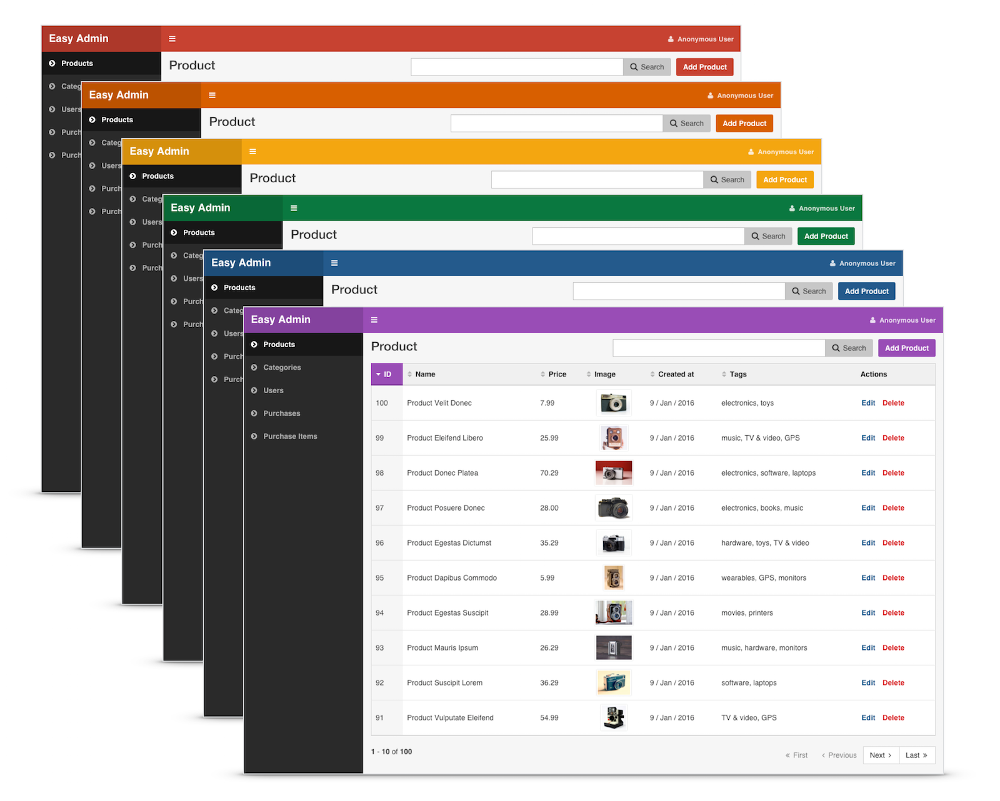
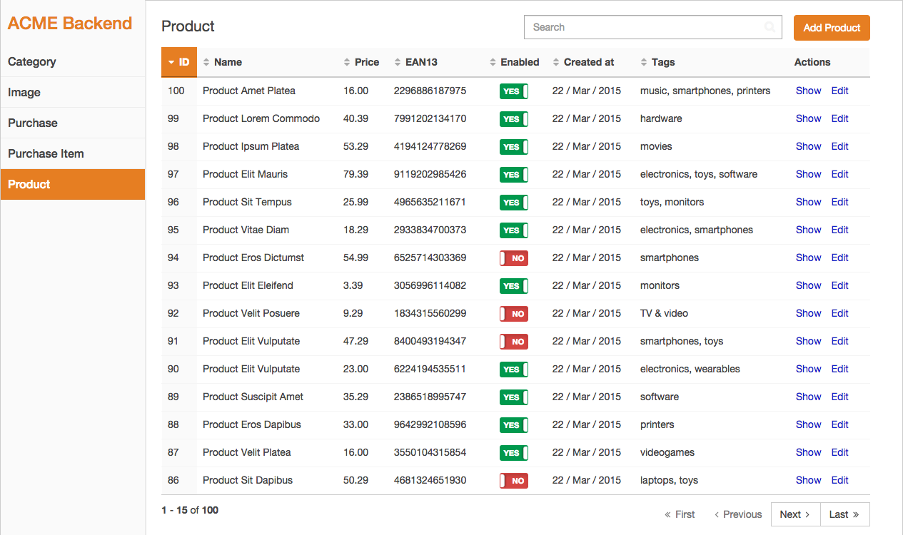

Chapter 2. Design Configuration
===============================

The design of the backend is based on the popular [AdminLTE template][1] and it
also uses [Bootstrap 3][2], [jQuery][3] and [Font Awesome icons][4]. You can
customize this design in two ways:

  1. For **simple backends**, you can change the value of some YAML configuration
     options, as explained in this chapter.
  2. For **more complex backends**, you can override every template and fragment
     used to render the backend pages, as explained in the following chapters.

All the configuration options explained in this chapter are defined under the
global `design` YAML key:

```yaml
easy_admin:
    design:
        # ... design configuration options
```

Changing the Main Backend Color
-------------------------------

Define the `brand_color` option to change the default blue color used by the
backend interface:

```yaml
easy_admin:
    design:
        brand_color: '#1ABC9C'
    # ...
```



The value of the `brand_color` option can be any of the valid CSS color formats:

```yaml
easy_admin:
    design:
        brand_color: 'red'
        brand_color: 'rgba(26, 188, 156, 0.85)'
        brand_color: 'hsl(0, 100%, 50%);'
    # ...
```

Changing the Color Scheme
-------------------------

By default, backend interface uses a dark color scheme, which is the most common
choice for admin applications. If you prefer a lighter alternative, add the
`color_scheme` option with the `light` value:

```yaml
easy_admin:
    design:
        # 'dark' is the default value
        color_scheme: 'light'
    # ...
```



Adding Custom Web Assets
------------------------

Complex backends may require to load your own CSS and JavaScript files. Add the
`assets` option to define the paths of the web assets to load in the backend
pages. All kinds of assets are supported and linked accordingly:

```yaml
easy_admin:
    design:
        assets:
            css:
                # HTTP protocol-relative URL
                - '//example.org/css/admin1.css'
                # absolute non-secure URL
                - 'http://example.org/css/admin2.css'
                # absolute secure URL
                - 'https://example.org/css/admin3.css'
                # absolute internal bundle URL
                - '/bundles/user/css/admin4.css'
                # relative internal bundle URL
                - 'bundles/app/css/admin5.css'
            js:
                # this option works exactly the same as the 'css' option
                - '//example.org/js/admin1.js'
                - 'http://example.org/js/admin2.js'
                - 'https://example.org/js/admin3.js'
                - '/bundles/user/js/admin4.js'
                - 'bundles/app/js/admin5.js'
    # ...
```

### CSS Selectors

The `<body>` element of every backend page includes different `id` and `class`
attributes to help you target your own styles. The `id` follows this pattern:

| View   | `<body>` ID attribute
| ------ | --------------------------------------------------------------------
| `edit` | `easyadmin-edit-<entity_name>-<entity_id>`
| `list` | `easyadmin-list-<entity_name>`
| `new`  | `easyadmin-new-<entity_name>`
| `show` | `easyadmin-show-<entity_name>-<entity_id>`

If you are editing for example the element with `id = 200` of the `User` entity,
the `<body>` of that page will be `<body id="easyadmin-edit-User-200" ...>`.

The pattern of the `class` attribute is different because it applies several
CSS classes at the same time:

| View   | `<body>` CSS class
| ------ | --------------------------------------------------------------------
| `edit` | `easyadmin edit edit-<entity_name>`
| `list` | `easyadmin list list-<entity_name>`
| `new`  | `easyadmin new new-<entity_name>`
| `show` | `easyadmin show show-<entity_name>`

If you are displaying for example the listing of `User` entity elements, the
`<body>` of that page will be `<body class="easyadmin list list-User" ...>`.

Changing the favicon
--------------------

A nice trick for backends is to change their favicon to better differentiate
the backend from the public website (this is specially useful when opening lots
of tabs in your browser).

If you want to apply this technique, create the favicon image (using any common
format: `.ico`, `.png`, `.gif`, `.jpg`) and set the `favicon` option:

```yaml
easy_admin:
    design:
        assets:
            favicon: '/assets/backend/favicon.png'
    # ...
```

The value of the `favicon` option is used as the value of the `href` attribute
of the `<link rel="icon" ...>` element in the backend's layout.

If your favicon uses an uncommon graphic format, you must define both the `path`
of the favicon and its `mime_type`:

```yaml
easy_admin:
    design:
        assets:
            favicon:
                path: '/assets/backend/favicon.xxx'
                mime_type: 'image/xxx'
    # ...
```

-------------------------------------------------------------------------------

&larr; [Chapter 1. Basic Configuration](1-basic-configuration.md)  |  [Chapter 3. List, Search and Show Views Configuration](3-list-search-show-configuration.md) &rarr;

[1]: https://github.com/almasaeed2010/AdminLTE
[2]: https://github.com/twbs/bootstrap
[3]: https://github.com/jquery/jquery
[4]: https://github.com/FortAwesome/Font-Awesome
