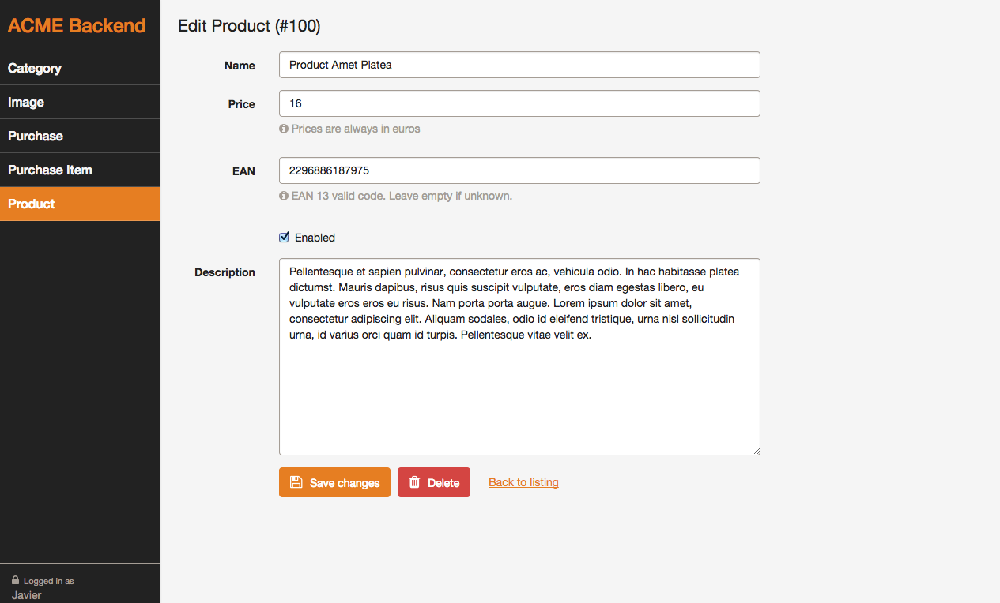
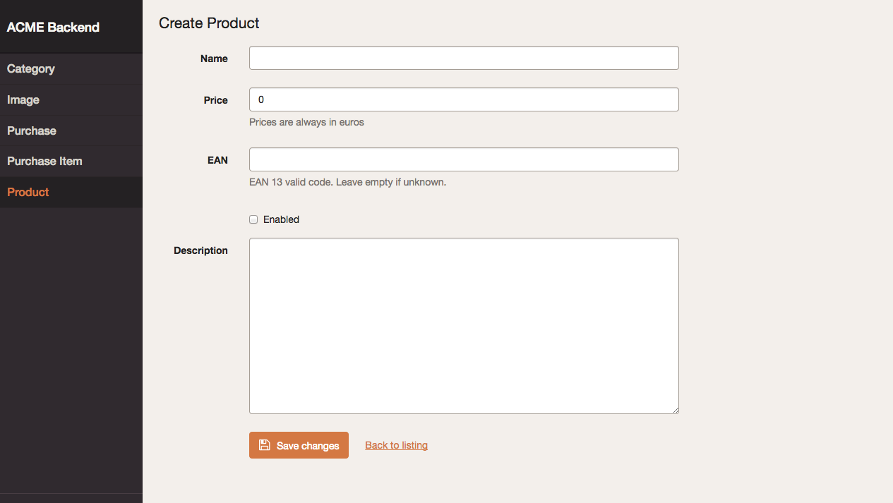
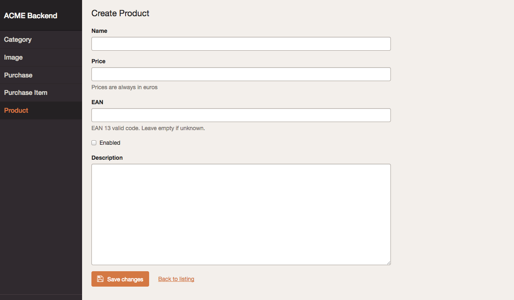
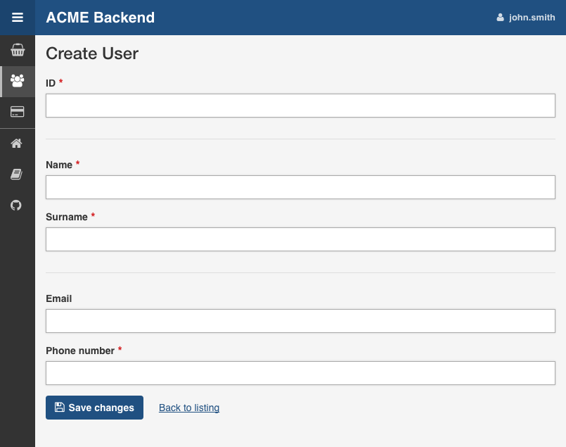
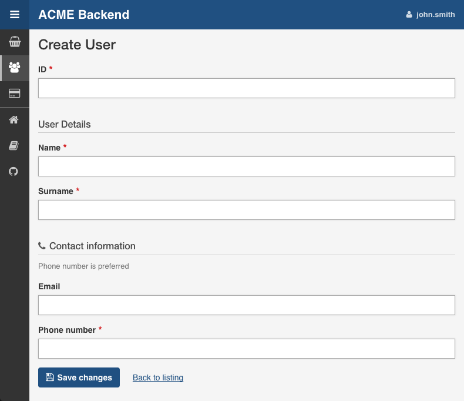
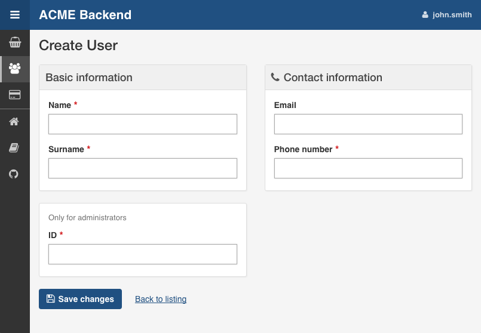
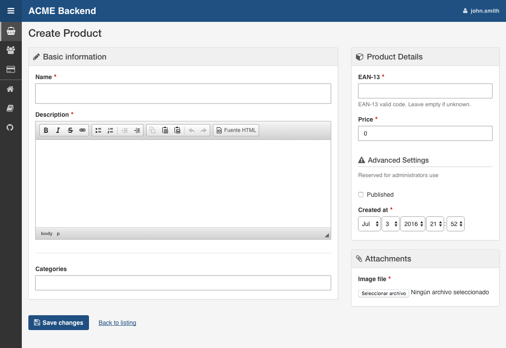

Chapter 4. Edit and New Views Configuration
===========================================

This chapter explains how to customize the read-and-write views: `edit` and
`new`. You'll learn all their configuration options and how to override or
tweak their templates.

Edit, New and Form Views
------------------------

The **Edit View** is displayed when modifying the contents of any existing
entity. The **New View** is used when creating new items of the given entity.
The design of both views is almost identical:



### The Special Form View

Most of the times you apply the same configuration to both the `edit` and `new`
views. Instead of duplicating the configuration, you can use the special `form`
view:

```yaml
easy_admin:
    entities:
        Customer:
            class: AppBundle\Entity\Customer
            form:  # <-- 'form' is applied to both 'new' and 'edit' views
                fields:
                    - 'id'
                    - { property: 'email', type: 'email', label: 'Contact' }
                    # ...
    # ...
```

Any option defined in the `form` view is copied into the `new` and `edit` views.
However, any option defined in the `edit` and `new` view overrides the
corresponding `form` option. In other words, always use the `form` action to
define the common configuration, and then use the `new` and `edit` views to
define just the specific options you want to override:

```yaml
easy_admin:
    entities:
        Customer:
            class: AppBundle\Entity\Customer
            form:
                fields: ['id', 'name', 'email']
                title:  'Add customer'
            new:
                fields: ['name', 'email']
            edit:
                title:  'Edit customer'
    # ...
```

The above configuration is equivalent to the following:

```yaml
easy_admin:
    entities:
        Customer:
            class: AppBundle\Entity\Customer
            new:
                fields: ['name', 'email']
                title:  'Add customer'
            edit:
                fields: ['id', 'name', 'email']
                title:  'Edit customer'
    # ...
```

General Configuration
---------------------

In order to make examples more concise, this section only shows the
configuration for the special `form` view, but you can apply the same options
to the other `edit` and `new` views.

### Customize the Title of the Page

This option refers both to the value of the `<title>` element and to the visible
title displayed at the top of the page. By default the title is just the name of
the entity. Define the `title` option to set a custom page title:

```yaml
# app/config/config.yml
easy_admin:
    entities:
        Customer:
            class: AppBundle\Entity\Customer
            label: 'Customers'
            form:
                title: "Add/edit customers"
        # ...
```

The `title` option can include the following special variables:

  * `%entity_label%`, resolves to the value defined in the `label` option of
    the entity. If you haven't defined it, this value will be equal to the
    entity name. In the example above, this value would be `Customers`.
  * `%entity_name%`, resolves to the entity name, which is the YAML key used
    to configure the entity in the backend configuration file. In the example
    above, this value would be `Customer`.
  * `%entity_id%`, it's only available for the `edit` view and it resolves to
    the value of the primary key of the entity being edited. Even if the option
    is called `entity_id`, it also works for primary keys with names different
    from `id`.

> **CAUTION**
>
> In Symfony applications, YAML values enclosed with `%` and `%` have a special
> meaning (they are considered container parameters). Escape these values
> doubling the `%` characters:
>
> ```yaml
> easy_admin:
>     entities:
>         Customer:
>             class: AppBundle\Entity\Customer
>             label: 'Customers'
>             form:
>                 title: '%%entity_name%% listing'
>         # ...
> ```

### Customize the Properties Displayed

By default, the `edit` and `new` views display all the entity properties. Use
the `fields` option to explicitly set the properties to display in each view:

```yaml
# app/config/config.yml
easy_admin:
    entities:
        Customer:
            class: AppBundle\Entity\Customer
            form:
                fields: ['firstName', 'lastName', 'phone', 'email']
    # ...
```

This option is also useful to reorder the form fields, because by default they
are displayed in the same order as defined in the related Doctrine entity.

> **NOTE**
>
> Fields that represent an association with another entity are displayed as
> `<select>` lists. For that reason, you must define the `__toString()` PHP
> method in any entity which is used in a Doctrine relation. Otherwise you'll
> see an error message because the backend cannot represent the related object
> as a string.

> **Virtual Properties**
>
> The `fields` option can also include properties that are not defined in the
> Doctrine entities. These properties are called "virtual properties" and the
> only requirement is that they must define a *setter* method for them. For
> example, if your entity contains a `setName()` method but not a `name` property,
> the `fields` option can include the `name` *virtual property* to set its value.

Defining Custom Form Options
----------------------------

By default, the forms built to create and edit entities only define the
`data_class` configuration option:

```php
$form = $this->createFormBuilder($entity, array(
    'data_class' => 'AppBundle\Entity\Customer',
))
-> ...
```

If you need to pass custom options to the forms, define the `form_options`
option under the `edit`, `new` or `form` options:

```yaml
easy_admin:
    entities:
        Customer:
            class: AppBundle\Entity\Customer
            form:
                form_options: { validation_groups: ['Default', 'my_validation_group'] }
    # ...
```

The above example makes the backend use the following PHP code to build the form:

```php
$form = $this->createFormBuilder($entity, array(
    'data_class' => 'AppBundle\Entity\Customer',
    'validation_groups' => array('Default', 'my_validation_group'),
))
-> ...
```

Customize the Form Fields
-------------------------

When form fields are not configured explicitly, the backend renders them with
the most appropriate widget according to their data types. If you prefer to
control their appearance, start by using the extended field configuration:

```yaml
# app/config/config.yml
easy_admin:
    entities:
        Customer:
            class: AppBundle\Entity\Customer
            form:
                fields: ['name', { property: 'email', label: 'Contact' }]
    # ...
```

Instead of using a string to define the property (e.g. `'email'`) you have to
define a hash with the name of the property (`{ property: 'email' }`) and the
options you want to define for it (`{ ..., label: 'Contact' }`).

If your entity contains lots of properties, consider using the alternative YAML
sequence syntax to improve the legibility of your backend configuration. The
following example is equivalent to the above example:

```yaml
# app/config/config.yml
easy_admin:
    entities:
        Customer:
            class: AppBundle\Entity\Customer
            form:
                fields:
                    - name
                    - { property: 'email', label: 'Contact' }
    # ...
```

These are the options that you can define for each field:

  * `property` (mandatory): the name of the property to bet set (in `new` view)
    or modified (in `edit` view). This is the only mandatory option when using
    the extended field configuration format.
  * `label` (optional): the content displayed in the `<label>` element of the
    form field. The default label is the "humanized" version of the property name
    (e.g. `published` is displayed as `Published` and `dateOfBirth` as `Date of birth`).
  * `help` (optional): the help message displayed below the form field.
  * `css_class` (optional): the CSS class applied to the parent HTML element
    that contains the entire form field. For example, when using the default
    Bootstrap form theme, this value is applied to the `<div>` element which
    wraps the label, the widget and the error messages of the field.
  * `type` (optional): the Symfony Form type used to render this field. You can
    use the short type name (e.g. `email`) instead of its fully qualified class
    name (e.g. `Symfony\Component\Form\Extension\Core\Type\EmailType`) even if
    your application runs on Symfony 3 (the needed conversion is done internally
    by the bundle).The allowed values are:
    * Any of the [Symfony Form types](http://symfony.com/doc/current/reference/forms/types.html).
    * Any of the custom EasyAdmin form types: `easyadmin_autocomplete` (they are
      explained later in this chapter).
  * `type_options` (optional), a hash with the options passed to the Symfony
    Form type used to render the field.

The `type_options` is the most powerful option because it literally comprises
tens of options suited for each form type:

```yaml
easy_admin:
    entities:
        Customer:
            class: AppBundle\Entity\Customer
            form:
                fields:
                    - 'id'
                    - { property: 'email', type: 'email', type_options: { trim: true } }
                    - { property: 'interests', type_options: { expanded: true, multiple: true } }
                    - { property: 'updated_at', type_options: { widget: 'single_text' } }
```

Read the [Symfony Form type reference](http://symfony.com/doc/current/reference/forms/types.html)
to learn about all the available options, their usage and allowed values.

Formatting Dates and Numbers
----------------------------

### Customizing Date and Time Properties

Unlike the `list`, `search` and `show` views, there are no configuration options
to define the date/time format for `edit` and `new` form fields. You must use
instead the options defined by Symfony's `DateTimeType`, `DateType` and
`TimeType` types.

For example, to display your dates as a single `<input>` text element, define
the `widget` form field option (commonly used together with `format`):

```yaml
easy_admin:
    entities:
        Event:
            edit:
                fields:
                    - { property: 'startsAt', type_options: { widget: 'single_text' } }
                    # ...
```

### Customizing Numeric Properties

Similarly, there are no configuration options to define the formatting of the
numeric values for the `edit` and `new` views. You must use instead the options
defined by Symfony's `NumberType`, `IntegerType`, `MoneyType` and `PercentType`
types.

For example, to display a numeric property that stores prices, you can define
the `currency` option of the `MoneyType` form type:

```yaml
easy_admin:
    entities:
        Product:
            edit:
                fields:
                    - { property: 'price', type: 'money', type_options: { currency: 'EUR' } }
                    # ...
```

Custom Doctrine Types
---------------------

When your application defines custom Doctrine DBAL types, you must also define
a custom form type for them before using them as form fields. Imagine that your
application defines a `UTCDateTime` type to convert the timezone of datetime
values to UTC before saving them in the database.

If you add that type in a property as follows, you'll get an error message
saying that the `utcdatetime` type couldn't be loaded:

```yaml
easy_admin:
    entities:
        Customer:
            class: AppBundle\Entity\Customer
            form:
                fields:
                    - { property: 'createdAt', type: 'utcdatetime' }
                    # ...
    # ...
```

This problem is solved defining a custom `utcdatetime` Form Type. Read the
[How to Create a Custom Form Field Type][1] article to learn how to define
custom form types.

EasyAdmin Form Types
--------------------

In addition to the Symfony Form types, fields can use any of the following types
defined by EasyAdmin.

### Autocomplete

It's similar to Symfony's `Entity` type, but the values are loaded on demand
via Ajax requests based on the user's input. This type is useful to improve the
backend performance when a field is related to an entity with lots of database
records:

```yaml
easy_admin:
    entities:
        Product:
            class: AppBundle\Entity\Product
            form:
                fields:
                    - { property: 'category', type: 'easyadmin_autocomplete' }
                    # ...
    # ...
```

The `easyadmin_autocomplete` type configures the class of the related entity
automatically. If you prefer to define it explicitly, do it in the type options:

```yaml
# ...
- { property: 'category', type: 'easyadmin_autocomplete', type_options: { class: 'AppBundle\Entity\Category' } }
```

When the user types in an autocomplete field, EasyAdmin performs a fuzzy search
on all the properties of the related entity. This is the same behavior applied
when using the backend search form.

The autocomplete action returns to the browser a JSON array of
`{ id: '...', text: '...' }` tuples. The `id` is used as the form field value
and the `text` is the value displayed to the user.

By default, the entity's primary key is used for the `id` property and the
`(string) $entity` conversion is used for the `text` property. Therefore, you
must define the `__toString()` method in all the entities used in autocomplete
form fields.

If the number of autocomplete suggestions is large, they are paginated to
display a maximum of `10` results. Define the `show.max_results` option to
change this value:

```yaml
# app/config/config.yml
easy_admin:
    show:
        max_results: 20
    # ...
```

Advanced Form Design
--------------------

### Selecting the Form Theme

By default, forms are displayed using the **horizontal style** defined by the
Bootstrap 3 CSS framework:



The form style can be changed with the `form_theme` design option. In fact, the
default form style is equivalent to using this configuration:

```yaml
easy_admin:
    design:
        form_theme: 'horizontal'
    # ...
```

If you prefer to display your forms using the **vertical Bootstrap style**,
change the value of this option to `vertical`:

```yaml
easy_admin:
    design:
        form_theme: 'vertical'
    # ...
```

The same form shown previously will now be rendered as follows:



The `horizontal` and `vertical` values are just nice shortcuts for the two
built-in form themes. But you can also use your own form themes:

```yaml
easy_admin:
    design:
        form_theme: '@App/form/custom_layout.html.twig'
    # ...
```

The `form_theme` option even allows to define an array of form themes and all of
them will be used when rendering the backend forms:

```yaml
easy_admin:
    design:
        form_theme:
            - '@App/form/custom_layout.html.twig'
            - 'form_div_layout.html.twig'
    # ...
```

### Customizing the Form Layout

The default form layout is pretty basic: fields are displayed in the same order
they were defined and they span the full browser window width. However, forms
can also include special design elements (dividers, groups, sections) to create
more advanced layouts.

#### Form Dividers

This is the simplest form design element. It just displays a straight horizontal
line. It's useful to easily separate fields in long forms:

```yaml
easy_admin:
    entities:
        Customer:
            class: AppBundle\Entity\Customer
            form:
                fields:
                    - id
                    - { type: 'divider' }
                    - name
                    - surname
                    - { type: 'divider' }
                    - email
                    - phoneNumber
    # ...
```



#### Form Sections

This design element helps you divide a long form into different sections defined
by a title and, optionally, an icon, a help message and a custom CSS class:

```yaml
easy_admin:
    entities:
        Customer:
            class: AppBundle\Entity\Customer
            form:
                fields:
                    - id
                    - { type: 'section', label: 'User Details' }
                    - name
                    - surname
                    - { type: 'section', label: 'Contact information', icon: 'phone',
                        help: 'Phone number is preferred', css_class: 'danger' }
                    - email
                    - phoneNumber
    # ...
```

A form that includes sections is still displayed as a single form that spans
the entire browser window width. Multi-column forms are created with "groups"
as explained below.



### Form Groups

This element groups one or more fields and displays them separately from the
rest of the form fields. It's useful to create multi-column forms and to create
very advanced layouts.

```yaml
easy_admin:
    entities:
        Customer:
            class: AppBundle\Entity\Customer
            form:
                fields:
                    - { type: 'group', css_class: 'col-sm-6', label: 'Basic information' }
                    - name
                    - surname
                    - { type: 'group', label: 'Contact information', icon: 'phone',
                        css_class: 'col-sm-6' }
                    - email
                    - phoneNumber
                    - { type: 'group', css_class: 'col-sm-6', help: 'Only for administrators' }
                    - id
    # ...
```

> **TIP**
>
> When using form groups, it's recommended to use the `vertical` form theme.
> Otherwise, the field label will take up too much space.



> **TIP**
>
> Because of the way CSS works, when creating multi-column forms is common to
> have ugly gaps between some rows and columns. EasyAdmin provides a `.new-row`
> CSS class that forces the form group to be displayed in a new row:
>
>     # ...
>     - { type: 'group', css_class: 'new-row ...' }
>
> This solves most of the issues, but sometimes you might be forced to also
> reorder the form group positions.

Design elements can be combined to display dividers and sections inside groups
and create advanced layouts:



Advanced Design Configuration
-----------------------------

### Default Templates

EasyAdmin defines seven Twig templates to create its interface. These are the
four templates related to `edit` and `new` views:

  * `layout`, the common layout that decorates the rest of the main templates;
  * `new`, renders the page where new entities are created;
  * `edit`, renders the page where entity contents are edited;
  * `form`, renders the form included in the `new` and `edit` views.

Depending on your needs you can override these templates in different ways:

  * Override the templates **via configuration**, when you want to decide where
    to store the custom templates;
  * Override the templates **via convention**, which is faster to set up because
    you store the custom templates in a specific directory defined by EasyAdmin.

### Selecting the Template to Render

Before selecting a template to render some contents, EasyAdmin looks for these
configuration options and directory locations to check if your backend has
overridden it (the first template which exists is used):

  1. `easy_admin.entities.<EntityName>.templates.<TemplateName>` configuration
     option.
  2. `easy_admin.design.templates.<TemplateName>` configuration option.
  3. `app/Resources/views/easy_admin/<EntityName>/<TemplateName>.html.twig`
  4. `app/Resources/views/easy_admin/<TemplateName>.html.twig`
  5. `@EasyAdmin/default/<TemplateName>.html.twig`

The last one is the path of the built-in templates and they are always available.
The following sections explain the first four ways to customize the templates
used by the backend.

> **TIP**
>
> Regardless of how you override the default templates, it's convenient to check
> first the variables provided by the backend to those templates. The easiest
> way to do this is to include an empty `{{ dump() }}` call in your templates.

#### Overriding the Default Templates By Configuration

If you prefer to decide where to store your custom templates, use the `templates`
option globally or for some specific entities.

For example, to override the `edit` template just for the `Customer` entity,
create the `edit.html.twig` template somewhere in your application and then,
configure its location with the `templates` option:

```yaml
easy_admin:
    entities:
        Customer:
            # ...
            templates:
                # Twig namespace template syntax
                edit: '@User/Backend/edit.html.twig'
                # legacy template syntax works too:
                # edit: 'UserBundle:Backend:edit.html.twig'
```

Similarly, to override some template for all entities, define the `templates`
option under the global `design` option:

```yaml
easy_admin:
    design:
        templates:
            # Twig namespace template syntax
            edit: '@App/Backend/edit.html.twig'
            # legacy template syntax works too:
            edit: 'AppBundle:Backend:edit.html.twig'
    entities:
        # ...
```

#### Overriding the Default Templates By Convention

If you don't mind the location of your custom templates, consider creating them
in the `app/Resources/views/easy_admin/` directory. When the `templates` option
is not defined, EasyAdmin looks into this directory before falling back to the
default templates.

For example, to override the `edit` template just for the `Customer` entity,
you only need to create this template in this exact location (there is no need
to define the `templates` configuration option):

```
your-project/
├─ app/
│  ├─ ...
│  └─ Resources/
│     └─ views/
│        └─ easy_admin/
│           └─ Customer/
│              └─ edit.html.twig
├─ src/
├─ vendor/
└─ web/
```

In case you want to override the template for all entities, define the new
template right under the `easy_admin/` directory:

```
your-project/
├─ app/
│  ├─ ...
│  └─ Resources/
│     └─ views/
│        └─ easy_admin/
│           └─ edit.html.twig
├─ src/
├─ vendor/
└─ web/
```

-------------------------------------------------------------------------------

&larr; [Chapter 3. List, Search and Show Views Configuration](3-list-search-show-configuration.md)  |  [Chapter 5. Actions Configuration](5-actions-configuration.md) &rarr;

[1]: http://symfony.com/doc/current/cookbook/form/create_custom_field_type.html
[2]: http://symfony.com/doc/current/components/event_dispatcher/generic_event.html
