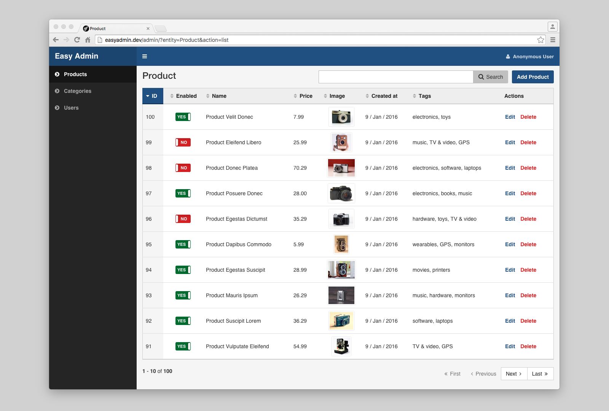

Chapter 2. Your First Backend
=============================

Creating your first backend will take you less than 30 seconds. Let's suppose
that your Symfony application defines three Doctrine ORM entities called
``Product``, ``Category`` and ``User``.

Open the ``app/config/config.yml`` file and add the following configuration:

.. code-block:: yaml

    # app/config/config.yml
    easy_admin:
        entities:
            - AppBundle\Entity\Product
            - AppBundle\Entity\Category
            - AppBundle\Entity\User

**Congratulations! You've just created your first fully-featured backend!**
Browse the ``/admin`` URL in your Symfony application and you'll get access to
the admin backend:

.. note::

    If the interface of your backend displays translation strings instead of
    the actual contents, make sure that the ``translator`` service is enabled:

    .. code-block:: yaml

        # app/config/config.yml
        framework:
            translator: { fallbacks: [ "en" ] }

Expanded Configuration Format
-----------------------------

This simple backend uses the shortcut configuration format, but for real
backends, you must use the extended configuration syntax instead, which allows
to configure lots of options for each entity:

.. code-block:: yaml

    # app/config/config.yml
    easy_admin:
        entities:
            Customer:
                class: AppBundle\Entity\Customer
            Order:
                class: AppBundle\Entity\Order
            Product:
                class: AppBundle\Entity\Product

Entities are configured as elements under the ``entities`` key. The name of the
entities are used as the YAML keys. These names must be unique in the backend
and it's recommended to use the CamelCase syntax (e.g. ``BlogPost`` and not
``blog_post`` or ``blogPost``).

The only required option in this configuration format is called ``class`` and
defines the fully qualified class name of the Doctrine entity managed by the
backend.
