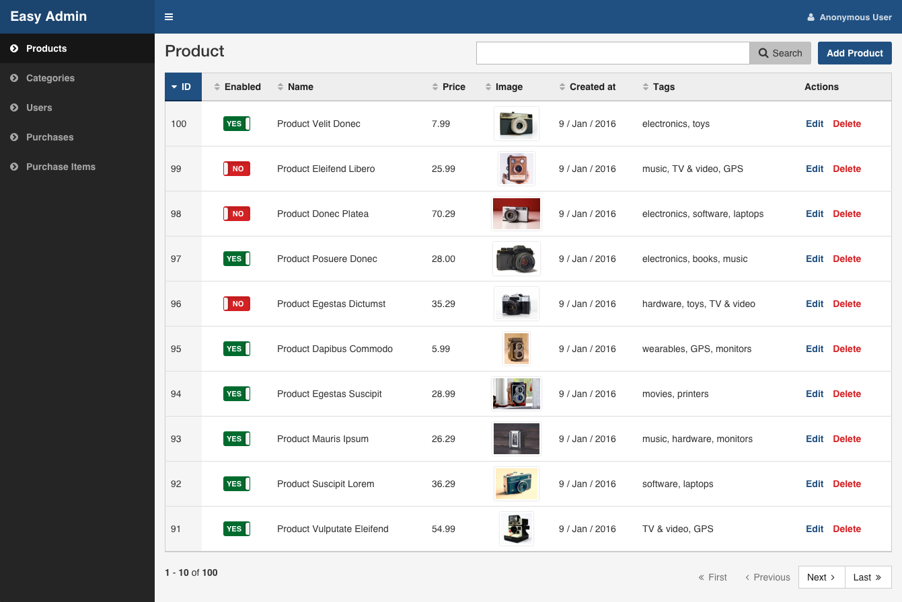
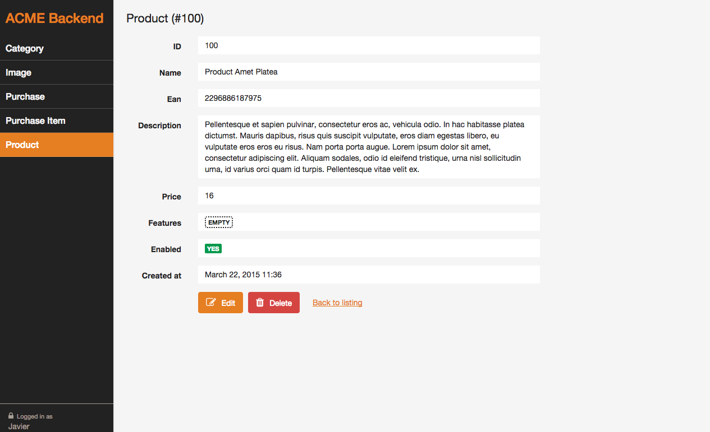
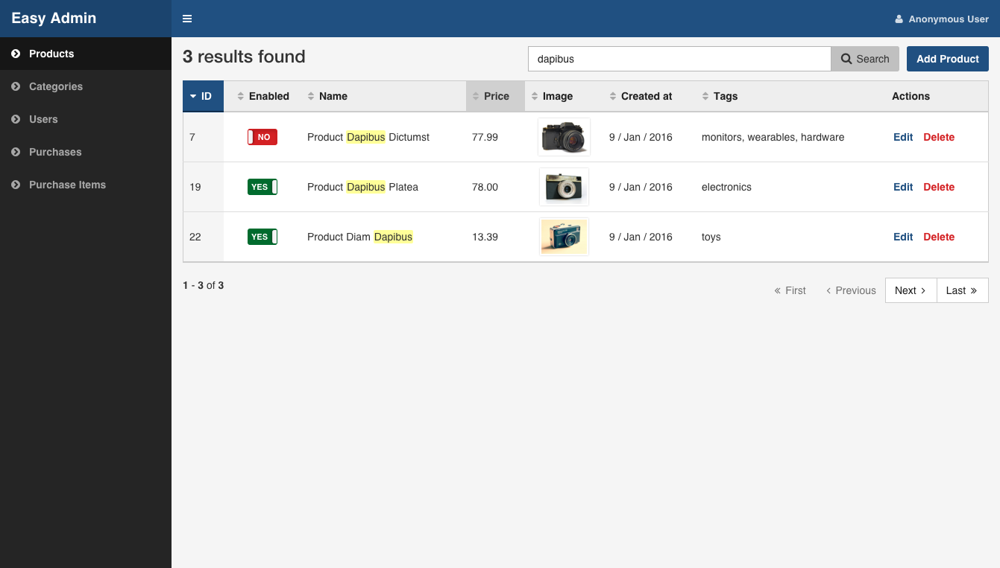
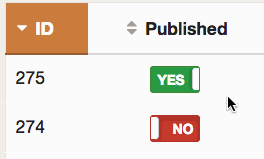
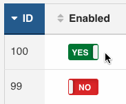
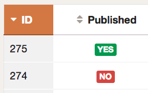

Chapter 4. Views and Actions
============================

Introduction to Views and Actions
---------------------------------

EasyAdmin backends consist of **views** and **actions**. The **view** is the
page where you are (`list`, `edit`, `show`, etc.) and the **action** is what
you want to do next (`search`, `delete`, etc.)

There are five different **views** defined for each entity: `edit`, `list`,
`new`, `search` and `show`. The `list` view is mandatory for all entities, but
the rest of the views can be disabled if needed as explained in this chapter.

### Views

The **List View** displays the list of items that match the given criteria and
provides automatic pagination and column sorting:



The **Show View** is used when displaying the contents of any entity:



The **Edit and New Views** are pretty similar. The `new` view is used when
creating new elements of the given entity. The `edit` view is displayed when
modifying the contents of any existing entity:


The **Search View** is used to display the results of any query performed by
the user. It reuses most of the design and features of the `list` view to
ensure a consistent user experience:



### Actions

Each view can include one or more **actions** to perform operations on the
items displayed in that view. For example, the default `list` view interface
includes four actions as buttons or links:


These are the actions included by default in each view:

| View   | Actions
| ------ | -----------------------------------------
| `list` | `delete`, `edit`, `list`, `new`, `search`
| `edit` | `delete`, `list`
| `new`  | `list`
| `show` | `delete`, `edit`, `list`

Read the [Customizing Backend Actions] [custom-actions] tutorial to learn how
to configure and/or disable default actions and how to create your own actions.

Common View Configuration
-------------------------

In this section you'll learn about the configuration options that can be applied
to all views. The examples will use the `list` view, but you can replace it
with any other view (`edit`, `new`, `show`, `search`). In the following sections
you'll learn the specific configuration options available for each view.

### Customize the Title of the Page

By default, titles just display the name of the entity. Define the `title`
option to set a custom page title:

```yaml
# app/config/config.yml
easy_admin:
    entities:
        Customer:
            class: AppBundle\Entity\Customer
            label: 'Customers'
            list:
                title: "Most recent customers"
        # ...
```

The `title` content can include the following special variables:

  * `%entity_label%`, resolves to the value defined in the `label` option of
    the entity. If you haven't defined it, this value will be equal to the
    entity name. In the example above, this value would be `Customers`.
  * `%entity_name%`, resolves to the entity name, which is the YAML key used
    to configure the entity in the backend configuration file. In the example
    above, this value would be `Customer`.
  * `%entity_id%`, resolves to the value of the primary key of the entity being
    edited or showed. This variable is only available for the `show` and `edit`
    views. Even if the option is called `entity_id`, it also works for primary
    keys with names different from `id`.

Beware that, in Symfony applications, YAML values enclosed with `%` and `%`
have a special meaning. To avoid any issue, use two consecutive `%` characters
when including these variables:

```yaml
easy_admin:
    entities:
        Customer:
            class: AppBundle\Entity\Customer
            label: 'Customers'
            list:
                title: '%%entity_name%% listing'
        # ...
```

### Customize the Properties Displayed

By default, the `edit`, `new` and `show` views display all the entity properties.
The `list` and `search` views make some "smart guesses" to decide which columns
to display to make listings look good.

Use the `fields` option to explicitly set the properties to display in each
view:

```yaml
# app/config/config.yml
easy_admin:
    entities:
        Customer:
            class: AppBundle\Entity\Customer
            list:
                fields: ['id', 'firstName', 'lastName', 'phone', 'email']
    # ...
```

This option is useful to reorder the way properties are displayed. By default
properties are displayed in the same order as defined in the related Doctrine
entity.

If any of the properties is an association with another entity, the `edit` and
`new` views render it as a `<select>` list. The elements displayed in this list
are the values returned by the `__toString()` PHP method. Define this method
in all your entities to avoid errors and to define the textual representation
of the entity.

### Virtual Properties

Sometimes, it's useful to display values which are not entity properties. For
example, if your `Customer` entity defines the `firstName` and `lastName`
properties, you may want to just display a column called `Name` with both
values merged. These are called *virtual properties* because they don't really
exist as Doctrine entity properties.

The first step to use a virtual property is to add it to the entity configuration
as any other property:

```yaml
easy_admin:
    entities:
        Customer:
            class: AppBundle\Entity\Customer
            list:
                fields: ['id', 'name', 'phone', 'email']
    # ...
```

Now, if you reload the backend, you'll see that the virtual property only
displays `Inaccessible` as its value. The reason is that `name` does not match
any of the entity's properties. To fix this issue, add a new public method in
your entity called `getXxx()` or `xxx()`, where `xxx` is the name of the
virtual property (in this case the property is called `name`, so the method
must be called `getName()` or `name()`):

```php
use Doctrine\ORM\Mapping as ORM;

/** @ORM\Entity */
class Customer
{
    // ...

    public function getName()
    {
        return $this->getFirstName().' '.$this->getLastName();
    }
}
```

That's it. Reload your backend and now you'll see the value of this virtual
property. Virtual properties also work for the `edit` and `new` views, as long
as you define a *setter* method for them (`setName()` in the example above).

By default, virtual properties are displayed as text contents. If your virtual
property is a *boolean* value or a date, use the `type` option to set a more
appropriate data type:

```yaml
# in this example, the virtual properties 'is_eligible' and 'last_contact' define
# their 'type' option to avoid displaying them as regular text contents
easy_admin:
    entities:
        Customer:
            class: AppBundle\Entity\Customer
            list:
                fields:
                    - 'id'
                    - { property: 'is_eligible',  type: 'boolean' }
                    - { property: 'last_contact', type: 'datetime' }
    # ...
```

The main limitation of virtual properties is that you cannot sort listings
using these fields.

Customize the Properties Appearance
-----------------------------------

By default, properties are displayed with the most appropriate appearance
according to their data types. Besides, their labels are generated automatically
based on their property name (e.g. if the property name is `published`, the
label will be `Published` and if the name is `dateOfBirth`, the label will be
`Date of birth`).

In order to customize the appearance of the properties, use the following
extended field configuration:

```yaml
# app/config/config.yml
easy_admin:
    entities:
        Customer:
            class: AppBundle\Entity\Customer
            list:
                fields: ['id', 'name', { property: 'email', label: 'Contact' }]
    # ...
```

Instead of using a string to define the name of the property (e.g. `email`) you
have to define a hash with the name of the property (`property: 'email'`) and
the custom label you want to display (`label: 'Contact'`).

If your view contains lots of properties and most of them define their own
custom label, consider using the alternative YAML syntax for sequences to
improve the legibility of your backend configuration. The following example is
equivalent to the above example:

```yaml
# app/config/config.yml
easy_admin:
    entities:
        Customer:
            class: AppBundle\Entity\Customer
            list:
                fields:
                    - 'id'
                    - 'name'
                    - { property: 'email', label: 'Contact' }
    # ...
```

These are the options that you can define for each field:

  * `property` (mandatory): the name of the Doctrine property which you want to
    display (in `list`, `search` and `show` views), set (in `new` view) or
    modify (in `edit` view). Properties can be real (they exist as Doctrine
    properties) or "virtual" (they just define getter/setter methods). The
    `property` option is the only mandatory option when using the extended
    field configuration format.
  * `label` (optional): the title displayed for the property. The default
    title is the "humanized" version of the property name
    (e.g. 'fieldName' is transformed into 'Field name').
  * `help` (optional): the help message displayed below the form field in the
    `edit`, `new` and `show` views.
  * `css_class` (optional): the CSS class applied to the form field widget
    container element in the `edit`, `new` and `show` views. For example, when
    using the default Bootstrap based form theme, this value is applied to the
    `<div>` element which wraps the label, the widget and the error messages of
    the field.
  * `template` (optional): the name of the custom template used to render the
    contents of the field in the `list` and `show` views. This option is fully
    explained in the [Advanced Design Customization] [advanced-design-customization] tutorial.
  * `type` (optional): the type of data displayed in the `list`, `search` and
    `show` views and the form widget displayed in the `edit` and `new` views.
    These are the supported types:
    * All the [Symfony Form types](http://symfony.com/doc/current/reference/forms/types.html)
    * Custom EasyAdmin types:
      * `image`, displays inline images in the `list`, `search` and `show` views
        (as explained later in this chapter).
      * `toggle`, displays a boolean value as a flip switch in the `list` and
        `search` views (as explained later in this chapter).
      * `raw`, displays the value unescaped (using the `raw` Twig filter), which
        is useful when the content stores HTML code that must be rendered
        instead of displayed as HTML tags (as explained later in this chapter).
  * `type_options` (optional), a hash which defines the value of any of the
    valid options defined by the Symfony Form type associated with the field.

The `type_options` is the most powerful option because it literally comprises
tens of options suited for each form type:

```yaml
easy_admin:
    entities:
        Customer:
            class: AppBundle\Entity\Customer
            form:
                fields:
                    - 'id'
                    - { property: 'email', type: 'email', type_options: { trim: true } }
                    - { property: 'interests', type_options: { expanded: true, multiple: true } }
                    - { property: 'updated_at', type_options: { read_only: true } }
```

Read the [Symfony Form type reference](http://symfony.com/doc/current/reference/forms/types.html)
to learn about all the available options, their usage and allowed values.

> In addition to these options defined by EasyAdmin, you can define any custom
> option for the fields. This way you can create very powerful backend
> customizations, as explained in the
> [Advanced Design Customization] [advanced-design-customization] tutorial.

### Customize Boolean Properties

By default, when an entity is editable its boolean properties are displayed in
`list` view as flip switches that allow to toggle their values very easily:



When you change the value of any boolean property, EasyAdmin makes an Ajax
request to actually change that value in the database. If something goes
wrong, the switch automatically returns to its original value and it disables
itself until the page is refreshed to avoid further issues:



In case you want to disable this behavior, use `boolean` as the property type:

```yaml
easy_admin:
    entities:
        Product:
            class: AppBundle\Entity\Product
            list:
                fields:
                    - { property: 'hasStock', type: 'boolean' }
                    # ...
    # ...
```

Now the boolean value will be rendered as a simple label and its value cannot
be modified from the `list` view:



### Customize Image Properties

If some property stores the URL of an image, you can show the actual image in
the `list`, `search` and `show` views instead of its URL. Just set the type of
the property to `image`:

```yaml
easy_admin:
    entities:
        Product:
            class: AppBundle\Entity\Product
            list:
                fields:
                    - { property: 'photo', type: 'image' }
                    # ...
    # ...
```

In this example, the `photo` property is displayed as a `` HTML element
whose `src` attribute is the value of the property. If your application stores
relative paths, define the `base_path` option to set the path to be prefixed
to the image path:

```yaml
easy_admin:
    entities:
        Product:
            class: AppBundle\Entity\Product
            list:
                fields:
                    - { property: 'photo', type: 'image', base_path: '/img/' }
                    # ...
    # ...
```

The value of the `base_path` can be a relative or absolute URL and even a
Symfony parameter:

```yaml
# relative path
- { property: 'photo', type: 'image', base_path: '/img/products/' }

# absolute path pointing to an external host
- { property: 'photo', type: 'image', base_path: 'http://static.acme.org/img/' }

# Symfony container parameter
- { property: 'photo', type: 'image', base_path: '%vich_uploader.mappings.product_image%' }
```

The image base path can also be set in the entity, to avoid repeating its
value for different properties or different views (`list`, `show`):

```yaml
easy_admin:
    entities:
        Product:
            class: AppBundle\Entity\Product
            image_base_path: 'http://static.acme.org/img/'
            list:
                fields:
                    - { property: 'photo', type: 'image' }
                    # ...
    # ...
```

The base paths defined for a property always have priority over the one defined
globally for the entity.

### Displaying Raw Values

All the string-based values are escaped before displaying them. For that reason,
if the value stores HTML content, you'll see the HTML tags instead of the rendered
HTML content. In case you want to display the rendered content, set the type of
the property to `raw`:

```yaml
easy_admin:
    entities:
        Product:
            class: AppBundle\Entity\Product
            list:
                fields:
                    - { property: 'features', type: 'raw' }
                    # ...
    # ...
```

List View Configuration
-----------------------

### Customize the Number of Item Rows Displayed

By default, listings display a maximum of `15` rows. Define the `max_results`
option under the `list` key to change this value:

```yaml
# app/config/config.yml
easy_admin:
    list:
        max_results: 30
    # ...
```

Search View Configuration
-------------------------

### Customize the Properties on which the Query is Performed

By default, the search query is performed on all entity properties except those
with special data types, such as `binary`, `blob`, `object`, etc. Define the
`fields` option in the `search` configuration of any entity to explicitly set
the properties used to perform the query:

```yaml
# app/config/config.yml
easy_admin:
    entities:
        Customer:
            class: AppBundle\Entity\Customer
            search:
                fields: ['firstName', 'lastName', 'email']
    # ...
```

Edit and New Views Configuration
--------------------------------

### The Special Form View

The `edit` and `new` views are pretty similar, so most of the times you apply
the same customization to them. Instead of duplicating the configuration for
both views, you can use the special `form` view:

```yaml
easy_admin:
    entities:
        Customer:
            class: AppBundle\Entity\Customer
            form:  # <-- 'form' is applied to both 'new' and 'edit' views
                fields:
                    - 'id'
                    - { property: 'email', type: 'email', label: 'Contact' }
                    # ...
    # ...
```

Any option defined in the `form` view will be copied into the `new` and
`edit` views. However, any option defined in the `edit` and `new` view
overrides the corresponding `form` option. In other words, always use the
`form` action to define the common configuration, and then use the `new` and
`edit` views to define just the specific options you want to override:

```yaml
easy_admin:
    entities:
        Customer:
            class: AppBundle\Entity\Customer
            form:
                fields: ['id', 'name', 'email']
                title:  'Add customer'
            new:
                fields: ['name', 'email']
            edit:
                title:  'Edit customer'
    # ...
```

The above configuration is equivalent to the following:

```yaml
easy_admin:
    entities:
        Customer:
            class: AppBundle\Entity\Customer
            new:
                fields: ['name', 'email']
                title:  'Add customer'
            edit:
                fields: ['id', 'name', 'email']
                title:  'Edit customer'
    # ...
```

### Custom Doctrine Types

When your application defines custom Doctrine DBAL types, you must define a
related custom form type before using them as form fields. Imagine that your
application defines a `UTCDateTime` type to convert the timezone of datetime
values to UTC before saving them in the database.

If you add that type in a property as follows, you'll get an error message
saying that the `utcdatetime` type couldn't be loaded:

```yaml
easy_admin:
    entities:
        Customer:
            class: AppBundle\Entity\Customer
            form:
                fields:
                    - { property: 'createdAt', type: 'utcdatetime' }
                    # ...
    # ...
```

This problem is solved defining a custom `utcdatetime` Form Type. Read the
[How to Create a Custom Form Field Type](http://symfony.com/doc/current/cookbook/form/create_custom_field_type.html)
article of the official Symfony documentation to learn how to define custom
form types.

### Applying Custom Options for Entity Forms

By default, EasyAdmin only sets the `data_class` option in the forms built to
create and edit entities. If you need to pass custom options to any form, define
the `form_options` option under the `edit`, `new` or `form` options:

```yaml
easy_admin:
    entities:
        Customer:
            class: AppBundle\Entity\Customer
            form:
                form_options: { validation_groups: ['Default', 'my_validation_group'] }
    # ...
```

This configuration makes EasyAdmin to generate the form for the `edit` and `new`
views of the `Customer` entity using this PHP code:

```php
$form = $this->createFormBuilder($entity, array(
    'data_class' => 'AppBundle\Entity\Customer',
    'validation_groups' => array('Default', 'my_validation_group'),
))
-> ...
```

[custom-actions]: ../tutorials/customizing-backend-actions.md
[advanced-design-customization]: ../tutorials/advanced-design-customization.md

-------------------------------------------------------------------------------

&larr; [Chapter 3. Backend Configuration](3-backend-configuration.md)  |  [Chapter 5. Design Customization](5-design-customization.md) &rarr;
