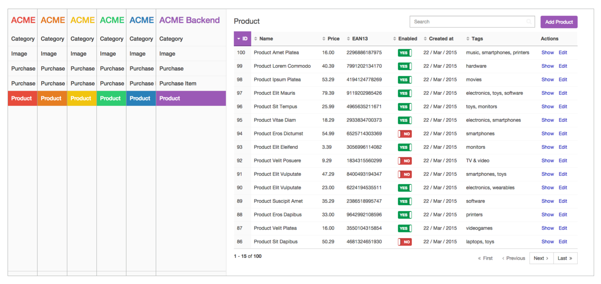

Chapter 5. Design Customization
===============================

The design of the backend can be customized in two ways:

  1. Using some simple configuration options, as explained in this chapter.
  2. Overriding the default templates and fragments used to render the backend,
    which is useful for very complex backends. This is explained in the
    [Advanced Design Customization] [advanced-design-customization] tutorial.

Customizing the Main Backend Color
----------------------------------

By default, backends use a dark orange shade as the main color. Use the
`brand_color` design option to change it:

```yaml
easy_admin:
    design:
        # this backend uses turquoise as its main color
        brand_color: '#1ABC9C'
    # ...
```

This simple configuration option allows you to easily match the backend design
to your project identity:


The value of the `brand_color` option is directly passed to the `color` and
`background-color` CSS properties, so you can define the color using any valid
CSS format:

```yaml
easy_admin:
    design:
        brand_color: 'rgb(26, 188, 156)'
    # ...
```

This flexibility allows you to use semi-transparent colors:

```yaml
easy_admin:
    design:
        brand_color: 'rgba(26, 188, 156, 0.85)'
    # ...
```

Selecting the Color Scheme
--------------------------

EasyAdmin provides two different color schemes: `dark` and `light`. The `dark`
scheme is the default one because it's the most common choice when designing
backends. The `light` scheme is a cleaner and more minimalist alternative:

```yaml
easy_admin:
    design:
        color_scheme: 'light'
    # ...
```


Combine the `light` color scheme with the `brand_color` option to get a myriad
of new backend designs:



Customizing Form Design
-----------------------

By default, forms are displayed using the **horizontal style** defined by the
Bootstrap 3 CSS framework:


The style of the forms can be changed application-wide using the `form_theme`
option inside the `design` configuration section. In fact, the default form
style is equivalent to using this configuration:

```yaml
easy_admin:
    design:
        form_theme: 'horizontal'
    # ...
```

If you prefer to display your forms using the **vertical Bootstrap style**,
change the value of this option to `vertical`:

```yaml
easy_admin:
    design:
        form_theme: 'vertical'
    # ...
```

The same form shown previously will now be rendered as follows:


The `horizontal` and `vertical` values are just nice shortcuts for the two
built-in form themes. But you can also use your own form themes. Just set the
full theme path as the value of the `form_theme` option:

```yaml
easy_admin:
    design:
        form_theme: '@AppBundle/form/custom_layout.html.twig'
    # ...
```

You can even pass several form themes in an array to use all of them when
rendering the backend forms:

```yaml
easy_admin:
    design:
        form_theme:
            - '@AppBundle/form/custom_layout.html.twig'
            - 'form_div_layout.html.twig'
    # ...
```

### Multiple-Column Forms

EasyAdmin doesn't support multi-column form layouts. However, you can use the
`css_class` form field to create these advanced layouts. The `css_class` value
is applied to the parent `<div>` element which contains the field label, the
field widget, the field help and the optional field errors:


The configuration used to display this form is the following:

 ```yaml
easy_admin:
    design:
        form_theme: 'vertical'
    entities:
        Product:
            # ...
            form:
                fields:
                    - { property: name, css_class: 'col-sm-12' }
                    - { property: price, type: 'number', help: 'Prices are always in euros', css_class: 'col-sm-6' }
                    - { property: 'ean', label: 'EAN', help: 'EAN 13 valid code. Leave empty if unknown.', css_class: 'col-sm-6' }
                    - { property: 'enabled', css_class: 'col-sm-12' }
                    - { property: 'description', css_class: 'col-sm-12' }
    # ...
```

Adding Custom Web Assets
------------------------

Use the `assets` option to define the web assets (CSS and JavaScript files)
that should be loaded in the backend layout:

```yaml
easy_admin:
    design:
        assets:
            css:
                - 'bundles/app/css/admin1.css'
                - 'bundles/acmedemo/css/admin2.css'
            js:
                - 'bundles/app/js/admin1.js'
                - 'bundles/acmedemo/js/admin2.js'
    # ...
```

EasyAdmin supports any kind of web asset (internal, external, relative and
absolute) and links to them accordingly:

```yaml
easy_admin:
    design:
        assets:
            css:
                # HTTP protocol-relative URL
                - '//example.org/css/admin1.css'
                # absolute non-secure URL
                - 'http://example.org/css/admin2.css'
                # absolute secure URL
                - 'https://example.org/css/admin3.css'
                # absolute internal bundle URL
                - '/bundles/acmedemo/css/admin4.css'
                # relative internal bundle URL
                - 'bundles/app/css/admin5.css'
            js:
                # this option works exactly the same as the 'css' option
                - '//example.org/js/admin1.js'
                - 'http://example.org/js/admin2.js'
                - 'https://example.org/js/admin3.js'
                - '/bundles/acmedemo/js/admin4.js'
                - 'bundles/app/js/admin5.js'
    # ...
```

Custom stylesheets can make use of the `id` and `class` attributes applied to
the `<body>` element of each backend page. The `id` allows you to target
specific entity instances:

| View   | `<body>` ID attribute
| ------ | --------------------------------------------------------------------
| `edit` | `easyadmin-edit-<entity_name>-<entity_id>`
| `list` | `easyadmin-list-<entity_name>`
| `new`  | `easyadmin-new-<entity_name>`
| `show` | `easyadmin-show-<entity_name>-<entity_id>`

The `class` attribute allows you to target entire sections of the backend:

| View   | `<body>` CSS class
| ------ | --------------------------------------------------------------------
| `edit` | `easyadmin edit edit-<entity_name>`
| `list` | `easyadmin list list-<entity_name>`
| `new`  | `easyadmin new new-<entity_name>`
| `show` | `easyadmin show show-<entity_name>`

Customizing the favicon
-----------------------

A nice trick for backends is to change their favicon to better differentiate
the backend from the public website (this is specially useful when opening lots
of tabs in your browser).

If you want to apply this technique to your backends, just create the favicon
image (using any common format: `.ico`, `.png`, `.gif`, `.jpg`) and set the
`favicon` option:

```yaml
easy_admin:
    design:
        assets:
            favicon: '/assets/backend/favicon.png'
    # ...
```

The value of the `favicon` option is used as the value of the `href` attribute
of the `<link rel="icon">` element in the backend's layout.

If your favicon uses an uncommon graphic format, you must define both the `path`
of the favicon and its `mime_type`:

```yaml
easy_admin:
    design:
        assets:
            favicon:
                path: '/assets/backend/favicon.xxx'
                mime_type: 'image/xxx'
    # ...
```

[advanced-design-customization]: ../tutorials/advanced-design-customization.md
