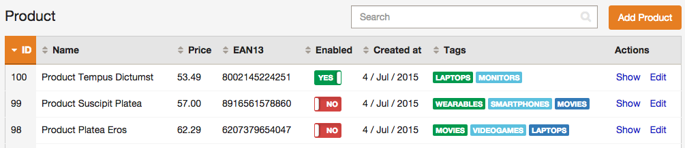

Advanced Design Customization
=============================

This article explains how to completely customize the backend design by
overriding the default templates and fragments used to render the interface.

Customize the Templates Used by the Backend
-------------------------------------------

EasyAdmin uses the following seven Twig templates to create its interface:

  * `layout`, the common layout that decorates the `list`, `edit`, `new` and
    `show` templates;
  * `new`, renders the page where new entities are created;
  * `show`, renders the contents stored by a given entity;
  * `edit`, renders the page where entity contents are edited;
  * `list`, renders the entity listings and the search results page;
  * `paginator`, renders the paginator of the `list` view;
  * `form`, renders the form of the `new` and `edit` views.

EasyAdmin offers a powerful overriding mechanism which allows you to customize
any of these templates in several different ways. Depending on your needs you
must select the best alternative.

Before rendering a template, EasyAdmin applies the following logic to choose
the template (the first existing template is used):

  1. The template defined in the
     `easy_admin.entities.<EntityName>.templates.<TemplateName>` configuration
     option.
  2. The template defined in the `easy_admin.design.templates.<TemplateName>`
     configuration option.
  3. `app/Resources/views/easy_admin/<EntityName>/<TemplateName>.html.twig`
     template.
  4. `app/Resources/views/easy_admin/<TemplateName>.html.twig`
     template.
  5. `@EasyAdmin/default/<TemplateName>.html.twig` (these are the default
     templates defined by EasyAdmin and they are always available).

The following sections explain all these alternatives with practical examples.

### Tweaking the Default Templates for All Entities

Most often than not, customizing the design of the backend is a matter of just
tweaking some element of the default templates. The easiest way to do that is
to create a new template that extends from the default one and override the
specific Twig block you want to customize.

Suppose you want to change the search form of the `list` view for all entities.
First, create a new `list.html.twig` template in this location:

```
your-project/
├─ app/
│  ├─ ...
│  └─ Resources/
│     └─ views/
│        └─ easy_admin/
│           └─ list.html.twig
├─ src/
├─ vendor/
└─ web/
```

Then, make your template extend from the default `list` template:

```twig
{# app/Resources/views/easy_admin/list.html.twig #}


{# ... #}
```

Lastly, override the `search_action` block to just change that template part:

```twig
{# app/Resources/views/easy_admin/list.html.twig #}



    {# ... #}

```

Creating a template in `app/Resources/views/easy_admin/` is a convention which
simplifies the overriding of templates. If you prefer to use an existing
template located elsewhere, define the `easy_admin.design.templates.list`
option and use any of the valid Symfony formats to define the template path:

```yaml
easy_admin:
    design:
        templates:
            list: 'AppBundle:Backend:list.html.twig'
```

### Tweaking the Default Templates for Some Entities

In this case, the changes are applied just for one entity, instead of applying
them in the entire backend. To do so, follow the steps explained in the
previous section, but change the location of the template to a subdirectory
called after the entity name.

Suppose you want to override the search form just for the `Customer` entity.
Then, create this `list.html.twig` template:

```
your-project/
├─ app/
│  ├─ ...
│  └─ Resources/
│     └─ views/
│        └─ easy_admin/
│           └─ Customer/
│              └─ list.html.twig
├─ src/
├─ vendor/
└─ web/
```

Again, you can use an existing template located elsewhere via the `templates`
configuration option. This time you have to define the option just for the
specific entity:

```yaml
easy_admin:
    entities:
        Customer:
            # ...
            templates:
                list: 'AppBundle:Backend:list.html.twig'
```

### Overriding the Default Templates for All Entities

Default templates define lots of Twig blocks to provide you great flexibility.
However, sometimes it's not enough to modify the default templates and you need
to change them completely. The solution is to follow the same steps explained
in the previous sections, but without extending your templates from the
default ones.

Suppose you want to modify the paginator displayed at the bottom of each
listing page. This element is built with the `paginator` template, so you have
to create a new `paginator.html.twig` template in this location:

```
your-project/
├─ app/
│  ├─ ...
│  └─ Resources/
│     └─ views/
│        └─ easy_admin/
│           └─ paginator.html.twig
├─ src/
├─ vendor/
└─ web/
```

If you prefer to use one of your existing templates to override it, define the
`easy_admin.design.templates.paginator` option and use any of the valid
Symfony formats to set the template path:

```yaml
easy_admin:
    design:
        templates:
            paginator: 'AppBundle:Default:fragments/_paginator.html.twig'
```

### Overriding the Default Templates for Some Entities

Similarly, you can also replace the paginator template just for a single
entity. For example, if you want to override the paginator of the `Customer`
entity, create this template:

```
your-project/
├─ app/
│  ├─ ...
│  └─ Resources/
│     └─ views/
│        └─ easy_admin/
│           └─ Customer/
│              └─ paginator.html.twig
├─ src/
├─ vendor/
└─ web/
```

Again, you can use an existing template located elsewhere via the `templates`
configuration option. This time you have to define the option just for the
specific entity:

```yaml
easy_admin:
    entities:
        Customer:
            # ...
            templates:
                paginator: 'AppBundle:Default:fragments/_paginator.html.twig'
```

Customize the Templates Used to Render Each Property
----------------------------------------------------

The same template overriding mechanism can be applied to customize the template
fragments used to render each property in the `list`, `search` and `show` views
(if you need to customize the form fields, configure your own form theme as
explained in the [chapter 5] [chapter-5] of the "Getting Started" guide).

These are the available templates (most of them correspond to the associated
Doctrine data type and are self-explanatory):

  * `field_array`
  * `field_association`, renders properties that store Doctrine associations.
  * `field_bigint`
  * `field_boolean`
  * `field_date`
  * `field_datetime`
  * `field_datetime_locale`
  * `field_datetimetz`
  * `field_decimal`
  * `field_float`
  * `field_id`, special template to render any property called `id`. This
    avoids formatting the value of the primary key as a numeric value, with
    decimals and thousand separators.
  * `field_image`, related to the special `image` type defined by EasyAdmin
    used to display the contents of an image.
  * `field_integer`
  * `field_raw`, renders the value of the property without applying any escape
    mechanism.
  * `field_simple_array`
  * `field_smallint`
  * `field_string`
  * `field_text`
  * `field_time`
  * `field_toggle`, related to the special `toggle` type defined by EasyAdmin
    used to display boolean values as flip switches.
  * `label_empty`, used when the property to render is an empty collection.
  * `label_inaccessible`, used when is not possible to access the value of the
    property because there is no getter or public property.
  * `label_null`, used when the value of the property is null.
  * `label_undefined`, used when any kind of error or exception happens when
    trying to access the value of the property.

Suppose that in your backend you don't want to display a `NULL` text for `null`
values and prefer to display a more human friendly value, such as a dash (`-`).
Making this change is as easy as creating a new `label_null` template with your
own content and HTML markup:

```twig
{# app/Resources/views/easy_admin/label_null.html.twig #}
<span class="null">~</span>
```

To override this value just for a specific entity (for example, `Invoice`),
create this other template:

```twig
{# app/Resources/views/easy_admin/Invoice/label_null.html.twig #}
<span class="null">Unpaid</span>
```

To use an existing template located elsewhere, define the global
`design.templates` configuration option or the entity's `templates` option
depending on your needs:

```yaml
easy_admin:
    design:
        templates:
            label_null: 'AppBundle:Default:labels/null.html.twig'
    # ...
    entities:
      Invoice:
        templates:
            label_null: 'AppBundle:Invoice:backend/label_null.html.twig'
```

Before customizing any of these templates, it's recommended to check out the
contents of the default `field_*` and `label_*` templates, so you can learn
about their features.

Inside the `field_*` and `label_*` templates you have access to the following
variables:

  * `field_options`, the options configured for this field in the backend
    configuration file.
  * `item`, the entity instance.
  * `value`, the content of the field being rendered, which can be a variable
    of any type (string, numeric, boolean, array, etc.)
  * `view`, the name of the view where the field is being rendered (`show` or
    `list`).

### Rendering Properties with Custom Templates

The default property templates are flexible enough for most backends. However,
when your backend is very complex, it may be useful to use a custom template to
define the way some property is rendered in the `list` or `show` views.

To do so, define the name of the custom template in the `template` option of
the property:

```yaml
easy_admin:
    # ...
    entities:
        Invoice:
            list:
                fields:
                    - { property: 'total', template: 'invoice_total' }
```

The above configuration makes the backend use the `invoice_total.html.twig`
template instead of the default `field_float.html.twig` template. Custom
templates are looked for in the following locations (the first existing
template is used):

  1. `app/Resources/views/easy_admin/<EntityName>/<TemplateName>.html.twig`
     template.
  2. `app/Resources/views/easy_admin/<TemplateName>.html.twig`
     template.

Custom templates receive the same parameters as built-in templates (
`field_options`, `item`, `value`, `view`).

### Adding Custom Logic to Property Templates

All property templates receive a parameter called `field_options` with the full
list of options defined in the configuration file for that property. If you
add custom options, they will also be available in the `field_options`
parameter. This allows you to add custom logic to templates very easily.

Imagine that you want to translate some text contents in the `list` view. To do
so, define a custom option called `trans` which indicates if the property
content should be translated and another option called `domain` which defines
the name of the translation domain to use.

```yaml
# app/config.yml
Product:
    class: AppBundle\Entity\Product
    label: 'Products'
    list:
        fields:
            - id
            - { property: 'name', trans: true, domain: 'messages' }
            # ...
```

Supposing that the `name` property is of type `string`, you just need to
override the built-in `field_string.html.twig` template:

```twig
{# app/Resources/views/easy_admin/field_string.html.twig #}


    {# translate fields defined as "translatable" #}
    {{ value|trans({}, field_options.domain|default('messages')) }}

    {# if not translatable, simply include the default template #}
    {{ include('@EasyAdmin/default/field_string.html.twig') }}

```

If the custom logic is too complex, it may be better to use your own custom
template to not mess built-in templates too much. In this example, the
collection of tags associated with a product is displayed in a way that is too
customized to use a built-in template:

```yaml
# app/config.yml
Product:
    class: AppBundle\Entity\Product
    label: 'Products'
    list:
        fields:
            - id
            # ...
            - { property: 'tags', template: 'tag_collection', label_colors: ['primary', 'success', 'info'] }
```

The custom `tag_collection.html.twig` would look as follows:

```twig
{# app/Resources/views/easy_admin/tag_collection.html.twig #}




    <span class="label label-{{ cycle(colors, loop.index) }}">{{ tag }}</span>

```

And this property would be rendered in the `list` view as follows:



Translating Backend Elements in Custom Templates
------------------------------------------------

The translations of the default backend elements are defined under the
`EasyAdminBundle` translation domain. That's why built-in templates include
the following tag:

```twig

```

When overriding templates, make sure to add this tag at the top of each file to
not break the backend internationalization. Of course, you can also define any
other translation domain and skip the default one in your templates:

```twig
{{ 'content_to_translate' | trans({}, 'MyCustomTranslationDomain') }}
```

The above template uses the translations defined in the
`app/Resources/translations/MyCustomTranslationDomain.en.xlf` file (replace
`en` by your locale and `xlf` by the desired translation format) instead of the
default EasyAdmin translations.

[chapter-5]: ../getting-started/5-design-customization.md
