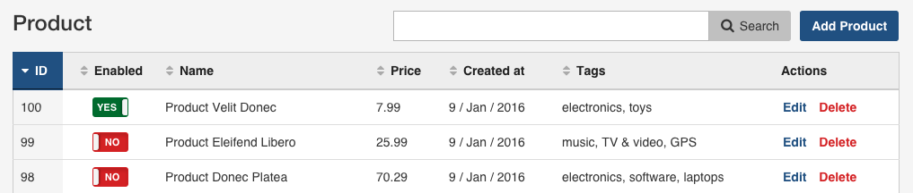
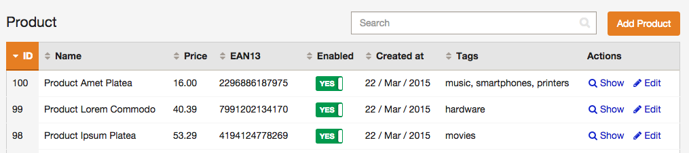
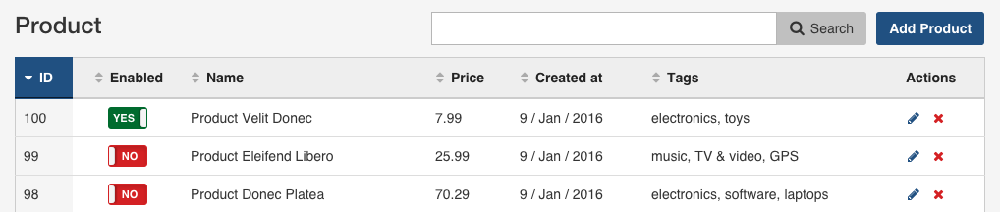

Tips and Tricks
===============

Improving Backend Performance
-----------------------------

EasyAdmin does an intense use of Doctrine metadata introspection to generate
the backend on the fly without generating any file or resource. For complex
backends, this process can add a noticeable performance overhead.

Fortunately, Doctrine provides a simple caching mechanism for entity metadata.
If your server has APC installed, enable this cache just by adding the
following configuration:

```yaml
# app/config/config_prod.yml
doctrine:
    orm:
        metadata_cache_driver: apc
```

In addition to `apc`, Doctrine metadata cache supports `memcache`, `memcached`,
`xcache` and `service` (for using a custom cache service). Read the
documentation about [Doctrine caching drivers][1].

Note that the previous example configures metadata caching in `config_prod.yml`
file, which is the configuration used for the production environment. It's not
recommended to enable this cache in the development environment to avoid having
to clear APC cache or restart the web server whenever you make any change to
your Doctrine entities.

This simple metadata cache configuration can improve your backend performance
between 20% and 30% depending on the complexity and number of your entities.

Create a Read-Only Backend
--------------------------

Disable the `delete`, `edit` and `new` actions for all views and the users
won't be able to add, modify or remove any information:

```yaml
easy_admin:
    disabled_actions: ['delete', 'edit', 'new']
```

Unloading the Default JavaScript and Stylesheets
------------------------------------------------

EasyAdmin uses Bootstrap CSS and jQuery frameworks to build the interface.
In case you want to unload these files in addition to loading your own assets,
override the default `layout.html.twig` template and empty the
`head_stylesheets` and `head_javascript` Twig blocks.

Read the [Advanced Design Customization][2] section to learn how to override
default templates.

Removing Action Labels and Displaying Just Icons
------------------------------------------------

By default, the actions showed in the `list` view table only display their
label (`Edit`, `Show`, etc.):



Adding an icon for each action is as easy as defining their `icon` option:

```yaml
easy_admin:
    list:
        actions:
            - { name: 'show', icon: 'search' }
            - { name: 'edit', icon: 'pencil' }
    # ...
```

This configuration makes the entity listing looks as follow:



When displaying entities with lots of information, it may be useful to remove
the action label and display just their icons. To do so, define an empty string
for the `label` option or set its value to `false`:

```yaml
easy_admin:
    list:
        actions:
            - { name: 'show', icon: 'search', label: '' }
            - { name: 'edit', icon: 'pencil', label: '' }
            # if you prefer, set labels to false
            # - { name: 'show', icon: 'search', label: false }
            # - { name: 'edit', icon: 'pencil', label: false }
    # ...
```

This configuration makes the entity listing looks as follow:



Making the Backend Use a Different Language Than the Public Website
-------------------------------------------------------------------

Imagine that the public part of your website uses French as its default locale.
EasyAdmin uses the same locale as the underlying Symfony application, so the
backend would be displayed in French too. How could you define a different
language for the backend?

You just need to get the `translator` service and execute the `setLocale()` method
befor executing the code of EasyAdmin. The easiest way to do that is to create
a [custom admin controller][3] and override the `initialize()` method as follows:

```php
// src/AppBundle/Controller/AdminController.php
namespace AppBundle\Controller;

use JavierEguiluz\Bundle\EasyAdminBundle\Controller\AdminController as BaseAdminController;

class AdminController extends BaseAdminController
{
    protected function initialize(Request $request)
    {
        $this->get('translator')->setLocale('en');
        parent::initialize($request);
    }
}
```

Don't Apply Global Doctrine Filters in the Backend
--------------------------------------------------

[Doctrine filters][4] add conditions to your queries automatically. They are
useful to solve cases like *"never display products which haven't been published"*
or *"don't display comments marked as deleted"*.

These filters can be enabled for each query, but they are usually enabled
globally for the entire application thanks to a request listener:

```php
use Symfony\Component\HttpKernel\Event\GetResponseEvent;

class DoctrineFilterListener
{
    // ...

    public function onKernelRequest(GetResponseEvent $event)
    {
        $this->em->getFilters()->enable('is_published');
    }
}
```

When using global Doctrine filters, you probably don't want to apply them in the
backend. Otherwise you won't see unpublished items or deleted comments in the
listings. Given that all EasyAdmin URLs are generated with a single route called
`easyadmin`, you can add the following to disable the Doctrine filters in the
backend:

```php
public function onKernelRequest(GetResponseEvent $event)
{
    if ('easyadmin' === $event->getRequest()->attributes->get('_route')) {
        return;
    }

    // ...
}
```

Defining Dynamic Actions per Item
---------------------------------

By default, in the `list` view all items display the same actions. If you need
to show/hide actions dynamically per item, you can do that in a custom template.
Consider a backend that displays the `Delete` action only for items that haven't
been published yet (their `status` property is `PUBLISHED`):

```twig
{# app/Resources/views/easy_admin/list.html.twig #}



    
    
        
            {# remove the 'delete' action from published items #}
        
            
        
    

    

    {{ parent() }}

```

The solution work as follows:

1. The backend defines a new `list.html.twig` template to override the
   `item_actions` block, which is the one that displays the actions for each item.
2. The default template defines the `_list_item_actions` variable to store the
   actions to display for any given item. The custom template just needs to filter
   these actions according to some rules.
3. Finally, override the original `_list_item_actions` variable with the filtered
   list of actions and execute the original code for this Twig block in the
   parent template (`{{ parent() }}`).

[1]: http://symfony.com/doc/current/reference/configuration/doctrine.html#caching-drivers
[2]: ../book/3-list-search-show-configuration.md#advanced-design-configuration
[3]: ../book/3-list-search-show-configuration.md#customizing-the-behavior-of-list-search-and-show-views
[4]: http://doctrine-orm.readthedocs.io/projects/doctrine-orm/en/latest/reference/filters.html
