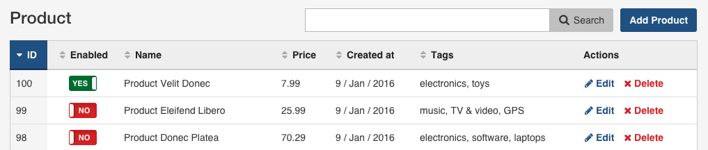
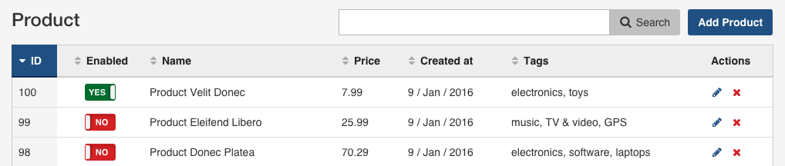

Chapter 7. Actions Configuration
================================

EasyAdmin backends consist of **views** and **actions**. The **view** is the
page where you are (``list``, ``edit``, ``show``, etc.) and the **action** is
what you do on that page (``search``, ``delete``, etc.)

Views include one or more **actions** to perform operations on the items
displayed in that view. For example, the default ``list`` view interface
includes four actions as buttons or links:

.. image:: ../images/easyadmin-list-view-actions.png
   :alt: List view interface

These are the built-in actions included by default in each view:

========  ===================================================
View      Default Actions
========  ===================================================
``list``  ``delete``, ``edit``, ``list``, ``new``, ``search``
``edit``  ``delete``, ``list``
``new``   ``list``
``show``  ``delete``, ``edit``, ``list``
========  ===================================================

In this chapter you'll learn how to enable, disable and customize these built-in
actions. If you want to create your own actions read the
:doc:`../tutorials/custom-actions` tutorial.

Disable Actions for Some or All Entities
----------------------------------------

Use the ``disabled_actions`` option to disable any action globally or just for
some entity. For example, to disable the ``show`` action for all entities:

.. code-block:: yaml

    easy_admin:
        disabled_actions: ['show']
        # ...

When an action is disabled, the backend no longer displays it in any of the
views. Moreover, if some user tries to *hack* the URL to access to a disabled
action, they'll see a *Forbidden Action* error page.

The ``disabled_actions`` option can also be defined per entity. For example, to
disable the ``new`` action just for the ``User`` entity:

.. code-block:: yaml

    easy_admin:
        entities:
            User:
                # ...
                disabled_actions: ['new']

The values of the ``disabled_actions`` options are merged in cascade for each
entity. If the backend configuration is the following:

.. code-block:: yaml

    easy_admin:
        disabled_actions: ['show']
        # ...
        entities:
            User:
                # ...
                disabled_actions: ['new']

The ``User`` entity will have both the ``new`` and the ``show`` actions disabled.

Configure the Actions Displayed in Each View
--------------------------------------------

Adding Actions Globally
~~~~~~~~~~~~~~~~~~~~~~~

Define the actions to display on each backend view using the ``actions`` option:

.. code-block:: yaml

    easy_admin:
        edit:
            actions: ['show']
        list:
            actions: ['edit', 'search']
        # ...

The value of the ``actions`` option is merged with the default action
configuration for each view. In the above example, the ``edit`` view of all
entities will include the ``list``, ``delete`` and ``show`` actions (the first
two are the default actions and the last one is explicitly configured).

Removing Actions Globally
~~~~~~~~~~~~~~~~~~~~~~~~~

Instead of adding new actions, sometimes you want to remove them. To do so, use
the same ``actions`` option but prefix each action name with a dash (``-``):

.. code-block:: yaml

    easy_admin:
        edit:
            actions: ['show', '-delete']
        list:
            actions: ['edit', 'search', '-delete']
        # ...

In the above example, the ``edit`` view will now include just the ``list`` and
the ``show`` actions because of the following configuration merge:

==================================  ====================
Configuration merge                 Actions
==================================  ====================
Default actions                     ``list``, ``delete``
Actions added by global config      ``show``
Actions deleted by global config    ``delete``
**Resulting actions for entities**  ``list``, ``show``
==================================  ====================

Adding Actions Per Entity
~~~~~~~~~~~~~~~~~~~~~~~~~

Define the actions to add to each entity view using the ``actions`` option:

.. code-block:: yaml

    easy_admin:
        entities:
            Invoice:
                list:
                    actions: ['show']
                # ...

The global ``action`` configuration (if any) is merged with the entity's
``action`` configuration, as explained in the next section.

Removing Actions Per Entity
~~~~~~~~~~~~~~~~~~~~~~~~~~~

Define the actions to remove to each entity view using the ``actions`` option and
prefixing the action name with a dash (``-``):

.. code-block:: yaml

    easy_admin:
        entities:
            Customer:
                list:
                    actions: ['-search']
                # ...

The global ``action`` configuration (if any) is merged in cascade with the
entity's ``action`` configuration. Consider the following example:

.. code-block:: yaml

    easy_admin:
        list:
            actions: ['-edit']
        entities:
            Customer:
                list:
                    actions: ['-search']
                # ...
            Invoice:
                list:
                    actions: ['edit']
                # ...

This would be the configuration merging process for the ``Invoice`` entity:

================================  =======================================
Configuration merge               Actions
================================  =======================================
Default actions                   ``edit``, ``new``, ``search``, ``show``
Actions added by global config    (none)
Actions deleted by global config  ``edit``
Actions added by entity           ``edit``
Actions removed by entity         (none)
**Resulting actions for entity**  ``edit``, ``new``, ``search``, ``show``
================================  =======================================

This would be the configuration merging process for the ``Customer`` entity:

================================  =======================================
Configuration merge               Actions
================================  =======================================
Default actions                   ``edit``, ``new``, ``search``, ``show``
Actions added by global config    (none)
Actions deleted by global config  ``edit``
Actions added by entity           (none)
Actions removed by entity         ``search``
**Resulting actions for entity**  ``new``, ``show``
================================  =======================================

.. note::

    Beware that the ``actions`` option just defines if an action should be
    displayed or not, but it doesn't disable the action (a malicious user could
    *hack* the URL and change the ``action`` parameter manually). Use the
    ``disabled_actions`` options to ban those actions entirely.

Customizing the Actions Displayed in Each View
----------------------------------------------

In addition to adding or removing actions, you can also configure their
properties, such as their labels and icons. To do so, you must use the expanded
configuration format:

.. code-block:: yaml

    easy_admin:
        list:
            # shortcut configuration format
            actions: ['edit']

            # expanded configuration format
            actions:
                - { name: 'edit' }

Then, define any of the following options to customize the action:

* ``name``, this is the only mandatory option. You can freely choose this value,
  but it must be valid as a PHP method name (use characters, numbers and
  underscores only).
* ``label``, is the text displayed in the button or link associated with the
  action. If not defined, the action label is the *humanized* version of its
  ``name`` option. Set it to ``null`` or an empty string to hide it and only
  display the associated icon.
* ``title``, is the text used in the ``title`` HTML attribute of the ``<a>``
  element associated with the action. Most of the times you can safely ignore
  this option, but it's useful to display a helpful message when the action
  hides its label and only displays its icon.
* ``css_class``, is the CSS class or classes applied to the link or button used
  to render the action.
* ``icon``, is the name of the FontAwesome icon displayed next to the link or
  inside the button used to render the action. You don't have to include the
  ``fa-`` prefix of the icon name (e.g. to display the icon of a user, don't
  use ``fa fa-user`` or ``fa-user``; just use ``user``).
* ``target``, is the value of the ``target`` HTML attribute applied to the button
  or link associated with the action (e.g. ``_blank`` to open the action in a
  new browser tab/window).

Removing Action Labels and Displaying Just Icons
------------------------------------------------

By default, the actions showed in the ``list`` view only display their label
(``Edit``, ``Show``, etc.):

.. image:: ../images/easyadmin-listing-actions-label-only.png
   :alt: Action Labels in Entity Listing

Adding an icon for each action is as easy as defining their ``icon`` option:

.. code-block:: yaml

    easy_admin:
        list:
            actions:
                - { name: 'show', icon: 'search' }
                - { name: 'edit', icon: 'pencil' }
        # ...

This configuration makes the entity listing looks as follow:

When displaying entities with lots of information, it may be useful to remove
the action label and display just their icons. To do so, define an empty string
for the ``label`` option or set its value to ``false``:

.. code-block:: yaml

    easy_admin:
        list:
            actions:
                - { name: 'show', icon: 'search', label: '' }
                - { name: 'edit', icon: 'pencil', label: '' }
                # if you prefer, set labels to false
                # - { name: 'show', icon: 'search', label: false }
                # - { name: 'edit', icon: 'pencil', label: false }
        # ...

This configuration makes the entity listing looks as follow:

Finally, when displaying only the action icon, it's useful to define the
``title`` attribute to display it when the user moves the cursor over the action
icon:

.. code-block:: yaml

    easy_admin:
        list:
            actions:
                - { name: 'show', icon: 'search', label: '', title: 'Search' }
                - { name: 'edit', icon: 'pencil', label: '', title: 'Edit' }
        # ...
