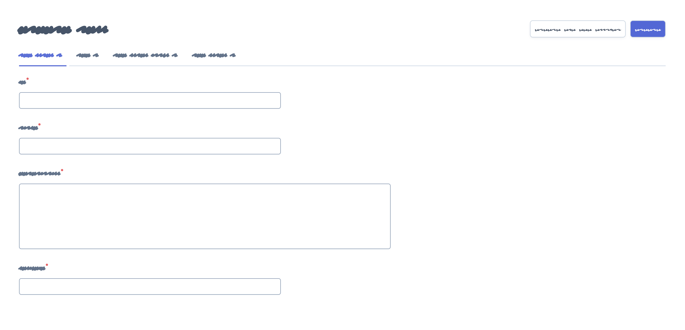

Chapter 6. Edit and New Views Configuration
===========================================

This chapter explains how to customize the read-and-write views: ``edit`` and
``new``. You'll learn all their configuration options and how to override or
tweak their templates.

Edit, New and Form Views
------------------------

The **Edit View** is displayed when modifying the contents of any existing
entity. The **New View** is used when creating new items of the given entity.
The design of both views is almost identical:

.. image:: ../images/easyadmin-edit-view.png
   :alt: Edit view interface

The Special ``form`` View
~~~~~~~~~~~~~~~~~~~~~~~~~

Most of the times you apply the same or very similar configuration to both the
``edit`` and ``new`` views. Instead of duplicating the configuration, you can
use the special ``form`` view:

.. code-block:: yaml

    # config/packages/easy_admin.yaml
    easy_admin:
        entities:
            Customer:
                class: App\Entity\Customer
                form:  # <-- 'form' is applied to both 'new' and 'edit' views
                    fields:
                        - 'id'
                        - { property: 'email', type: 'email', label: 'Contact' }
                        # ...
        # ...

Any option defined in the ``form`` view is copied into the ``new`` and ``edit``
views. However, any option defined in the ``edit`` and ``new`` view overrides
the corresponding ``form`` option. In other words, always use the ``form``
action to define the common configuration, and then use the ``new`` and ``edit``
views to define just the specific options you want to override:

.. code-block:: yaml

    # config/packages/easy_admin.yaml
    easy_admin:
        entities:
            Customer:
                class: App\Entity\Customer
                form:
                    title: 'Add customer'
                    form_options: { validation_groups: ['Default'] }
                new:
                    form_options: { validation_groups: ['Default', 'Customer'] }
                edit:
                    title:  'Edit customer'
        # ...

The above configuration is equivalent to the following:

.. code-block:: yaml

    # config/packages/easy_admin.yaml
    easy_admin:
        entities:
            Customer:
                class: App\Entity\Customer
                new:
                    title:  'Add customer'
                    form_options: { validation_groups: ['Default', 'Customer'] }
                edit:
                    title:  'Edit customer'
                    form_options: { validation_groups: ['Default'] }
        # ...

The merging of the ``form`` fields configuration is done recursively, so you can
change or add any option to any property. In addition, the following processing
takes place:

1. All the fields defined in the ``form`` view are copied in the same order into
   the ``edit`` and ``new`` views.
2. Any field defined in the ``edit`` or ``new`` view which is not present in the
   ``form`` view is added after the ``form`` fields.
3. The ``edit`` and ``new`` views can remove any field defined in the ``form`` view
   just by prefixing the name of the removed field with a dash ``-`` (e.g. add
   a property called ``-name`` to remove the ``name`` property defined in ``form``)

Consider the following complex form field configuration:

.. code-block:: yaml

    # config/packages/easy_admin.yaml
    easy_admin:
        entities:
            Customer:
                class: App\Entity\Customer
                form:
                    fields:
                        - id
                        - { property: 'name', icon: 'user' }
                        - { property: 'email', css_class: 'input-large' }
                new:
                    fields:
                        - '-id'
                        - { property: 'email', type_options: { required: false } }
                edit:
                    fields:
                        - { property: 'name', icon: 'customer' }
                        - { property: 'email', help: 'Phone number is preferred' }
                        - phone
        # ...

The above configuration is equivalent to the following:

.. code-block:: yaml

    # config/packages/easy_admin.yaml
    easy_admin:
        entities:
            Customer:
                class: App\Entity\Customer
                new:
                    fields:
                        - { property: 'name', icon: 'user' }
                        - { property: 'email', css_class: 'input-large', type_options: { required: false } }
                edit:
                    fields:
                        - id
                        - { property: 'name', icon: 'customer' }
                        - { property: 'email', css_class: 'input-large', help: 'Phone number is preferred' }
                        - phone
        # ...

General Configuration
---------------------

In order to make examples more concise, this section only shows the
configuration for the special ``form`` view, but you can apply the same options
to the other ``edit`` and ``new`` views.

Customize the Title of the Page
~~~~~~~~~~~~~~~~~~~~~~~~~~~~~~~

This option refers both to the value of the ``<title>`` element and to the visible
title displayed at the top of the page. By default the title is just the name of
the entity. Define the ``title`` option to set a custom page title:

.. code-block:: yaml

    # config/packages/easy_admin.yaml
    easy_admin:
        entities:
            Customer:
                class: App\Entity\Customer
                label: 'Customers'
                form:
                    title: "Add/edit customers"
            # ...

The ``title`` option can include the following special variables:

* ``%entity_label%``, resolves to the value defined in the ``label`` option of
  the entity. If you haven't defined it, this value will be equal to the
  entity name. In the example above, this value would be ``Customers``.
* ``%entity_name%``, resolves to the entity name, which is the YAML key used
  to configure the entity in the backend configuration file. In the example
  above, this value would be ``Customer``.
* ``%entity_id%``, it's only available for the ``edit`` view and it resolves to
  the value of the primary key of the entity being edited. Even if the option
  is called ``entity_id``, it also works for primary keys with names different
  from ``id``.

.. caution::

    In Symfony applications, YAML values enclosed with ``%`` and ``%`` have a
    special meaning (they are considered container parameters). Escape these
    values doubling the ``%`` characters:

    .. code-block:: yaml

        # config/packages/easy_admin.yaml
        easy_admin:
            entities:
                Customer:
                    class: App\Entity\Customer
                    label: 'Customers'
                    form:
                        title: '%%entity_label%% listing'
                # ...

If several entities use the same custom title, you can define the default title
for all entities in the global ``edit.title`` and ``new.title`` options (these
global titles are always overridden by the title defined by each entity):

.. code-block:: yaml

    # config/packages/easy_admin.yaml
    easy_admin:
        edit:
            title: '%%entity_label%%_edit'
        new:
            title: 'New %%entity_label%%'

Display a Help Message in the Page
~~~~~~~~~~~~~~~~~~~~~~~~~~~~~~~~~~

Entities can define a global help message that is displayed below the title of
the page. This is useful to add instructions or warning messages for the end
users (e.g. "The upload process can take a lot of time (don't close the browser
window)").

The help message is defined with the ``help`` configuration option, which can be
added to the entity (all views display the same message) and to each of the
entity views:

.. code-block:: yaml

    # config/packages/easy_admin.yaml
    easy_admin:
        entities:
            Customer:
                class: App\Entity\Customer
                help: 'Global message displayed in all views'
                # ...
                form:
                    help: 'The form view overrides the global help message'
                    # ...
                edit:
                    # 'help' is not defined, so the global help message is displayed
                    # ...
                new:
                    # use the null value to not display the inherited global help message
                    help: null
                    # ...
            # ...

Customize the Properties Displayed
~~~~~~~~~~~~~~~~~~~~~~~~~~~~~~~~~~

By default, the ``edit`` and ``new`` views display all the entity properties.
Use the ``fields`` option to explicitly set the properties to display in each
view:

.. code-block:: yaml

    # config/packages/easy_admin.yaml
    easy_admin:
        entities:
            Customer:
                class: App\Entity\Customer
                form:
                    fields: ['firstName', 'lastName', 'phone', 'email']
        # ...

This option is also useful to reorder the form fields, because by default they
are displayed in the same order as defined in the related Doctrine entity.

.. note::

    Fields that represent an association with another entity are displayed as
    ``<select>`` lists. For that reason, you must define the ``__toString()``
    magic method in any entity which is used in a Doctrine relation. Otherwise
    you'll see the following error message:
    ``Catchable Fatal Error: Object of class XY could not be converted to string``

Virtual Properties
..................

The ``fields`` option can also include properties that are not defined in the
Doctrine entities. These properties are called "virtual properties" and the only
requirement is that they must define a *setter* method for them. For example, if
your entity contains a ``setName()`` method but not a ``name`` property, the
``fields`` option can include the ``name`` *virtual property* to set its value.

.. note::

    The values or virtual properties are set using the `PropertyAccess component`_
    from Symfony, which requires to follow a strict syntax for setter names:
    ``set`` + camelized version of the property name. Example: ``name`` ->
    ``setName()``; ``firstName`` -> ``setFirstName()``; ``first_and_last_name`` ->
    ``setFirstAndLastName()``.

Defining Custom Form Options
----------------------------

By default, the forms built to create and edit entities only define the
``data_class`` configuration option:

.. code-block:: php

    $form = $this->createFormBuilder($entity, [
        'data_class' => 'App\Entity\Customer',
    ])
    -> ...

If you need to pass custom options to the forms, define the ``form_options``
option under the ``edit``, ``new`` or ``form`` options:

.. code-block:: yaml

    # config/packages/easy_admin.yaml
    easy_admin:
        entities:
            Customer:
                class: App\Entity\Customer
                form:
                    form_options: { validation_groups: ['Default', 'my_validation_group'] }
        # ...

The above example makes the backend use the following PHP code to build the form:

.. code-block:: php

    $form = $this->createFormBuilder($entity, [
        'data_class' => 'App\Entity\Customer',
        'validation_groups' => ['Default', 'my_validation_group'],
    ])
    -> ...

Customize the Form Fields
-------------------------

When form fields are not configured explicitly, the backend renders them with
the most appropriate widget according to their data types. If you prefer to
control their appearance, start by using the extended field configuration:

.. code-block:: yaml

    # config/packages/easy_admin.yaml
    easy_admin:
        entities:
            Customer:
                class: App\Entity\Customer
                form:
                    fields: ['name', { property: 'email', label: 'Contact' }]
        # ...

Instead of using a string to define the property (e.g. ``'email'``) you have to
define a hash with the name of the property (``{ property: 'email' }``) and the
options you want to define for it (``{ ..., label: 'Contact' }``).

If your entity contains lots of properties, consider using the alternative YAML
sequence syntax to improve the legibility of your backend configuration. The
following example is equivalent to the above example:

.. code-block:: yaml

    # config/packages/easy_admin.yaml
    easy_admin:
        entities:
            Customer:
                class: App\Entity\Customer
                form:
                    fields:
                        - name
                        - { property: 'email', label: 'Contact' }
        # ...

These are the options that you can define for each field:

* ``property`` (mandatory): the name of the property to bet set (in ``new`` view)
  or modified (in ``edit`` view). This is the only mandatory option when using
  the extended field configuration format.
* ``label`` (optional): the content displayed in the ``<label>`` element of the
  form field. The default label is the "humanized" version of the property name
  (e.g. ``published`` is displayed as ``Published`` and ``dateOfBirth`` as
  ``Date of birth``).

  If the form field renders a collection of items, the numeric auto-increment
  label of the collection items is hidden by default. If you want to display it,
  set the ``entry_options.label`` option to ``true``:
  ``- { property: '...', type: 'collection', type_options: { entry_options: { label: true } }``
* ``help`` (optional): the help message displayed below the form field. You can
  also define this value via the ``type_options: { help: '...' }`` option.
* ``css_class`` (optional): the CSS class applied to the parent HTML element
  that contains the entire form field. For example, when using the default
  Bootstrap form theme, this value is applied to the ``
`` element which
  wraps the label, the widget and the error messages of the field.
* ``permission`` (optional): a string or array defining the role or roles the
  current user must have to see this form field. It's explained later in the
  :ref:`Security permissions <edit-new-security>` section.
* ``type`` (optional): the Symfony Form type used to render this field. In
  addition to its fully qualified class name (e.g.
  ``Symfony\Component\Form\Extension\Core\Type\EmailType``), you can also use
  the short type name (e.g. ``email``) (the map between names and classes is
  done internally by the bundle). The allowed values are:

  * Any of the `Symfony Form types`_.
  * Any of the custom EasyAdmin form types: ``code_editor``, ``file_upload``,
    ``text_editor``, ``easyadmin_autocomplete`` (they are explained later in
    this chapter).
* ``type_options`` (optional), a hash with the options passed to the Symfony
  Form type used to render the field.

The ``type_options`` is the most powerful option because it literally comprises
tens of options suited for each form type:

.. code-block:: yaml

    # config/packages/easy_admin.yaml
    easy_admin:
        entities:
            Customer:
                class: App\Entity\Customer
                form:
                    fields:
                        - 'id'
                        - { property: 'email', type: 'email', type_options: { trim: true } }
                        - { property: 'interests', type_options: { expanded: true, multiple: true } }
                        - { property: 'updated_at', type_options: { widget: 'single_text' } }

Read the `Symfony Form types`_  reference to learn about all the available
options, their usage and allowed values.

.. tip::

    Symfony makes Doctrine relations nullable by default. Instead of adding the
    ``type_options: { required: true }`` option to all those fields, it's simpler
    to add ``@ORM\JoinColumn(nullable=false)`` to the property that defines the
    relation in the entity class.

Formatting Dates and Numbers
----------------------------

Customizing Date and Time Properties
~~~~~~~~~~~~~~~~~~~~~~~~~~~~~~~~~~~~

Unlike the ``list``, ``search`` and ``show`` views, there are no configuration
options to define the date/time format for ``edit`` and ``new`` form fields. You
must use instead the options defined by Symfony's ``DateTimeType``, ``DateType``
and ``TimeType`` types.

For example, to display your dates as a single ``<input>`` text element, define
the ``widget`` form field option (commonly used together with ``format``):

.. code-block:: yaml

    # config/packages/easy_admin.yaml
    easy_admin:
        entities:
            Event:
                edit:
                    fields:
                        - { property: 'startsAt', type_options: { widget: 'single_text' } }
                        # ...

Customizing Numeric Properties
~~~~~~~~~~~~~~~~~~~~~~~~~~~~~~

Similarly, there are no configuration options to define the formatting of the
numeric values for the ``edit`` and ``new`` views. You must use instead the
options defined by Symfony's ``NumberType``, ``IntegerType``, ``MoneyType`` and
``PercentType`` types.

For example, to display a numeric property that stores prices, you can define
the ``currency`` option of the ``MoneyType`` form type:

.. code-block:: yaml

    # config/packages/easy_admin.yaml
    easy_admin:
        entities:
            Product:
                edit:
                    fields:
                        - { property: 'price', type: 'money', type_options: { currency: 'EUR' } }
                        # ...

Custom Doctrine Types
---------------------

When your application defines custom Doctrine DBAL types, you must also define
a custom form type for them before using them as form fields. Imagine that your
application defines a ``UTCDateTime`` type to convert the timezone of datetime
values to UTC before saving them in the database.

If you add that type in a property as follows, you'll get an error message
saying that the ``utcdatetime`` type couldn't be loaded:

.. code-block:: yaml

    # config/packages/easy_admin.yaml
    easy_admin:
        entities:
            Customer:
                class: App\Entity\Customer
                form:
                    fields:
                        - { property: 'createdAt', type: 'utcdatetime' }
                        # ...
        # ...

This problem is solved defining a custom ``utcdatetime`` Form Type. Read the
`How to Create a Custom Form Field Type`_ article to learn how to define
custom form types.

EasyAdmin Form Types
--------------------

In addition to the Symfony Form types, fields can use any of the following types
defined by EasyAdmin.

Autocomplete
~~~~~~~~~~~~

It's similar to Symfony's ``Entity`` type, but the values are loaded on demand
via Ajax requests based on the user's input. This type is useful to improve the
backend performance when a field is related to an entity with lots of database
records:

.. code-block:: yaml

    # config/packages/easy_admin.yaml
    easy_admin:
        entities:
            Product:
                class: App\Entity\Product
                form:
                    fields:
                        - { property: 'category', type: 'easyadmin_autocomplete' }
                        # ...
        # ...

The ``easyadmin_autocomplete`` type configures the class of the related entity
automatically. If you prefer to define it explicitly, do it in the type options:

.. code-block:: yaml

    # ...
    - { property: 'category', type: 'easyadmin_autocomplete', type_options: { class: 'App\Entity\Category' } }

When the user types in an autocomplete field, EasyAdmin performs a fuzzy search
on all the properties of the related entity. This is the same behavior applied
when using the backend search form.

The autocomplete action returns to the browser a JSON array of
``{ id: '...', text: '...' }`` tuples. The ``id`` is used as the form field value
and the ``text`` is the value displayed to the user.

By default, the entity's primary key is used for the ``id`` property and the
``(string) $entity`` conversion is used for the ``text`` property. Therefore,
you must define the ``__toString()`` method in all the entities used in
autocomplete form fields.

If the number of autocomplete suggestions is large, they are paginated to
display a maximum of ``10`` results. Define the ``show.max_results`` option to
change this value (globally or per entity):

.. code-block:: yaml

    # config/packages/easy_admin.yaml
    easy_admin:
        show:
            max_results: 20
        entities:
            Category:
                show:
                    max_results: 5
        # ...

Code Editor
~~~~~~~~~~~

It displays a JavaScript-based editor for source code. It provides advanced
features such as code highlighting and smart indenting.

.. code-block:: yaml

    # config/packages/easy_admin.yaml
    easy_admin:
        entities:
            Server:
                class: App\Entity\Server
                form:
                    fields:
                        - { property: 'config', type: 'code_editor', language: 'nginx' }
                        # ...
        # ...

This type defines the following configuration options:

* ``height``: the initial height of code blocks is the same as their contents
  and it grows automatically as you add more contents. This option, which must
  be an integer, sets the height of the code block element in pixels. If
  contents don't fit, a scrollbar is displayed.
* ``language``: sets the programming language used for the syntax highlighting
  of the code (the language can't be autodetected from the contents). The available
  languages are: ``css``, ``dockerfile``, ``js`` (equivalent to ``javascript``),
  ``markdown``, ``nginx``, ``php``, ``shell``, ``sql``, ``twig``, ``xml``,
  ``yaml-frontmatter`` (used in some blogs, CMS systems and static site
  generators), ``yaml``.
* ``tab_size``: an integer (default: ``4``) that defines the indention size (no
  matter if the code uses white spaces or tabs).
* ``indent_with_tabs``: if this boolean option is set to ``true``, code is
   indented with real tabs instead of white spaces (default: ``false``).

.. code-block:: yaml

    # config/packages/easy_admin.yaml
    easy_admin:
        entities:
            ExamQuestion:
                class: App\Entity\ExamQuestion
                form:
                    fields:
                        - { property: 'question', type: 'code_editor', language: 'yaml', height: 150, tab_size: 4 }
                        - { property: 'codeSample', type: 'code_editor', language: 'php', height: 600, tab_size: 2 }
                        # ...
        # ...

File Upload
~~~~~~~~~~~

It displays an advanced file upload widget which supports single and multiple
uploads, deleting files, etc.

.. code-block:: yaml

    # config/packages/easy_admin.yaml
    easy_admin:
        entities:
            User:
                class: App\Entity\User
                form:
                    fields:
                        - { property: 'photo', type: 'file_upload' }
                        # ...
        # ...

This type defines the following configuration options:

* ``upload_dir``: (optional; default ``public/uploads/files/``) a string with
  the path to the directory where the files are uploaded. If the value doesn't
  start with a directory separator (e.g. ``/var/sites/uploads``), it's considered
  relative to the ``kernel.project_dir`` value;
* ``download_path``: (optional) a PHP callable that returns the relative path
  where assets can be downloaded. For example, if ``upload_dir`` is ``public/contracts/``,
  this option would be ``contracts/`` and the public asset URL would be
  ``https://example.com/contracts/filename.extension``. Overriding this option is
  useful in complex scenarios such as when uploading files to a cloud service which
  creates special URLs to access to assets;
* ``upload_filename``: (optional; by default the original name is used) if defined,
  this string is the pattern used to rename the uploaded file. You can also pass a
  PHP callable to use some logic to generate the new file name. Example of a
  file name pattern: ``[year]/[month]/[day]/[slug]-[contenthash].[extension]``.
  The available placeholders in the pattern are:

  * ``[contenthash]``, the SHA1 hash of the entire file contents;
  * ``[day]``, the current day of the month with leading zeros (e.g. ``07``);
  * ``[extension]``, the guessed extension for the uploaded file (it can be
    different from the original file extension);
  * ``[month]``, the current month number with leading zeros (e.g. March = ``03``);
  * ``[name]``, the original file name without the extension;
  * ``[randomhash]``, an alphanumeric random string;
  * ``[slug]``, the slug of the original file name (i.e. the name is lower cased
    and any non-ASCII letter or number is removed);
  * ``[timestamp]``, the current timestamp;
  * ``[uuid]``, a random UUID v4 value;
  * ``[year]``, the current year with 4 digits (e.g. ``2020``).

* ``allow_add``: (optional, default = ``true``) a boolean value which is only
  used when the ``multiple`` option is ``true``. If set to ``false``, when you
  upload new files, all the previous files are deleted. If set to ``true``, the
  new files are added to the list of previously uploded files;
* ``allow_delete``: (optional, default ``true``) a boolean value indicating if
  uploaded files can be deleted directly in the edit/new form;
* ``multiple``: (optional, default ``false``) a boolean value indicating if
  it's allowed to upload more than one file;
* ``upload_new``: (optional) a PHP callable used to move the uploaded file/s to
  its final destination. By default it's just ``$file->move($uploadDir, $fileName)``.
  It's useful in complex scenarios such as moving the files to some cloud service;
* ``upload_delete``: (optional) a PHP callable to delete the uploaded file/s.
  By default it's just ``unlink($file->getPathname())``. It's useful in complex
  scenarios such as performing some tasks before/after deleting files or when you
  also need to delete the file from other locations (e.g. cloud services).
* ``upload_validate``: (optional) a PHP callable used to validate the uploaded files
  before moving them to their final destination. By default it checks duplicated
  files and renames them. It's useful in complex scenarios such as validating
  files that will be moved to some cloud service.

This form type uses a `form data transformer`_ to manage the file resource to
file path conversion. This means that only the file path/s is/are stored in the
entity property and not the entire file/s contents. In other words, your file
upload property should be a varchar/string/text property and not a binary blob.

.. _form-type-text-editor:

Text Editor
~~~~~~~~~~~

It displays a JavaScript-based WYSIWYG text editor based on the popular
`Trix editor`_. You don't need to install any external dependencies because
EasyAdmin includes them dynamically when needed. The result of editing the
contents is stored as HTML in the given property:

.. code-block:: yaml

    # config/packages/easy_admin.yaml
    easy_admin:
        entities:
            ExamQuestion:
                class: App\Entity\BlogPost
                form:
                    fields:
                        - { property: 'content', type: 'text_editor' }
                        # ...
        # ...

This field does not define any configuration option. It has been designed to
provide the most commonly needed formatted options. If this doesn't fit your
needs, you can :doc:`integrate the popular CKEditor text editor with EasyAdmin </integration/ivoryckeditorbundle>`.

.. _edit-new-advanced-form-design:

Advanced Form Design
--------------------

Selecting the Form Theme
~~~~~~~~~~~~~~~~~~~~~~~~

By default, forms are displayed using a proprietary form theme compatible with
the Bootstrap 4 CSS framework.

.. image:: ../images/easyadmin-new-view.png
   :alt: Default form style

The form style can be changed with the ``form_theme`` design option:

.. code-block:: yaml

    # config/packages/easy_admin.yaml
    easy_admin:
        design:
            # ...

            # this is the default form theme used by backends
            form_theme: '@EasyAdmin/form/bootstrap_4.html.twig'

            # you can use your own form theme
            form_theme: '@App/form/custom_layout.html.twig'

            # you can also define an array of form themes to use all of them
            form_theme:
                - 'admin/form/custom_layout.html.twig'
                - 'form_div_layout.html.twig'
                - '@EasyAdmin/form/bootstrap_4.html.twig'

Customizing the Form Fields
~~~~~~~~~~~~~~~~~~~~~~~~~~~

Unlike the properties displayed on the ``list``, ``search`` and ``show`` views,
you can't easily override the template fragment used to render each form field.
Instead, EasyAdmin forms follow the same mechanism defined by Symfony to
`customize individual form fields`_.

Imagine a form field where you want to include a ``<a>`` element that links to
additional information. If the field is called ``title`` and belongs to a
``Product`` entity, the configuration would look like this:

.. code-block:: yaml

    # config/packages/easy_admin.yaml
    easy_admin:
        # ...
        entities:
            Product:
                class: App\Entity\Product
                form:
                    fields:
                        - { property: title, type_options: { block_name: 'custom_title' } }
                        # ...

The next step is to define the template fragment used by that field, which
requires to know the `form fragment naming rules`_ defined by Symfony:

.. code-block:: html+twig

    {# templates/admin/form.html.twig #}
    
        {# ... #}
        <a href="...">More information</a>
    

Finally, add this custom theme to the list of themes used to render backend forms:

.. code-block:: yaml

    # config/packages/easy_admin.yaml
    easy_admin:
        # ...
        design:
            form_theme:
                - '@EasyAdmin/form/bootstrap_4.html.twig'
                # the following Twig template can be located anywhere in the application.
                # it can also be added to the twig.form_themes option to use it in the
                # entire application, not only the backend
                - 'admin/form.html.twig'

Customizing the Form Layout
~~~~~~~~~~~~~~~~~~~~~~~~~~~

The default form layout is pretty basic: fields are displayed in the same order
they were defined and they span the full browser window width. However, forms
can also include special design elements (tabs, groups, sections) to create
more advanced layouts.

Form Sections
.............

This design element helps you divide a long form into different sections using
a subtle line. They are defined with elements of type ``section``:

.. code-block:: yaml

    # config/packages/easy_admin.yaml
    easy_admin:
        # ...
        entities:
            Customer:
                class: App\Entity\Customer
                form:
                    fields:
                        - id
                        - { type: 'section', label: 'User Details' }
                        - name
                        - surname
                        - { type: 'section', label: 'Contact information', icon: 'phone',
                            help: 'Phone number is preferred' }
                        - email
                        - phoneNumber

The configurable options of this element are:

* ``label`` (optional, ``string``), leave it empty if you only want to display
  a separator line.
* ``icon`` (optional, ``string``), the name of the FontAwesome icon without the
  ``fa-`` prefix (e.g. don't use ``fa fa-user`` or ``fa-user`` but ``user``).
* ``css_class`` (optional, ``string``), you can apply multiple classes separating
  them with white spaces.
* ``help`` (optional, ``string``), text displayed to describe the form section
  or display helpful messages. It can include HTML elements.

A form that includes sections is still displayed as a single form that spans
the entire available width. Multi-column forms are created with "groups"
as explained below.

.. image:: ../images/easyadmin-form-section.png
   :alt: A form using sections to separate its fields

Form Groups
...........

This element groups one or more fields using ``<fieldset>`` elements and
displays them separately from the rest of the form fields. It's useful to create
multi-column forms and to create very advanced layouts. They are defined with
elements of type ``group``:

.. code-block:: yaml

    # config/packages/easy_admin.yaml
    easy_admin:
        entities:
            Customer:
                class: App\Entity\Customer
                form:
                    fields:
                        - { type: 'group', columns: 4, label: 'Basic information' }
                        - id
                        - name
                        - surname
                        - { type: 'group', label: 'Contact information', icon: 'phone', columns: 6 }
                        - email
                        - phoneNumber

.. image:: ../images/easyadmin-form-group.png
   :alt: A form using groups to separate its fields

The configurable options of this element are:

* ``label`` (optional, ``string``), leave it empty if you only want to display
  a the ``<fieldset>`` without the ``<legend>`` element.
* ``icon`` (optional, ``string``), the name of the FontAwesome icon without the
  ``fa-`` prefix (e.g. don't use ``fa fa-user`` or ``fa-user`` but ``user``).
* ``css_class`` (optional, ``string``), you can apply multiple classes separating
  them with white spaces.
* ``columns`` (optional, ``integer``), the number of columns that spans this
  form group. The default value is ``12``, which spans the whole row. Ideal to
  display complex forms as multi-column forms.
* ``help`` (optional, ``string``), text displayed to describe the form group
  or display helpful messages. It can include HTML elements.

.. tip::

    Because of the way CSS works, when creating multi-column forms is common to
    have ugly gaps between some rows and columns. Use the ``.w-100`` CSS class
    provided by Bootstrap 4 to force the form group to be displayed in a new row:

    .. code-block:: yaml

        # ...
        - { type: 'group', css_class: 'w-100 ...' }

    This solves most of the issues, but sometimes you might be forced to also
    reorder the form group positions.

Form Tabs
.........

This element groups one or more fields and displays them in a separate tab. You
can combine it with the other elements (tabs can contain groups, but not the other
way around) to create clean interfaces when forms contains lots of fields. They
are defined with elements of type ``tab``:

.. code-block:: yaml

    # config/packages/easy_admin.yaml
    easy_admin:
        entities:
            User:
                class: App\Entity\User
                form:
                    fields:
                        - { type: 'tab' , label: 'Basic Information' }
                        - id
                        - name
                        - surname
                        - { type: 'tab', label: 'Contact Information', icon: 'phone' }
                        - email
                        - phone

The configurable options of this element are:

* ``label`` (mandatory, ``string``), displayed as the clickable name of the tab.
* ``icon`` (optional, ``string``), the name of the FontAwesome icon without the
  ``fa-`` prefix (e.g. don't use ``fa fa-user`` or ``fa-user`` but ``user``).
* ``css_class`` (optional, ``string``), you can apply multiple classes separating
  them with white spaces.
* ``help`` (optional, ``string``), text displayed to describe the form tab
  or display helpful messages. It can include HTML elements.

Design elements can be combined to display sections inside groups and create
advanced layouts:

.. image:: ../images/easyadmin-form-complex-layout.png
   :alt: A complex form layout combining sections and groups

Advanced Design Configuration
-----------------------------

The previous sections explain how to customize the design of the forms and their
fields using Symfony's Form component features. EasyAdmin also lets you
customize the entire ``edit`` and ``new`` views, similar to how the other
views (``list``, ``show``, etc.) are customized.

EasyAdmin defines several Twig templates to create its interface. These are the
templates related to ``edit`` and ``new`` views:

.. _default-templates:

* ``@EasyAdmin/default/layout.html.twig``, the common layout that decorates the
  rest of the main templates;
* ``@EasyAdmin/default/new``, renders the page where new entities are created;
* ``@EasyAdmin/default/edit``, renders the page where entity contents are edited;

.. note::

    The special ``form`` view doesn't have a template associated. The template
    configured for ``form`` will be used for both ``edit`` and ``new`` unless
    they override that template in their own configuration.

Depending on your needs, there are several customization options:

1) Override the default EasyAdmin templates using Symfony's overriding mechanism.
   Useful to add or change minor things in the default interface.
2) Use your own templates to display the edit/new views and all their elements.
   Useful if you want to customize the interface entirely.

Overriding the Default Templates Using Symfony's Mechanism
~~~~~~~~~~~~~~~~~~~~~~~~~~~~~~~~~~~~~~~~~~~~~~~~~~~~~~~~~~

Symfony allows to `override any part of third-party bundles`_. To override one
of the default EasyAdmin templates, create a new template inside
``templates/bundles/EasyAdminBundle/default/`` with the same path as the
template to override. Example:

.. code-block:: text

    your-project/
    ├─ ...
    └─ templates/
       └─ bundles/
          └─ EasyAdminBundle/
             └─ default/
                ├─ new.html.twig
                └─ edit.html.twig

.. tip::

    Add an empty ``{{ dump() }}`` call in your custom templates to know which
    variables are passed to them by EasyAdmin.

Instead of creating the new templates from scratch, you can extend from the
original templates and change only the parts you want to override. However, you
must use a special syntax inside ``extends`` to avoid an infinite loop:

.. code-block:: twig

    {# templates/bundles/EasyAdminBundle/default/layout.html.twig #}

    {# DON'T DO THIS: it will cause an infinite loop #}
    

    {# DO THIS: the '!' symbol tells Symfony to extend from the original template #}
    

    
        {# ... #}
    

Using your Own Templates to Display the edit/new Views
~~~~~~~~~~~~~~~~~~~~~~~~~~~~~~~~~~~~~~~~~~~~~~~~~~~~~~

Add the ``templates`` option (globally or only to some entities) to define the
path of the Twig template used to render each part of the interface:

.. code-block:: yaml

    # config/packages/easy_admin.yaml
    easy_admin:
        design:
            # these custom templates are applied to all entities
            templates:
                edit: 'admin/custom_edit_form.html.twig'
        entities:
            Customer:
                # ...
                # these custom templates are only applied to this entity and
                # they override any global template defined in 'design.templates'
                templates:
                    edit: 'admin/customer/edit.html.twig'
                    new: 'admin/customizations/customer_new.html.twig'

The name of the config option matches the name of the template files inside
``src/Resources/views/`` (e.g. ``layout``, ``edit``, ``new``, etc.) The value of
the options can be any valid Twig template path.

.. tip::

    Add an empty ``{{ dump() }}`` call in your custom templates to know which
    variables are passed to them by EasyAdmin.

Instead of creating the new templates from scratch, you can extend from the
original templates and change only the parts you want to override. Suppose you
only want to change the way titles are displayed on the ``new`` view. To do so,
create the following ``new.html.twig`` template extending from the default one
and override only the ``content_title`` Twig block:

.. code-block:: twig

    {# templates/admin/new.html.twig #}
    

    
        {# ... customize the content title ... #}
    

.. _edit-new-security:

Security and Permissions
------------------------

The ``permission`` option of each property allows to hide the associated form
field depending on the current user roles:

.. code-block:: yaml

    # config/packages/easy_admin.yaml
    easy_admin:
        entities:
            Product:
                edit:
                    fields:
                        # all users will see the first three form fields
                        - name
                        - price
                        - stock

                        # only users with this role will see this form field
                        - { property: 'taxRate', permission: 'ROLE_ADMIN' }

                        # this form field will only be displayed for users with one of these roles
                        # (or all of them, depending on your Symfony app configuration)
                        # (see https://symfony.com/doc/current/security/access_control.html#access-enforcement)
                        - { property: 'comission', permission: ['ROLE_SALES', 'ROLE_ADMIN'] }
        # ...

You can also restrict which items can users create and/or edit with the
``item_permission`` option. The role or roles defined in that option are passed
to the ``is_granted($roles, $item)`` function to decide if the current user can
create/edit the given item:

.. code-block:: yaml

    # config/packages/easy_admin.yaml
    easy_admin:
        edit:
            # optionally you can define a global permission applied to all entities
            # each entity can later override this by defining their own item_permission option
            item_permission: 'ROLE_ADMIN'

        entities:
            Product:
                edit:
                    # set this option to an empty string or array to unset the global permission for this entity
                    item_permission: ''
            Employees:
                edit:
                    # this completely overrides the global option (both options are not merged)
                    item_permission: ['ROLE_SUPER_ADMIN', 'ROLE_HUMAN_RESOURCES']
        # ...

If the user doesn't have permission they will see an appropriate error message
(and you'll see a detailed error message in the application logs).

.. tip::

    Combine the ``item_permission`` option with custom `Symfony security voters`_
    to better decide if the current user can see any given item.

.. _`How to Create a Custom Form Field Type`: https://symfony.com/doc/current/cookbook/form/create_custom_field_type.html
.. _`Symfony Form types`: https://symfony.com/doc/current/reference/forms/types.html
.. _`PropertyAccess component`: https://symfony.com/doc/current/components/property_access.html
.. _`customize individual form fields`: https://symfony.com/doc/current/form/form_customization.html#how-to-customize-an-individual-field
.. _`form fragment naming rules`: https://symfony.com/doc/current/form/form_themes.html#form-template-blocks
.. _`override any part of third-party bundles`: https://symfony.com/doc/current/bundles/override.html
.. _`Trix editor`: https://trix-editor.org/
.. _`Symfony security voters`: https://symfony.com/doc/current/security/voters.html
.. _`form data transformer`: https://symfony.com/doc/current/form/data_transformers.html

-----

Next chapter: :doc:`actions-configuration`
