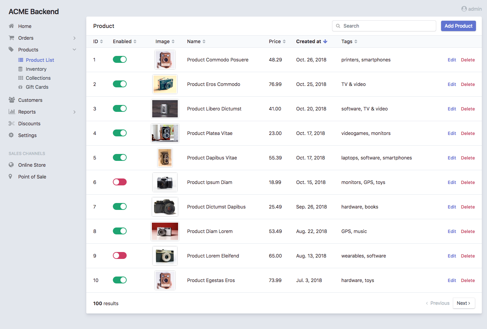
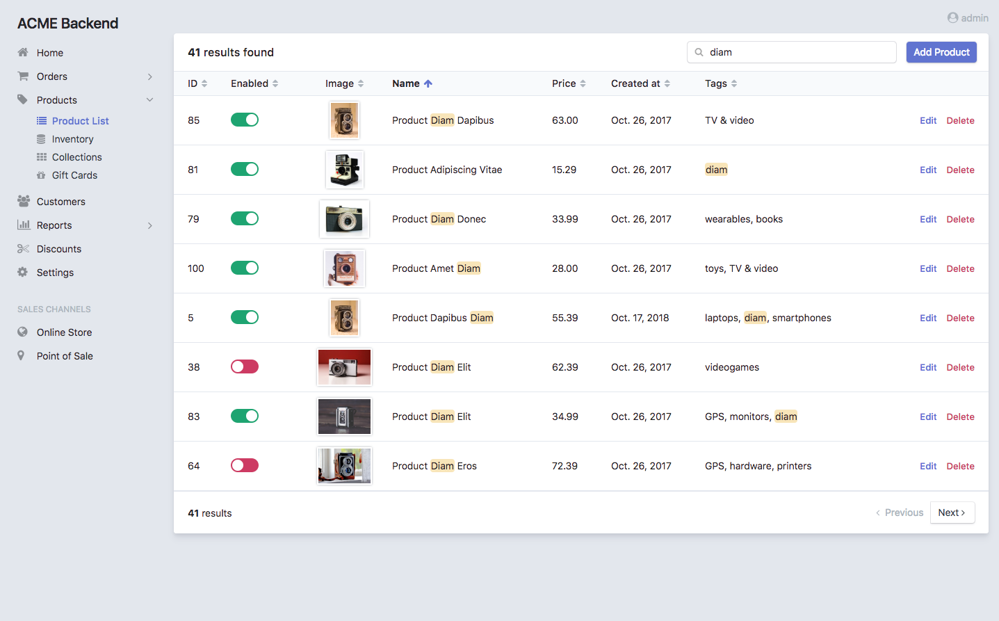
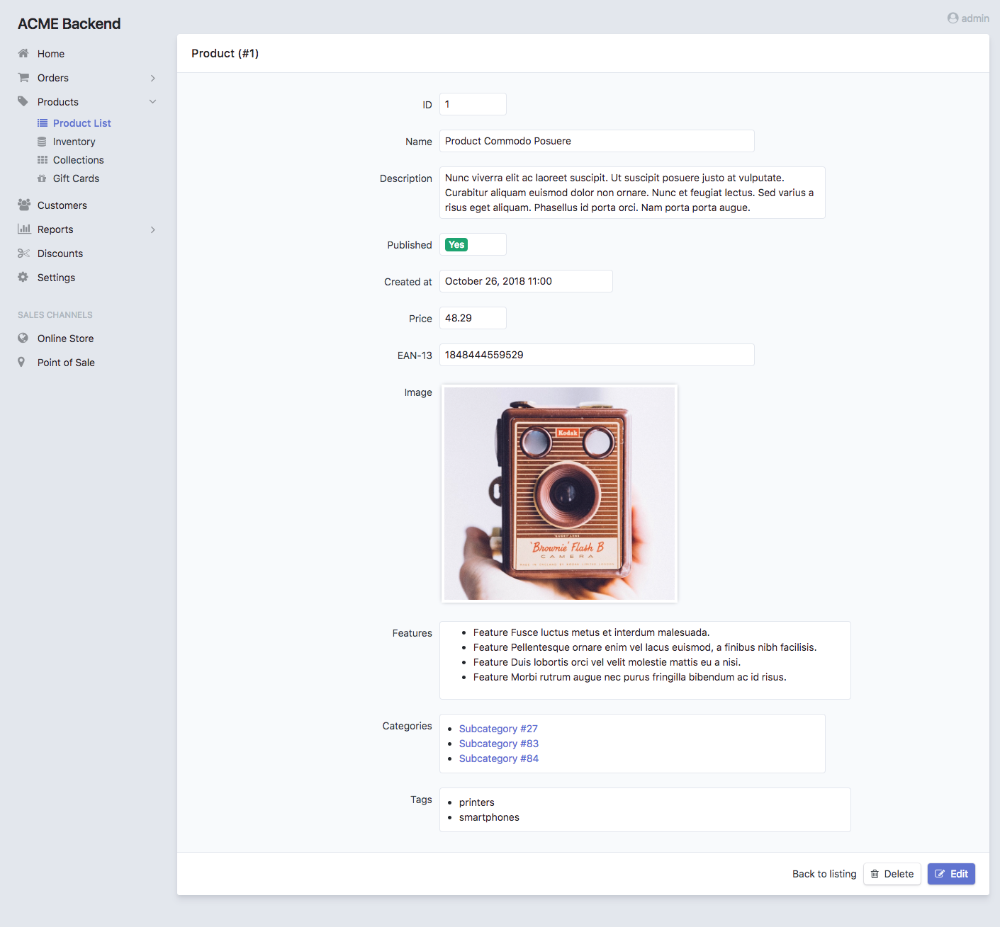
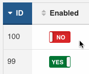
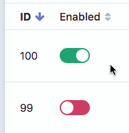
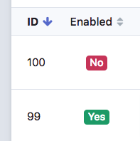

Chapter 5. List, Search and Show Views Configuration
====================================================

This chapter explains how to customize the read-only views: ``list``, ``search``
and ``show``. You'll learn all their configuration options and how to override
or tweak their templates.

List, Search and Show Views
---------------------------

The **List View** displays the items that match the given criteria and provides
automatic pagination and column sorting:



The **Search View** displays the results of any query performed by the user.
It reuses most of the design and features of the ``list`` view to ensure a
consistent user experience:



The **Show View** displays the contents of a given entity:



General Configuration
---------------------

In order to make examples more concise, this section only shows the
configuration for the ``list`` view, but you can apply the exact same options to
the other ``search`` and ``show`` views.

Customize the Title of the Page
~~~~~~~~~~~~~~~~~~~~~~~~~~~~~~~

This option refers both to the value of the ``<title>`` element and to the visible
title displayed at the top of the page. By default the title is just the name of
the entity. Define the ``title`` option to set a custom page title:

.. code-block:: yaml

    # app/config/config.yml
    easy_admin:
        entities:
            Customer:
                class: AppBundle\Entity\Customer
                label: 'Customers'
                list:
                    title: "Most recent customers"
            # ...

The ``title`` value can include the following special variables:

* ``%entity_label%``, resolves to the value defined in the ``label`` option of
  the entity. If you haven't defined it, this value will be equal to the
  entity name. In the example above, this value would be ``Customers``.
* ``%entity_name%``, resolves to the entity name, which is the YAML key used
  to configure the entity in the backend configuration file. In the example
  above, this value would be ``Customer``.
* ``%entity_id%``, it's only available for the ``show`` view and it resolves to
  the value of the primary key of the entity being showed. Even if the option
  is called ``entity_id``, it also works for primary keys with names different
  from ``id``.

.. caution::

    In Symfony applications, YAML values enclosed with ``%`` and ``%`` have a
    special meaning (they are considered container parameters). Escape these
    values doubling the ``%`` characters:

    .. code-block:: yaml

        easy_admin:
            entities:
                Customer:
                    class: AppBundle\Entity\Customer
                    label: 'Customers'
                    list:
                        title: '%%entity_label%% listing'
                # ...

If several entities use the same custom title, you can define the default title
for all entities in the global ``list.title`` and ``show.title`` options (these
global titles are always overridden by the title defined by each entity):

.. code-block:: yaml

    # app/config/config.yml
    easy_admin:
        list:
            title: 'list.%%entity_label%%'
        show:
            title: '%%entity_label%% (#%%entity_id%%)'

Display a Help Message in the Page
~~~~~~~~~~~~~~~~~~~~~~~~~~~~~~~~~~

Entities can define a global help message that is displayed below the title of
the page. This is useful to add instructions or warning messages for the end
users (e.g. "The upload process can take a lot of time (don't close the browser
window)").

The help message is defined with the ``help`` configuration option, which can be
added to the entity (all views display the same message) and to each of the
entity views:

.. code-block:: yaml

    # app/config/config.yml
    easy_admin:
        entities:
            Customer:
                class: AppBundle\Entity\Customer
                help: 'Global message displayed in all views'
                # ...
                list:
                    help: 'The list view overrides the global help message'
                    # ...
                show:
                    # 'help' is not defined, so the global help message is displayed
                    # ...
                search:
                    # use the null value to not display the inherited global help message
                    help: null
                    # ...
            # ...

Customize the Number of Rows Displayed
~~~~~~~~~~~~~~~~~~~~~~~~~~~~~~~~~~~~~~

By default, listings in the ``list`` and ``search`` display a maximum of 15
rows. To change this value, define the ``max_results`` option under the global
``list`` key or the local ``list`` key of any entity:

.. code-block:: yaml

    # app/config/config.yml
    easy_admin:
        list:
            max_results: 30
        entities:
            Category:
                list:
                    max_results: 10
        # ...

In addition, the ``show`` view displays a maximum of 10 items for fields related
with other entities (e.g. if ``Category`` and ``Product`` entities are related,
it displays a maximum of 10 products when browsing the details of some
category). To change this value, define the ``max_results`` option under the
global ``show`` key or the local ``show`` key of any entity:

.. code-block:: yaml

    # app/config/config.yml
    easy_admin:
        show:
            max_results: 20
        entities:
            Category:
                show:
                    max_results: 5
        # ...

Customize the Properties Displayed
~~~~~~~~~~~~~~~~~~~~~~~~~~~~~~~~~~

By default, the ``show`` view displays all the entity properties and the
``list`` and ``search`` views make some "smart guesses" to decide which columns
to display to make listings look good.

Use the ``fields`` option to explicitly set the properties to display:

.. code-block:: yaml

    # app/config/config.yml
    easy_admin:
        entities:
            Customer:
                class: AppBundle\Entity\Customer
                list:
                    fields: ['id', 'firstName', 'lastName', 'phone', 'email']

                # if the field name contains a dot, it's the property of a Doctrine association
                list:
                    # this config displays the 'email' and 'phone' properties of the
                    # Doctrine entity associated via the 'user' property of 'Customer'
                    fields: ['id', 'name', 'age', 'user.email', 'user.phone']

                # Doctrine associations are also supported in the 'search' view. This config looks
                # for data in the 'email' and 'phone' properties of the associated 'user' entity
                search:
                    fields: ['name', 'user.email', 'user.phone']
        # ...

This option is also useful to reorder the properties, because by default they
are displayed in the same order as defined in the related Doctrine entity.

In the case of the ``search`` view, this ``fields`` option defines the
properties included in the search query. Otherwise, the query is performed on
all entity properties except those with special data types, such as ``binary``,
``blob``, ``object``, etc.

Customize the Properties Appearance
-----------------------------------

When entity properties are not configured explicitly, the backend displays them
with the most appropriate appearance according to their data types. If you
prefer to control their appearance, start by using the extended field
configuration:

.. code-block:: yaml

    # app/config/config.yml
    easy_admin:
        entities:
            Customer:
                class: AppBundle\Entity\Customer
                list:
                    fields: ['id', 'name', { property: 'email', label: 'Contact' }]
        # ...

Instead of using a string to define the property (e.g. ``'email'``) you have to
define a hash with the name of the property (``{ property: 'email' }``) and the
options you want to define for it (``{ ..., label: 'Contact' }``).

If your entity contains lots of properties, consider using the alternative YAML
sequence syntax to improve the legibility of your backend configuration. The
following example is equivalent to the above example:

.. code-block:: yaml

    # app/config/config.yml
    easy_admin:
        entities:
            Customer:
                class: AppBundle\Entity\Customer
                list:
                    fields:
                        - id
                        - name
                        - { property: 'email', label: 'Contact' }
        # ...

These are the options that you can define for each field:

* ``property`` (mandatory): the name of the property to be displayed. This is
  the only mandatory option when using the extended field configuration format.
* ``label`` (optional): the title displayed for the field (as the column name in
  the ``list`` and ``search`` views and as the ``<label>`` element in the
  ``show`` view).

  The default title is the "humanized" version of the property name (e.g.
  ``published`` is displayed as ``Published`` and ``dateOfBirth`` as
  ``Date of birth``).
* ``css_class`` (optional): the CSS class applied to the parent HTML element that
  encloses the field contents. In the ``list`` and ``search`` views, this class
  is also applied to the ``<th>`` header of the column associated with this field.
  For example, to align the contents of some column to the right, use ``css_class: text-right``
* ``template`` (optional): the name of the custom template used to render the
  contents of the field. This option is fully explained later in this chapter.
* ``type`` (optional): the type of data stored in the property, which affects
  how the contents are displayed. The allowed values are:

  * Any of the Doctrine types: ``array``, ``association``, ``bigint``, ``blob``,
    ``boolean``, ``date``, ``datetime``, ``datetimetz``, ``decimal``, ``float``,
    ``guid``, ``integer``, ``json_array``, ``object``, ``simple_array``,
    ``smallint``, ``string``, ``text``, ``time``.
  * Any of the custom EasyAdmin types: ``email``, ``file``, ``image``, ``raw``,
    ``tel``, ``toggle``, ``url`` (they are explained later in this chapter).

The fields of the ``list`` and ``search`` views define another option:

* ``sortable`` (optional): if ``true`` the backend allows to sort results by
  this property; set it to ``false`` to disable sorting. All properties are
  *sortable* by default except virtual properties (explained later in this
  chapter) and those related with Doctrine associations of any type.

The fields of the ``show`` view can define another option:

* ``help`` (optional): the help message displayed below the field contents.

.. tip::

    In addition to these options defined by EasyAdmin, you can define any custom
    option for the fields. This way you can create very powerful backend
    customizations, as explained in the :doc:`../tutorials/custom-property-options`
    tutorial.

Formatting Dates and Numbers
----------------------------

Customizing Date and Time Properties
~~~~~~~~~~~~~~~~~~~~~~~~~~~~~~~~~~~~

By default, these are the formats applied to date and time properties (read the
`date configuration options`_ in the PHP manual if you don't understand the
meaning of these formats):

* ``date``: ``Y-m-d``
* ``time``:  ``H:i:s``
* ``datetime``: ``F j, Y H:i``

These default formats can be overridden in two ways: globally for all entities
and locally for each entity property. The global ``formats`` option sets the
formats for all entities and their properties:

.. code-block:: yaml

    easy_admin:
        formats:
            date:     'd/m/Y'
            time:     'H:i'
            datetime: 'd/m/Y H:i:s'
        entities:
            # ...

The values of the ``date``, ``time`` and ``datetime`` options are passed to the
``format()`` method of the ``DateTime`` class, so you can use any of the
`date configuration options`_ defined by PHP.

Date/time formatting can also be defined in each property configuration using
the ``format`` option. This local option always overrides the global format:

.. code-block:: yaml

    easy_admin:
        entities:
            Customer:
                class: AppBundle\Entity\Customer
                list:
                    fields:
                        - { property: 'dateOfBirth', format: 'j/n/Y' }
                        # ...
        # ...

Customizing Numeric Properties
~~~~~~~~~~~~~~~~~~~~~~~~~~~~~~

Numeric properties (``bigint``, ``integer``, ``smallint``, ``decimal``,
``float``) are formatted by default according to the locale of your Symfony
application. This formatting can be overridden globally for all entities or
locally for each property.

The global ``formats`` option applies the same formatting for all entities:

.. code-block:: yaml

    easy_admin:
        formats:
            # ...
            number: '%.2f'
        entities:
            # ...

In this case, the value of the ``number`` option is passed to the ``sprintf()``
function, so you can use any of the `PHP format specifiers`_.

Numeric properties can also define their formatting using the ``format``
option. This local option always overrides the global format:

.. code-block:: yaml

    easy_admin:
        entities:
            Product:
                class: AppBundle\Entity\Product
                list:
                    fields:
                        - { property: 'serialNumber', format: '%010s' }
                        - { property: 'margin', format: '%01.2f' }
                        # ...
        # ...

Virtual Properties
------------------

Sometimes, it's useful to display values which are not entity properties. For
example, if your ``Customer`` entity defines the ``firstName`` and ``lastName``
properties, you may want to display a column called ``Name`` with both values
merged. These are called *virtual properties* because they don't really exist as
Doctrine entity properties.

First add the virtual property to the entity configuration as any other property:

.. code-block:: yaml

    easy_admin:
        entities:
            Customer:
                class: AppBundle\Entity\Customer
                list:
                    # 'name' doesn't exist as a Doctrine entity property
                    fields: ['id', 'name', 'phone', 'email']
        # ...

Now, if you reload the backend, you'll see that the virtual property only
displays ``Inaccessible`` as its value. The reason is that ``name`` does not
match any of the entity's properties. To fix this issue, add a new public method
in your entity called ``getName()``:

.. code-block:: php

    use Doctrine\ORM\Mapping as ORM;

    /** @ORM\Entity */
    class Customer
    {
        // ...

        public function getName()
        {
            return $this->getFirstName().' '.$this->getLastName();
        }
    }

That's it. Reload your backend and now you'll see the value of this virtual
property.

.. note::

    The values or virtual properties are get using the `PropertyAccess component`_
    from Symfony, which requires to follow a strict syntax for getter names:
    ``get`` + camelized version of the property name. Example: ``name`` ->
    ``getName()``; ``firstName`` -> ``getFirstName()``; ``first_and_last_name`` ->
    ``getFirstAndLastName()``.

By default, virtual properties are displayed as text contents. If your virtual
property is a *boolean* value or a date, use the ``type`` option to set a more
appropriate data type:

.. code-block:: yaml

    # in this example, the virtual properties 'is_eligible' and 'last_contact' define
    # their 'type' option to avoid displaying them as regular text contents
    easy_admin:
        entities:
            Customer:
                class: AppBundle\Entity\Customer
                list:
                    fields:
                        - 'id'
                        - { property: 'is_eligible',  type: 'boolean' }
                        - { property: 'last_contact', type: 'datetime' }
        # ...

The main limitation of virtual properties is that you cannot sort listings
using these fields.

Sorting Entity Listings
-----------------------

By default the ``list`` and ``search`` views sort the rows in descending order
according to the value of the primary key. You can sort by any other entity
property using the ``sort`` configuration option:

.. code-block:: yaml

    # app/config/config.yml
    easy_admin:
        entities:
            User:
                # ...
                list:
                    # if the sort order is not specified, 'DESC' is used
                    sort: 'createdAt'
                search:
                    # use an array to also define the sorting direction
                    sort: ['createdAt', 'ASC']

            Purchase:
                # ...
                # the 'sort' option supports Doctrine associations up to one level
                # (e.g. 'sort: user.name' works but 'sort: user.group.name' won't work)
                list:
                    sort: 'user.name'
                search:
                    sort: ['user.name', 'ASC']

The ``sort`` option of each entity is only used as the default content sorting. If
the query string includes the optional ``sortField`` and ``sortDirection``
parameters, their values override this ``sort`` option. This happens for example
when defining a different sorting in a custom menu and when clicking on the
listings columns to reorder the displayed contents.

Filtering Entities
------------------

A common need for backends is to filter the entities included in listings (for
example: don't display expired offers, display only clients that spend more than
a given amount, etc.) You can achieve this with the features explained later in
this chapter to modify the behavior of the ``list``, ``search`` and ``show`` views.

However, for simple filters it's more convenient to use the ``dql_filter`` option,
which defines the conditions passed to the ``WHERE`` clause of the Doctrine query
used to get the entities displayed in the ``list`` and ``search`` views.

The following example manages the same ``User`` entity in two different ways using
a basic filter to differentiate each type of user:

.. code-block:: yaml

    easy_admin:
        entities:
            VipCustomers:
                class: AppBundle\Entity\User
                list:
                    dql_filter: 'entity.budget > 100000'
            RegularCustomers:
                class: AppBundle\Entity\User
                list:
                    dql_filter: 'entity.budget <= 100000'

The Doctrine DQL expression defined in the ``dql_filter`` option must always use
``entity`` as the name of the entity, regardless of your actual entity name.

Since this is a regular YAML configuration file, you can also include container
parameters inside the filter to use different values depending on the environment
or even dynamic values:

.. code-block:: yaml

    easy_admin:
        entities:
            VipCustomers:
                class: AppBundle\Entity\User
                list:
                    dql_filter: 'entity.budget > %customers.budget_threshold%'
            # ...

The value of the ``dql_filter`` can combine several conditions (in fact, you can
put anything that is considered valid as a ``WHERE`` clause in a Doctrine query):

.. code-block:: yaml

    easy_admin:
        entities:
            UrgentIssues:
                class: AppBundle\Entity\Issue
                list:
                    dql_filter: "entity.label = 'CRITICAL' OR entity.priority > 4"
            ImportantIssues:
                class: AppBundle\Entity\Issue
                list:
                    dql_filter: "entity.priority > 2 AND entity.numComments > 10"
            AllIssues:
                class: AppBundle\Entity\Issue

.. note::

    By default the ``dql_filter`` option from the ``list`` view is also used in the
    ``search`` view. If you prefer to apply different filters, define the
    ``dql_filter`` option explicitly for the ``search`` view:

    .. code-block:: yaml

        easy_admin:
            entities:
                Issues:
                    class: AppBundle\Entity\Issue
                    list:
                        dql_filter: "LOWER(entity.title) LIKE '%%issue%%'"
                    search:
                        # defining a different condition than 'list'
                        dql_filter: "entity.status != 'DELETED'"
                        # using an empty value to not apply any condition when searching
                        # elements (this prevents inheriting the 'dql_filter' value defined in 'list')
                        dql_filter: ''

.. tip::

    Combine the ``dql_filter`` option with a custom menu (as explained in the next
    chapters) to improve the navigation of the backend.

Property Types Defined by EasyAdmin
-----------------------------------

In addition to the Doctrine data types, properties can use any of the following
data types defined by EasyAdmin.

Email Data Type
~~~~~~~~~~~~~~~

It displays the contents of the property as a clickable ``mailto:`` link:

.. code-block:: yaml

    easy_admin:
        entities:
            Product:
                class: AppBundle\Entity\User
                list:
                    fields:
                        - { property: 'contact', type: 'email' }
                        # ...
        # ...

URL Data Type
~~~~~~~~~~~~~

It displays the contents of the property as a clickable link which opens in a
new browser tab:

.. code-block:: yaml

    easy_admin:
        entities:
            Product:
                class: AppBundle\Entity\User
                list:
                    fields:
                        - { property: 'blogUrl', type: 'url' }
                        # ...
        # ...

Telephone Data Type
~~~~~~~~~~~~~~~~~~~

It displays the contents of the property as a clickable telephone number. Beware
that some browsers don't support these links:

.. code-block:: yaml

    easy_admin:
        entities:
            Product:
                class: AppBundle\Entity\User
                list:
                    fields:
                        - { property: 'workPhoneNumber', type: 'tel' }
                        # ...
        # ...

Toggle and Boolean Data Types
~~~~~~~~~~~~~~~~~~~~~~~~~~~~~

If an entity is editable, the ``list`` view applies the ``type: 'toggle'``
option to all its boolean properties. This data type makes these properties be
rendered as "flip switches" that allow to toggle their values very easily:



When you change the value of any boolean property, an Ajax request is made to
actually change that value in the database. If something goes wrong, the switch
automatically returns to its original value and it disables itself until the
page is refreshed to avoid further issues:



In you prefer to disable these "toggles", define the ``type`` of the property
explicitly as ``boolean``:

.. code-block:: yaml

    easy_admin:
        entities:
            Product:
                class: AppBundle\Entity\Product
                list:
                    fields:
                        - { property: 'hasStock', type: 'boolean' }
                        # ...
        # ...

Now the boolean value is rendered as a simple label and its value cannot be
modified from the ``list`` view:



Image Data Type
~~~~~~~~~~~~~~~

If any of your properties stores the URL or path of an image, this type allows
you to display the actual image instead of its path. In most cases, you just
need to set the ``type`` property to ``image``:

.. code-block:: yaml

    easy_admin:
        entities:
            Product:
                class: AppBundle\Entity\Product
                list:
                    fields:
                        - { property: 'photo', type: 'image' }
                        # ...
        # ...

In the above example, the ``photo`` property is displayed as a ```` HTML
element whose ``src`` attribute is the value stored in the property.

If the property stores relative paths, define the ``base_path`` option to set the
path to be prefixed to the image path:

.. code-block:: yaml

    easy_admin:
        entities:
            Product:
                class: AppBundle\Entity\Product
                list:
                    fields:
                        - { property: 'photo', type: 'image', base_path: '/img/' }
                        # ...
        # ...

The value of the ``base_path`` can be a relative or absolute URL and even a
Symfony parameter:

.. code-block:: yaml

    # relative path
    - { property: 'photo', type: 'image', base_path: '/img/products/' }

    # absolute path pointing to an external host
    - { property: 'photo', type: 'image', base_path: 'http://static.acme.org/img/' }

    # Symfony container parameter
    - { property: 'photo', type: 'image', base_path: '%vich_uploader.mappings.product_image%' }

The image base path can also be set in the entity, to avoid repeating its
value for different properties or different views:

.. code-block:: yaml

    easy_admin:
        entities:
            Product:
                class: AppBundle\Entity\Product
                image_base_path: 'http://static.acme.org/img/'
                list:
                    fields:
                        - { property: 'photo', type: 'image' }
                        # ...
        # ...

The base paths defined for a property always have priority over the one defined
globally for the entity.

File Data Type
~~~~~~~~~~~~~~

If any of your properties stores the URL or path of a file, this type allows you
to display a link to the actual file. In most cases, you just need to set the
``type`` property to ``file``:

.. code-block:: yaml

    easy_admin:
        entities:
            Product:
                class: AppBundle\Entity\Product
                list:
                    fields:
                        - { property: 'instructions', type: 'file' }
                        # ...
        # ...

In the above example, the ``instructions`` property is displayed as an ``<a>``
HTML element whose ``href`` attribute is the value stored in the property.

If the property stores relative paths, define the ``base_path`` option to set the
absolute or relative path to be prefixed to the file path:

.. code-block:: yaml

    easy_admin:
        entities:
            Product:
                class: AppBundle\Entity\Product
                list:
                    fields:
                        - { property: 'instructions', type: 'file', base_path: '/pdf/' }
                        # ...
        # ...

The file base path can also be set in the entity, to avoid repeating its
value for different properties or different views:

.. code-block:: yaml

    easy_admin:
        entities:
            Product:
                class: AppBundle\Entity\Product
                file_base_path: 'http://static.acme.org/pdf/'
                list:
                    fields:
                        - { property: 'instructions', type: 'file' }
                        # ...
        # ...

The base paths defined for a property always have priority over the one defined
globally for the entity.

The name of the file is displayed by default as the text of the ``<a>`` link.
If this is undesired, define the ``filename`` property to set the ``<a>`` text
explicitly:

.. code-block:: yaml

    easy_admin:
        entities:
            Product:
                class: AppBundle\Entity\Product
                list:
                    fields:
                        - { property: 'instructions', type: 'file', filename: 'View instructions (PDF)' }
                        # ...
        # ...

Raw Data Type
~~~~~~~~~~~~~

All the string-based data types are escaped before displaying them. For that
reason, if the property stores HTML content, you'll see the HTML tags instead of
the rendered HTML content. In case you want to display the contents unescaped,
define the ``type`` option with a ``raw`` value:

.. code-block:: yaml

    easy_admin:
        entities:
            Product:
                class: AppBundle\Entity\Product
                list:
                    fields:
                        - { property: 'features', type: 'raw' }
                        # ...
        # ...

.. _list-search-show-advanced-design-configuration:

Advanced Design Configuration
-----------------------------

This section explains how to completely customize the design of the ``list``,
``search`` and ``show`` views overriding the default templates and fragments
used to render them.

Default Templates
~~~~~~~~~~~~~~~~~

EasyAdmin defines seven Twig templates to create its interface. These are the
four templates related to ``list``, ``search`` and ``show`` views:

* ``layout``, the common layout that decorates the rest of the main templates;
* ``show``, renders the contents stored by a given entity;
* ``list``, renders the entity listings and the search results page;
* ``paginator``, renders the paginator of the ``list`` view.

Depending on your needs you can override these templates in different ways:

* Override the templates **via configuration**, when you want to decide where
  to store the custom templates;
* Override the templates **via convention**, which is faster to set up because
  you store the custom templates in a specific directory defined by EasyAdmin.

Selecting the Template to Render
~~~~~~~~~~~~~~~~~~~~~~~~~~~~~~~~

Before selecting a template to render some contents, EasyAdmin looks for these
configuration options and directory locations to check if your backend has
overridden it (the first template which exists is used):

1. ``easy_admin.entities.<EntityName>.templates.<TemplateName>`` configuration
   option.
2. ``easy_admin.design.templates.<TemplateName>`` configuration option.
3. ``app/Resources/views/easy_admin/<EntityName>/<TemplateName>.html.twig``
4. ``app/Resources/views/easy_admin/<TemplateName>.html.twig``
5. ``@EasyAdmin/default/<TemplateName>.html.twig``

The last one is the path of the built-in templates and they are always available.
The following sections explain the first four ways to customize the templates
used by the backend.

.. tip::

    Regardless of how you override the default templates, it's convenient to
    check first the variables provided by the backend to those templates. The
    easiest way to do this is to include an empty ``{{ dump() }}`` call in your
    templates.

Overriding the Default Templates By Configuration
.................................................

If you prefer to decide where to store your custom templates, use the
``templates`` option globally or for some specific entities.

For example, to override the ``paginator`` template just for the ``Customer``
entity, create the ``paginator.html.twig`` template somewhere in your
application and then, configure its location with the ``templates`` option:

.. code-block:: yaml

    easy_admin:
        entities:
            Customer:
                # ...
                templates:
                    # Twig namespace template syntax
                    paginator: '@App/Default/fragments/_paginator.html.twig'
                    # legacy template syntax works too:
                    # paginator: 'AppBundle:Default:fragments/_paginator.html.twig'

Similarly, to override some template for all entities, define the ``templates``
option under the global ``design`` option:

.. code-block:: yaml

    easy_admin:
        design:
            templates:
                # Twig namespace template syntax
                paginator: '@App/Default/fragments/_paginator.html.twig'
                # legacy template syntax works too:
                paginator: 'AppBundle:Default:fragments/_paginator.html.twig'
        entities:
            # ...

Overriding the Default Templates By Convention
..............................................

If you don't mind the location of your custom templates, consider creating them
in the ``app/Resources/views/easy_admin/`` directory. When the ``templates``
option is not defined, EasyAdmin looks into this directory before falling back
to the default templates.

For example, to override the ``paginator`` template just for the ``Customer``
entity, you only need to create this template in this exact location (there is
no need to define the ``templates`` configuration option):

::

    your-project/
    ├─ app/
    │  ├─ ...
    │  └─ Resources/
    │     └─ views/
    │        └─ easy_admin/
    │           └─ Customer/
    │              └─ paginator.html.twig
    ├─ src/
    ├─ vendor/
    └─ web/

In case you want to override the template for all entities, define the new
template right under the ``easy_admin/`` directory:

::

    your-project/
    ├─ app/
    │  ├─ ...
    │  └─ Resources/
    │     └─ views/
    │        └─ easy_admin/
    │           └─ paginator.html.twig
    ├─ src/
    ├─ vendor/
    └─ web/

Tweaking the Design of the Default Templates
............................................

Most often than not, customizing the design of the backend is a matter of just
tweaking some element of the default templates instead of overriding them
completely. The easiest way to do that is to create a new template that extends
from the default one and override just the specific Twig block you want to
customize.

Suppose you want to change the search form of the ``list`` view. First, create a
new ``list.html.twig`` template as explained in the previous sections. Then, make
your template extend from the default ``list.html.twig`` template:

.. code-block:: twig

    

    {# ... #}

Lastly, override the ``search_action`` block to just change that template fragment:

.. code-block:: twig

    

    
        {# ... #}
    

Customizing the Template Used to Render Each Property Type
~~~~~~~~~~~~~~~~~~~~~~~~~~~~~~~~~~~~~~~~~~~~~~~~~~~~~~~~~~

In the ``list``, ``search`` and ``show`` views, the value of each property is
rendered with a different template according to its type. For example,
properties of type ``string`` are rendered with the ``field_string.html.twig``
template.

These are all the available templates for each property type:

* ``field_array.html.twig``
* ``field_association.html.twig``, renders the properties defined as Doctrine
  associations. These relations are by default displayed as links pointing to
  the ``show`` action of the related entity. If you prefer to not display those
  links, disable the ``show`` action for the related entities with the
  ``disabled_actions`` option.
* ``field_bigint.html.twig``
* ``field_boolean.html.twig``
* ``field_date.html.twig``
* ``field_datetime.html.twig``
* ``field_datetimetz.html.twig``
* ``field_decimal.html.twig``
* ``field_email.html.twig``, related to the special ``email`` data type defined
  by EasyAdmin.
* ``field_float.html.twig``
* ``field_id.html.twig``, special template to render any property called ``id``.
  This avoids formatting the value of the primary key as a numeric value, with
  decimals and thousand separators.
* ``field_image.html.twig``, related to the special ``image`` data type defined
  by EasyAdmin.
* ``field_integer.html.twig``
* ``field_raw.html.twig``, related to the special ``raw`` data type defined by
  EasyAdmin.
* ``field_simple_array.html.twig``
* ``field_smallint.html.twig``
* ``field_string.html.twig``
* ``field_tel.html.twig``, related to the special ``tel`` data type defined by
  EasyAdmin.
* ``field_text.html.twig``
* ``field_time.html.twig``
* ``field_toggle.html.twig``, related to the special ``toggle`` data type defined
  by EasyAdmin for boolean properties.
* ``field_url.html.twig``, related to the special ``url`` data type defined by
  EasyAdmin.

In addition, there are other templates defined to render special labels:

* ``label_empty.html.twig``, used when the property to render is empty (it's
  used for arrays, collections, associations, images, etc.)
* ``label_inaccessible.html.twig``, used when is not possible to access the
  value of the property because there is no getter or public property.
* ``label_null.html.twig``, used when the value of the property is ``null``.
* ``label_undefined.html.twig``, used when any kind of error or exception
  happens when trying to access the value of the property.

The same template overriding mechanism explained in the previous sections can be
applied to customize the templates used to render each property. Therefore, you
can override these templates globally or for each entity and you can do that
defining the ``template`` configuration option or storing the templates in the
``app/Resources/views/easy_admin/`` directory.

Before customizing these templates, it's recommended to check out the default
``field_*.html.twig`` and ``label_*.html.twig`` templates to learn about their
features. Inside these templates you have access to the following variables:

* ``field_options``, an array with the options configured for this field in the
  backend configuration file.
* ``item``, an object with the current entity instance.
* ``value``, the content of the property being rendered, which can be a variable
  of any type (string, numeric, boolean, array, etc.)
* ``view``, a string with the name of the view where the field is being rendered
  (``show`` or ``list``);
* ``entity_config``, an array with the full configuration of the currently
  selected entity;
* ``backend_config``, an array with the full backend configuration.

Rendering Entity Properties with Custom Templates
~~~~~~~~~~~~~~~~~~~~~~~~~~~~~~~~~~~~~~~~~~~~~~~~~

The ``templates`` property explained in the previous section is an "all or
nothing" option. If you override for example the ``field_integer.html.twig``
template, the changes are applied to all the properties of type integer for that
entity or the entire backend.

However, when your backend is very complex, it may be useful to use a custom
template just to render a single property of some entity. To do so, define the
path of the custom template in the ``template`` option of the property:

.. code-block:: yaml

    easy_admin:
        # ...
        entities:
            Invoice:
                list:
                    fields:
                        - { property: 'total', template: 'invoice_total.html.twig' }

The value of the ``total`` property is now rendered with ``invoice_total.html.twig``
template instead of the default ``field_float.html.twig`` template. As usual,
EasyAdmin first looks for custom templates in the following locations (the first
existing template is used):

1. ``app/Resources/views/easy_admin/<EntityName>/<TemplateOptionValue>``
2. ``app/Resources/views/easy_admin/<TemplateOptionValue>``

If none of these templates exist, the value of the ``template`` option is
considered a Symfony template path, so you can use any of the valid template
syntaxes:

.. code-block:: yaml

    easy_admin:
        # ...
        entities:
            Invoice:
                list:
                    fields:
                        - { property: 'total', template: 'AppBundle:Invoice:total.html.twig' }
                        - { property: 'price', template: '@App/Invoice/unit_price.html.twig' }

Custom templates receive the same parameters as built-in templates
(``field_options``, ``item``, ``value`` and ``view``).

.. _`date configuration options`: http://php.net/manual/en/function.date.php
.. _`PHP format specifiers`: http://php.net/manual/en/function.sprintf.php
.. _`PropertyAccess component`: https://symfony.com/doc/current/components/property_access.html
