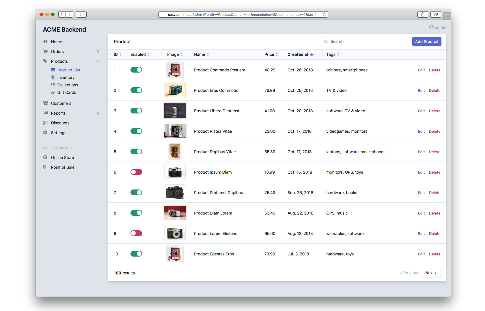

Chapter 2. Your First Backend
=============================

Creating your first backend will take you less than 30 seconds if your Symfony
application already defines some Doctrine ORM entities. Otherwise, create some
entities before continuing (you can use the ``make:entity`` command from the
`Symfony MakerBundle`_ to generate them quickly).

Let's consider that the app defines three entities called ``Product``,
``Category`` and ``User``. Open the ``config/packages/easy_admin.yaml`` file and
add the following configuration:

.. code-block:: yaml

    # config/packages/easy_admin.yaml
    easy_admin:
        entities:
            # change the following to the namespaces of your own entities
            - App\Entity\Product
            - App\Entity\Category
            - App\Entity\User

**Congratulations! You've just created your first fully-featured backend!**
Browse the ``/admin`` URL in your Symfony application and you'll get access to
the admin backend:

.. note::

    If the interface of your backend displays translation keys instead of the
    actual contents, make sure that the ``translator`` service is enabled:

    .. code-block:: yaml

        # config/packages/translation.yaml
        framework:
            translator:
                fallbacks: [ "en" ]

Expanded Configuration Format
-----------------------------

This simple backend uses the shortcut configuration format, but for real
backends, you must use the extended configuration syntax instead, which allows
to configure lots of options for each entity:

.. code-block:: yaml

    # config/packages/easy_admin.yaml
    easy_admin:
        entities:
            Customer:
                class: App\Entity\Customer
            Order:
                class: App\Entity\Order
            Product:
                class: App\Entity\Product

Entities are configured as elements under the ``entities`` key. The name of the
entities are used as the YAML keys. These names must be unique in the backend
and it's recommended to use the CamelCase syntax (e.g. ``BlogPost`` and not
``blog_post`` or ``blogPost``).

The only required option in this configuration format is called ``class`` and
defines the fully qualified class name of the Doctrine entity managed by the
backend.

-----

Next chapter: :doc:`basic-configuration`

.. _`Symfony MakerBundle`: https://symfony.com/doc/current/bundles/SymfonyMakerBundle/index.html
