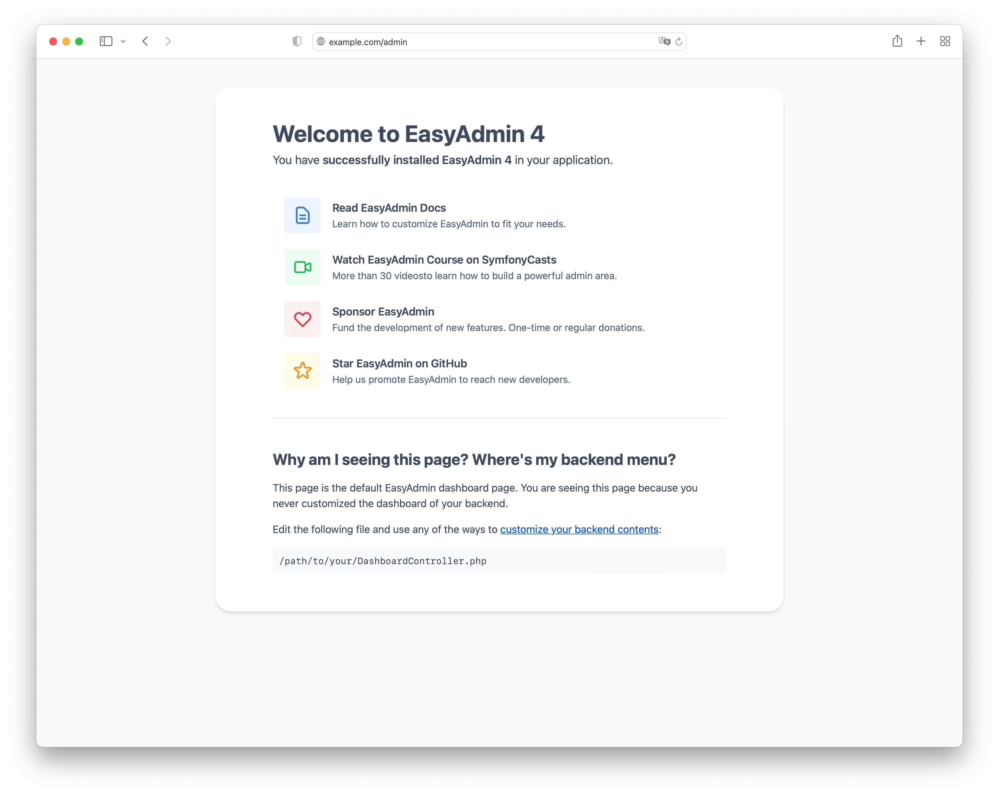

Dashboards
==========

**Dashboards** are the entry point of backends and they link to one or more
:doc:`resources </crud>`. Dashboards also display a main menu to navigate the
resources and the information of the logged in user.

Imagine that you have a simple application with three Doctrine entities: users,
blog posts and categories. Your own employees can create and edit any of them
but external collaborators can only create blog posts.

You can implement this in EasyAdmin as follows:

* Create three CRUD controllers (e.g. ``UserCrudController``, ``BlogPostCrudController``
  and ``CategoryCrudController``);
* Create a dashboard for your employees (e.g. ``DashboardController``) and link
  to the three resources;
* Create a dashboard for your external collaborators (e.g. ``ExternalDashboardController``)
  and link only to the ``BlogPostCrudController`` resource.

Technically, dashboards are regular `Symfony controllers`_ so you can do
anything you usually do in a controller, such as injecting services and using
shortcuts like ``$this->render()`` or ``$this->isGranted()``.

Dashboard controller classes must implement the
``EasyCorp\Bundle\EasyAdminBundle\Contracts\Controller\DashboardControllerInterface``,
which ensures that certain methods are defined in the dashboard. Instead of
implementing the interface, you can also extend from the
``AbstractDashboardController`` class. Run the following command to quickly
generate a dashboard controller:

.. code-block:: terminal

    $ php bin/console make:admin:dashboard

If you now visit the ``/admin`` URL of your application, you'll see the default
EasyAdmin Welcome Page:

Later in this article you'll learn how to customize that page. If you don't see
the Welcome Page, you might need to configure the URL of your backend as
explained in the next section.

.. _dashboard-route:

Dashboard Route
---------------

Each dashboard uses a single Symfony route to serve all its URLs. The needed
information is passed using query string parameters. If you generated the
dashboard with the ``make:admin:dashboard`` command, the route is defined using
`Symfony route annotations`_ or PHP attributes (if the project requires PHP 8 or newer).

**The only requirement** is to define the route in a controller method named
``index()``, which is the one called by EasyAdmin to render the dashboard:

.. configuration-block::

    .. code-block:: php-annotations

        // src/Controller/Admin/DashboardController.php
        namespace App\Controller\Admin;

        use EasyCorp\Bundle\EasyAdminBundle\Config\Dashboard;
        use EasyCorp\Bundle\EasyAdminBundle\Controller\AbstractDashboardController;
        use Symfony\Component\HttpFoundation\Response;
        use Symfony\Component\Routing\Annotation\Route;

        class DashboardController extends AbstractDashboardController
        {
            /**
             * @Route("/admin")
             */
            public function index(): Response
            {
                return parent::index();
            }

            // ...
        }

    .. code-block:: php-attributes

        // src/Controller/Admin/DashboardController.php
        namespace App\Controller\Admin;

        use EasyCorp\Bundle\EasyAdminBundle\Config\Dashboard;
        use EasyCorp\Bundle\EasyAdminBundle\Controller\AbstractDashboardController;
        use Symfony\Component\HttpFoundation\Response;
        use Symfony\Component\Routing\Attribute\Route;

        class DashboardController extends AbstractDashboardController
        {
            #[Route('/admin')]
            public function index(): Response
            {
                return parent::index();
            }

            // ...
        }

.. note::

    Since ``index()`` is part of the Dashboard interface, you cannot add arguments
    to it to inject dependencies. Instead, inject those dependencies in the
    constructor method of the controller.

.. note::

    If you are implementing a multilingual dashboard, add the ``_locale`` parameter
    to the route (e.g. ``/admin/{_locale}``).

The ``/admin`` URL is only a default value, so you can change it. If you do that,
don't forget to also update this value in your Symfony security config to
:ref:`restrict access to the entire backend <security-entire-backend>`.

There's no need to define an explicit name for this route. Symfony autogenerates
a route name and EasyAdmin gets that value at runtime to generate all URLs.
However, if you generate URLs pointing to the dashboard in other parts of your
application, you can define an explicit route name to simplify your code:

.. configuration-block::

    .. code-block:: php-annotations

        // src/Controller/Admin/DashboardController.php
        namespace App\Controller\Admin;

        use EasyCorp\Bundle\EasyAdminBundle\Config\Dashboard;
        use EasyCorp\Bundle\EasyAdminBundle\Controller\AbstractDashboardController;
        use Symfony\Component\HttpFoundation\Response;
        use Symfony\Component\Routing\Annotation\Route;

        class DashboardController extends AbstractDashboardController
        {
            /**
             * @Route("/admin", name="some_route_name")
             */
            public function index(): Response
            {
                return parent::index();
            }

            // ...
        }

    .. code-block:: php-attributes

        // src/Controller/Admin/DashboardController.php
        namespace App\Controller\Admin;

        use EasyCorp\Bundle\EasyAdminBundle\Config\Dashboard;
        use EasyCorp\Bundle\EasyAdminBundle\Controller\AbstractDashboardController;
        use Symfony\Component\HttpFoundation\Response;
        use Symfony\Component\Routing\Attribute\Route;

        class DashboardController extends AbstractDashboardController
        {
            #[Route('/admin', name: 'some_route_name')]
            public function index(): Response
            {
                return parent::index();
            }

            // ...
        }

If you don't use annotations, you must configure the dashboard route using YAML,
XML or PHP config in a separate file:

.. configuration-block::

    .. code-block:: yaml

        # config/routes.yaml
        dashboard:
            path: /admin
            controller: App\Controller\Admin\DashboardController::index

        # ...

    .. code-block:: xml

        <!-- config/routes.xml -->
        <?xml version="1.0" encoding="UTF-8" ?>
        <routes xmlns="http://symfony.com/schema/routing"
            xmlns:xsi="http://www.w3.org/2001/XMLSchema-instance"
            xsi:schemaLocation="http://symfony.com/schema/routing
                https://symfony.com/schema/routing/routing-1.0.xsd">

            <route id="dashboard" path="/admin"
                   controller="App\Controller\Admin\DashboardController::index"/>

            <!-- ... -->
        </routes>

    .. code-block:: php

        // config/routes.php
        use App\Controller\Admin\DashboardController;
        use Symfony\Component\Routing\Loader\Configurator\RoutingConfigurator;

        return function (RoutingConfigurator $routes) {
            $routes->add('dashboard', '/admin')
                ->controller([DashboardController::class, 'index'])
            ;

            // ...
        };

In practice you won't have to deal with this route or the query string
parameters in your application because EasyAdmin provides a service to
:ref:`generate admin URLs <generate-admin-urls>`.

.. note::

    Using a single route to handle all backend URLs means that generated URLs
    are a bit long and ugly. This is a reasonable trade-off because it makes
    many other features, such as generating admin URLs, much simpler.

Dashboard Configuration
-----------------------

The dashboard configuration is defined in the ``configureDashboard()`` method
(the main menu and the user menu are configured in their own methods, as
explained later)::

    namespace App\Controller\Admin;

    use EasyCorp\Bundle\EasyAdminBundle\Config\Dashboard;
    use EasyCorp\Bundle\EasyAdminBundle\Controller\AbstractDashboardController;
    use EasyCorp\Bundle\EasyAdminBundle\Dto\LocaleDto;

    class DashboardController extends AbstractDashboardController
    {
        // ...

        public function configureDashboard(): Dashboard
        {
            return Dashboard::new()
                // the name visible to end users
                ->setTitle('ACME Corp.')
                // you can include HTML contents too (e.g. to link to an image)
                ->setTitle(' ACME Corp.')

                // by default EasyAdmin displays a black square as its default favicon;
                // use this method to display a custom favicon: the given path is passed
                // "as is" to the Twig asset() function:
                // <link rel="shortcut icon" href="{{ asset('...') }}">
                ->setFaviconPath('favicon.svg')

                // the domain used by default is 'messages'
                ->setTranslationDomain('my-custom-domain')

                // there's no need to define the "text direction" explicitly because
                // its default value is inferred dynamically from the user locale
                ->setTextDirection('ltr')

                // set this option if you prefer the page content to span the entire
                // browser width, instead of the default design which sets a max width
                ->renderContentMaximized()

                // set this option if you prefer the sidebar (which contains the main menu)
                // to be displayed as a narrow column instead of the default expanded design
                ->renderSidebarMinimized()

                // by default, users can select between a "light" and "dark" mode for the
                // backend interface. Call this method if you prefer to disable the "dark"
                // mode for any reason (e.g. if your interface customizations are not ready for it)
                ->disableDarkMode()

                // by default, the UI color scheme is 'auto', which means that the backend
                // will use the same mode (light/dark) as the operating system and will
                // change in sync when the OS mode changes.
                // Use this option to set which mode ('light', 'dark' or 'auto') will users see
                // by default in the backend (users can change it via the color scheme selector)
                ->setDefaultColorScheme('dark')
                // instead of magic strings, you can use constants as the value of
                // this option: EasyCorp\Bundle\EasyAdminBundle\Config\Option\ColorScheme::DARK

                // by default, all backend URLs are generated as absolute URLs. If you
                // need to generate relative URLs instead, call this method
                ->generateRelativeUrls()

                // set this option if you want to enable locale switching in dashboard.
                // IMPORTANT: this feature won't work unless you add the {_locale}
                // parameter in the admin dashboard URL (e.g. '/admin/{_locale}').
                // the name of each locale will be rendered in that locale
                // (in the following example you'll see: "English", "Polski")
                ->setLocales(['en', 'pl'])
                // to customize the labels of locales, pass a key => value array
                // (e.g. to display flags; although it's not a recommended practice,
                // because many languages/locales are not associated to a single country)
                ->setLocales([
                    'en' => '🇬🇧 English',
                    'pl' => '🇵🇱 Polski'
                ])
                // to further customize the locale option, pass an instance of
                // EasyCorp\Bundle\EasyAdminBundle\Config\Locale
                ->setLocales([
                    'en', // locale without custom options
                    Locale::new('pl', 'polski', 'far fa-language') // custom label and icon
                ])
            ;
        }
    }

.. deprecated:: 4.1.0

    The ``disableUrlSignatures()`` dashboard method was deprecated in
    EasyAdmin 4.1.0 because backend URLs no longer include signatures.

Customizing the Dashboard Contents
----------------------------------

Generated dashboards display by default a "Welcome Page" with some useful links.
In a real application you'll need to customize this page to display your own contents.

Dashboards usually display widgets and charts with stats. EasyAdmin doesn't
provide yet any way of creating those widgets. It's in our list of future features,
but meanwhile you can use `Symfony UX Chart.js`_ bundle to create those charts
and render them in your own Twig template::

    use EasyCorp\Bundle\EasyAdminBundle\Config\Dashboard;
    use EasyCorp\Bundle\EasyAdminBundle\Controller\AbstractDashboardController;
    use Symfony\UX\Chartjs\Builder\ChartBuilderInterface;
    use Symfony\UX\Chartjs\Model\Chart;

    class DashboardController extends AbstractDashboardController
    {
        public function __construct(
            private ChartBuilderInterface $chartBuilder,
        ) {
        }

        // ... you'll also need to load some CSS/JavaScript assets to render
        // the charts; this is explained later in the chapter about Design

        #[Route('/admin')]
        public function index(): Response
        {
            $chart = $this->chartBuilder->createChart(Chart::TYPE_LINE);
            // ...set chart data and options somehow

            return $this->render('admin/my-dashboard.html.twig', [
                'chart' => $chart,
            ]);
        }
    }

.. note::

    Since ``index()`` is part of the ``Dashboard`` interface, you cannot add arguments
    to it to inject dependencies (such as ``ChartBuilderInterface`` in the above
    example). Instead, inject dependencies in the controller constructor or use
    a method name different from the ones defined in the interface.

To use EasyAdmin's built-in layout on your custom dashboard (e.g. the main menu
bar on the left - explained in the next section), make your template extend
`vendor/easycorp/easyadmin-bundle/src/Resources/views/layout.html.twig` and override
some blocks::

    {# templates/admin/my_dashboard.html.twig #}
    

    
        {# ... #}
    

Another popular option is to avoid a dashboard at all and instead redirect to the most common task
for people working on the backend. This requires :ref:`generating admin URLs <generate-admin-urls>`,
and :doc:`CRUD controllers </crud>`, which is explained in detail later::

    use EasyCorp\Bundle\EasyAdminBundle\Config\Dashboard;
    use EasyCorp\Bundle\EasyAdminBundle\Controller\AbstractDashboardController;
    use EasyCorp\Bundle\EasyAdminBundle\Router\AdminUrlGenerator;

    class DashboardController extends AbstractDashboardController
    {
        // ...

        #[Route('/admin')]
        public function index(): Response
        {
            $adminUrlGenerator = $this->container->get(AdminUrlGenerator::class);

            // Option 1. Make your dashboard redirect to the same page for all users
            return $this->redirect($adminUrlGenerator->setController(OneOfYourCrudController::class)->generateUrl());

            // Option 2. Make your dashboard redirect to different pages depending on the user
            if ('jane' === $this->getUser()->getUsername()) {
                return $this->redirect('...');
            }
        }
    }

.. _dashboard-menu:

Main Menu
---------

The **main menu** links to different :doc:`CRUD controllers </crud>` from the
dashboard. It's the only way to associate dashboards and resources. For security
reasons, a backend can only access to the resources associated to the dashboard
via the main menu.

The main menu is a collection of objects implementing
``EasyCorp\Bundle\EasyAdminBundle\Contracts\Menu\MenuItemInterface`` that configure
the look and behavior of each menu item::

    use App\Entity\BlogPost;
    use App\Entity\Category;
    use App\Entity\Comment;
    use App\Entity\User;
    use EasyCorp\Bundle\EasyAdminBundle\Config\Dashboard;
    use EasyCorp\Bundle\EasyAdminBundle\Controller\AbstractDashboardController;

    class DashboardController extends AbstractDashboardController
    {
        // ...

        public function configureMenuItems(): iterable
        {
            return [
                MenuItem::linkToDashboard('Dashboard', 'fa fa-home'),

                MenuItem::section('Blog'),
                MenuItem::linkToCrud('Categories', 'fa fa-tags', Category::class),
                MenuItem::linkToCrud('Blog Posts', 'fa fa-file-text', BlogPost::class),

                MenuItem::section('Users'),
                MenuItem::linkToCrud('Comments', 'fa fa-comment', Comment::class),
                MenuItem::linkToCrud('Users', 'fa fa-user', User::class),
            ];
        }
    }

The first argument of ``MenuItem::new()`` is the label displayed by the item and
the second argument is the full CSS class of the `FontAwesome`_ icon to display.

Menu Item Configuration Options
~~~~~~~~~~~~~~~~~~~~~~~~~~~~~~~

All menu items define the following methods to configure some options:

* ``setCssClass(string $cssClass)``, sets the CSS class or classes applied to
  the ``<li>`` parent element of the menu item;
* ``setLinkRel(string $rel)``, sets the ``rel`` HTML attribute of the menu item
  link (check out the `allowed values for the "rel" attribute`_);
* ``setLinkTarget(string $target)``, sets the ``target`` HTML attribute of the
  menu item link (``_self`` by default);
* ``setPermission(string $permission)``, sets the `Symfony security permission`_
  that the user must have to see this menu item. Read the :ref:`menu security reference <security-menu>`
  for more details.
* ``setHtmlAttribute(string $name, mixed $value)``, sets a custom HTML attribute
  in the HTML element that renders the menu item.
* ``setBadge($content, string $style='secondary', array $htmlAttributes = [])``, renders the given content
  as a badge of the menu item. It's commonly used to show notification counts.
  The first argument can be any value that can be converted to a string in a Twig
  template (numbers, strings, *stringable* objects, etc.) The second argument is
  one of the predefined Bootstrap styles (``primary``, ``secondary``, ``success``,
  ``danger``, ``warning``, ``info``, ``light``, ``dark``) or an arbitrary string
  content which is passed as the value of the ``style`` attribute of the HTML
  element associated to the badge. The third argument allows to set custom
  HTML attributes in the element that renders the badge.

The rest of options depend on each menu item type, as explained in the next sections.

Menu Item Types
~~~~~~~~~~~~~~~

CRUD Menu Item
..............

This is the most common menu item type and it links to some action of some
:doc:`CRUD controller </crud>`. Instead of passing the FQCN *(fully-qualified
class name)* of the CRUD controller, you must pass the FQCN of the Doctrine
entity associated to the CRUD controller::

    use App\Entity\Category;
    use EasyCorp\Bundle\EasyAdminBundle\Config\MenuItem;

    public function configureMenuItems(): iterable
    {
        return [
            // ...

            // links to the 'index' action of the Category CRUD controller
            MenuItem::linkToCrud('Categories', 'fa fa-tags', Category::class),

            // links to a different CRUD action
            MenuItem::linkToCrud('Add Category', 'fa fa-tags', Category::class)
                ->setAction('new'),

            MenuItem::linkToCrud('Show Main Category', 'fa fa-tags', Category::class)
                ->setAction('detail')
                ->setEntityId(1),

            // if the same Doctrine entity is associated to more than one CRUD controller,
            // use the 'setController()' method to specify which controller to use
            MenuItem::linkToCrud('Categories', 'fa fa-tags', Category::class)
                ->setController(LegacyCategoryCrudController::class),

            // uses custom sorting options for the listing
            MenuItem::linkToCrud('Categories', 'fa fa-tags', Category::class)
                ->setDefaultSort(['createdAt' => 'DESC']),
        ];
    }

Dashboard Menu Item
...................

It links to the homepage of the current dashboard. You can achieve the same with
a "route menu item" (explained below) but this one is simpler because you don't
have to specify the route name (it's found automatically)::

    use EasyCorp\Bundle\EasyAdminBundle\Config\MenuItem;

    public function configureMenuItems(): iterable
    {
        return [
            MenuItem::linkToDashboard('Home', 'fa fa-home'),
            // ...
        ];
    }

Route Menu Item
...............

It links to any of the routes defined by your Symfony application::

    use EasyCorp\Bundle\EasyAdminBundle\Config\MenuItem;

    public function configureMenuItems(): iterable
    {
        return [
            MenuItem::linkToRoute('The Label', 'fa ...', 'route_name'),
            MenuItem::linkToRoute('The Label', 'fa ...', 'route_name', ['routeParamName' => 'routeParamValue']),
            // ...
        ];
    }

.. note::

    Read the section about
    :ref:`integrating Symfony controllers/actions in EasyAdmin <actions-integrating-symfony>`
    to fully understand the URLs generated by ``linkToRoute()``.

URL Menu Item
.............

It links to a relative or absolute URL::

    use EasyCorp\Bundle\EasyAdminBundle\Config\MenuItem;

    public function configureMenuItems(): iterable
    {
        return [
            MenuItem::linkToUrl('Visit public website', null, '/'),
            MenuItem::linkToUrl('Search in Google', 'fab fa-google', 'https://google.com'),
            // ...
        ];
    }

To avoid leaking internal backend information to external websites, EasyAdmin
adds the ``rel="noopener"`` attribute to all URL menu items, except if the
menu item defines its own ``rel`` option.

Section Menu Item
.................

It creates a visual separation between menu items and can optionally display a
label which acts as the title of the menu items below::

    use EasyCorp\Bundle\EasyAdminBundle\Config\MenuItem;

    public function configureMenuItems(): iterable
    {
        return [
            // ...

            MenuItem::section(),
            // ...

            MenuItem::section('Blog'),
            // ...
        ];
    }

Logout Menu Item
................

It links to the URL that the user must visit to log out from the application.
If you know the logout route name, you can achieve the same with the
"route menu item", but this one is more convenient because it finds the logout
URL for the current security firewall automatically::

    use EasyCorp\Bundle\EasyAdminBundle\Config\MenuItem;

    public function configureMenuItems(): iterable
    {
        return [
            // ...
            MenuItem::linkToLogout('Logout', 'fa fa-exit'),
        ];
    }

.. note::

    The logout menu item will not work under certain authentication schemes like
    HTTP Basic because they do not have a default logout path configured due to
    the nature of how those authentication schemes work.

    If you encounter an error like *"Unable to find the current firewall
    LogoutListener, please provide the provider key manually."*, you'll need to
    remove the logout menu item or add a logout provider to your authentication scheme.

Exit Impersonation Menu Item
............................

It links to the URL that the user must visit to stop impersonating other users::

    use EasyCorp\Bundle\EasyAdminBundle\Config\MenuItem;

    public function configureMenuItems(): iterable
    {
        return [
            // ...
            MenuItem::linkToExitImpersonation('Stop impersonation', 'fa fa-exit'),
        ];
    }

Submenus
~~~~~~~~

The main menu can display up to two level nested menus. Submenus are defined
using the ``subMenu()`` item type::

    use EasyCorp\Bundle\EasyAdminBundle\Config\MenuItem;

    public function configureMenuItems(): iterable
    {
        return [
            MenuItem::subMenu('Blog', 'fa fa-article')->setSubItems([
                MenuItem::linkToCrud('Categories', 'fa fa-tags', Category::class),
                MenuItem::linkToCrud('Posts', 'fa fa-file-text', BlogPost::class),
                MenuItem::linkToCrud('Comments', 'fa fa-comment', Comment::class),
            ]),
            // ...
        ];
    }

.. note::

    In a submenu, the parent menu item cannot link to any resource, route or URL;
    it can only expand/collapse the submenu items.

Complex Main Menus
~~~~~~~~~~~~~~~~~~

The return type of the ``configureMenuItems()`` is ``iterable``, so you don't have
to always return an array. For example, if your main menu requires complex logic
to decide which items to display for each user, it's more convenient to use a
generator to return the menu items::

    public function configureMenuItems(): iterable
    {
        yield MenuItem::linkToDashboard('Dashboard', 'fa fa-home');

        if ('... some complex expression ...') {
            yield MenuItem::section('Blog');
            yield MenuItem::linkToCrud('Categories', 'fa fa-tags', Category::class);
            yield MenuItem::linkToCrud('Blog Posts', 'fa fa-file-text', BlogPost::class);
        }

        // ...
    }

.. _dashboards-user-menu:

User Menu
---------

When accessing a protected backend, EasyAdmin displays the details of the user
who is logged in the application and a menu with some options like "logout" (if
Symfony's `logout feature`_ is enabled).

The user name is the result of calling to the ``__toString()`` method on the
current user object. The user avatar is a generic avatar icon. Use the
``configureUserMenu()`` method to configure the features and items of this menu::

    use EasyCorp\Bundle\EasyAdminBundle\Config\MenuItem;
    use EasyCorp\Bundle\EasyAdminBundle\Config\UserMenu;
    use EasyCorp\Bundle\EasyAdminBundle\Controller\AbstractDashboardController;
    use Symfony\Component\Security\Core\User\UserInterface;

    class DashboardController extends AbstractDashboardController
    {
        // ...

        public function configureUserMenu(UserInterface $user): UserMenu
        {
            // Usually it's better to call the parent method because that gives you a
            // user menu with some menu items already created ("sign out", "exit impersonation", etc.)
            // if you prefer to create the user menu from scratch, use: return UserMenu::new()->...
            return parent::configureUserMenu($user)
                // use the given $user object to get the user name
                ->setName($user->getFullName())
                // use this method if you don't want to display the name of the user
                ->displayUserName(false)

                // you can return an URL with the avatar image
                ->setAvatarUrl('https://...')
                ->setAvatarUrl($user->getProfileImageUrl())
                // use this method if you don't want to display the user image
                ->displayUserAvatar(false)
                // you can also pass an email address to use gravatar's service
                ->setGravatarEmail($user->getMainEmailAddress())

                // you can use any type of menu item, except submenus
                ->addMenuItems([
                    MenuItem::linkToRoute('My Profile', 'fa fa-id-card', '...', ['...' => '...']),
                    MenuItem::linkToRoute('Settings', 'fa fa-user-cog', '...', ['...' => '...']),
                    MenuItem::section(),
                    MenuItem::linkToLogout('Logout', 'fa fa-sign-out'),
                ]);
        }
    }

.. _admin-context:

Admin Context
-------------

EasyAdmin initializes a variable of type ``EasyCorp\Bundle\EasyAdminBundle\Context\AdminContext``
automatically on each backend request. This object implements the `context object`_
design pattern and stores all the information commonly needed in different parts
of the backend.

This context object is automatically injected in every template as a variable
called ``ea`` (the initials of "EasyAdmin"):

.. code-block:: twig

    <h1>{{ ea.dashboardTitle }}</h1>

    
        {# ... #}
    

The ``AdminContext`` variable is created dynamically on each request, so you
can't inject it directly in your services. Instead, use the ``AdminContextProvider``
service to get the context variable::

    use EasyCorp\Bundle\EasyAdminBundle\Provider\AdminContextProvider;

    final class SomeService
    {
        private $adminContextProvider;

        public function __construct(AdminContextProvider $adminContextProvider)
        {
            $this->adminContextProvider = $adminContextProvider;
        }

        public function someMethod()
        {
            $context = $this->adminContextProvider->getContext();
        }

        // ...
    }

In EasyAdmin's :doc:`CRUD controllers </crud>` and in
:ref:`Symfony controllers integrated into EasyAdmin <actions-integrating-symfony>`,
use the ``AdminContext`` type-hint in any argument where you want to inject the
context object::

    use EasyCorp\Bundle\EasyAdminBundle\Context\AdminContext;
    use Symfony\Bundle\FrameworkBundle\Controller\AbstractController;

    class SomeController extends AbstractController
    {
        public function someMethod(AdminContext $context)
        {
            // ...
        }
    }

Translation
-----------

The backend interface is fully translated using the `Symfony translation`_
features. EasyAdmin own messages and contents use the ``EasyAdminBundle``
`translation domain`_ (thanks to our community for kindly providing translations
in tens of languages).

The rest of the contents (e.g. the label of the menu items, entity and field
names, etc.) use the ``messages`` translation domain by default. You can change
this value with the ``translationDomain()`` method::

    class DashboardController extends AbstractDashboardController
    {
        // ...

        public function configureDashboard(): Dashboard
        {
            return Dashboard::new()
                // ...

                // the argument is the name of any valid Symfony translation domain
                ->setTranslationDomain('admin');
        }
    }

Internally, EasyAdmin manages translations via ``TranslatableMessage`` objects.
These objects are passed to the templates, where they are translated into the
user locale. You can also use ``TranslatableMessage`` objects to define any text
content in your backends (e.g. the label of some field, the help contents of
some page, etc.)::

    use function Symfony\Component\Translation\t;
    use Symfony\Component\Translation\TranslatableMessage;

    // creating translatable messages using objects
    TextField::new('firstName', new TranslatableMessage('Name'))
    TextField::new('firstName', new TranslatableMessage('Name', ['parameter' => 'value'], 'admin'))

    // creating translatable messages using the t() function shortcut
    TextField::new('firstName', t('Name'))
    TextField::new('firstName', t('Name', ['parameter' => 'value'], 'admin'))

.. tip::

    Using translatable objects is recommended for multilingual backends because
    Symfony can extract all of them automatically to update your translation files.

The backend uses the same language configured in the Symfony application.
When the locale is Arabic (``ar``), Persian (``fa``) or Hebrew (``he``), the
HTML text direction is set to ``rtl`` (right-to-left) automatically. Otherwise,
the text is displayed as ``ltr`` (left-to-right), but you can configure this
value explicitly::

    class DashboardController extends AbstractDashboardController
    {
        // ...

        public function configureDashboard(): Dashboard
        {
            return Dashboard::new()
                // ...

                // most of the times there's no need to configure this explicitly
                // (default: 'rtl' or 'ltr' depending on the language)
                ->setTextDirection('rtl');
        }
    }

.. tip::

    If you want to make the backend use a different language than the public
    website, add the ``{_locale}`` parameter to your dashboard route and use
    the ``setLocales()`` method to configure the locales available in the backend.

.. note::

    The contents stored in the database (e.g. the content of a blog post or the
    name of a product) are not translated. EasyAdmin does not support the
    translation of the entity property contents into different languages.

Page Templates
--------------

EasyAdmin provides several page templates which are useful when adding custom
logic in your dashboards.

Login Form Template
~~~~~~~~~~~~~~~~~~~

Twig Template Path: ``@EasyAdmin/page/login.html.twig``

It displays a simple username + password login form that matches the style of
the rest of the backend. The template defines lots of config options, but most
applications can rely on its default values:

.. code-block:: php

    namespace App\Controller;

    use Symfony\Bundle\FrameworkBundle\Controller\AbstractController;
    use Symfony\Component\HttpFoundation\Response;
    use Symfony\Component\Routing\Attribute\Route;
    use Symfony\Component\Security\Http\Authentication\AuthenticationUtils;

    class SecurityController extends AbstractController
    {
        #[Route("/login", name="login")]
        public function login(AuthenticationUtils $authenticationUtils): Response
        {
            $error = $authenticationUtils->getLastAuthenticationError();
            $lastUsername = $authenticationUtils->getLastUsername();

            return $this->render('@EasyAdmin/page/login.html.twig', [
                // parameters usually defined in Symfony login forms
                'error' => $error,
                'last_username' => $lastUsername,

                // OPTIONAL parameters to customize the login form:

                // the translation_domain to use (define this option only if you are
                // rendering the login template in a regular Symfony controller; when
                // rendering it from an EasyAdmin Dashboard this is automatically set to
                // the same domain as the rest of the Dashboard)
                'translation_domain' => 'admin',

                // by default EasyAdmin displays a black square as its default favicon;
                // use this method to display a custom favicon: the given path is passed
                // "as is" to the Twig asset() function:
                // <link rel="shortcut icon" href="{{ asset('...') }}">
                'favicon_path' => '/favicon-admin.svg',

                // the title visible above the login form (define this option only if you are
                // rendering the login template in a regular Symfony controller; when rendering
                // it from an EasyAdmin Dashboard this is automatically set as the Dashboard title)
                'page_title' => 'ACME login',

                // the string used to generate the CSRF token. If you don't define
                // this parameter, the login form won't include a CSRF token
                'csrf_token_intention' => 'authenticate',

                // the URL users are redirected to after the login (default: '/admin')
                'target_path' => $this->generateUrl('admin_dashboard'),

                // the label displayed for the username form field (the |trans filter is applied to it)
                'username_label' => 'Your username',

                // the label displayed for the password form field (the |trans filter is applied to it)
                'password_label' => 'Your password',

                // the label displayed for the Sign In form button (the |trans filter is applied to it)
                'sign_in_label' => 'Log in',

                // the 'name' HTML attribute of the <input> used for the username field (default: '_username')
                'username_parameter' => 'my_custom_username_field',

                // the 'name' HTML attribute of the <input> used for the password field (default: '_password')
                'password_parameter' => 'my_custom_password_field',

                // whether to enable or not the "forgot password?" link (default: false)
                'forgot_password_enabled' => true,

                // the path (i.e. a relative or absolute URL) to visit when clicking the "forgot password?" link (default: '#')
                'forgot_password_path' => $this->generateUrl('...', ['...' => '...']),

                // the label displayed for the "forgot password?" link (the |trans filter is applied to it)
                'forgot_password_label' => 'Forgot your password?',

                // whether to enable or not the "remember me" checkbox (default: false)
                'remember_me_enabled' => true,

                // remember me name form field (default: '_remember_me')
                'remember_me_parameter' => 'custom_remember_me_param',

                // whether to check by default the "remember me" checkbox (default: false)
                'remember_me_checked' => true,

                // the label displayed for the remember me checkbox (the |trans filter is applied to it)
                'remember_me_label' => 'Remember me',
            ]);
        }
    }

.. _content_page_template:

Content Page Template
~~~~~~~~~~~~~~~~~~~~~

Twig Template Path: ``@EasyAdmin/page/content.html.twig``

It displays a simple page similar to the index/detail/form pages, with the main
header, the sidebar menu and the central content section. The only difference is
that the content section is completely empty, so it's useful to display your own
contents and custom forms, to :ref:`integrate Symfony actions inside EasyAdmin <actions-integrating-symfony>`,
etc. Example:

.. code-block:: twig

    {# templates/admin/my-custom-page.html.twig #}
    

    The Title of the Page
    
        <a class="btn btn-primary" href="...">Some Action</a>
    

    
        <table class="datagrid">
            <thead>
                <tr>
                    <td>Some Column</td>
                    <td>Another Column</td>
                </tr>
            </thead>
            <tbody>
                
                    <tr>
                        <td>{{ data.someColumn }}</td>
                        <td>{{ data.anotherColumn }}</td>
                    </tr>
                
            </tbody>
        </table>
    

.. _`Symfony controllers`: https://symfony.com/doc/current/controller.html
.. _`Symfony route annotations`: https://symfony.com/doc/current/routing.html#creating-routes-as-annotations
.. _`context object`: https://wiki.c2.com/?ContextObject
.. _`FontAwesome`: https://fontawesome.com/v6/search?m=free
.. _`allowed values for the "rel" attribute`: https://developer.mozilla.org/en-US/docs/Web/HTML/Link_types
.. _`Symfony security permission`: https://symfony.com/doc/current/security.html#roles
.. _`logout feature`: https://symfony.com/doc/current/security.html#logging-out
.. _`Symfony translation`: https://symfony.com/doc/current/components/translation.html
.. _`translation domain`: https://symfony.com/doc/current/components/translation.html#using-message-domains
.. _`Symfony UX Chart.js`: https://symfony.com/bundles/ux-chartjs/current/index.html
