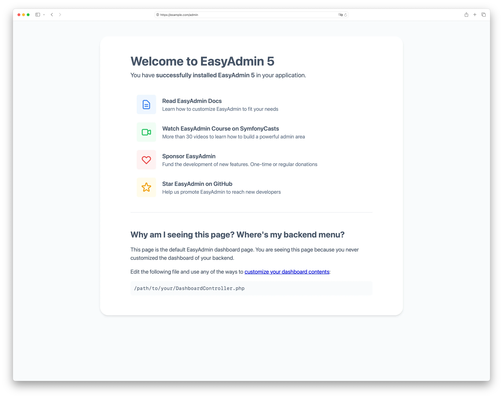

Dashboards
==========

**Dashboards** are the entry point of backends and they link to one or more
:doc:`resources </crud>`. Dashboards also display a main menu to navigate the
resources and information about the logged-in user.

Imagine that you have a simple application with three Doctrine entities: users,
blog posts and categories. Your own employees can create and edit any of them
but external collaborators can only create blog posts.

You can implement this in EasyAdmin as follows:

* Create three CRUD controllers (e.g. ``UserCrudController``, ``BlogPostCrudController``
  and ``CategoryCrudController``);
* Create a dashboard for your employees (e.g. ``DashboardController``) and link
  to the three resources;
* Create a dashboard for your external collaborators (e.g. ``ExternalDashboardController``)
  and link only to the ``BlogPostCrudController`` resource.

Technically, dashboards are regular `Symfony controllers`_ so you can do
anything you usually do in a controller, such as injecting services and using
shortcuts like ``$this->render()`` or ``$this->isGranted()``.

Dashboard controller classes must implement the
``EasyCorp\Bundle\EasyAdminBundle\Contracts\Controller\DashboardControllerInterface``,
which ensures that certain methods are defined in the dashboard. Instead of
implementing the interface, you can also extend the ``AbstractDashboardController``
class. Run the following command to quickly generate a dashboard controller:

.. code-block:: terminal

    $ php bin/console make:admin:dashboard

If you now visit the ``/admin`` URL of your application, you'll see the default
EasyAdmin Welcome Page:

Later in this article you'll learn how to customize that page. If you don't see
the Welcome Page, you might need to configure the URL of your backend as
explained in the next section.

.. _dashboard-route:
.. _pretty-admin-urls:

Dashboard Route
---------------

EasyAdmin backends define concise and predictable route names (e.g. ``admin_product_index``
or ``admin_category_detail``) that generate short and pretty URLs (e.g. ``/admin/product``
or ``/admin/category/324``).

This is possible thanks to a `custom Symfony route loader`_ that generates all
the needed routes for you. If your Symfony application uses `Symfony Flex`_, this
route loader is already enabled. Otherwise, you need to create this file manually:

.. code-block:: yaml

    # config/routes/easyadmin.yaml
    easyadmin:
        resource: .
        type: easyadmin.routes

.. note::

    The ``easyadmin.routes`` string is also available as the PHP constant
    ``\EasyCorp\Bundle\EasyAdminBundle\Router\AdminRouteLoader::ROUTE_LOADER_TYPE``.

Now, define the main route of your dashboard class using the following PHP attribute
(if you don't have a Dashboard yet, you can quickly generate one running the command
``make:admin:dashboard``)::

    // src/Controller/Admin/DashboardController.php
    namespace App\Controller\Admin;

    use EasyCorp\Bundle\EasyAdminBundle\Attribute\AdminDashboard;
    use EasyCorp\Bundle\EasyAdminBundle\Config\Dashboard;
    use EasyCorp\Bundle\EasyAdminBundle\Controller\AbstractDashboardController;
    use Symfony\Component\HttpFoundation\Response;

    #[AdminDashboard(routePath: '/admin', routeName: 'admin')]
    class DashboardController extends AbstractDashboardController
    {
        public function index(): Response
        {
            return parent::index();
        }

        // ...
    }

.. caution::

    The dashboard route must be defined using the ``#[AdminDashboard]`` attribute.
    None of the other ways supported by Symfony to configure a route will work.

EasyAdmin uses the configuration of the ``#[AdminDashboard]`` attribute to create
the main route of your dashboard. You can verify this by running the following command:

.. code-block:: terminal

    $ php bin/console debug:router

.. tip::

    If you don't see any of the routes that must be generated by EasyAdmin, clear
    your application cache to regenerate the routes.

.. tip::

    If you are implementing a multilingual dashboard, add the ``_locale`` parameter
    to the route (e.g. ``/admin/{_locale}``).

In addition to ``routePath`` and ``routeName``, the ``#[AdminDashboard]`` attribute
defines a ``routeOptions`` argument to further configure the Symfony route created
for the dashboard. Its contents are passed "as is" to the route without any
additional validation, so you can use any of the following options:
``requirements``, ``options``, ``defaults``, ``host``, ``methods``, ``schemes``,
``condition``, ``locale``, ``format``, ``utf8`` and ``stateless``::

    #[AdminDashboard(
        routePath: '/admin/{_locale}',
        routeName: 'admin',
        routeOptions: [
            'requirements' => ['_locale' => 'en|es|fr'],
            'defaults' => ['_locale' => 'en'],
            'methods' => ['GET'],
        ],
    )]
    class DashboardController extends AbstractDashboardController
    {
        // ...
    }

The ``index()`` method is called by EasyAdmin to render your dashboard. Since
``index()`` is part of the Dashboard interface, you cannot add arguments to it
to inject dependencies. Instead, inject those dependencies in the constructor
method of the controller.

The name of the dashboard route should be concise because it's used as the prefix
of all the routes associated with this dashboard (e.g. if this route name is ``my_private_backend``,
the generated routes will be like ``my_private_backend_product_index``). The path
of this route will also be used by all the dashboard routes (e.g. if the path is
``/_secret/backend``, the generated routes paths will be like ``/_secret/backend/category/324``).

That's it. Later, when you start adding :doc:`CRUD controllers </crud>`, the route
loader will create all the needed routes for each of them.

.. _dashboard-configuration:

Dashboard Configuration
-----------------------

The dashboard configuration is defined in the ``configureDashboard()`` method
(the main menu and the user menu are configured in their own methods, as
explained later)::

    namespace App\Controller\Admin;

    use EasyCorp\Bundle\EasyAdminBundle\Attribute\AdminDashboard;
    use EasyCorp\Bundle\EasyAdminBundle\Config\Dashboard;
    use EasyCorp\Bundle\EasyAdminBundle\Config\Locale;
    use EasyCorp\Bundle\EasyAdminBundle\Config\Theme;
    use EasyCorp\Bundle\EasyAdminBundle\Controller\AbstractDashboardController;

    #[AdminDashboard(routePath: '/admin', routeName: 'admin')]
    class DashboardController extends AbstractDashboardController
    {
        // ...

        public function configureDashboard(): Dashboard
        {
            return Dashboard::new()
                // the name visible to end users
                ->setTitle('ACME Corp.')
                // you can include HTML contents too (e.g. to link to an image)
                ->setTitle(' ACME Corp.')

                // by default EasyAdmin displays a black square as its default favicon;
                // use this method to display a custom favicon: the given path is passed
                // "as is" to the Twig asset() function:
                // <link rel="shortcut icon" href="{{ asset('...') }}">
                ->setFaviconPath('favicon.svg')

                // the domain used by default is 'messages'
                ->setTranslationDomain('my-custom-domain')

                // there's no need to define the "text direction" explicitly because
                // its default value is inferred dynamically from the user locale
                ->setTextDirection('ltr')
                // instead of magic strings, you can use constants as the value of
                // this option: EasyCorp\Bundle\EasyAdminBundle\Config\Option\TextDirection::LTR

                // set this option if you prefer the page content to span the entire
                // browser width, instead of the default design which sets a max width
                ->renderContentMaximized()

                // set this option if you prefer the sidebar (which contains the main menu)
                // to be displayed as a narrow column instead of the default expanded design
                ->renderSidebarMinimized()

                // by default, users can select between a "light" and "dark" mode for the
                // backend interface. Call this method if you prefer to disable the "dark"
                // mode for any reason (e.g. if your interface customizations are not ready for it)
                ->disableDarkMode()

                // by default, the UI color scheme is 'auto', which means that the backend
                // will use the same mode (light/dark) as the operating system and will
                // change in sync when the OS mode changes.
                // Use this option to set which mode ('light', 'dark' or 'auto') users will see
                // by default in the backend (users can change it via the color scheme selector)
                ->setDefaultColorScheme('dark')
                // instead of magic strings, you can use constants as the value of
                // this option: EasyCorp\Bundle\EasyAdminBundle\Config\Option\ColorScheme::DARK

                // use this option to create a custom theme for the backend without
                // writing any CSS (all Theme options are optional; you can call only
                // the ones you need)
                ->setTheme(Theme::new()
                    // the accent color of buttons, links, switches, etc. Use the
                    // hexadecimal, rgb(), hsl() or oklch() formats (no alpha channel).
                    // The color of the text/icons displayed on top of primary-colored
                    // elements is computed automatically based on this color.
                    // The optional 'dark' argument sets a different primary color for
                    // the dark color scheme (if not set, the same color is used in both)
                    ->primaryColor('#15803d', dark: 'oklch(0.6 0.2 150)')
                    // the base border radius from which all border radius values of the
                    // backend derive. Use a CSS length in 'px' or 'rem' units or one of
                    // these presets: 'none', 'xs', 'sm', 'md' (the default look), 'lg', 'xl'
                    // (the 'sm', 'md', 'lg' and 'xl' presets are also available as the
                    // constants of EasyCorp\Bundle\EasyAdminBundle\Config\Option\Size)
                    ->radius('0.5rem')
                    // the base spacing unit from which all paddings, margins, gaps and
                    // control sizes derive; it defines the density of the whole interface.
                    // Use a CSS length in 'px' or 'rem' units or one of these presets:
                    // 'xs', 'sm', 'md' (the default look), 'lg', 'xl' (the 'sm', 'md', 'lg'
                    // and 'xl' presets are also available as the constants of
                    // EasyCorp\Bundle\EasyAdminBundle\Config\Option\Size)
                    ->spacing('md')
                    // the gray scale used by all neutral surfaces, borders and text
                    // colors: 'neutral', 'stone' (warmer), 'zinc', 'gray' or 'slate'
                    // (cooler). The default look uses 'slate' in the light color scheme
                    // and 'neutral' in the dark one. The optional 'dark' argument sets a
                    // different gray scale for the dark color scheme (if not set, the
                    // same scale is used in both). Instead of magic strings, you can use
                    // the constants of EasyCorp\Bundle\EasyAdminBundle\Config\Option\GrayScale
                    ->grays('zinc', dark: 'stone'))

                // by default, all backend URLs are generated as absolute URLs. If you
                // need to generate relative URLs instead, call this method
                ->generateRelativeUrls()

                // set this option if you want to enable locale switching in the dashboard.
                // IMPORTANT: this feature won't work unless you add the {_locale}
                // parameter in the admin dashboard URL (e.g. '/admin/{_locale}').
                // the name of each locale will be rendered in that locale
                // (in the following example you'll see: "English", "Polski")
                ->setLocales(['en', 'pl'])
                // to customize the labels of locales, pass a key => value array
                // (e.g. to display flags; although it's not a recommended practice,
                // because many languages/locales are not associated with a single country)
                ->setLocales([
                    'en' => '🇬🇧 English',
                    'pl' => '🇵🇱 Polski'
                ])
                // to further customize the locale option, pass an instance of
                // EasyCorp\Bundle\EasyAdminBundle\Config\Locale
                ->setLocales([
                    'en', // locale without custom options
                    Locale::new('pl', 'polski', 'far fa-language') // custom label and icon
                ])
            ;
        }
    }

The ``renderContentMaximized()``, ``renderSidebarMinimized()``, ``disableDarkMode()``,
``generateRelativeUrls()`` and ``useEntityTranslations()`` methods accept an optional
boolean argument (which is ``true`` by default) so you can enable them conditionally
(e.g. ``->disableDarkMode($someCondition)``).

The ``setTheme()`` method covers the most common visual customizations without
writing any CSS. Read :doc:`the Design chapter </design>` to learn how to further
customize the look of your backend with your own assets and templates.

Customizing the Dashboard Contents
----------------------------------

Generated dashboards display by default a "Welcome Page" with some useful links.
In a real application you'll need to customize this page to display your own contents.

Dashboards usually display widgets and charts with stats. EasyAdmin doesn't
provide any way of creating those widgets yet. It's in our list of future features,
but meanwhile you can use the `Symfony UX Chart.js`_ bundle to create those charts
and render them in your own Twig template::

    use EasyCorp\Bundle\EasyAdminBundle\Attribute\AdminDashboard;
    use EasyCorp\Bundle\EasyAdminBundle\Config\Assets;
    use EasyCorp\Bundle\EasyAdminBundle\Config\Dashboard;
    use EasyCorp\Bundle\EasyAdminBundle\Controller\AbstractDashboardController;
    use Symfony\UX\Chartjs\Builder\ChartBuilderInterface;
    use Symfony\UX\Chartjs\Model\Chart;

    #[AdminDashboard(routePath: '/admin', routeName: 'admin')]
    class DashboardController extends AbstractDashboardController
    {
        public function __construct(
            private ChartBuilderInterface $chartBuilder,
        ) {
        }

        // ... you'll also need to load some CSS/JavaScript assets to render
        // the charts; this is explained later in the chapter about Design
        public function configureAssets(): Assets
        {
            return Assets::new()
                ->addAssetMapperEntry('charts');
        }

        public function index(): Response
        {
            $chart = $this->chartBuilder->createChart(Chart::TYPE_LINE);
            // ...set chart data and options somehow

            return $this->render('admin/my-dashboard.html.twig', [
                'chart' => $chart,
            ]);
        }
    }

See :ref:`the section about custom web assets <crud-design-custom-web-assets>` to
learn how to load the CSS and JavaScript files needed to render those charts.

.. note::

    As explained earlier, ``index()`` cannot take arguments, so dependencies like
    ``ChartBuilderInterface`` must be injected in the controller constructor.

To use EasyAdmin's built-in layout on your custom dashboard (e.g. the main menu
bar on the left - explained in the next section), make your template extend
``vendor/easycorp/easyadmin-bundle/templates/layout.html.twig`` and override
some blocks:

.. code-block:: twig

    {# templates/admin/my-dashboard.html.twig #}
    

    
        {# ... #}
    

Read the section about :ref:`overriding EasyAdmin templates <template-customization>`
to learn about all the blocks that you can override.

Another popular option is to avoid having a dashboard at all and instead redirect
to the most common task for people working on the backend. This requires
:ref:`generating admin URLs <generate-admin-urls>`, and :doc:`CRUD controllers </crud>`,
which is explained in detail later::

    use EasyCorp\Bundle\EasyAdminBundle\Attribute\AdminDashboard;
    use EasyCorp\Bundle\EasyAdminBundle\Config\Dashboard;
    use EasyCorp\Bundle\EasyAdminBundle\Controller\AbstractDashboardController;

    #[AdminDashboard(routePath: '/admin', routeName: 'admin')]
    class DashboardController extends AbstractDashboardController
    {
        // ...

        public function index(): Response
        {
            // you can make your dashboard redirect to different pages depending on the user
            if ('jane' === $this->getUser()->getUserIdentifier()) {
                return $this->redirectToRoute('...');
            }

            // or you can redirect directly to some backend route
            return $this->redirectToRoute('admin_post_index');
        }
    }

.. _dashboard-menu:

Main Menu
---------

The **main menu** links to different :doc:`CRUD controllers </crud>` from the
dashboard. It's the usual way for users to reach the CRUD controllers of your
backend. By default, every CRUD controller is reachable from every dashboard. Use
the ``allowedControllers`` and ``deniedControllers`` options of the
``#[AdminDashboard]`` attribute to restrict that, as explained in
:ref:`the security reference <security-controllers>`.

The main menu is a collection of objects implementing
``EasyCorp\Bundle\EasyAdminBundle\Contracts\Menu\MenuItemInterface`` that configure
the look and behavior of each menu item::

    use App\Controller\Admin\BlogPostCrudController;
    use App\Controller\Admin\CategoryCrudController;
    use App\Controller\Admin\CommentCrudController;
    use App\Controller\Admin\UserCrudController;
    use EasyCorp\Bundle\EasyAdminBundle\Attribute\AdminDashboard;
    use EasyCorp\Bundle\EasyAdminBundle\Config\MenuItem;
    use EasyCorp\Bundle\EasyAdminBundle\Controller\AbstractDashboardController;

    #[AdminDashboard(routePath: '/admin', routeName: 'admin')]
    class DashboardController extends AbstractDashboardController
    {
        // ...

        public function configureMenuItems(): iterable
        {
            return [
                MenuItem::linkToDashboard('Dashboard', 'fa fa-home'),

                MenuItem::section('Blog'),
                MenuItem::linkTo(CategoryCrudController::class, 'Categories', 'fa fa-tags'),
                MenuItem::linkTo(BlogPostCrudController::class, 'Blog Posts', 'fa fa-file-text'),

                MenuItem::section('Users'),
                MenuItem::linkTo(CommentCrudController::class, 'Comments', 'fa fa-comment'),
                MenuItem::linkTo(UserCrudController::class, 'Users', 'fa fa-user'),
            ];
        }
    }

The first argument of these ``MenuItem`` factory methods is the label displayed by
the item and the second argument is the icon to display. By default, icon names are
`FontAwesome`_ CSS classes (e.g. ``fa fa-tags``). Alternatively, you can use the
``icon_set:icon_name`` syntax of `Symfony UX Icons`_.

.. note::

    The CSS styles and web fonts needed by FontAwesome are included by default, so
    you don't need to take any additional steps to use FontAwesome icons. Alternatively,
    you can :ref:`use your own icon sets <icon-customization>` instead of FontAwesome.

.. _menu-item-options:

Menu Item Configuration Options
~~~~~~~~~~~~~~~~~~~~~~~~~~~~~~~

All menu items define the following methods to configure some options:

* ``setCssClass(string $cssClass)``, sets the CSS class or classes applied to
  the ``<li>`` parent element of the menu item;
* ``setLinkRel(string $rel)``, sets the ``rel`` HTML attribute of the menu item
  link (check out the `allowed values for the "rel" attribute`_);
* ``setLinkTarget(string $target)``, sets the ``target`` HTML attribute of the
  menu item link (``_self`` by default);
* ``setPermission(string|Expression $permission)``, sets the `Symfony security permission`_
  that the user must have to see this menu item. Read the :ref:`menu security reference <security-menu>`
  and the section about :ref:`security expressions <security-expressions>` for more details.
* ``setQueryParameter(string $parameterName, mixed $parameterValue)``, adds the
  given query parameter to the URL generated for the menu item (e.g. to filter
  the listing of the linked CRUD controller).
* ``setTranslationParameters(array $parameters)``, sets the parameters used when
  translating the label of the menu item (e.g. ``['%count%' => 7]``).
* ``setBadge($content, string $style = 'secondary', array $htmlAttributes = [])``,
  renders the given content as a badge of the menu item. It's commonly used to
  show notification counts. The first argument can be any value that can be
  converted to a string in a Twig template (numbers, strings, *stringable*
  objects, etc.) The second argument is one of the predefined Bootstrap styles
  (``primary``, ``secondary``, ``success``, ``danger``, ``warning``, ``info``,
  ``light``, ``dark``). You can also pass an arbitrary string, which is used as
  the value of the ``style`` HTML attribute of the badge. The third argument
  allows you to set custom HTML attributes in the element that renders the badge.

The rest of the options depend on the menu item type, as explained in the next sections.

Menu Item Types
~~~~~~~~~~~~~~~

Controller Menu Item
....................

This is the most common menu item type. Use ``MenuItem::linkTo()`` to link to
any admin controller: CRUD controllers, Dashboard controllers, or custom
controllers with the ``#[AdminRoute]`` attribute (see
:ref:`actions-integrating-symfony`).

The first argument is the FQCN *(fully-qualified class name)* of the controller.
The label and icon are optional (when linking to a CRUD controller without a
label, EasyAdmin derives it automatically from the entity name)::

    use App\Controller\Admin\CategoryCrudController;
    use App\Controller\Admin\LegacyCategoryCrudController;
    use EasyCorp\Bundle\EasyAdminBundle\Config\Action;
    use EasyCorp\Bundle\EasyAdminBundle\Config\MenuItem;

    public function configureMenuItems(): iterable
    {
        return [
            // ...

            // links to the 'index' action of the Category CRUD controller
            // the label is auto-derived from the entity name (e.g. "Categories")
            MenuItem::linkTo(CategoryCrudController::class),

            // you can pass an explicit label and icon
            MenuItem::linkTo(CategoryCrudController::class, 'Categories', 'fa fa-tags'),

            // links to a different CRUD action
            MenuItem::linkTo(CategoryCrudController::class, 'Add Category', 'fa fa-tags')
                ->setAction(Action::NEW),

            MenuItem::linkTo(CategoryCrudController::class, 'Show Main Category', 'fa fa-tags')
                ->setAction(Action::DETAIL)
                ->setEntityId(40585),

            // uses custom sorting options for the listing
            MenuItem::linkTo(CategoryCrudController::class, 'Categories', 'fa fa-tags')
                ->setDefaultSort(['createdAt' => 'DESC']),
        ];
    }

You can also link to your own Symfony controllers if they use the
``#[AdminRoute]`` attribute to :ref:`integrate them in EasyAdmin <actions-integrating-symfony>`::

    use App\Controller\Admin\AnalyticsDashboardController;

    MenuItem::linkTo(AnalyticsDashboardController::class, 'Analytics', 'fa fa-chart-line');

If the controller is invokable (has a ``__invoke()`` method), the action is
detected automatically. Otherwise, call ``->setAction('theActionName')`` to
specify which action to link to.

In addition to the :ref:`common options of all menu items <menu-item-options>`,
controller menu items define the following options:

* ``setAction(string $actionName)``, sets the controller action to link to
  (``index`` by default for CRUD controllers). Use the ``Action::*`` constants
  for :ref:`built-in actions <actions-built-in>` or the method name for custom actions;
* ``setEntityId($entityId)``, sets the ID of the entity to load in actions that
  are associated with a specific entity (e.g. ``Action::DETAIL`` and ``Action::EDIT``);
* ``setDefaultSort(array $sortFieldsAndOrder)``, sets the initial sorting
  applied to the ``index`` action (e.g. ``['createdAt' => 'DESC']``). This only
  applies until the user changes the sorting by clicking on any column.
* ``setHtmlAttribute(string $name, mixed $value)``, sets a custom HTML attribute
  in the HTML element that renders the menu item.

Dashboard Menu Item
...................

It links to the homepage of the current dashboard. You can achieve the same with
a "route menu item" (explained below) but this one is simpler because you don't
have to specify the route name (it's found automatically)::

    use EasyCorp\Bundle\EasyAdminBundle\Config\MenuItem;

    public function configureMenuItems(): iterable
    {
        return [
            MenuItem::linkToDashboard('Home', 'fa fa-home'),
            // ...
        ];
    }

.. tip::

    You can also use ``MenuItem::linkTo()`` to link to a dashboard. This is
    especially useful when you have multiple dashboards and want to link to a
    *different* one::

        use App\Controller\Admin\AnalyticsDashboardController;

        MenuItem::linkTo(AnalyticsDashboardController::class, 'Analytics', 'fa fa-chart-line');

Route Menu Item
...............

It links to any of the routes defined by your Symfony application::

    use EasyCorp\Bundle\EasyAdminBundle\Config\MenuItem;

    public function configureMenuItems(): iterable
    {
        return [
            MenuItem::linkToRoute('The Label', 'fa ...', 'route_name'),
            MenuItem::linkToRoute('The Label', 'fa ...', 'route_name', ['routeParamName' => 'routeParamValue']),
            // ...
        ];
    }

.. note::

    Read the section about
    :ref:`integrating Symfony controllers/actions in EasyAdmin <actions-integrating-symfony>`
    to fully understand the URLs generated by ``linkToRoute()``.

URL Menu Item
.............

It links to a relative or absolute URL::

    use EasyCorp\Bundle\EasyAdminBundle\Config\MenuItem;

    public function configureMenuItems(): iterable
    {
        return [
            MenuItem::linkToUrl('Visit public website', null, '/'),
            MenuItem::linkToUrl('Search in Google', 'fab fa-google', 'https://google.com'),
            // ...
        ];
    }

To avoid leaking internal backend information to external websites, EasyAdmin
adds the ``rel="noopener"`` attribute to all URL menu items, except if the
menu item defines its own ``rel`` option.

Section Menu Item
.................

It creates a visual separation between menu items and can optionally display a
label which acts as the title of the menu items below. Both the label and the
icon arguments are optional::

    use EasyCorp\Bundle\EasyAdminBundle\Config\MenuItem;

    public function configureMenuItems(): iterable
    {
        return [
            // ...

            MenuItem::section(),
            // ...

            MenuItem::section('Blog'),
            // ...

            MenuItem::section('Blog', 'fa fa-newspaper'),
            // ...
        ];
    }

Logout Menu Item
................

It links to the URL that the user must visit to log out from the application.
If you know the logout route name, you can achieve the same with the
"route menu item", but this one is more convenient because it finds the logout
URL for the current security firewall automatically::

    use EasyCorp\Bundle\EasyAdminBundle\Config\MenuItem;

    public function configureMenuItems(): iterable
    {
        return [
            // ...
            MenuItem::linkToLogout('Logout', 'fa fa-right-from-bracket'),
        ];
    }

.. note::

    The logout menu item will not work under certain authentication schemes like
    HTTP Basic because they do not have a default logout path configured due to
    the nature of how those authentication schemes work.

    If you encounter an error like *"Unable to find the current firewall
    LogoutListener, please provide the provider key manually."*, you'll need to
    remove the logout menu item or add a logout provider to your authentication scheme.

Exit Impersonation Menu Item
............................

It links to the URL that the user must visit to stop impersonating other users::

    use EasyCorp\Bundle\EasyAdminBundle\Config\MenuItem;

    public function configureMenuItems(): iterable
    {
        return [
            // ...
            MenuItem::linkToExitImpersonation('Stop impersonation', 'fa fa-right-from-bracket'),
        ];
    }

Submenus
~~~~~~~~

The main menu can display up to two levels of nested menus. Submenus are defined
using the ``subMenu()`` item type::

    use App\Controller\Admin\BlogPostCrudController;
    use App\Controller\Admin\CategoryCrudController;
    use App\Controller\Admin\CommentCrudController;
    use EasyCorp\Bundle\EasyAdminBundle\Config\MenuItem;

    public function configureMenuItems(): iterable
    {
        return [
            MenuItem::subMenu('Blog', 'fa fa-newspaper')->setSubItems([
                MenuItem::linkTo(CategoryCrudController::class, 'Categories', 'fa fa-tags'),
                MenuItem::linkTo(BlogPostCrudController::class, 'Posts', 'fa fa-file-text'),
                MenuItem::linkTo(CommentCrudController::class, 'Comments', 'fa fa-comment'),
            ]),
            // ...
        ];
    }

.. note::

    In a submenu, the parent menu item cannot link to any resource, route or URL;
    it can only expand/collapse the submenu items.

By default, submenus render collapsed unless the current URL matches one of
their items. If some submenu is important enough to keep all its items always
visible, call ``keepOpen()`` on it. The submenu will render always expanded::

    MenuItem::subMenu('Blog', 'fa fa-newspaper')->setSubItems([
        // ...
    ])->keepOpen(),

Complex Main Menus
~~~~~~~~~~~~~~~~~~

The return type of ``configureMenuItems()`` is ``iterable``, so you don't have
to always return an array. For example, if your main menu requires complex logic
to decide which items to display for each user, it's more convenient to use a
generator to return the menu items::

    public function configureMenuItems(): iterable
    {
        yield MenuItem::linkToDashboard('Dashboard', 'fa fa-home');

        if ('... some complex expression ...') {
            yield MenuItem::section('Blog');
            yield MenuItem::linkTo(CategoryCrudController::class, 'Categories', 'fa fa-tags');
            yield MenuItem::linkTo(BlogPostCrudController::class, 'Blog Posts', 'fa fa-file-text');
        }

        // ...
    }

.. _dashboards-user-menu:

User Menu
---------

When accessing a protected backend, EasyAdmin displays the details of the user
who is logged in the application and a menu with some options like "logout" (if
Symfony's `logout feature`_ is enabled).

The user name is the result of calling the ``__toString()`` method on the user
object when it is ``Stringable``; otherwise, EasyAdmin uses ``getUserIdentifier()``.
The user avatar is a generic avatar icon. Use the ``configureUserMenu()`` method
to configure the features and items of this menu::

    use EasyCorp\Bundle\EasyAdminBundle\Attribute\AdminDashboard;
    use EasyCorp\Bundle\EasyAdminBundle\Config\MenuItem;
    use EasyCorp\Bundle\EasyAdminBundle\Config\UserMenu;
    use EasyCorp\Bundle\EasyAdminBundle\Controller\AbstractDashboardController;
    use Symfony\Component\Security\Core\User\UserInterface;

    #[AdminDashboard(routePath: '/admin', routeName: 'admin')]
    class DashboardController extends AbstractDashboardController
    {
        // ...

        public function configureUserMenu(UserInterface $user): UserMenu
        {
            // Usually it's better to call the parent method because that gives you a
            // user menu with some menu items already created ("sign out", "exit impersonation", etc.)
            // if you prefer to create the user menu from scratch, use: return UserMenu::new()->...
            return parent::configureUserMenu($user)
                // use the given $user object to get the user name
                ->setName($user->getFullName())
                // use this method if you don't want to display the name of the user
                ->displayUserName(false)

                // you can return a URL with the avatar image
                ->setAvatarUrl('https://...')
                ->setAvatarUrl($user->getProfileImageUrl())
                // use this method if you don't want to display the user image
                ->displayUserAvatar(false)
                // you can also pass an email address to use gravatar's service
                ->setGravatarEmail($user->getMainEmailAddress())

                // you can hide the "Sign out" link from the user menu (e.g. when using
                // authentication methods like HTTP Basic or OAuth that don't support logout)
                ->disableLogoutLink()

                // you can use any type of menu item, except submenus
                ->addMenuItems([
                    MenuItem::linkToRoute('My Profile', 'fa fa-id-card', '...', ['...' => '...']),
                    MenuItem::linkToRoute('Settings', 'fa fa-user-cog', '...', ['...' => '...']),
                    MenuItem::section(),
                    // the parent method already adds a "Sign out" item, so there's no need to add it here
                    // MenuItem::linkToLogout('Logout', 'fa fa-sign-out'),
                ]);
        }
    }

The items passed to ``addMenuItems()`` are added *before* the ones created by the
parent method, so they are displayed at the top of the user menu. Use
``setMenuItems(array $items)`` instead if you prefer to discard all the existing
items and define the entire contents of the user menu yourself.

.. _admin-context:

Admin Context
-------------

EasyAdmin initializes a variable of type ``EasyCorp\Bundle\EasyAdminBundle\Context\AdminContext``
automatically on each backend request. This object implements the `context object`_
design pattern and stores all the information commonly needed in different parts
of the backend.

In templates, use the ``ea()`` Twig function (the initials of "EasyAdmin") to
get this context object:

.. code-block:: twig

    <h1>{{ ea().dashboardTitle }}</h1>

    
        {# ... #}
    

The ``AdminContext`` object is created dynamically on each request, so you
can't inject it directly in your services. Instead, use the ``AdminContextProvider``
service to get the context object::

    use EasyCorp\Bundle\EasyAdminBundle\Provider\AdminContextProvider;

    final class SomeService
    {
        public function __construct(
            private AdminContextProvider $adminContextProvider,
        ) {
        }

        public function someMethod()
        {
            $context = $this->adminContextProvider->getContext();
        }

        // ...
    }

In EasyAdmin's :doc:`CRUD controllers </crud>` and in
:ref:`Symfony controllers integrated into EasyAdmin <actions-integrating-symfony>`,
use the ``AdminContext`` type-hint in any argument where you want to inject the
context object::

    use EasyCorp\Bundle\EasyAdminBundle\Context\AdminContext;
    use Symfony\Bundle\FrameworkBundle\Controller\AbstractController;

    class SomeController extends AbstractController
    {
        public function someMethod(AdminContext $context)
        {
            // ...
        }
    }

Translation
-----------

.. _translation-domain:

Translation Domain
~~~~~~~~~~~~~~~~~~

The backend interface is fully translated using the `Symfony translation`_
features. EasyAdmin own messages and contents use the ``EasyAdminBundle``
`translation domain`_ (thanks to our community for kindly providing translations
in dozens of languages).

The rest of the contents (e.g. the label of the menu items, entity and field
names, etc.) use the ``messages`` translation domain by default. You can change
this value with the ``setTranslationDomain()`` method::

    #[AdminDashboard(routePath: '/admin', routeName: 'admin')]
    class DashboardController extends AbstractDashboardController
    {
        // ...

        public function configureDashboard(): Dashboard
        {
            return Dashboard::new()
                // ...

                // the argument is the name of any valid Symfony translation domain
                ->setTranslationDomain('admin');
        }
    }

.. tip::

    If you want to make the backend use a different language than the public
    website, add the ``{_locale}`` parameter to your dashboard route and use
    the ``setLocales()`` method to configure the locales available in the backend.

Entity Translation
~~~~~~~~~~~~~~~~~~

Internally, EasyAdmin manages translations via ``TranslatableMessage`` objects.
These objects are passed to the templates, where they are translated into the
user locale. You can also use ``TranslatableMessage`` objects to define any text
content in your backends (e.g. the label of some field, the help contents of
some page, etc.)::

    use EasyCorp\Bundle\EasyAdminBundle\Field\TextField;
    use Symfony\Component\Translation\TranslatableMessage;
    use function Symfony\Component\Translation\t;

    // creating translatable messages using objects
    TextField::new('firstName', new TranslatableMessage('Name'));
    TextField::new('firstName', new TranslatableMessage('Name', ['parameter' => 'value'], 'admin'));

    // creating translatable messages using the t() function shortcut
    TextField::new('firstName', t('Name'));
    TextField::new('firstName', t('Name', ['parameter' => 'value'], 'admin'));

.. tip::

    Using translatable objects is recommended for multilingual backends because
    Symfony can extract all of them automatically to update your translation files.

.. note::

    The contents stored in the database (e.g. the content of a blog post or the
    name of a product) are not translated. EasyAdmin does not support the
    translation of the entity property contents into different languages.

Alternatively, EasyAdmin can help you generate translation keys for entity labels
(singular and plural) and field/property labels. This allows you to centralize all
entity-related translations in your translation files instead of defining them
individually in each CRUD controller.

To enable this feature, call the ``useEntityTranslations()`` method in your
dashboard configuration::

    // src/Controller/Admin/DashboardController.php
    use EasyCorp\Bundle\EasyAdminBundle\Attribute\AdminDashboard;
    use EasyCorp\Bundle\EasyAdminBundle\Config\Dashboard;

    #[AdminDashboard(routePath: '/admin', routeName: 'admin')]
    class DashboardController extends AbstractDashboardController
    {
        public function configureDashboard(): Dashboard
        {
            return Dashboard::new()
                // ...
                ->useEntityTranslations();
        }
    }

Once enabled, EasyAdmin will look for translations using the following patterns
for the translation keys:

* **Entity singular label**: ``entities.<EntityFQCN>.singular``
* **Entity plural label**: ``entities.<EntityFQCN>.plural``
* **Property/field label**: ``entities.<EntityFQCN>.properties.<propertyName>``

You can define these translations in any format supported by Symfony. Here's an
example using PHP arrays::

    // translations/messages.en.php
    return [
        'entities' => [
            App\Entity\BlogPost::class => [
                'singular' => 'Blog Post',
                'plural' => 'Blog Posts',
                'properties' => [
                    'title' => 'Post Title',
                    'publishedAt' => 'Publication Date',
                    'isPublished' => 'Published?',
                ],
            ],
            App\Entity\User::class => [
                'singular' => 'User',
                'plural' => 'Users',
                'properties' => [
                    'email' => 'Email Address',
                    'createdAt' => 'Registration Date',
                ],
            ],
        ],
    ];

Or using YAML format:

.. code-block:: yaml

    # translations/messages.en.yaml
    entities:
        App\Entity\BlogPost:
            singular: 'Blog Post'
            plural: 'Blog Posts'
            properties:
                title: 'Post Title'
                publishedAt: 'Publication Date'
                isPublished: 'Published?'

When using this feature, you can omit the label when creating CRUD menu items::

    public function configureMenuItems(): iterable
    {
        yield MenuItem::linkToDashboard('Dashboard', 'fa fa-home');

        // no label needed: will use the translated plural label
        yield MenuItem::linkTo(BlogPostCrudController::class, icon: 'fa fa-file-text');
        yield MenuItem::linkTo(UserCrudController::class, icon: 'fa fa-users');
    }

.. note::

    The entity translations use the configured translation domain. You can set a
    custom domain in the dashboard as explained above with ``setTranslationDomain()``.

Customizing Translation IDs
...........................

If you need a different translation key structure, implement the
``EntityTranslationIdGeneratorInterface`` and register it as a service::

    // src/Translation/CustomEntityTranslationIdGenerator.php
    namespace App\Translation;

    use EasyCorp\Bundle\EasyAdminBundle\Contracts\Translation\EntityTranslationIdGeneratorInterface;

    class CustomEntityTranslationIdGenerator implements EntityTranslationIdGeneratorInterface
    {
        public function generateForEntity(string $entity, bool $singular): string
        {
            // use the class name instead of the FQCN
            $shortName = basename(str_replace('\\', '/', $entity));

            return sprintf('admin.entities.%s.%s',
                strtolower($shortName),
                $singular ? 'singular' : 'plural'
            );
        }

        public function generateForProperty(string $entity, string $property): string
        {
            $shortName = basename(str_replace('\\', '/', $entity));

            return sprintf('admin.entities.%s.fields.%s',
                strtolower($shortName),
                $property
            );
        }
    }

Register your custom generator:

.. code-block:: yaml

    # config/services.yaml
    services:
        EasyCorp\Bundle\EasyAdminBundle\Contracts\Translation\EntityTranslationIdGeneratorInterface:
            class: App\Translation\CustomEntityTranslationIdGenerator

With this custom generator, your translations would look like:

.. code-block:: yaml

    # translations/messages.en.yaml
    admin:
        entities:
            blogpost:
                singular: 'Blog Post'
                plural: 'Blog Posts'
                fields:
                    title: 'Post Title'

Translation Precedence
......................

Entity translations follow these precedence rules:

#. **Explicit labels** defined in CRUD controllers (via the
   :ref:`entity options <crud-entity-options>` ``setEntityLabelInSingular()`` and
   ``setEntityLabelInPlural()``, or field ``setLabel()``) always take priority
#. **Entity translations** are used when no explicit label is defined and
   ``useEntityTranslations()`` is enabled
#. **Auto-generated labels** (humanized property names) are used as a fallback
   when entity translations are disabled

This means you can enable entity translations globally and still override specific
labels in individual CRUD controllers when needed.

Text Direction
~~~~~~~~~~~~~~

The backend uses the same language configured in the Symfony application.
When the locale is Arabic (``ar``), Persian (``fa``) or Hebrew (``he``), the
HTML text direction is set to ``rtl`` (right-to-left) automatically. Otherwise,
the text is displayed as ``ltr`` (left-to-right), but you can configure this
value explicitly::

    #[AdminDashboard(routePath: '/admin', routeName: 'admin')]
    class DashboardController extends AbstractDashboardController
    {
        // ...

        public function configureDashboard(): Dashboard
        {
            return Dashboard::new()
                // ...

                // most of the times there's no need to configure this explicitly
                // (default: 'rtl' or 'ltr' depending on the language)
                ->setTextDirection('rtl');
        }
    }

Page Templates
--------------

EasyAdmin provides several page templates which are useful when adding custom
logic in your dashboards.

Login Form Template
~~~~~~~~~~~~~~~~~~~

Twig Template Path: ``@EasyAdmin/page/login.html.twig``

It displays a simple username + password login form that matches the style of
the rest of the backend. The template defines many configuration options, but most
applications can rely on its default values::

    namespace App\Controller;

    use Symfony\Bundle\FrameworkBundle\Controller\AbstractController;
    use Symfony\Component\HttpFoundation\Response;
    use Symfony\Component\Routing\Attribute\Route;
    use Symfony\Component\Security\Http\Authentication\AuthenticationUtils;

    class SecurityController extends AbstractController
    {
        #[Route('/login', name: 'login')]
        public function login(AuthenticationUtils $authenticationUtils): Response
        {
            $error = $authenticationUtils->getLastAuthenticationError();
            $lastUsername = $authenticationUtils->getLastUsername();

            return $this->render('@EasyAdmin/page/login.html.twig', [
                // parameters usually defined in Symfony login forms
                'error' => $error,
                'last_username' => $lastUsername,

                // OPTIONAL parameters to customize the login form:

                // the translation_domain to use (define this option only if you are
                // rendering the login template in a regular Symfony controller; when
                // rendering it from an EasyAdmin Dashboard this is automatically set to
                // the same domain as the rest of the Dashboard)
                'translation_domain' => 'admin',

                // by default EasyAdmin displays a black square as its default favicon;
                // use this method to display a custom favicon: the given path is passed
                // "as is" to the Twig asset() function:
                // <link rel="shortcut icon" href="{{ asset('...') }}">
                'favicon_path' => '/favicon-admin.svg',

                // the title visible above the login form (define this option only if you are
                // rendering the login template in a regular Symfony controller; when rendering
                // it from an EasyAdmin Dashboard this is automatically set as the Dashboard title)
                'page_title' => 'ACME login',

                // the string used to generate the CSRF token. If you don't define
                // this parameter, the login form won't include a CSRF token
                'csrf_token_intention' => 'authenticate',

                // the URL that the login form is submitted to (default: the current URL)
                'action' => $this->generateUrl('login'),

                // the URL users are redirected to after the login
                // (default: the dashboard homepage)
                'target_path' => $this->generateUrl('admin_dashboard'),

                // the 'name' HTML attribute of the hidden <input> that stores the URL
                // to redirect to after the login (default: '_target_path')
                'target_path_parameter' => 'my_custom_target_path_field',

                // the label displayed for the username form field (the |trans filter is applied to it)
                'username_label' => 'Your username',

                // the label displayed for the password form field (the |trans filter is applied to it)
                'password_label' => 'Your password',

                // the label displayed for the Sign In form button (the |trans filter is applied to it)
                'sign_in_label' => 'Log in',

                // the 'name' HTML attribute of the <input> used for the username field (default: '_username')
                'username_parameter' => 'my_custom_username_field',

                // the 'name' HTML attribute of the <input> used for the password field (default: '_password')
                'password_parameter' => 'my_custom_password_field',

                // whether to enable or not the "forgot password?" link (default: false)
                'forgot_password_enabled' => true,

                // the path (i.e. a relative or absolute URL) to visit when clicking the "forgot password?" link (default: '#')
                'forgot_password_path' => $this->generateUrl('...', ['...' => '...']),

                // the label displayed for the "forgot password?" link (the |trans filter is applied to it)
                'forgot_password_label' => 'Forgot your password?',

                // whether to enable or not the "remember me" checkbox (default: false)
                'remember_me_enabled' => true,

                // remember me name form field (default: '_remember_me')
                'remember_me_parameter' => 'custom_remember_me_param',

                // whether to check by default the "remember me" checkbox (default: false)
                'remember_me_checked' => true,

                // the label displayed for the remember me checkbox (the |trans filter is applied to it)
                'remember_me_label' => 'Remember me',
            ]);
        }
    }

Like all EasyAdmin templates, the login template defines several Twig blocks
that you can use to customize its content or add new elements. For example, it
includes a ``login_form_footer`` block right after the form and before the
login script, which you can use to render additional markup (such as a
disclaimer or a link to the terms of service). Create your own template that
extends the login template and override this block:

.. code-block:: twig

    {# templates/security/login.html.twig #}
    

    
        

            <a href="{{ path('terms') }}">Terms of Service</a>
        

    

Then update your security controller to render this custom template instead of
``@EasyAdmin/page/login.html.twig``. Alternatively,
:ref:`override EasyAdmin's template globally <replacing-templates>`: save your
template as ``templates/bundles/EasyAdminBundle/page/login.html.twig`` and make it
extend ``@!EasyAdmin/page/login.html.twig``. This way you don't have to change the
login controller.

.. _content_page_template:
.. _content-page-template:

Content Page Template
~~~~~~~~~~~~~~~~~~~~~

Twig Template Path: ``@EasyAdmin/page/content.html.twig``

It displays a simple page similar to the index/detail/form pages, with the main
header, the sidebar menu and the central content section. The only difference is
that the content section is completely empty, so it's useful to display your own
contents and custom forms, to :ref:`integrate Symfony actions inside EasyAdmin <actions-integrating-symfony>`,
etc. Example:

.. code-block:: twig

    {# templates/admin/my-custom-page.html.twig #}
    

    The Title of the Page
    
        <a class="btn btn-primary" href="...">Some Action</a>
    

    
        <table class="datagrid">
            <thead>
                <tr>
                    <td>Some Column</td>
                    <td>Another Column</td>
                </tr>
            </thead>
            <tbody>
                
                    <tr>
                        <td>{{ data.someColumn }}</td>
                        <td>{{ data.anotherColumn }}</td>
                    </tr>
                
            </tbody>
        </table>
    

.. _custom-pages-symfony-forms:

Rendering Symfony Forms in Custom Pages
.......................................

Custom pages can also render your own Symfony forms. However, if you render
them with ``{{ form(my_form) }}``, their design won't match the design of the
rest of the backend forms. The reason is that the design of EasyAdmin forms is
applied via a Symfony `form theme`_ (see :ref:`form field templates <form-field-templates>`)
which is only used by default on the CRUD ``new`` and ``edit`` pages.

Use the ``form_theme`` Twig tag to apply EasyAdmin's form theme to your own
forms and they will look exactly like the rest of the backend forms:

.. code-block:: twig

    {# templates/admin/my-custom-page.html.twig #}
    
    

    The Title of the Page

    
        {{ form(my_form) }}
    

.. tip::

    If your form uses Symfony's ``CollectionType``, load also EasyAdmin's
    ``form.js`` asset, which implements the buttons to add and remove
    collection items:

    .. code-block:: twig

        
            {{ parent() }}
            
        

.. _`Symfony controllers`: https://symfony.com/doc/current/controller.html
.. _`form theme`: https://symfony.com/doc/current/form/form_themes.html
.. _`context object`: https://wiki.c2.com/?ContextObject
.. _`FontAwesome`: https://fontawesome.com/
.. _`allowed values for the "rel" attribute`: https://developer.mozilla.org/en-US/docs/Web/HTML/Link_types
.. _`Symfony security permission`: https://symfony.com/doc/current/security.html#roles
.. _`logout feature`: https://symfony.com/doc/current/security.html#logging-out
.. _`Symfony translation`: https://symfony.com/doc/current/components/translation.html
.. _`translation domain`: https://symfony.com/doc/current/components/translation.html#using-message-domains
.. _`Symfony UX Chart.js`: https://symfony.com/bundles/ux-chartjs/current/index.html
.. _`custom Symfony route loader`: https://symfony.com/doc/current/routing/custom_route_loader.html
.. _`Symfony UX Icons`: https://symfony.com/bundles/ux-icons/current/index.html
.. _`Symfony Flex`: https://symfony.com/doc/current/setup/flex.html
