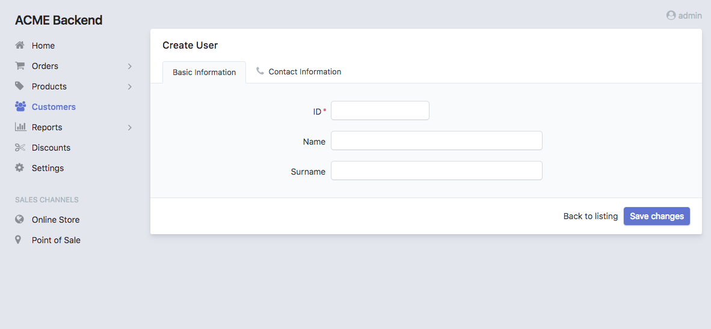
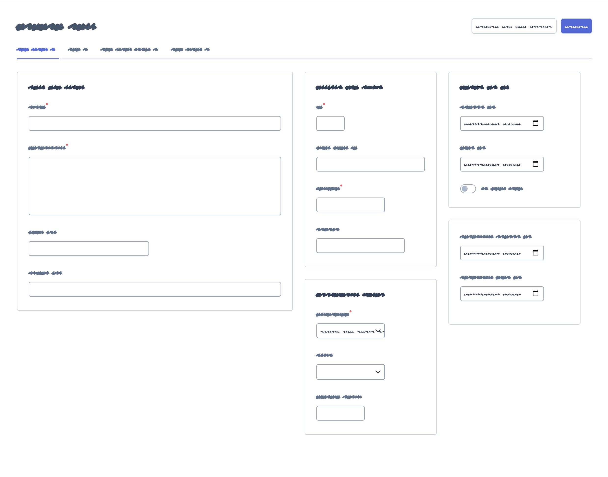
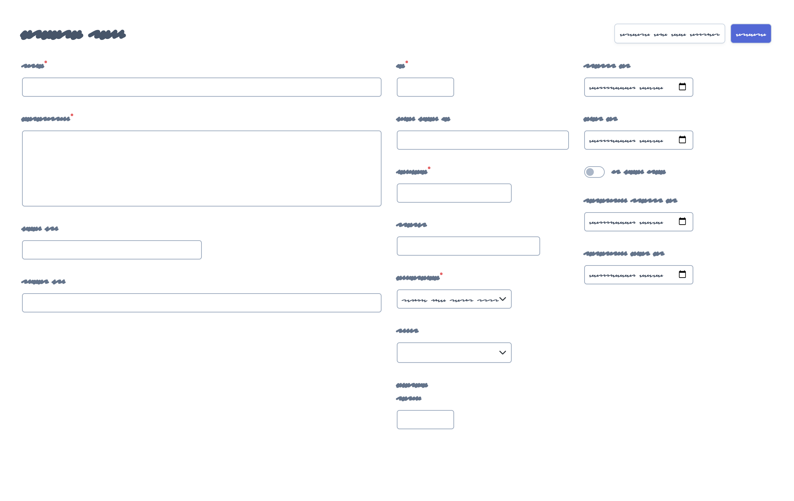
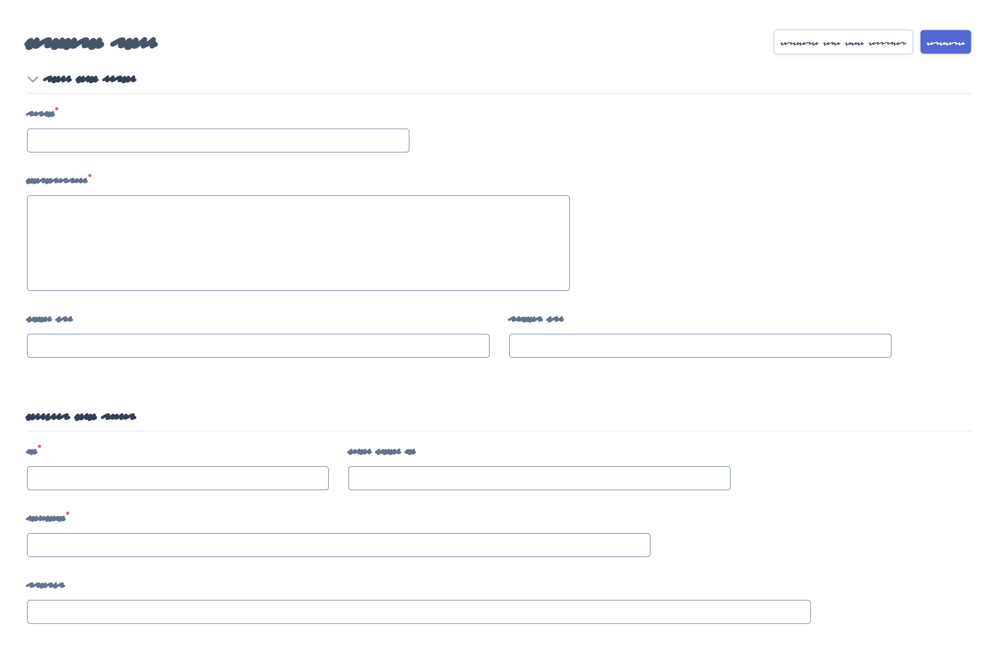
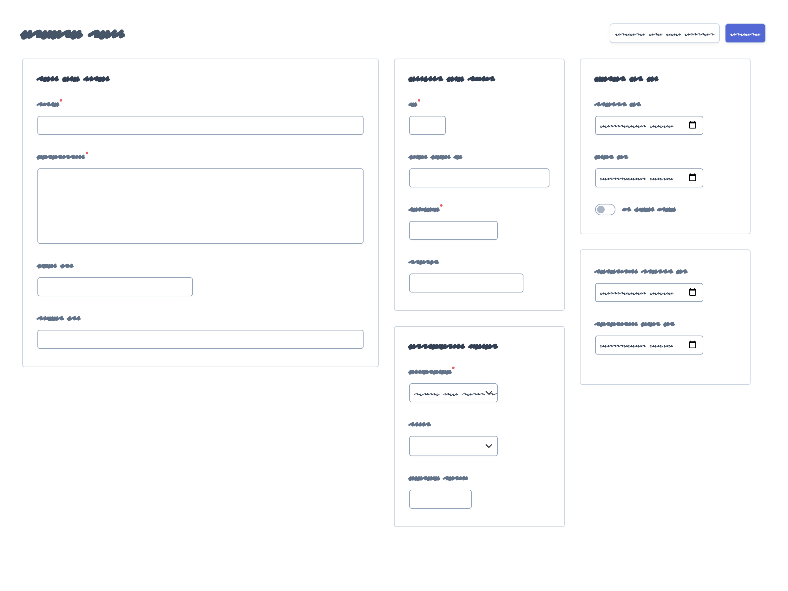
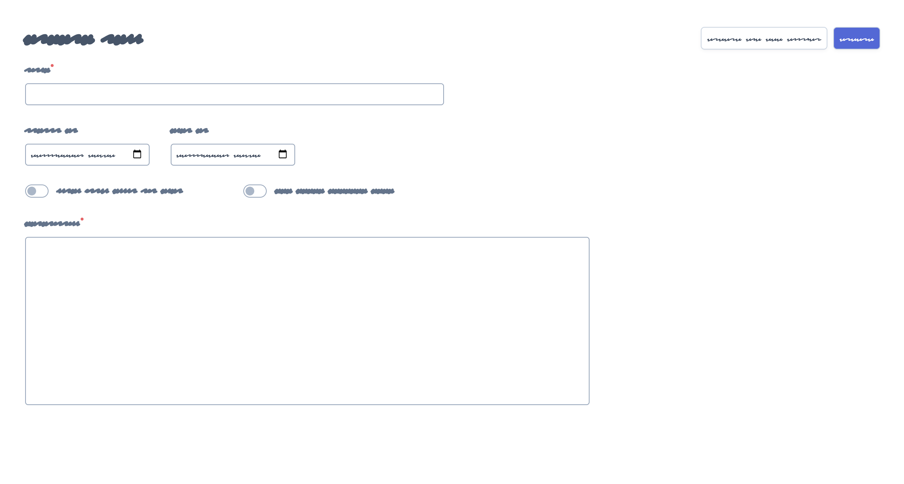

Fields
======

Fields let you display the contents of your Doctrine entities on each
:ref:`CRUD page <crud-pages>`. EasyAdmin provides built-in fields to display
all the common data types, but you can also :ref:`create your own fields <custom-fields>`.

Configuring the Fields to Display
---------------------------------

If your :doc:`CRUD controller </crud>` extends the ``AbstractCrudController``
provided by EasyAdmin, the fields are configured automatically. On the ``index``
page you'll see a few fields, and on the other pages you'll see as many fields
as needed to display all the properties of your Doctrine entity.

Implement the ``configureFields()`` method in your CRUD controller to customize
the list of fields to display::

    namespace App\Controller\Admin;

    use App\Entity\Product;
    use EasyCorp\Bundle\EasyAdminBundle\Controller\AbstractCrudController;

    class ProductCrudController extends AbstractCrudController
    {
        public static function getEntityFqcn(): string
        {
            return Product::class;
        }

        public function configureFields(string $pageName): iterable
        {
            // ...
        }

        // ...
    }

There are several ways of defining the list of fields to display.

**Option 1.** Return strings with the name of the properties to display. EasyAdmin
creates fields automatically for them and applies the default config options::

    public function configureFields(string $pageName): iterable
    {
        return [
            'title',
            'description',
            'price',
            'stock',
            'publishedAt',
        ];
    }

**Option 2.** Return ``Field`` objects created for the Doctrine entity properties.
EasyAdmin transforms these generic ``Field`` objects into the specific objects
used to display each type of property::

    use EasyCorp\Bundle\EasyAdminBundle\Field\Field;

    public function configureFields(string $pageName): iterable
    {
        return [
            Field::new('title'),
            Field::new('description'),
            Field::new('price'),
            Field::new('stock'),
            Field::new('publishedAt'),
        ];
    }

**Option 3.** Return the appropriate field objects to display each property::

    use EasyCorp\Bundle\EasyAdminBundle\Field\DateTimeField;
    use EasyCorp\Bundle\EasyAdminBundle\Field\IntegerField;
    use EasyCorp\Bundle\EasyAdminBundle\Field\MoneyField;
    use EasyCorp\Bundle\EasyAdminBundle\Field\TextEditorField;
    use EasyCorp\Bundle\EasyAdminBundle\Field\TextField;

    public function configureFields(string $pageName): iterable
    {
        return [
            TextField::new('title'),
            TextEditorField::new('description'),
            MoneyField::new('price')->setCurrency('EUR'),
            IntegerField::new('stock'),
            DateTimeField::new('publishedAt'),
        ];
    }

The only mandatory argument of the field constructors is the name of the
Doctrine entity property managed by this field. EasyAdmin uses the
`PropertyAccess component`_ to get the value of the properties, so the entity
can expose data as public properties (e.g. ``public $firstName``) or as public
methods (e.g. ``public function getFirstName()``, ``public function firstName()``).

.. note::

    EasyAdmin uses Symfony Forms to create and edit Doctrine entities. That's
    why all entity properties must be nullable: their setters need to accept
    ``null`` values and their getters must be allowed to return ``null``. In the
    database, the associated fields don't have to be nullable.

.. _unmapped-fields:

Unmapped Fields
~~~~~~~~~~~~~~~

Fields usually reference properties of the related Doctrine entity. However,
they can also refer to methods of the entity which are not associated with any
properties. For example, if your ``Customer`` entity defines the ``firstName``
and ``lastName`` properties, you may want to display a "Full Name" field with
both values merged.

To do so, add the following method to the entity::

    use Doctrine\ORM\Mapping as ORM;

    #[ORM\Entity]
    class Customer
    {
        // ...

        public function getFullName()
        {
            return $this->getFirstName().' '.$this->getLastName();
        }
    }

Now, add a ``fullName`` field that refers to this ``getFullName()`` method. The
conversion between field names and methods must comply with the rules of the
`PropertyAccess component`_ (e.g. ``foo_bar`` -> ``getFooBar()`` or ``fooBar()``)::

    public function configureFields(string $pageName): iterable
    {
        return [
            TextField::new('fullName'),
            // ...
        ];
    }

Internally, EasyAdmin flags unmapped fields as *virtual* (both terms refer to
the same concept). This is detected automatically from the Doctrine metadata,
so you never need to call the ``setVirtual()`` method on the field yourself.
Virtual fields are optional (``required`` = ``false``) in forms by default, and
their column header on the index page includes a ``field-virtual`` CSS class
that you can use to style them differently.

Note that unmapped fields are **not sortable** because they don't exist as a
database table column, so they cannot be included in the Doctrine query. The
sorting options of the listing are explained in :ref:`crud-search-sort-pagination`. In some
cases, you can overcome this limitation yourself by computing the unmapped field
contents using SQL. To do so, override the ``createIndexQueryBuilder()`` method
used in your :doc:`CRUD controller </crud>`::

    namespace App\Controller\Admin;

    use Doctrine\ORM\QueryBuilder;
    use EasyCorp\Bundle\EasyAdminBundle\Collection\FieldCollection;
    use EasyCorp\Bundle\EasyAdminBundle\Collection\FilterCollection;
    use EasyCorp\Bundle\EasyAdminBundle\Controller\AbstractCrudController;
    use EasyCorp\Bundle\EasyAdminBundle\Dto\EntityDto;
    use EasyCorp\Bundle\EasyAdminBundle\Dto\SearchDto;
    use EasyCorp\Bundle\EasyAdminBundle\Field\TextField;

    class UserCrudController extends AbstractCrudController
    {
        // ...

        public function configureFields(string $pageName): iterable
        {
            return [
                TextField::new('fullName'),
                // ...
            ];
        }

        public function createIndexQueryBuilder(SearchDto $searchDto, EntityDto $entityDto, FieldCollection $fields, FilterCollection $filters): QueryBuilder
        {
            $queryBuilder = parent::createIndexQueryBuilder($searchDto, $entityDto, $fields, $filters);

            // if a user-defined sort is not set
            if (0 === count($searchDto->getSort())) {
                $queryBuilder
                    ->addSelect('CONCAT(entity.firstName, \' \', entity.lastName) AS HIDDEN full_name')
                    ->addOrderBy('full_name', 'DESC');
            }

            return $queryBuilder;
        }
    }

.. _fields-per-page:

Displaying Different Fields per Page
~~~~~~~~~~~~~~~~~~~~~~~~~~~~~~~~~~~~

There are several methods to display fields conditionally depending on the
current page::

    public function configureFields(string $pageName): iterable
    {
        return [
            IdField::new('id')->hideOnForm(),
            TextField::new('firstName'),
            TextField::new('lastName'),
            TextField::new('phone'),
            EmailField::new('email')->hideOnIndex(),
            DateTimeField::new('createdAt')->onlyOnDetail(),
        ];
    }

These are all the available methods:

* ``hideOnIndex()``
* ``hideOnDetail()``
* ``hideOnForm()`` (hides the field both in ``edit`` and ``new`` pages)
* ``hideWhenCreating()``
* ``hideWhenUpdating()``
* ``onlyOnIndex()``
* ``onlyOnDetail()``
* ``onlyOnForms()`` (hides the field in all pages except ``edit`` and ``new``)
* ``onlyWhenCreating()``
* ``onlyWhenUpdating()``

If the fields to display are completely different on each page, use the given
``$pageName`` argument to differentiate them::

    use EasyCorp\Bundle\EasyAdminBundle\Config\Crud;

    public function configureFields(string $pageName): iterable
    {
        $id = IdField::new('id');
        $firstName = TextField::new('firstName');
        $lastName = TextField::new('lastName');
        $phone = TextField::new('phone');
        $email = EmailField::new('email');
        $createdAt = DateTimeField::new('createdAt');

        if (Crud::PAGE_INDEX === $pageName) {
            return [$id, $firstName, $lastName, $phone];
        } elseif (Crud::PAGE_DETAIL === $pageName) {
            return ['...'];
        } else {
            return ['...'];
        }
    }

If you need even greater control, consider using the following way of defining
the fields using `PHP generators`_::

    public function configureFields(string $pageName): iterable
    {
        yield IdField::new('id')->hideOnForm();

        if ('... some expression ...') {
            yield TextField::new('firstName');
            yield TextField::new('lastName');
        }

        yield TextField::new('phone');
        yield EmailField::new('email')->hideOnIndex();
        yield DateTimeField::new('createdAt')->onlyOnDetail();
    }

.. _field-layout:

Field Layout
------------

By default, EasyAdmin forms display one field per row. Inside each row, fields
show a different width depending on their type (e.g. integer fields are narrow
and code editor fields are very wide).

In this section, you'll learn how to customize the width of each field and also
the whole form layout thanks to elements such as tabs, columns, fieldsets and rows.

.. _form-tabs:

Form Tabs
~~~~~~~~~

This element is intended to make very long or complex forms more usable. It lets
you group fields into separate tabs that are visible one at a time. It looks like
this:

Add tabs to your forms with the ``addTab()`` method of the special ``FormField`` object::

    use EasyCorp\Bundle\EasyAdminBundle\Field\FormField;

    public function configureFields(string $pageName): iterable
    {
        return [
            // Creates a tab: all fields following it will belong to that tab
            // (until the end of the form or until you create another tab)
            FormField::addTab('First Tab'),
            TextField::new('firstName'),
            TextField::new('lastName'),

            // Creates a second tab and customizes some of its properties, such
            // as its icon, CSS class and help message
            FormField::addTab('Contact Information Tab')
                ->setIcon('phone')->addCssClass('optional')
                ->setHelp('Phone number is preferred'),

            TextField::new('phone'),
            // ...
        ];
    }

The arguments of the ``addTab()`` method are:

* ``$label``: (type: ``TranslatableInterface|string|false|null``) the text that
  this tab displays in the clickable list of tabs; if you set it to ``false``,
  ``null`` or an empty string, no text will be displayed (make sure to show an
  icon for the tab or users won't be able to click on it); you can also pass
  ``string`` and ``TranslatableInterface`` variables. In both cases, if they
  contain HTML tags they will be rendered instead of escaped;
* ``$icon``: (type: ``?string``) the full CSS class of a `FontAwesome`_ icon
  (e.g. ``far fa-folder-open``), or any icon name accepted by menu items and
  actions.

.. note::

    By default, EasyAdmin assumes that icon names correspond to `FontAwesome`_ CSS
    classes. The necessary CSS styles and web fonts are included by default too,
    so you don't need to take any additional steps to use FontAwesome icons. Alternatively,
    you can :ref:`use your own icon sets <icon-customization>` instead of FontAwesome.

.. tip::

    The selected tab is stored in the URL hash (e.g. ``#tab-contact-information``),
    so you can reload or bookmark the page and see the same tab selected. The tab
    is also kept when going from the ``detail`` page to the ``edit`` page of the
    same entity (and vice versa).

Tabs can display a small badge next to their label (e.g. to show the number of
related items in a tab) with the ``setBadge()`` method::

    use EasyCorp\Bundle\EasyAdminBundle\Field\FormField;

    // a static value with the default 'secondary' style
    FormField::addTab('Contact')->setBadge('New');

    // a value with one of the predefined Bootstrap styles: 'primary', 'secondary',
    // 'success', 'danger', 'warning', 'info', 'light', 'dark'
    FormField::addTab('Invoices')->setBadge(7, 'warning');

    // the badge value can also be a callable that receives the current entity
    // instance, so you can compute dynamic values such as collection counts
    FormField::addTab('Orders')->setBadge(fn (Customer $customer) => $customer->getOrders()->count());

The arguments of the ``setBadge()`` method are:

* ``$content``: (type: ``\Stringable|string|int|float|bool|callable|null``) the
  value displayed inside the badge. When it's a callable, it receives the current
  entity instance and must return the value to display. A ``null``, ``false`` or
  empty string value hides the badge (the value ``0`` is displayed);
* ``$style``: (type: ``string``, default: ``'secondary'``) one of the predefined
  Bootstrap styles listed above; any other value is applied "as is" to the ``style``
  HTML attribute of the badge (e.g. ``'background-color: purple;'``);
* ``$htmlAttributes``: (type: ``array``) an optional list of HTML attributes to add
  to the badge element.

The ``setBadge()`` method only works on form tabs. Calling it on any other field,
including columns, fieldsets and rows, throws an exception.

If the tab also contains fields with validation errors, both the red error badge
and your custom badge are displayed.

Inside tabs you can include not only form fields but all the other form layout
fields explained in the following sections: columns, fieldsets and rows. This
is what a form using all those elements looks like:

By default, tabs are rendered using a special Symfony form type. The name of
this type is ``ea_form_tab`` + a random ULID value. This makes it impossible to
override its template using a form theme. To customize it, use the ``propertySuffix``
optional argument of the ``addTab()`` method::

    FormField::addTab('Contact Information Tab', propertySuffix: 'contact');

The suffix cannot be empty and must be a valid Symfony form name. The same optional
argument is available in ``addColumn()``, ``addFieldset()`` and ``addRow()``, and any
field can define it later with the ``setPropertySuffix()`` method.

Following this example, you can define the following blocks to override the
design of this tab:

.. code-block:: twig

    
        {# ... #}
        {{ block('ea_form_tab_open_row') }}
        {# ... #}
    

    
        {# ... #}
        {{ block('ea_form_tab_close_row') }}
        {# ... #}
    

.. _form-columns:

Form Columns
~~~~~~~~~~~~

Before using this option, you must be familiar with the `Bootstrap grid system`_,
which divides each row into 12 same-width columns, and the `Bootstrap breakpoints`_,
which are ``xs`` (device width < 576px), ``sm`` (>= 576px), ``md`` (>= 768px),
``lg`` (>= 992px), ``xl`` (>= 1,200px) and ``xxl`` (>= 1,400px).

Form columns allow you to break down a complex form into two or more columns of
fields. In addition to increasing the density of information, columns allow you to
better separate fields according to their function. This is what a three column
form looks like:

The following is a simple example that divides a form in two columns (the first
one spanning 8 of the available 12 Bootstrap columns and the second column
spanning the other 4 Bootstrap columns)::

    use EasyCorp\Bundle\EasyAdminBundle\Field\FormField;

    public function configureFields(string $pageName): iterable
    {
        return [
            FormField::addColumn(8),
            TextField::new('firstName'),
            TextField::new('lastName'),

            FormField::addColumn(4),
            TextField::new('phone'),
            TextField::new('email')->hideOnIndex(),
        ];
    }

The arguments of the ``addColumn()`` method are:

* ``$cols``: (type: ``int|string``, default: ``'col'``) the width of the column
  defined as any value compatible with the `Bootstrap grid system`_ (e.g. ``'col-6'``,
  ``'col-md-6 col-xl-4'``, etc.). Integer values are transformed like this:
  N -> 'col-md-N' (e.g. ``8`` is transformed to ``col-md-8``). The default
  ``'col'`` value makes all the columns share the available width equally;
* ``$label``: (type: ``TranslatableInterface|string|false|null``) an optional title
  that is displayed at the top of the column. If you pass ``false``, ``null``
  or an empty string, no title is displayed. You can also pass ``string`` and
  ``TranslatableInterface`` variables. In both cases, if they contain HTML tags
  they will be rendered instead of escaped;
* ``$icon``: (type: ``?string``) the full CSS class of a `FontAwesome`_ icon
  (e.g. ``far fa-folder-open``), or any icon name accepted by menu items and
  actions; it is displayed next to the column label;
* ``$help``: (type: ``?string``) an optional content that is displayed below the
  column label; it's mostly used to describe the column contents or provide further
  instructions or help contents. You can include HTML tags and they will be
  rendered instead of escaped.

.. note::

    By default, EasyAdmin assumes that icon names correspond to `FontAwesome`_ CSS
    classes. The necessary CSS styles and web fonts are included by default too,
    so you don't need to take any additional steps to use FontAwesome icons. Alternatively,
    you can :ref:`use your own icon sets <icon-customization>` instead of FontAwesome.

Thanks to Bootstrap responsive classes, you can have columns of different sizes,
or even no columns at all, depending on the browser window size. In the following
example, breakpoints below ``lg`` don't display columns. The two columns don't
add up to ``12``. This is allowed, and it creates columns narrower than the full
width::

    use EasyCorp\Bundle\EasyAdminBundle\Field\FormField;

    public function configureFields(string $pageName): iterable
    {
        return [
            FormField::addColumn('col-lg-8 col-xl-6'),
            TextField::new('firstName'),
            TextField::new('lastName'),

            FormField::addColumn('col-lg-3 col-xl-2'),
            TextField::new('phone'),
            TextField::new('email')->hideOnIndex(),
        ];
    }

You can also use columns inside tabs to further organize the contents of very
complex layouts::

    use EasyCorp\Bundle\EasyAdminBundle\Field\FormField;

    public function configureFields(string $pageName): iterable
    {
        return [
            FormField::addTab('User Data'),

            FormField::addColumn('col-lg-8 col-xl-6'),
            TextField::new('firstName'),
            TextField::new('lastName'),

            FormField::addColumn('col-lg-3 col-xl-2'),
            TextField::new('phone'),
            TextField::new('email')->hideOnIndex(),

            FormField::addTab('Financial Information'),

            // ...
        ];
    }

.. note::

    By default, all fields inside columns are as wide as their containing column.
    Use form rows, as explained below, to customize the field width and/or to
    display more than one field on the same row.

By default, columns are rendered using a special Symfony form type. The name of
this type is ``ea_form_column`` + a random ULID value. This makes it impossible to
override its template using a form theme. To customize it, use the ``propertySuffix``
optional argument of the ``addColumn()`` method::

    FormField::addColumn('col-lg-8 col-xl-6', propertySuffix: 'main');

Following this example, you can define the following blocks to override the
design of this column:

.. code-block:: twig

    
        {# ... #}
        {{ block('ea_form_column_open_row') }}
        {# ... #}
    

    
        {# ... #}
        {{ block('ea_form_column_close_row') }}
        {# ... #}
    

.. _form-fieldsets:

Form Fieldsets
~~~~~~~~~~~~~~

In pages where you display lots of fields, you can divide them into groups using
fieldsets. This is what they look like:

Add fieldsets with the ``addFieldset()`` method of the special
``FormField`` object::

    use EasyCorp\Bundle\EasyAdminBundle\Field\FormField;

    public function configureFields(string $pageName): iterable
    {
        return [
            // fieldsets usually display only a title
            FormField::addFieldset('User Details'),
            TextField::new('firstName'),
            TextField::new('lastName'),

            // fieldsets without titles only display a separation between fields
            FormField::addFieldset(),
            DateTimeField::new('createdAt')->onlyOnDetail(),

            // fieldsets can also define their icon, CSS class and help message
            FormField::addFieldset('Contact information')
                ->setIcon('phone')->addCssClass('optional')
                ->setHelp('Phone number is preferred'),
            TextField::new('phone'),
            TextField::new('email')->hideOnIndex(),

            // fieldsets can be collapsible too (useful if your forms are long)
            // this makes the fieldset collapsible but renders it expanded by default
            FormField::addFieldset('Shipping address')->collapsible(),
            // this makes the fieldset collapsible and renders it collapsed by default
            FormField::addFieldset('Billing address')->renderCollapsed(),
        ];
    }

The arguments of the ``addFieldset()`` method are:

* ``$label``: (type: ``TranslatableInterface|string|bool|null``, default: ``false``)
  an optional title that is displayed at the top of the fieldset. If you pass
  ``false``, ``null`` or an empty string, no title is displayed, which is why a
  fieldset created without arguments renders as a plain separator between fields. You can also pass ``string`` and
  ``TranslatableInterface`` variables. In both cases, if they contain HTML tags
  they will be rendered instead of escaped;
* ``$icon``: (type: ``?string``) the full CSS class of a `FontAwesome`_ icon
  (e.g. ``far fa-folder-open``), or any icon name accepted by menu items and
  actions; it is displayed next to the fieldset label.

The ``collapsible()`` and ``renderCollapsed()`` methods require the fieldset to
define either a label or an icon. They throw an exception when the fieldset
defines neither of them.

.. note::

    By default, EasyAdmin assumes that icon names correspond to `FontAwesome`_ CSS
    classes. The necessary CSS styles and web fonts are included by default too,
    so you don't need to take any additional steps to use FontAwesome icons. Alternatively,
    you can :ref:`use your own icon sets <icon-customization>` instead of FontAwesome.

When using form columns, fieldsets inside them display a slightly different
design to better group the different fields. That's why it's recommended to
use fieldsets whenever you use columns. This is what it looks like:

By default, fieldsets are rendered using a special Symfony form type. The name of
this type is ``ea_form_fieldset`` + a random ULID value. This makes it impossible to
override its template using a form theme. To customize it, use the ``propertySuffix``
optional argument of the ``addFieldset()`` method::

    FormField::addFieldset('Contact information', propertySuffix: 'contact');

Following this example, you can define the following blocks to override the
design of this fieldset:

.. code-block:: twig

    
        {# ... #}
        {{ block('ea_form_fieldset_open_row') }}
        {# ... #}
    

    
        {# ... #}
        {{ block('ea_form_fieldset_close_row') }}
        {# ... #}
    

.. _form-rows:

Form Rows
~~~~~~~~~

This option also relies on the `Bootstrap grid system`_ and the `Bootstrap breakpoints`_
described in the :ref:`form columns <form-columns>` section.

Form rows allow you to display two or more fields on the same row. This is what it
looks like:

Imagine that you want to display two fields called  ``startsAt`` and ``endsAt``
on the same row, each of them spanning 6 columns of the row. This is how you
configure that layout::

    use EasyCorp\Bundle\EasyAdminBundle\Field\DateTimeField;

    public function configureFields(string $pageName): iterable
    {
        return [
            // ...,

            DateTimeField::new('startsAt')->setColumns(6),
            DateTimeField::new('endsAt')->setColumns(6),
        ];
    }

This example renders both fields on the same row, except in ``xs`` and ``sm``
breakpoints, where each field takes the entire row (because the device width is
too small).

If you need better control of the design depending on the device width, you
can pass a string with the responsive CSS classes that define the width of the
field on different breakpoints::

    use EasyCorp\Bundle\EasyAdminBundle\Field\DateTimeField;

    public function configureFields(string $pageName): iterable
    {
        return [
            // ...,

            DateTimeField::new('startsAt')->setColumns('col-sm-6 col-lg-5 col-xxl-3'),
            DateTimeField::new('endsAt')->setColumns('col-sm-6 col-lg-5 col-xxl-3'),
        ];
    }

This example adds ``col-sm-6`` to override the default EasyAdmin behavior and
display the two fields on the same row also in the ``sm`` breakpoint. Besides,
it reduces the number of columns in larger breakpoints (``lg`` and ``xxl``) to
improve the rendering of those fields.

.. tip::

    You can also use the CSS classes related to reordering and offsetting columns::

        yield DateTimeField::new('endsAt')->setColumns('col-sm-6 col-xxl-3 offset-lg-1 order-3');

Because of how Bootstrap grid works, when you configure field columns manually,
each row will contain as many fields as possible. If one field takes 4 columns
and the next one takes 3 columns, the row still has ``12 - 4 - 3 = 5`` columns
to render other fields. If the next field takes more than 5 columns, it renders
on the next row.

Sometimes you need better control of this automatic layout. For example, you
might want to display two or more fields on the same row, and ensure that no
other field is displayed on that row, even if there's enough space for it.
To do so, use the ``addRow()`` method of the special ``FormField`` field to
force the creation of a new line::

    use EasyCorp\Bundle\EasyAdminBundle\Field\BooleanField;
    use EasyCorp\Bundle\EasyAdminBundle\Field\DateTimeField;
    use EasyCorp\Bundle\EasyAdminBundle\Field\FormField;

    public function configureFields(string $pageName): iterable
    {
        return [
            // ...,

            DateTimeField::new('startsAt')->setColumns('col-sm-6 col-lg-5 col-xxl-3'),
            DateTimeField::new('endsAt')->setColumns('col-sm-6 col-lg-5 col-xxl-3'),
            FormField::addRow(),

            // you can pass the name of the breakpoint to add a row only on certain widths
            // FormField::addRow('xl'),

            // this field will always render on its own row, even if there's
            // enough space for it in the previous row in `lg`, `xl` and `xxl` breakpoints
            BooleanField::new('published')->setColumns(2),
        ];
    }

By default, rows are rendered using a special Symfony form type. The name of
this type is ``ea_form_row`` + a random ULID value. This makes it impossible to
override its template using a form theme. To customize it, use the ``propertySuffix``
optional argument of the ``addRow()`` method::

    FormField::addRow('xl', propertySuffix: 'main');

The breakpoint name only accepts these values: ``''`` (the default, which creates
the row on all widths), ``'sm'``, ``'md'``, ``'lg'``, ``'xl'`` and ``'xxl'``. The
``'xs'`` value is not accepted; use ``''`` instead to create the row on all widths.

Following this example, you can define the following blocks to override the
design of this row:

.. code-block:: twig

    
        {# ... #}
        {{ block('ea_form_row_open_row') }}
        {# ... #}
    

    
        {# ... #}
        {{ block('ea_form_row_close_row') }}
        {# ... #}
    

.. _fields_reference:

.. _fields-reference:

Field Types
-----------

These are all the built-in fields provided by EasyAdmin:

* :doc:`ArrayField </fields/ArrayField>`
* :doc:`AssociationField </fields/AssociationField>`
* :doc:`AvatarField </fields/AvatarField>`
* :doc:`BooleanField </fields/BooleanField>`
* :doc:`ChoiceField </fields/ChoiceField>`
* :doc:`CodeEditorField </fields/CodeEditorField>`
* :doc:`CollectionField </fields/CollectionField>`
* :doc:`ColorField </fields/ColorField>`
* :doc:`CountryField </fields/CountryField>`
* :doc:`CurrencyField </fields/CurrencyField>`
* :doc:`DateField </fields/DateField>`
* :doc:`DateTimeField </fields/DateTimeField>`
* :doc:`EmailField </fields/EmailField>`
* :doc:`FileField </fields/FileField>`
* :doc:`HiddenField </fields/HiddenField>`
* :doc:`IdField </fields/IdField>`
* :doc:`ImageField </fields/ImageField>`
* :doc:`IntegerField </fields/IntegerField>`
* :doc:`LanguageField </fields/LanguageField>`
* :doc:`LocaleField </fields/LocaleField>`
* :doc:`MoneyField </fields/MoneyField>`
* :doc:`NumberField </fields/NumberField>`
* :doc:`PasswordField </fields/PasswordField>`
* :doc:`PercentField </fields/PercentField>`
* :doc:`SlugField </fields/SlugField>`
* :doc:`TelephoneField </fields/TelephoneField>`
* :doc:`TextareaField </fields/TextareaField>`
* :doc:`TextEditorField </fields/TextEditorField>`
* :doc:`TextField </fields/TextField>`
* :doc:`TimeField </fields/TimeField>`
* :doc:`TimezoneField </fields/TimezoneField>`
* :doc:`UrlField </fields/UrlField>`

Mapping Between Doctrine Types and EasyAdmin Fields
~~~~~~~~~~~~~~~~~~~~~~~~~~~~~~~~~~~~~~~~~~~~~~~~~~~

The following table shows the recommended EasyAdmin field(s) to use depending
on the `Doctrine DBAL Type`_ of your entity properties:

========================  ===========================================================
Doctrine Type             Recommended EasyAdmin Fields
========================  ===========================================================
``array``                 ``ArrayField`` (Doctrine DBAL 3 only)
``ascii_string``          ``TextField``
``bigint``                ``TextField``
``binary``                (not supported)
``blob``                  (not supported)
``boolean``               ``BooleanField``
``date_immutable``        ``DateField``
``date``                  ``DateField``
``datetime_immutable``    ``DateTimeField``
``datetime``              ``DateTimeField``
``datetimetz_immutable``  ``DateTimeField``
``datetimetz``            ``DateTimeField``
``dateinterval``          ``TextField``
``decimal``               ``NumberField``
``float``                 ``NumberField``
``guid``                  ``TextField``
``integer``               ``IntegerField``
``json_array``            ``ArrayField`` (Doctrine DBAL 2 only)
``json``                  ``TextField``, ``TextareaField``, ``CodeEditorField``, ``ArrayField``
``object``                ``TextField``, ``TextareaField``, ``CodeEditorField`` (Doctrine DBAL 3 only)
``simple_array``          ``ArrayField``
``smallint``              ``IntegerField``
``string``                ``TextField``
``text``                  ``TextareaField``, ``TextEditorField``, ``CodeEditorField``
``time_immutable``        ``TimeField``
``time``                  ``TimeField``
========================  ===========================================================

In addition to these, EasyAdmin includes other field types for specific values:

* ``AvatarField``, ``ColorField``, ``CountryField``, ``CurrencyField``, ``EmailField``,
  ``FileField``, ``IdField``, ``ImageField``, ``LanguageField``, ``LocaleField``, ``SlugField``,
  ``TelephoneField``, ``TimezoneField`` and ``UrlField`` work well with Doctrine's
  ``string`` type.
* ``MoneyField`` and ``PercentField`` work well with Doctrine's ``decimal``, ``float``
  and ``integer``, depending on how you store the data.
* :doc:`AssociationField </fields/AssociationField>`,
  :doc:`CollectionField </fields/CollectionField>` and
  :doc:`ChoiceField </fields/ChoiceField>` are special fields that correspond to
  Symfony's ``EntityType``, ``CollectionType`` and ``ChoiceType`` respectively.

.. tip::

    If you want to use one of Doctrine's `Custom Mapping Types`_ you should
    create one of Symfony's `Custom Form Field Types`_ and one of
    EasyAdmin's :ref:`Custom Fields <custom-fields>`. Note that for some
    custom mapping types you will also need to customize EasyAdmin's
    search and filter functionality if you need them.

.. _field-configuration:

Field Configuration
-------------------

This section shows the config options available for all field types. In addition,
some fields define additional config options, as shown in the
:ref:`fields reference <fields-reference>`.

Label Options
~~~~~~~~~~~~~

The second optional argument of the field constructors is the label, which can
take many different values:

* **Not set or null**: EasyAdmin generates the label automatically from the
  field name (e.g. 'firstName' -> 'First Name');
* **An empty string**: the field doesn't display any label, but an empty
  ``<label>`` element is rendered so the form layout is not affected;
* **false**: the field doesn't display any label and no ``<label>`` element is
  rendered either. This is useful to display special full-width fields such as
  maps or wide tables created with custom field templates;
* If you **set the label** explicitly, EasyAdmin will use that value; the contents
  can include HTML tags and they will be rendered, not escaped. Also, you can use
  ``TranslatableInterface`` objects (e.g. ``t('admin.form.labels.user')``).

Here are some examples of field labels in action::

    // label not defined: generate it automatically (label = 'First Name')
    TextField::new('firstName'),
    // label is null: generate it automatically (label = 'First Name')
    TextField::new('firstName', null),

    // label is false: no label is displayed and no <label> element is rendered
    TextField::new('firstName', false),

    // label is set explicitly: render its contents, including HTML tags
    TextField::new('firstName', 'Customer <b>Name</b>'),

Design Options
~~~~~~~~~~~~~~

::

    TextField::new('firstName', 'Name')
        // use this method if your field needs a specific form theme to render properly
        ->addFormTheme('@FOSCKEditor/Form/ckeditor_widget.html.twig')
        // you can add more than one form theme using the same method
        ->addFormTheme('theme1.html.twig', 'theme2.html.twig', 'theme3.html.twig')

        // on the 'index' page, CSS class/classes are applied both to the `<th>` and the `<td>`
        // of the field in all rows; on the 'detail', 'edit', and 'new' pages, they are applied
        // to the row that wraps the contents of the field

        // use this method to add new classes to the ones applied by EasyAdmin
        ->addCssClass('text-large text-bold')
        // use this other method if you want to remove any CSS class added by EasyAdmin
        ->setCssClass('text-large text-bold')

        // this defines the Twig template used to render this field in 'index' and 'detail' pages
        // (this is not used in the 'edit'/'new' pages because they use Symfony Forms themes)
        ->setTemplatePath('admin/fields/my_template.html.twig')

        // useful for example to right-align numbers/money values (this setting is ignored in 'detail' page)
        // the only allowed values are 'left', 'center' and 'right'
        ->setTextAlign('right')
    ;

Form themes are explained in :ref:`form-field-templates`, and the Twig templates
used to render fields in the ``index`` and ``detail`` pages are explained in
:ref:`field-and-action-templates`.

Similar to the :ref:`CRUD design options <crud-design-custom-web-assets>`, fields
can also load CSS files, JavaScript files, Webpack Encore entries, AssetMapper
entries and Symfony Reprise entries, and add HTML contents to the ``<head>``
and/or ``<body>`` elements of the backend pages::

    TextField::new('firstName', 'Name')
        ->addCssFiles('bundle/some-bundle/foo.css', 'some-custom-styles.css')
        ->addJsFiles('admin/some-custom-code.js')
        ->addWebpackEncoreEntries('admin-maps')
        // this method requires the symfony/asset-mapper package; it throws an
        // exception when AssetMapper is not installed in your application
        ->addAssetMapperEntries('admin-maps')
        ->addRepriseEntries('admin-maps')
        ->addHtmlContentsToHead('<link rel="dns-prefetch" href="https://assets.example.com">')
        ->addHtmlContentsToBody('<!-- generated at '.time().' -->')
    ;

By default, these web assets are loaded in all backend pages. If you need more
precise control, use the ``Asset`` class to define the assets::

    use EasyCorp\Bundle\EasyAdminBundle\Config\Asset;
    // ...

    TextField::new('firstName', 'Name')
        ->addCssFiles(Asset::new('bundle/some-bundle/foo.css')->ignoreOnForm()->htmlAttr('media', 'print'))
        ->addJsFiles(Asset::new('admin/some-custom-code.js')->onlyOnIndex()->defer())
        ->addWebpackEncoreEntries(Asset::new('admin-maps')->onlyWhenCreating()->preload())
        ->addAssetMapperEntries(Asset::new('admin-maps')->onlyOnDetail())
        // Symfony Reprise entries use reprisePackageName() to define the Symfony
        // Asset package they belong to
        ->addRepriseEntries(Asset::new('admin-maps')->onlyWhenCreating()->reprisePackageName('legacy_assets'))
        // you can even define the Symfony Asset package which the asset belongs to
        ->addCssFiles(Asset::new('some-path/bar.css')->package('legacy_assets'))
    ;

Formatting Options
~~~~~~~~~~~~~~~~~~

The ``formatValue()`` method allows you to apply a PHP callable to the value before
rendering it in the ``index`` and ``detail`` pages::

    IntegerField::new('stock', 'Stock')
        // callbacks usually take only the current value as argument
        ->formatValue(static fn ($value): int|string => $value < 10 ? sprintf('%d **LOW STOCK**', $value) : $value)
    ;

    TextEditorField::new('description')
        // callables also receive the entire entity instance as the second argument
        ->formatValue(static fn ($value, $entity): int|string => $entity->isPublished() ? $value : 'Coming soon...')
    ;

.. _field-prepend-append:

Other Options
~~~~~~~~~~~~~

::

    TextField::new('firstName', 'Name')
        // if TRUE, listing can be sorted by this field (default: TRUE)
        // unmapped fields cannot be sorted
        ->setSortable(false)

        // if TRUE, the field is rendered as disabled in the 'edit'/'new' pages
        // (the argument is optional and defaults to TRUE)
        ->setDisabled()

        // overrides the 'required' state that EasyAdmin infers from the Doctrine
        // metadata of the property
        ->setRequired(true)

        // help message displayed for this field in the 'detail', 'edit' and 'new' pages
        ->setHelp('...')

        // sets the value of the `empty_data` option in the Symfony form
        // see https://symfony.com/doc/current/reference/forms/types/form.html#empty-data
        ->setEmptyData('Jane Doe')

        // the Symfony Form type used to render this field in 'edit'/'new' pages
        // (fields have good default values for this option, so you don't usually configure this)
        ->setFormType(TextType::class)

        // an array of parameters passed to the Symfony form type
        // (this only overrides the values of the passed form type options;
        // it leaves all the other existing type options unchanged)
        ->setFormTypeOptions(['option_name' => 'option_value'])

        // sets a single form type option; use the "dot" notation for nested
        // options (e.g. 'attr.class')
        ->setFormTypeOption('attr.placeholder', 'Your name')

        // same as above, but it does nothing if that option is already set
        ->setFormTypeOptionIfNotSet('attr.placeholder', 'Your name')

        // a custom HTML attribute added when rendering the field
        // e.g. setHtmlAttribute('data-foo', 'bar') renders a 'data-foo="bar"' attribute in HTML
        // On 'index' and 'detail' pages, the attribute is added to the field container:
        // <td> and div.field-group respectively
        // On 'new' and 'edit' pages, the attribute is added to the form field;
        // it's a shortcut for the equivalent setFormTypeOption('attr.data-foo', 'bar')
        // attribute names cannot use the "dot" notation and values must be scalar
        ->setHtmlAttribute('attribute_name', 'attribute_value')

        // a key-value array of attributes to add to the HTML element
        ->setHtmlAttributes(['data-foo' => 'bar', 'autofocus' => 'autofocus'])

        // parameters used when translating the label and the help message of the field
        ->setTranslationParameters(['%company%' => 'ACME Inc.'])

        // replaces all the custom options of the field at once
        // (custom options are explained later in this article)
        ->setCustomOptions(['mapProvider' => 'google'])

        // content rendered inside the field's form input, before/after the value
        // (it's only displayed on form pages and ignored for fields whose form
        // control is not a single-line input, such as textareas and checkboxes)
        ->prepend('https://')
        ->append('@example.com')

        // string contents can include HTML tags (they are rendered instead of escaped)
        // and they are translated using the application translation domain
        ->append('<b>per unit</b>')

        // use the 'icon' argument to display an icon: pass the full CSS class of a
        // FontAwesome icon, or any icon name accepted by menu items and actions;
        // you can combine icons and text contents
        ->prepend(icon: 'fa fa-lock')
        ->append('Search', icon: 'fa fa-magnifying-glass')

The string contents passed to ``prepend()`` and ``append()`` are translated using
the :ref:`translation domain <translation-domain>` of your backend, so you can
pass translation keys to them.

The ``setPermission()`` method restricts the field to the users granted a given
role or security expression. It's explained in detail in :ref:`security-fields`.

The ``setSortable()`` method only toggles sorting for a single field. The default
sort order and the rest of the listing behavior are configured in the CRUD
controller, as explained in :ref:`crud-search-sort-pagination`.

.. note::

    :doc:`MoneyField </fields/MoneyField>` and :doc:`PercentField </fields/PercentField>`
    display their currency and percentage symbols using these input addons, so
    their symbols are compatible with any additional content that you prepend or
    append to those fields.

.. _custom-fields:

Creating Custom Fields
----------------------

A field is a class that implements
``EasyCorp\Bundle\EasyAdminBundle\Contracts\Field\FieldInterface``. Although the
interface only requires a few methods, you may want to add all the
methods available in built-in fields to configure all the common field options.
You can use the ``EasyCorp\Bundle\EasyAdminBundle\Field\FieldTrait`` for that.

Imagine that you want to create a custom ``MapField`` that renders a full map
for a given postal address. This is the class you could create for the field::

    namespace App\Admin\Field;

    use EasyCorp\Bundle\EasyAdminBundle\Contracts\Field\FieldInterface;
    use EasyCorp\Bundle\EasyAdminBundle\Field\FieldTrait;
    use Symfony\Component\Form\Extension\Core\Type\TextareaType;
    use Symfony\Contracts\Translation\TranslatableInterface;

    final class MapField implements FieldInterface
    {
        use FieldTrait;

        /**
         * @param TranslatableInterface|string|false|null $label
         */
        public static function new(string $propertyName, $label = null): self
        {
            return (new self())
                ->setProperty($propertyName)
                ->setLabel($label)

                // this template is used in 'index' and 'detail' pages
                ->setTemplatePath('admin/field/map.html.twig')

                // use setTemplateName() instead of setTemplatePath() to reuse one
                // of the built-in EasyAdmin templates (e.g. 'crud/field/text');
                // the two methods are mutually exclusive
                // ->setTemplateName('crud/field/text')

                // this is used in 'edit' and 'new' pages to edit the field contents
                // you can use your own form types too
                ->setFormType(TextareaType::class)
                ->addCssClass('field-map')

                // loads the CSS and JS assets associated with the given Webpack Encore entry
                // in any CRUD page (index/detail/edit/new). It's equivalent to calling
                // encore_entry_link_tags('...') and encore_entry_script_tags('...')
                ->addWebpackEncoreEntries('admin-field-map')

                // these methods allow you to define the web assets loaded when the
                // field is displayed in any CRUD page (index/detail/edit/new)
                ->addCssFiles('js/admin/field-map.css')
                ->addJsFiles('js/admin/field-map.js')
            ;
        }
    }

Next, create the template used to render the field in the ``index`` and ``detail``
:ref:`CRUD pages <crud-pages>` (see :ref:`field-and-action-templates` for the
details about these templates). The template can use any `Twig templating features`_
and the following variables:

* ``ea``, an ``EasyCorp\Bundle\EasyAdminBundle\Context\AdminContext``
  instance which stores the :ref:`admin context <admin-context>` and it's
  available in all backend templates;
* ``field``, an ``EasyCorp\Bundle\EasyAdminBundle\Dto\FieldDto``
  instance which stores the config and value of the field being rendered;
* ``entity``, an ``EasyCorp\Bundle\EasyAdminBundle\Dto\EntityDto``
  instance which stores the instance of the entity to which the field belongs
  and other useful data about that Doctrine entity.

.. note::

    This template is not used in the ``edit`` and ``new`` :ref:`CRUD pages <crud-pages>`,
    which use `Symfony Form themes`_ to define how each form field is displayed.

That's all. You can now use this field in any of your CRUD controllers::

    use App\Admin\Field\MapField;

    public function configureFields(string $pageName): iterable
    {
        return [
            // ...
            MapField::new('shipAddress'),
        ];
    }

Custom Options
~~~~~~~~~~~~~~

If your field is configurable in any way, you can add custom options for it.
The recommended way of adding options is defining their names as public constants
in the field object and using the ``setCustomOption()`` method defined in the
``FieldTrait`` to set their values.

Imagine that the ``MapField`` defined in the previous section allows you to use
either Google Maps or OpenStreetMap to render the maps. You can add that
option as follows::

    namespace App\Admin\Field;

    use EasyCorp\Bundle\EasyAdminBundle\Contracts\Field\FieldInterface;
    use EasyCorp\Bundle\EasyAdminBundle\Field\FieldTrait;
    use Symfony\Component\Form\Extension\Core\Type\TextareaType;
    use Symfony\Contracts\Translation\TranslatableInterface;

    final class MapField implements FieldInterface
    {
        use FieldTrait;

        public const OPTION_MAP_PROVIDER = 'mapProvider';

        public static function new(string $propertyName, TranslatableInterface|string|bool|null $label = null): self
        {
            return (new self())
                // ...
                ->setCustomOption(self::OPTION_MAP_PROVIDER, 'openstreetmap')
            ;
        }

        public function useGoogleMaps(): self
        {
            $this->setCustomOption(self::OPTION_MAP_PROVIDER, 'google');

            return $this;
        }

        public function useOpenStreetMap(): self
        {
            $this->setCustomOption(self::OPTION_MAP_PROVIDER, 'openstreetmap');

            return $this;
        }
    }

Later you can access these options via the ``getCustomOptions()`` method of the
field DTO. For example, in a Twig template:

.. code-block:: twig

    {# admin/field/map.html.twig #}
    
        {# ... #}
    

    {# if you defined the field options as public constants, you can access
       them in the template too (although the resulting code is a bit verbose) #}
    
    
        {# ... #}
    

.. _field-configurators:

Field Configurators
-------------------

Sometimes, field options depend on the value of the entity property, which is
only available at runtime. To handle this, you can define a **field configurator**,
a class that updates the field configuration before it is rendered.

EasyAdmin defines many configurators for its built-in fields. You can create
your own configurators too, either to configure your own fields or to adjust
the built-in ones. A field configurator is a class that implements
``EasyCorp\Bundle\EasyAdminBundle\Contracts\Field\FieldConfiguratorInterface``::

    interface FieldConfiguratorInterface
    {
        // return TRUE to apply this configurator; return FALSE otherwise
        // e.g. you can match the field FQCN, its property name, or a custom option
        public function supports(FieldDto $field, EntityDto $entityDto): bool;

        // use it to update the value of any option of the given $field object
        public function configure(FieldDto $field, EntityDto $entityDto, AdminContext $context): void;
    }

The following example masks the local part of every ``EmailField`` value on the
index page (``jane.doe@example.com`` is rendered as ``j***@example.com``), so
the full address is only visible on the detail and edit pages::

    namespace App\Admin\Configurator;

    use EasyCorp\Bundle\EasyAdminBundle\Config\Crud;
    use EasyCorp\Bundle\EasyAdminBundle\Context\AdminContext;
    use EasyCorp\Bundle\EasyAdminBundle\Contracts\Field\FieldConfiguratorInterface;
    use EasyCorp\Bundle\EasyAdminBundle\Dto\EntityDto;
    use EasyCorp\Bundle\EasyAdminBundle\Dto\FieldDto;
    use EasyCorp\Bundle\EasyAdminBundle\Field\EmailField;

    final class MaskedEmailConfigurator implements FieldConfiguratorInterface
    {
        public function supports(FieldDto $field, EntityDto $entityDto): bool
        {
            return EmailField::class === $field->getFieldFqcn();
        }

        public function configure(FieldDto $field, EntityDto $entityDto, AdminContext $context): void
        {
            if (Crud::PAGE_INDEX !== $context->getCrud()->getCurrentPage()) {
                return;
            }

            $email = (string) $field->getValue();
            if (!str_contains($email, '@')) {
                return;
            }

            [$local, $domain] = explode('@', $email, 2);
            $field->setFormattedValue(substr($local, 0, 1).'***@'.$domain);
        }
    }

.. tip::

    In addition to matching the field FQCN, in ``supports()`` you can use other
    criteria: matching a property name (``'propertyName' === $field->getProperty()``),
    matching the value of a built-in or custom option
    (``true === $field->getCustomOption('option-name')``), etc.

With the default Symfony services configuration (autowiring and autoconfiguration
enabled), the configurator is registered automatically: EasyAdmin applies the
``ea.field_configurator`` tag to any service implementing ``FieldConfiguratorInterface``.
Otherwise, tag it manually:

.. code-block:: yaml

    # config/services.yaml
    services:
        App\Admin\Configurator\MaskedEmailConfigurator:
            tags:
                - { name: ea.field_configurator }

Use the tag's ``priority`` attribute to run before or after other configurators.
The built-in ``CommonPreConfigurator`` runs first (priority ``9999``) and
``CommonPostConfigurator`` runs last (``-9999``); yours runs between them by default:

.. code-block:: yaml

    tags:
        - { name: ea.field_configurator, priority: -100 }

.. _`PropertyAccess component`: https://symfony.com/doc/current/components/property_access.html
.. _`PHP generators`: https://www.php.net/manual/en/language.generators.overview.php
.. _`Twig templating features`: https://twig.symfony.com/doc/3.x/
.. _`Symfony Form themes`: https://symfony.com/doc/current/form/form_themes.html
.. _`Bootstrap grid system`: https://getbootstrap.com/docs/5.0/layout/grid/
.. _`Bootstrap breakpoints`: https://getbootstrap.com/docs/5.0/layout/breakpoints/
.. _`Doctrine DBAL Type`: https://www.doctrine-project.org/projects/doctrine-dbal/en/latest/reference/types.html
.. _`Custom Mapping Types`: https://www.doctrine-project.org/projects/doctrine-dbal/en/latest/reference/types.html#custom-mapping-types
.. _`Custom Form Field Types`: https://symfony.com/doc/current/form/create_custom_field_type.html
.. _`FontAwesome`: https://fontawesome.com/
