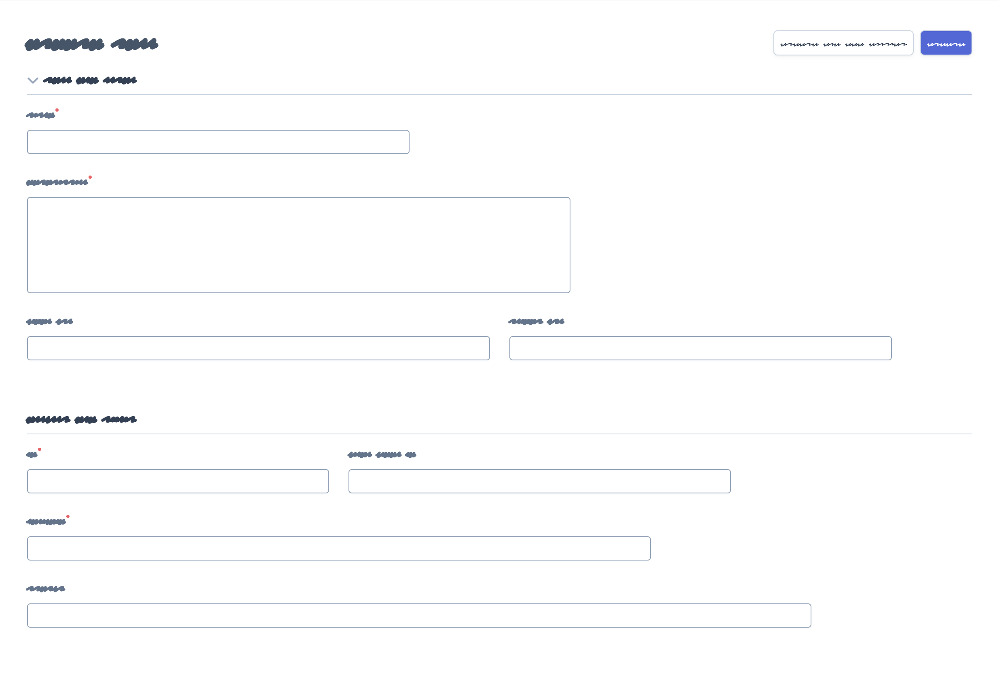

Fields
======

Fields allow to display the contents of your Doctrine entities on each
:ref:`CRUD page <crud-pages>`. EasyAdmin provides built-in fields to display
all the common data types, but you can also :ref:`create your own fields <custom-fields>`.

Configuring the Fields to Display
---------------------------------

If your :doc:`CRUD controller </crud>` extends from the ``AbstractCrudController``
provided by EasyAdmin, the fields are configured automatically. In the ``index``
page you'll see a few fields and in the rest of pages you'll see as many fields
as needed to display all the properties of your Doctrine entity.

Implement the ``configureFields()`` method in your CRUD controller to customize
the list of fields to display::

    namespace App\Controller\Admin;

    use App\Entity\Product;
    use EasyCorp\Bundle\EasyAdminBundle\Controller\AbstractCrudController;

    class ProductCrudController extends AbstractCrudController
    {
        public static function getEntityFqcn(): string
        {
            return Product::class;
        }

        public function configureFields(string $pageName): iterable
        {
            // ...
        }

        // ...
    }

There are several ways of defining the list of fields to display.

**Option 1.** Return strings with the name of the properties to display. EasyAdmin
creates fields automatically for them and applies the default config options::

    public function configureFields(string $pageName): iterable
    {
        return [
            'title',
            'description',
            'price',
            'stock',
            'publishedAt',
        ];
    }

**Option 2.** Return ``Field`` objects created for the Doctrine entity properties.
EasyAdmin transforms these generic ``Field`` objects into the specific objects
used to display each type of property::

    use EasyCorp\Bundle\EasyAdminBundle\Field\Field;

    public function configureFields(string $pageName): iterable
    {
        return [
            Field::new('title'),
            Field::new('description'),
            Field::new('price'),
            Field::new('stock'),
            Field::new('publishedAt'),
        ];
    }

**Option 3.** Return the appropriate field objects to display each property::

    use EasyCorp\Bundle\EasyAdminBundle\Field\DateTimeField;
    use EasyCorp\Bundle\EasyAdminBundle\Field\IntegerField;
    use EasyCorp\Bundle\EasyAdminBundle\Field\MoneyField;
    use EasyCorp\Bundle\EasyAdminBundle\Field\TextEditorField;
    use EasyCorp\Bundle\EasyAdminBundle\Field\TextField;

    public function configureFields(string $pageName): iterable
    {
        return [
            TextField::new('title'),
            TextEditorField::new('description'),
            MoneyField::new('price')->setCurrency('EUR'),
            IntegerField::new('stock'),
            DateTimeField::new('publishedAt'),
        ];
    }

The only mandatory argument of the field constructors is the name of the
Doctrine entity property managed by this field. EasyAdmin uses the
`PropertyAccess component`_ to get the value of the properties, so the entity
can define their access as public properties (e.g. ``public $firstName``) or
public methods (e.g. ``public function getFirstName()``, ``public function
firstName()``).

.. note::

    EasyAdmin uses Symfony Forms to create and edit Doctrine entities. That's
    why all entity properties must be nullable: their setters need to accept
    ``null`` values and their getters must be allowed to return ``null``. In the
    database, the associated fields don't have to be nullable.

Unmapped Fields
~~~~~~~~~~~~~~~

Fields usually reference to properties of the related Doctrine entity. However,
they can also refer to methods of the entity which are not associated to any
properties. For example, if your ``Customer`` entity defines the ``firstName``
and ``lastName`` properties, you may want to display a "Full Name" field with
both values merged.

To do so, add the following method to the entity::

    use Doctrine\ORM\Mapping as ORM;

    #[ORM\Entity]
    class Customer
    {
        // ...

        public function getFullName()
        {
            return $this->getFirstName().' '.$this->getLastName();
        }
    }

Now, add a ``fullName`` field that refers to this ``getFullName()`` method. The
conversion between field names and methods must comply with the rules of the
`PropertyAccess component`_ (e.g. ``foo_bar`` -> ``getFooBar()`` or ``fooBar()``)::

    public function configureFields(string $pageName): iterable
    {
        return [
            TextField::new('fullName'),
            // ...
        ];
    }

Beware that unmapped fields are **not sortable** because they don't exist as a
database table column, so they cannot be included in the Doctrine query. In some
cases, you can overcome this limitation yourself by computing the unmapped field
contents using SQL. To do so, override the ``createIndexQueryBuilder()`` method
used in your :doc:`CRUD controller </crud>`::

    namespace App\Controller\Admin;

    use EasyCorp\Bundle\EasyAdminBundle\Config\Crud;
    use EasyCorp\Bundle\EasyAdminBundle\Controller\AbstractCrudController;

    class UserCrudController extends AbstractCrudController
    {
        // ...

        public function configureFields(string $pageName): iterable
        {
            return [
                TextField::new('fullName'),
                // ...
            ];
        }

        public function createIndexQueryBuilder(SearchDto $searchDto, EntityDto $entityDto, FieldCollection $fields, FilterCollection $filters): QueryBuilder
        {
            $queryBuilder = parent::createIndexQueryBuilder($searchDto, $entityDto, $fields, $filters);

            // if user defined sort is not set
            if (0 === count($searchDto->getSort())) {
                $queryBuilder
                    ->addSelect('CONCAT(entity.first_name, \' \', entity.last_name) AS HIDDEN full_name')
                    ->addOrderBy('full_name', 'DESC');
            }

            return $queryBuilder;
        }
    }

Displaying Different Fields per Page
~~~~~~~~~~~~~~~~~~~~~~~~~~~~~~~~~~~~

There are several methods to display fields conditionally depending on the
current page::

    public function configureFields(string $pageName): iterable
    {
        return [
            IdField::new('id')->hideOnForm(),
            TextField::new('firstName'),
            TextField::new('lastName'),
            TextField::new('phone'),
            EmailField::new('email')->hideOnIndex(),
            DateTimeField::new('createdAt')->onlyOnDetail(),
        ];
    }

These are all the available methods:

* ``hideOnIndex()``
* ``hideOnDetail()``
* ``hideOnForm()`` (hides the field both in ``edit`` and ``new`` pages)
* ``hideWhenCreating()``
* ``hideWhenUpdating()``
* ``onlyOnIndex()``
* ``onlyOnDetail()``
* ``onlyOnForms()`` (hides the field in all pages except ``edit`` and ``new``)
* ``onlyWhenCreating()``
* ``onlyWhenUpdating()``

If the fields to display are completely different on each page, use the given
``$pageName`` argument to differentiate them::

    use EasyCorp\Bundle\EasyAdminBundle\Config\Crud;

    public function configureFields(string $pageName): iterable
    {
        $id = IdField::new('id');
        $firstName = TextField::new('firstName');
        $lastName = TextField::new('lastName');
        $phone = TextField::new('phone');
        $email = EmailField::new('email');
        $createdAt = DateTimeField::new('createdAt');

        if (Crud::PAGE_INDEX === $pageName) {
            return [$id, $firstName, $lastName, $phone];
        } elseif(Crud::PAGE_DETAIL === $pageName) {
            return ['...'];
        } else {
            return ['...'];
        }
    }

If you need even greater control, consider using the following way of defining
the fields using `PHP generators`_::

    public function configureFields(string $pageName): iterable
    {
        yield IdField::new('id')->hideOnForm();

        if ('... some expression ...') {
            yield TextField::new('firstName');
            yield TextField::new('lastName');
        }

        yield TextField::new('phone');
        yield EmailField::new('email')->hideOnIndex();
        yield DateTimeField::new('createdAt')->onlyOnDetail();
    }

Field Layout
------------

By default, EasyAdmin forms displays one field per row. Inside each row, fields
show a different width depending on their type (e.g. integer fields are narrow
and code editor fields are very wide).

In this section, you'll learn how to customize the width of each field and also
the whole form layout thanks to elements such as tabs, columns, fieldsets and rows.

Form Tabs
~~~~~~~~~

This element is intended to make very long/complex form more usable. It allows
to group fields into separate tabs that are visible one at a time. It looks like
this:

.. image:: images/easyadmin-form-tabs.png
   :alt: EasyAdmin form that uses tabs to group fields

Add tabs to your forms with the ``addTab()`` method of the special ``FormField`` object::

    use EasyCorp\Bundle\EasyAdminBundle\Field\FormField;

    public function configureFields(string $pageName): iterable
    {
        return [
            // Creates a tab: all fields following it will belong to that tab
            // (until the end of the form or until you create another tab)
            FormField::addTab('First Tab'),
            TextField::new('firstName'),
            TextField::new('lastName'),

            // Creates a second tab and customizes some of its properties, such
            // as its icon, CSS class and help message
            FormField::addTab('Contact information Tab')
                ->setIcon('phone')->addCssClass('optional')
                ->setHelp('Phone number is preferred'),

            TextField::new('phone'),
            // ...
        ];
    }

The arguments of the ``addTab()`` method are:

* ``$label``: (type: ``TranslatableInterface|string|false|null``) the text that
  this tab displays in the clickable list of tabs; if you set it to ``false``,
  ``null`` or an empty string, no text will be displayed (make sure to show an
  icon for the tab or users won't be able to click on it); You can also pass
  ``string`` and ``TranslatableInterface`` variables. In both cases, if they
  contain HTML tags they will be rendered in stead of escaped;
* ``$icon``: (type: ``?string``) the full CSS class of a `FontAwesome icon`_
  (e.g. ``far fa-folder-open``); if you don't display a text label for the tab,
  make sure to display an icon or users won't be able to click on the tab.

Inside tabs you can include not only form fields but all the other form layout
fields explained in the following sections: columns, fieldsets and rows. This
is how a form using all those elements looks like:

Form Columns
~~~~~~~~~~~~

.. versionadded:: 4.8.0

    Form columns were introduced in EasyAdmin 4.8.0.

Before using this option, you must be familiar with the `Bootstrap grid system`_,
which divides each row into 12 same-width columns, and the `Bootstrap breakpoints`_,
which are ``xs`` (device width < 576px), ``sm`` (>= 576px), ``md`` (>= 768px),
``lg`` (>= 992px), ``xl`` (>= 1,200px) and ``xxl`` (>= 1,400px).

Form columns allows to break down a complex form into two or more columns of
fields. In addition to increasing the density of information, columns allow to
better separate fields according to their function. This is how a three column
form looks like:

The following is a simple example that divides a form in two columns (the first
one spanning 8 of the available 12 Bootstrap columns and the second column
spanning the other 4 Bootstrap columns)::

    use EasyCorp\Bundle\EasyAdminBundle\Field\FormField;

    public function configureFields(string $pageName): iterable
    {
        return [
            FormField::addColumn(8),
            TextField::new('firstName'),
            TextField::new('lastName'),

            FormField::addColumn(4),
            TextField::new('phone'),
            TextField::new('email')->hideOnIndex(),
        ];
    }

The arguments of the ``addColumn()`` method are:

* ``$cols``: (type: ``int|string``) the width of the column defined as any value
  compatible with the `Bootstrap grid system`_  (e.g. ``'col-6'``, ``'col-md-6 col-xl-4'``,
  etc.). Integer values are transformed like this: N -> 'col-N' (e.g. ``8`` is
  transformed to ``col-8``);
* ``$label``: (type: ``TranslatableInterface|string|false|null``) an optional title
  that is displayed at the top of the column. If you pass ``false``, ``null``
  or an empy string, no title is displayed. You can also pass ``string`` and
  ``TranslatableInterface`` variables. In both cases, if they contain HTML tags
  they will be rendered in stead of escaped;
* ``$icon``: (type: ``?string``) the full CSS class of a `FontAwesome icon`_
  (e.g. ``far fa-folder-open``) that is displayed next to the column label;
* ``$help``: (type: ``?string``) an optional content that is displayed below the
  column label; it's mostly used to describe the column contents or provide further
  instructions or help contents. You can include HTML tags and they will be
  rendered instead of escaped.

Thanks to Bootstrap responsive classes, you can have columns of different sizes,
or even no columns at all, depending on the browser window size. In the following
example, breakpoints below ``lg`` doesn't display columns. Also, the sum of the
two columns doesn't total ``12``; this is allowed to create columns shorter than
the total space available::

    use EasyCorp\Bundle\EasyAdminBundle\Field\FormField;

    public function configureFields(string $pageName): iterable
    {
        return [
            FormField::addColumn('col-lg-8 col-xl-6'),
            TextField::new('firstName'),
            TextField::new('lastName'),

            FormField::addColumn('col-lg-3 col-xl-2'),
            TextField::new('phone'),
            TextField::new('email')->hideOnIndex(),
        ];
    }

You can also use columns inside tabs to further organize the contents of very
complex layouts::

    use EasyCorp\Bundle\EasyAdminBundle\Field\FormField;

    public function configureFields(string $pageName): iterable
    {
        return [
            FormField::addTab('User Data'),

            FormField::addColumn('col-lg-8 col-xl-6'),
            TextField::new('firstName'),
            TextField::new('lastName'),

            FormField::addColumn('col-lg-3 col-xl-2'),
            TextField::new('phone'),
            TextField::new('email')->hideOnIndex(),

            FormField::addTab('Financial Information'),

            // ...
        ];
    }

.. note::

    By default, all fields inside columns are as wide as their containing column.
    Use form rows, as explained below, to customize the field width and/or to
    display more than one field on the same row.

Form Fieldsets
~~~~~~~~~~~~~~

.. versionadded:: 4.8.0

    Form fieldsets were introduced in EasyAdmin 4.8.0. In previous versions,
    this feature was called "Form Panels".

In pages where you display lots of fields, you can divide them in groups using
fieldsets. This is how they look like:

Add fieldsets with the created with the ``addFieldset()`` method of the special
``FormField`` object::

    use EasyCorp\Bundle\EasyAdminBundle\Field\FormField;

    public function configureFields(string $pageName): iterable
    {
        return [
            // fieldsets usually display only a title
            FormField::addFieldset('User Details'),
            TextField::new('firstName'),
            TextField::new('lastName'),

            // fieldsets without titles only display a separation between fields
            FormField::addFieldset(),
            DateTimeField::new('createdAt')->onlyOnDetail(),

            // fieldsets can also define their icon, CSS class and help message
            FormField::addFieldset('Contact information')
                ->setIcon('phone')->addCssClass('optional')
                ->setHelp('Phone number is preferred'),
            TextField::new('phone'),
            TextField::new('email')->hideOnIndex(),

            // fieldsets can be collapsible too (useful if your forms are long)
            // this makes the fieldset collapsible but renders it expanded by default
            FormField::addFieldset('Contact information')->collapsible(),
            // this makes the fieldset collapsible and renders it collapsed by default
            FormField::addFieldset('Contact information')->renderCollapsed(),
        ];
    }

The arguments of the ``addFieldset()`` method are:

* ``$label``: (type: ``TranslatableInterface|string|false|null``) an optional title
  that is displayed at the top of the fieldset. If you pass ``false``, ``null``
  or an empy string, no title is displayed. You can also pass ``string`` and
  ``TranslatableInterface`` variables. In both cases, if they contain HTML tags
  they will be rendered in stead of escaped;
* ``$icon``: (type: ``?string``) the full CSS class of a `FontAwesome icon`_
  (e.g. ``far fa-folder-open``) that is displayed next to the fieldset label.

When using form columns, fieldsets inside them display a slightly different
design to better group the different fields. That's why it's recommended to
use fieldsets whenever you use columns. This is how it looks like:

Form Rows
~~~~~~~~~

Before using this option, you must be familiar with the `Bootstrap grid system`_,
which divides each row into 12 same-width columns, and the `Bootstrap breakpoints`_,
which are ``xs`` (device width < 576px), ``sm`` (>= 576px), ``md`` (>= 768px),
``lg`` (>= 992px), ``xl`` (>= 1,200px) and ``xxl`` (>= 1,400px).

Form rows allow to display two or more fields on the same row. This is how it
looks like:

.. image:: images/easyadmin-form-rows.png
   :alt: EasyAdmin form that uses rows to display several fields on the same row

Imagine that you want to display two fields called  ``startsAt`` and ``endsAt``
on the same row, each of them spanning 6 columns of the row. This is how you
configure that layout::

    use EasyCorp\Bundle\EasyAdminBundle\Field\DateTimeField;

    public function configureFields(string $pageName): iterable
    {
        return [
            // ...,

            DateTimeField::new('startsAt')->setColumns(6),
            DateTimeField::new('endsAt')->setColumns(6),
        ];
    }

This example renders both fields on the same row, except in ``xs`` and ``sm``
breakpoints, where each field takes the entire row (because the device width is
too small).

If you need a better control of the design depending on the device width, you
can pass a string with the responsive CSS classes that define the width of the
field on different breakpoints::

    use EasyCorp\Bundle\EasyAdminBundle\Field\DateTimeField;

    public function configureFields(string $pageName): iterable
    {
        return [
            // ...,

            DateTimeField::new('startsAt')->setColumns('col-sm-6 col-lg-5 col-xxl-3'),
            DateTimeField::new('endsAt')->setColumns('col-sm-6 col-lg-5 col-xxl-3'),
        ];
    }

This example adds ``col-sm-6`` to override the default EasyAdmin behavior and
display the two fields on the same row also in the ``sm`` breakpoint. Besides,
it reduces the number of columns in larger breakpoints (``lg`` and ``xxl``) to
improve the rendering of those fields.

.. tip::

    You can also use the CSS classes related to reordering and offseting columns::

        yield DateTimeField::new('endsAt')->setColumns('col-sm-6 col-xxl-3 offset-lg-1 order-3');

Because of how Bootstrap grid works, when you configure field columns manually,
each row will contain as many fields as possible. If one field takes 4 columns
and the next one takes 3 columns, the row still has ``12 - 4 - 3 = 5`` columns
to render other fields. If the next field takes more than 5 columns, it renders
on the next row.

Sometimes you need a better control of this automatic layout. For example, you
might want to display two or more fields on the same row, and ensure that no
other field is displayed on that row, even if there's enough space for it.
To do so, use the ``addRow()`` method of the special ``FormField`` field to
force the creation of a new line (the next field will forcibly render on a new row)::

    use EasyCorp\Bundle\EasyAdminBundle\Field\BooleanField;
    use EasyCorp\Bundle\EasyAdminBundle\Field\DateTimeField;
    use EasyCorp\Bundle\EasyAdminBundle\Field\FormField;

    public function configureFields(string $pageName): iterable
    {
        return [
            // ...,

            DateTimeField::new('startsAt')->setColumns('col-sm-6 col-lg-5 col-xxl-3'),
            DateTimeField::new('endsAt')->setColumns('col-sm-6 col-lg-5 col-xxl-3'),
            FormField::addRow(),

            // you can pass the name of the breakpoint to add a row only on certain widths
            // FormField::addRow('xl'),

            // this field will always render on its own row, even if there's
            // enough space for it in the previous row in `lg`, `xl` and `xxl` breakpoints
            BooleanField::new('published')->setColumns(2),
        ];
    }

.. _fields_reference:

Field Types
-----------

These are all the built-in fields provided by EasyAdmin:

* :doc:`ArrayField </fields/ArrayField>`
* :doc:`AssociationField </fields/AssociationField>`
* :doc:`AvatarField </fields/AvatarField>`
* :doc:`BooleanField </fields/BooleanField>`
* :doc:`ChoiceField </fields/ChoiceField>`
* :doc:`CodeEditorField </fields/CodeEditorField>`
* :doc:`CollectionField </fields/CollectionField>`
* :doc:`ColorField </fields/ColorField>`
* :doc:`CountryField </fields/CountryField>`
* :doc:`CurrencyField </fields/CurrencyField>`
* :doc:`DateField </fields/DateField>`
* :doc:`DateTimeField </fields/DateTimeField>`
* :doc:`EmailField </fields/EmailField>`
* :doc:`HiddenField </fields/HiddenField>`
* :doc:`IdField </fields/IdField>`
* :doc:`ImageField </fields/ImageField>`
* :doc:`IntegerField </fields/IntegerField>`
* :doc:`LanguageField </fields/LanguageField>`
* :doc:`LocaleField </fields/LocaleField>`
* :doc:`MoneyField </fields/MoneyField>`
* :doc:`NumberField </fields/NumberField>`
* :doc:`PercentField </fields/PercentField>`
* :doc:`SlugField </fields/SlugField>`
* :doc:`TelephoneField </fields/TelephoneField>`
* :doc:`TextareaField </fields/TextareaField>`
* :doc:`TextEditorField </fields/TextEditorField>`
* :doc:`TextField </fields/TextField>`
* :doc:`TimeField </fields/TimeField>`
* :doc:`TimezoneField </fields/TimezoneField>`
* :doc:`UrlField </fields/UrlField>`

Mapping Between Doctrine Types and EasyAdmin Fields
~~~~~~~~~~~~~~~~~~~~~~~~~~~~~~~~~~~~~~~~~~~~~~~~~~~

The following table shows the recommended EasyAdmin field(s) to use depending
on the `Doctrine DBAL Type`_ of your entity properties:

========================  ===========================================================
Doctrine Type             Recommended EasyAdmin Fields
========================  ===========================================================
``array``                 ``ArrayField``
``ascii_string``          ``TextField``
``bigint``                ``TextField``
``binary``                (not supported)
``blob``                  (not supported)
``boolean``               ``BooleanField``
``date_immutable``        ``DateField``
``date``                  ``DateField``
``datetime_immutable``    ``DateTimeField``
``datetime``              ``DateTimeField``
``datetimetz_immutable``  ``DateTimeField``
``datetimetz``            ``DateTimeField``
``datetinterval``         ``TextField``
``decimal``               ``NumberField``
``float``                 ``NumberField``
``guid``                  ``TextField``
``integer``               ``IntegerField``
``json_array``            ``ArrayField``
``json``                  ``TextField``, ``TextareaField``, ``CodeEditorField``
``object``                ``TextField``, ``TextareaField``, ``CodeEditorField``
``simple_array``          ``ArrayField``
``smallint``              ``IntegerField``
``string``                ``TextField``
``text``                  ``TextareaField``, ``TextEditorField``, ``CodeEditorField``
``time_immutable``        ``TimeField``
``time``                  ``TimeField``
========================  ===========================================================

In addition to these, EasyAdmin includes other field types for specific values:

* ``AvatarField``, ``ColorField``, ``CountryField``, ``CurrencyField``, ``EmailField``,
  ``IdField``, ``ImageField``, ``LanguageField``, ``LocaleField``, ``SlugField``,
  ``TelephoneField``, ``TimezoneField`` and ``UrlField`` work well with Doctrine's
  ``string`` type.
* ``MoneyField`` and ``PercentField`` work well with Doctrine's ``decimal``, ``float``
  and ``integer``, depending on how do you store the data.
* ``AssociationField``, ``CollectionField`` and ``ChoiceField`` are special fields
  that correspond to Symfony's ``EntityType``, ``CollectionType`` and ``ChoiceType``
  respectively.

.. tip::

    If you want to use one of Doctrine's `Custom Mapping Types`_ you should
    create one of Symfony's `Custom Form Field Types`_ and one of
    EasyAdmin's :ref:`Custom Fields <custom-fields>`. Note that for some
    custom mapping types you will also need to customize EasyAdmin's
    search and filter functionality if you need them.

Field Configuration
-------------------

This section shows the config options available for all field types. In addition,
some fields define additional config options, as shown in the
:ref:`fields reference <fields_reference>`.

Label Options
~~~~~~~~~~~~~

The second optional argument of the field constructors is the label, which can
take many different values:

* If you **don't set the label** explicitly, EasyAdmin generates the label
  automatically based on the field name (e.g. 'firstName' -> 'First Name');
* **null**: EasyAdmin generates the label automatically based on the field name
  (e.g. 'firstName' -> 'First Name');
* **An empty string**: the field doesn't display any label, but and empty
  ``<label>`` element is rendered to not mess with the form layout;
* **false**: the field doesn't display any label and no ``<label>`` element is
  rendered either. This is useful to display special full-width fields such as
  maps or wide tables created with custom field templates;
* If you **set the label** explicitly, EasyAdmin will use that value; the contents
  can include HTML tags and they will be rendered, not escaped. Also, you can use
  ``Translatable`` contents (e.g. ``t('admin.form.labels.user')``)

Here are some examples of field labels in action:

    // label not defined: generate it automatically (label = 'First Name')
    TextField::new('firstName'),
    // label is null: generate it automatically (label = 'First Name')
    TextField::new('firstName', null),

    // label is false: no label is displayed and no <label> element is rendered
    TextField::new('firstName', false),

    // label is set explicitly: render its contents, including HTML tags
    TextField::new('firstName', 'Customer <b>Name</b>'),

Design Options
~~~~~~~~~~~~~~

::

    TextField::new('firstName', 'Name')
        // use this method if your field needs a specific form theme to render properly
        ->addFormTheme('@FOSCKEditor/Form/ckeditor_widget.html.twig')
        // you can add more than one form theme using the same method
        ->addFormTheme('theme1.html.twig', 'theme2.html.twig', 'theme3.html.twig')

        // CSS class/classes are applied to the field contents (in the 'index' page)
        // or to the row that wraps the contents (in the 'detail', 'edit' and 'new' pages)

        // use this method to add new classes to the ones applied by EasyAdmin
        ->addCssClass('text-large text-bold')
        // use this other method if you want to remove any CSS class added by EasyAdmin
        ->setCssClass('text-large text-bold')

        // this defines the Twig template used to render this field in 'index' and 'detail' pages
        // (this is not used in the 'edit'/'new' pages because they use Symfony Forms themes)
        ->setTemplatePath('admin/fields/my_template.html.twig')

        // useful for example to right-align numbers/money values (this setting is ignored in 'detail' page)
        ->setTextAlign('right')
    ;

Similar to the :ref:`CRUD design options <crud-design-custom-web-assets>`, fields
can also load CSS files, Javascript files and Webpack Encore entries and add HTML
contents to the ``<head>`` and/or ``<body>`` elements of the backend pages::

    TextField::new('firstName', 'Name')
        ->addCssFiles('bundle/some-bundle/foo.css', 'some-custom-styles.css')
        ->addJsFiles('admin/some-custom-code.js')
        ->addWebpackEncoreEntry('admin-maps')
        ->addHtmlContentToHead('<link rel="dns-prefetch" href="https://assets.example.com">')
        ->addHtmlContentToBody('<!-- generated at '.time().' -->')
    ;

By default, these web assets are loaded in all backend pages. If you need a more
precise control, use the ``Asset`` class to define the assets::

    use EasyCorp\Bundle\EasyAdminBundle\Config\Asset;
    // ...

    TextField::new('firstName', 'Name')
        ->addCssFiles(Asset::new('bundle/some-bundle/foo.css')->ignoreOnForm()->htmlAttr('media', 'print'))
        ->addJsFiles(Asset::new('admin/some-custom-code.js')->onlyOnIndex()->defer())
        ->addWebpackEncoreEntries(Asset::new('admin-maps')->onlyWhenCreating()->preload())
        // you can even define the Symfony Asset package which the asset belongs to
        ->addCssFiles(Asset::new('some-path/bar.css')->package('legacy_assets'))
    ;

Formatting Options
~~~~~~~~~~~~~~~~~~

The ``formatValue()`` method allows to apply a PHP callable to the value before
rendering it in the ``index`` and ``detail`` pages::

    IntegerField::new('stock', 'Stock')
        // callbacks usually take only the current value as argument
        ->formatValue(function ($value) {
            return $value < 10 ? sprintf('%d **LOW STOCK**', $value) : $value;
        });

    TextEditorField::new('description')
        // callables also receives the entire entity instance as the second argument
        ->formatValue(function ($value, $entity) {
            return $entity->isPublished() ? $value : 'Coming soon...';
        });

    // in PHP 7.4 and newer you can use arrow functions
    // ->formatValue(fn ($value) => $value < 10 ? sprintf('%d **LOW STOCK**', $value) : $value);
    // ->formatValue(fn ($value, $entity) => $entity->isPublished() ? $value : 'Coming soon...');

Misc. Options
~~~~~~~~~~~~~

::

    TextField::new('firstName', 'Name')
        // if TRUE, listing can be sorted by this field (default: TRUE)
        // unmapped fields cannot be sorted
        ->setSortable(false)

        // help message displayed for this field in the 'detail', 'edit' and 'new' pages
        ->setHelp('...')

        // sets the value of the `empty_data` option in the Symfony form
        // see https://symfony.com/doc/current/reference/forms/types/form.html#empty-data
        ->setEmptyData('Jane Doe')

        // the Symfony Form type used to render this field in 'edit'/'new' pages
        // (fields have good default values for this option, so you don't usually configure this)
        ->setFormType(TextType::class)

        // an array of parameters passed to the Symfony form type
        // (this only overrides the values of the passed form type options;
        // it leaves all the other existing type options unchanged)
        ->setFormTypeOptions(['option_name' => 'option_value'])

        // a custom HTML attribute added when rendering the field
        // e.g. setHtmlAttribute('data-foo', 'bar') renders a 'data-foo="bar"' attribute in HTML
        // On 'index' and 'detail' pages, the attribute is added to the field container:
        // <td> and div.field-group respectively
        // On 'new' and 'edit' pages, the attribute is added to the form field;
        // it's a shortcut for the equivalent setFormTypeOption('attr.data-foo', 'bar)
        ->setHtmlAttribute('attribute_name', 'attribute_value')

        // a key-value array of attributes to add to the HTML element
        ->setHtmlAttributes(['data-foo' => 'bar', 'autofocus' => 'autofocus'])

.. _custom-fields:

Creating Custom Fields
----------------------

A field is a class that implements
``EasyCorp\Bundle\EasyAdminBundle\Contracts\Field\FieldInterface``. Although the
interface only requires to implement a few methods, you may want to add all the
methods available in built-in fields to configure all the common field options.
You can use the ``EasyCorp\Bundle\EasyAdminBundle\Field\FieldTrait`` for that.

Imagine that you want to create a custom ``MapField`` that renders a full map
for a given postal address. This is the class you could create for the field::

    namespace App\Admin\Field;

    use EasyCorp\Bundle\EasyAdminBundle\Contracts\Field\FieldInterface;
    use EasyCorp\Bundle\EasyAdminBundle\Field\FieldTrait;
    use Symfony\Component\Form\Extension\Core\Type\TextareaType;

    final class MapField implements FieldInterface
    {
        use FieldTrait;

        /**
         * @param TranslatableInterface|string|false|null $label
         */
        public static function new(string $propertyName, $label = null): self
        {
            return (new self())
                ->setProperty($propertyName)
                ->setLabel($label)

                // this template is used in 'index' and 'detail' pages
                ->setTemplatePath('admin/field/map.html.twig')

                // this is used in 'edit' and 'new' pages to edit the field contents
                // you can use your own form types too
                ->setFormType(TextareaType::class)
                ->addCssClass('field-map')

                // loads the CSS and JS assets associated to the given Webpack Encore entry
                // in any CRUD page (index/detail/edit/new). It's equivalent to calling
                // encore_entry_link_tags('...') and encore_entry_script_tags('...')
                ->addWebpackEncoreEntries('admin-field-map')

                // these methods allow to define the web assets loaded when the
                // field is displayed in any CRUD page (index/detail/edit/new)
                ->addCssFiles('js/admin/field-map.css')
                ->addJsFiles('js/admin/field-map.js')
            ;
        }
    }

Next, create the template used to render the field in the ``index`` and ``detail``
:ref:`CRUD pages <crud-pages>`. The template can use any `Twig templating features`_
and the following variables:

* ``ea``, a ``EasyCorp\Bundle\EasyAdminBundle\Context\AdminContext``
  instance which stores the :ref:`admin context <admin-context>` and it's
  available in all backend templates;
* ``field``, a ``EasyCorp\Bundle\EasyAdminBundle\Dto\FieldDto``
  instance which stores the config and value of the field being rendered;
* ``entity``, a ``EasyCorp\Bundle\EasyAdminBundle\Dto\EntityDto``
  instance which stores the instance of the entity which the field belongs to
  and other useful data about that Doctrine entity.

.. note::

    This template is not used in the ``edit`` and ``new`` :ref:`CRUD pages <crud-pages>`,
    which use `Symfony Form themes`_ to define how each form field is displayed.

That's all. You can now use this field in any of your CRUD controllers::

    use App\Admin\MapField;

    public function configureFields(string $pageName): iterable
    {
        return [
            // ...
            MapField::new('shipAddress'),
        ];
    }

Custom Options
~~~~~~~~~~~~~~

If your field is configurable in any way, you can add custom options for it.
The recommended way of adding options is defining their names as public constants
in the field object and use the ``setCustomOption()`` method defined in the
``FieldTrait`` to set their values.

Imagine that the ``MapField`` defined in the previous section allows to use
either Google Maps or OpenStreetMap to render the maps. You can add that
option as follows::

    namespace App\Admin\Field;

    use EasyCorp\Bundle\EasyAdminBundle\Contracts\Field\FieldInterface;
    use Symfony\Component\Form\Extension\Core\Type\TextareaType;

    final class MapField implements FieldInterface
    {
        use FieldTrait;

        public const OPTION_MAP_PROVIDER = 'mapProvider';

        public static function new(string $propertyName, ?string $label = null): self
        {
            return (new self())
                // ...
                ->setCustomOption(self::OPTION_MAP_PROVIDER, 'openstreetmap')
            ;
        }

        public function useGoogleMaps(): self
        {
            $this->setCustomOption(self::OPTION_MAP_PROVIDER, 'google');

            return $this;
        }

        public function useOpenStreetMap(): self
        {
            $this->setCustomOption(self::OPTION_MAP_PROVIDER, 'openstreetmap');

            return $this;
        }
    }

Later you can access these options via the ``getCustomOptions()`` method of the
field DTO. For example, in a Twig template:

.. code-block:: twig

    {# admin/field/map.html.twig #}
    
        {# ... #}
    

    {# if you defined the field options as public constants, you can access
       them in the template too (although resulting code is a bit verbose) #}
    
    
        {# ... #}
    

Field Configurators
-------------------

Some default options of some fields depend on the value of the entity
property, which is only available during runtime. That's why you can optionally
define a **field configurator**, which is a class that updates the config of the
field before rendering them.

EasyAdmin defines lots of configurators for its built-in fields. You can create
your own configurators too (either to configure your own fields and/or the
built-in fields). Field configurators are classes that implement
``EasyCorp\Bundle\EasyAdminBundle\Contracts\Field\FieldConfiguratorInterface``.

Once implemented, define a Symfony service for your configurator and tag it with
the ``ea.field_configurator`` tag. Optionally you can define the ``priority``
attribute of the tag to run your configurator before or after the built-in ones.

.. _`PropertyAccess component`: https://symfony.com/doc/current/components/property_access.html
.. _`PHP generators`: https://www.php.net/manual/en/language.generators.overview.php
.. _`Twig templating features`: https://twig.symfony.com/doc/3.x/
.. _`Symfony Form themes`: https://symfony.com/doc/current/form/form_themes.html
.. _`Bootstrap grid system`: https://getbootstrap.com/docs/5.0/layout/grid/
.. _`Bootstrap breakpoints`: https://getbootstrap.com/docs/5.0/layout/breakpoints/
.. _`Doctrine DBAL Type`: https://www.doctrine-project.org/projects/doctrine-dbal/en/latest/reference/types.html
.. _`Custom Mapping Types`: https://www.doctrine-project.org/projects/doctrine-dbal/en/latest/reference/types.html#custom-mapping-types
.. _`Custom Form Field Types`: https://symfony.com/doc/current/form/create_custom_field_type.html
.. _`FontAwesome icon`: https://fontawesome.com/v6/search?m=free
