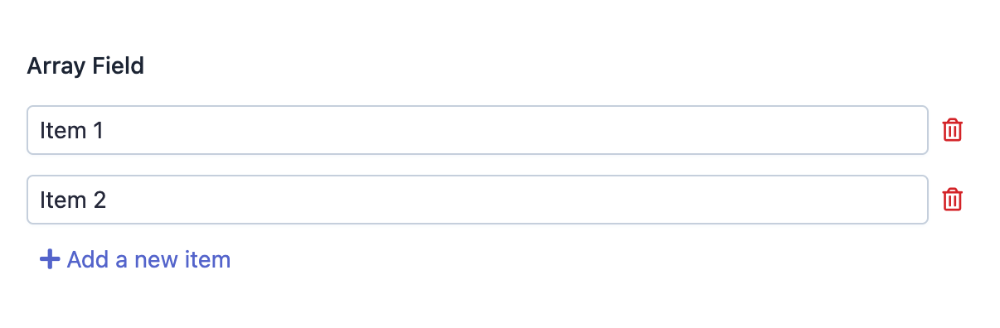

EasyAdmin Array Field
=====================

This field displays the contents of a Doctrine property of type ``array`` and it
allows to add new elements dynamically using JavaScript.

In :ref:`form pages (edit and new) <crud-pages>` it looks like this:

Basic Information
-----------------

* **PHP Class**: ``EasyCorp\Bundle\EasyAdminBundle\Field\ArrayField``
* **Doctrine DBAL Type** used to store this value: ``array``, ``simple_array``
  or ``json_array``
* **Symfony Form Type** used to render the field: `CollectionType`_
* **Rendered as**:

  .. code-block:: html

    <!-- when loading the page this is transformed into a dynamic collection via JavaScript -->
    <input type="text" value="...">
    <input type="text" value="...">
    <!-- ... -->

Options
-------

This field does not define any custom option.

.. _`CollectionType`: https://symfony.com/doc/current/reference/forms/types/collection.html
