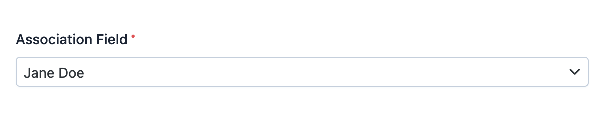

EasyAdmin Association Field
===========================

This field displays the contents of a property used to associate Doctrine entities
between them (of any type: one-to-one, one-to-many, etc.) In form pages this
field is rendered using an advanced autocomplete widget based on `TomSelect`_ library.

In :ref:`form pages (edit and new) <crud-pages>` it looks like this:

In read-only pages (``index``and ``detail``) is displayed as a clickable link
pointing to the ``detail`` action of the related entity.

Basic Information
-----------------

* **PHP Class**: ``EasyCorp\Bundle\EasyAdminBundle\Field\AssociationField``
* **Doctrine DBAL Type** used to store this value: ``integer``, ``guid`` or any
  other type that you use to store the ID of the associated entity
* **Symfony Form Type** used to render the field: `EntityType`_
* **Rendered as**:

  .. code-block:: html

    <!-- when loading the page this is transformed into a dynamic field via JavaScript -->
    <select> ... </select>

Options
-------

``autocomplete``
~~~~~~~~~~~~~~~~

By default, the field loads all the possible values of the related entity. This
creates "out of memory" errors when that entity has hundreds or thousands of values.
Use this option to load values dynamically (via Ajax requests) based on user input::

    yield AssociationField::new('...')->autocomplete();

``renderAsNativeWidget``
~~~~~~~~~~~~~~~~~~~~~~~~

By default, this field is rendered using an advanced JavaScript widget created
with the `TomSelect`_ library. If you prefer to display a standard ``<select>``
element, use this option::

    yield AssociationField::new('...')->renderAsNativeWidget();

``setCrudController``
~~~~~~~~~~~~~~~~~~~~~

In read-only pages (``index`` and ``detail``) this field is displayed as a
clickable link that points to the ``detail`` page of the related entity.

By default, EasyAdmin finds the CRUD controller of the related entity automatically.
However, if you define more than one CRUD controller for that entity, you'll need
to use this option to specify which one to use for the links::

    yield AssociationField::new('...')->setCrudController(SomeCrudController::class);

``setQueryBuilder``
~~~~~~~~~~~~~~~~~~~

By default, EasyAdmin uses a generic database query to find the items of the
related entity. Use this option if you need to use a custom query to filter results
or to sort them in some specific way.

Similar to the `query_builder option`_ of Symfony's ``EntityType``, the value of
this option can be a ``Doctrine\ORM\QueryBuilder`` object or a ``callable``.

You can use the ``QueryBuilder`` objects when the custom query is short and not
reused everywhere else in the application::

    // get the entity repository somehow...
    $someRepository = $this->entityManager->getRepository(SomeEntity::class);

    yield AssociationField::new('...')->setQueryBuilder(
        $someRepository->createQueryBuilder('entity')
            ->where('entity.some_property = :some_value')
            ->setParameter('some_value', '...')
            ->orderBy('entity.some_property', 'ASC')
    );

Using callables is more convenient when custom queries are complex and are
already defined in the entity repository because they are reused in other parts
of the application. When using a callable, the ``QueryBuilder`` is
automatically injected by Symfony as the first argument::

    yield AssociationField::new('...')->setQueryBuilder(
        fn (QueryBuilder $queryBuilder) => $queryBuilder->addCriteria('...')
    );

Or if you prefer using the repository of the entity::

    yield AssociationField::new('...')->setQueryBuilder(
        fn (QueryBuilder $queryBuilder) => $queryBuilder->getEntityManager()->getRepository(Foo::class)->findBySomeCriteria();
    );

.. _`TomSelect`: https://tom-select.js.org/
.. _`EntityType`: https://symfony.com/doc/current/reference/forms/types/entity.html
.. _`query_builder option`: https://symfony.com/doc/current/reference/forms/types/entity.html#query-builder
