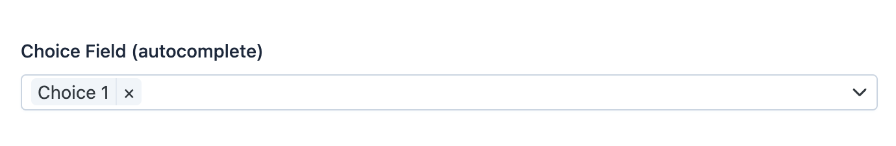
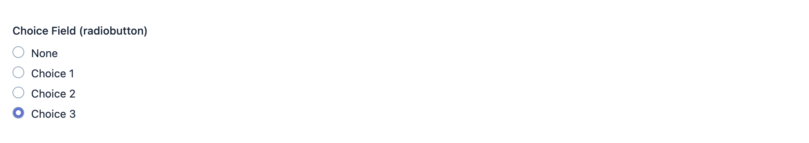
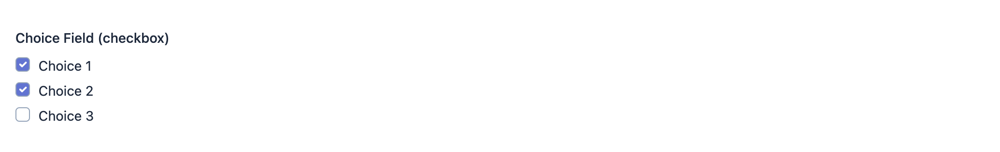

EasyAdmin Choice Field
======================

This field displays the contents of a property whose value can only be one of
the values included in a given set.

In :ref:`form pages (edit and new) <crud-pages>` this field is rendered in many
different ways depending on its configuration (see details later in this page).

Basic Information
-----------------

* **PHP Class**: ``EasyCorp\Bundle\EasyAdminBundle\Field\ChoiceField``
* **Doctrine DBAL Type** used to store this value: ``string`` or any
  other type that you use for the possible values (e.g. ``integer``)
* **Symfony Form Type** used to render the field: `ChoiceType`_
* **Rendered as**:

  .. code-block:: html

    <!-- this field is rendered either as a group of checkboxes, a set of
         radiobuttons or an advanced widget created with JavaScript.
         It all depends on the field configuration, as explained below -->

Options
-------

allowMultipleChoices
~~~~~~~~~~~~~~~~~~~~

By default, in form pages (``edit`` and ``new``) you can only select one of the
possible values of the field. Use this option to allow selecting an unlimited
number of items::

    yield ChoiceField::new('...')->allowMultipleChoices();

autocomplete
~~~~~~~~~~~~

By default, all possible items are loaded at once and shown in the item selector.
If there are many items, consider using this option to filter items dynamically
based on the user input::

    yield ChoiceField::new('...')->autocomplete();

This is how the autocomplete field looks like when it's expanded:

escapeHtml
~~~~~~~~~~

By default, in the list of possible values all the HTML contents are escaped.
Use this option if your values have HTML contents and want to render them::

    yield ChoiceField::new('...')->escapeHtml(false);

renderAsBadges
~~~~~~~~~~~~~~

When using this kind of field, is common for listings to represent the selected
value(s) as badges (e.g. the paid/unpaid status of an invoice). This option
provides many different ways of turning your choices into badges in read-only
pages (``index`` and ``detail``)::

    // all values are rendered with the same badge style (Bootstrap's ' secondary' style)
    yield ChoiceField::new('...')->renderAsBadges();

    // you can assign different badge styles per value using an array
    // there's no need to assign styles for all values; unassigned values will
    // be rendered with the 'secondary' style
    yield ChoiceField::new('...')->renderAsBadges([
        // $value => $badgeStyleName
        'paid' => 'success',
        'pending' => 'warning',
        'refunded' => 'danger',
    ]);

    // in addition to an array, you can also use a callback; this callback
    // receives a FieldDto object as its first and only argument
    // (unlike when using arrays, when using callables you must return a badge
    // style for all possible values)
    yield ChoiceField::new('...')->renderAsBadges(
        static fn (FieldDto $field): string => $field->getValue() < 10 ? 'warning' : 'primary'
    );

    // no badges are displayed for any value (this is the default behavior)
    yield ChoiceField::new('...')->renderAsBadges(false);

The built-in badge styles are the same as Bootstrap: ``'success'``,
``'warning'``, ``'danger'``, ``'info'``, ``'primary'``, ``'secondary'``,
``'light'``, ``'dark'``.

renderAsNativeWidget
~~~~~~~~~~~~~~~~~~~~

By default, when the field values are not rendered expanded (see ``renderExpanded``
option) it uses an advanced JavaScript widget based on `TomSelect`_ library.
Use this option if you prefer to use a default ``<select>`` HTML element::

    yield ChoiceField::new('...')->renderAsNativeWidget();

renderExpanded
~~~~~~~~~~~~~~

By default, the list of possible values is displayed using an advanced JavaScript
widget (or a ``<select>`` element; see ``renderAsNativeWidget`` option). If the
list of elements is short, it may be more convenient to display all the possible
values at once::

    yield ChoiceField::new('...')->renderExpanded();

If ``allowMultipleChoices`` is false, the expanded field will display radio buttons:

If ``allowMultipleChoices`` is true, the expanded field will display checkboxes:

setChoices
~~~~~~~~~~

This is the most important option, because it choice fields require to set their
possible values before using them. These options are defined in the same way as
Symfony Forms: ``['Label visible to users' => 'submitted_value', ...]``::

    yield ChoiceField::new('...')->setChoices([
        'Paid Invoice' => 'paid',
        'Invoice Sent but Unpaid' => 'pending',
        'Refunded Invoice' => 'refunded',
    ]);

    // in addition to arrays, you can use PHP closures to return the list of values
    // (the closure is given as arguments the current entity instance and the FieldDto)
    yield ChoiceField::new('...')->setChoices(
        static fn (?MyEntity $foo): array => $foo->someField()->getChoices()
    );

    yield ChoiceField::new('...')->setChoices(
        static fn (?MyEntity $foo, FieldDto $field): array => $field->getValue() < 10 ? $foo->getLowStockOptions() : $foo->getNormalStockOptions()
    );

setTranslatableChoices
~~~~~~~~~~~~~~~~~~~~~~

PHP doesn't allow using objects as array keys. That's why you can't use the
``setChoices()`` method when using ``TranslatableMessage`` objects to define
the labels of the choices.

Instead, use this method that works the same as ``setChoices()`` but flips the
order to use ``value => label`` instead of ``label => value``::

    use function Symfony\Component\Translation\t;
    // ...

    yield ChoiceField::new('...')->setTranslatableChoices([
        'paid' => t('Paid Invoice'),
        'pending' => t('Invoice Sent but Unpaid'),
        // if you want, some choices can use strings instead of objects
        'refunded' => 'Refunded Invoice',
    ]);

.. _`TomSelect`: https://tom-select.js.org/
.. _`ChoiceType`: https://symfony.com/doc/current/reference/forms/types/entity.html
