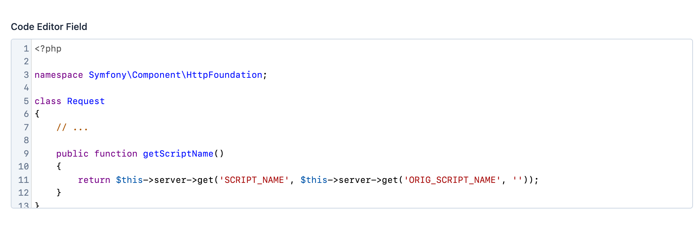

EasyAdmin Code Editor Field
===========================

This field creates a JavaScript-based editor to read and write source code based
on the `CodeMirror editor`_.

In :ref:`form pages (edit and new) <crud-pages>` it looks like this:

.. tip::

    EasyAdmin provides other fields for long text contents:
    :doc:`TextAreaField </fields/TextareaField>` is ideal for long contents that
    don't need any formatting; :doc:`TextEditorField </fields/TextEditorField>`
    is ideal to edit long text contents with rich formatting.

Basic Information
-----------------

* **PHP Class**: ``EasyCorp\Bundle\EasyAdminBundle\Field\CodeEditorField``
* **Doctrine DBAL Type** used to store this value: ``text``
* **Symfony Form Type** used to render the field: `CodeEditorType`_, which is
  based on Symfony's `TextareaType`_
* **Rendered as**:

  .. code-block:: html

    <!-- when loading the page this is transformed into a code editor via JavaScript -->
    <textarea> ... </textarea>

Options
-------

``hideLineNumbers``
~~~~~~~~~~~~~~~~~~~

By default, contents shows the line numbers of the code. Use this option to hide them::

    yield CodeEditorField('...')->hideLineNumbers();

``setIndentWithTabs``
~~~~~~~~~~~~~~~~~~~~~

By default, code is indented with 4 white spaces. Use this option to indent code
with tabs::

    yield CodeEditorField('...')->setIndentWithTabs();

``setLanguage``
~~~~~~~~~~~~~~~

By default, code is highlighted for Markdown contents. If you are editing contents
written in a different programming language, use this option:

    yield CodeEditorField('...')->setLanguage('php');

The argument passed to this method must be one of the following values:
``css``, ``dockerfile``, ``js``, ``markdown``, ``nginx``, ``php``, ``shell``,
``sql``, ``twig``, ``xml``, ``yaml-frontmatter``, ``yaml``.

``setNumOfRows``
~~~~~~~~~~~~~~~~

The height of the editor used in form pages (``new`` and ``edit``) is as large
as needed to display its contents. This height also grows dynamically (via JavaScript)
to always match the number of rows of its contents.

This option sets the number of rows displayed when the field contents are empty.
By default, the initial height is small, so it's a good idea to increase this
value when the expected content is much longer::

    yield CodeEditorField::new('...')->setNumOfRows(30);

``setTabSize``
~~~~~~~~~~~~~~

By default, code is indented with 4 white spaces. Use this option to increase or
decrease the indent size::

    yield CodeEditorField::new('...')->setTabSize(8);

.. _`CodeMirror editor`: https://github.com/codemirror/CodeMirror
.. _`CodeEditorType`: https://github.com/EasyCorp/EasyAdminBundle/blob/4.x/src/Form/Type/CodeEditorType.php
.. _`TextareaType`: https://symfony.com/doc/current/reference/forms/types/textarea.html
