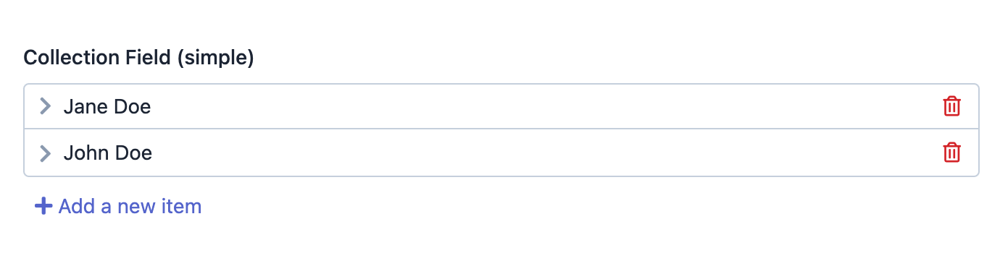
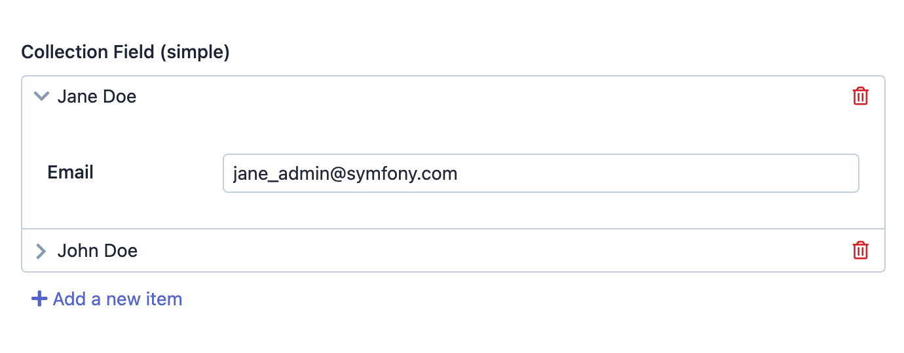

EasyAdmin Collection Field
==========================

This field displays a collection of objects, usually by rendering a list of
embedded forms.

In :ref:`form pages (edit and new) <crud-pages>` it looks like this:

When you click on any of the list items, its contents are expanded and you can
access its embedded form:

Basic Information
-----------------

* **PHP Class**: ``EasyCorp\Bundle\EasyAdminBundle\Field\CollectionField``
* **Doctrine DBAL Type** used to store this value: this field is related to
  Doctrine associations, so indirectly it uses  ``integer``, ``guid`` or any
  other type that you use to store the ID of the associated entity
* **Symfony Form Type** used to render the field: `CollectionType`_
* **Rendered as**:

  .. code-block:: html

    <!-- when loading the page this is transformed into a dynamic list of embedded forms -->
    <ul> ... </ul>

Options
-------

allowAdd
~~~~~~~~

By default, you can add new items to the collection. Use this option if you
prefer to now allow that::

    yield CollectionField::new('...')->allowAdd(false);

allowDelete
~~~~~~~~~~~

By default, you can delete any of the items included in the collection. Use this
option if you prefer to now allow that::

    yield CollectionField::new('...')->allowDelete(false);

renderExpanded
~~~~~~~~~~~~~~

By default, items in the collection are represented by a single line showing
their ``__toString()`` value. Users need to click on each item to reveal its
embedded form. Use this option if you prefer to render all items expanded on
page load::

    yield CollectionField::new('...')->renderExpanded();

setEntryIsComplex
~~~~~~~~~~~~~~~~~

Set this option if the embedded form of each collection item contains multiple
fields::

    yield CollectionField::new('...')->setEntryIsComplex();

EasyAdmin will try to do its best to display those fields correctly::

.. image:: ../images/fields/field-collection-complex-expanded.png
   :alt: Default style of EasyAdmin complex collection field expanded

setEntryType
~~~~~~~~~~~~

The entries of the collection can be rendered either using a Symfony Form or an
EasyAdmin CRUD Form. The ``setEntryType()`` method defines the Symfony form type
used to render the form of each collection entry::

    yield CollectionField::new('...')->setEntryType(SomeType::class);

showEntryLabel
~~~~~~~~~~~~~~

By default, EasyAdmin hides the form label of each collection item (because it's
an auto-increment integer number which doesn't look good most of the times).
Use this option if you prefer to display that label::

    yield CollectionField::new('...')->showEntryLabel();

useEntryCrudForm
~~~~~~~~~~~~~~~~

The entries of the collection can be rendered either using a Symfony Form or an
EasyAdmin CRUD Form. The ``useEntryCrudForm()`` method defines the EasyAdmin CRUD
form used to render the form of each collection entry::

    yield CollectionField::new('...')->useEntryCrudForm();

By default, EasyAdmin finds the CRUD controller associated to the property automatically.
If you need better control about which CRUD controller to use, pass the fully-qualified
class name of the controller as the first argument::

    yield CollectionField::new('...')->useEntryCrudForm(CategoryCrudController::class);

    // the other optional arguments are the CRUD page names to pass to the configureFields()
    // method when creating and editing entries respectively
    yield CollectionField::new('...')->useEntryCrudForm(
        CategoryCrudController::class, 'new_category_on_article_page', 'edit_category_on_article_page'
    );

.. note::

    The ``useEntryCrudForm()`` method requires Symfony 6.1 or newer version.

.. _`CollectionType`: https://symfony.com/doc/current/reference/forms/types/collection.html
