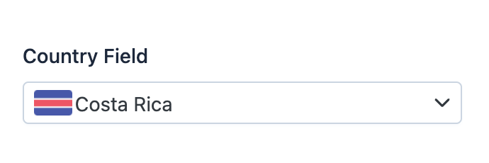

EasyAdmin Country Field
=======================

This field is used to represent the name and/or flag that corresponds to the
country code stored in some property.

In :ref:`form pages (edit and new) <crud-pages>` it looks like this:

Basic Information
-----------------

* **PHP Class**: ``EasyCorp\Bundle\EasyAdminBundle\Field\CountryField``
* **Doctrine DBAL Type** used to store this value: ``string``
* **Symfony Form Type** used to render the field: `CountryType`_
* **Rendered as**:

  .. code-block:: html

    <select> ... </select>

Options
-------

includeOnly
~~~~~~~~~~~

By default, the country selector displays all the countries/regions defined by
the `ICU project`_, the same which is used by Symfony and many other tech projects.
Use this option to only display the given country codes::

    yield CountryField::new('...')->includeOnly(['AR', 'BR', 'ES', 'PT']);

remove
~~~~~~

By default, the country selector displays all the countries/regions defined by
the `ICU project`_, the same which is used by Symfony and many other tech projects.
Use this option to remove the given countries/regions codes from that list::

    yield CountryField::new('...')->remove(['AF', 'KP']);

showFlag
~~~~~~~~

By default, the country flag is displayed both in read-only pages (``index`` and
``detail``) and in the selector used in form pages. Use this option if you want
to hide the flag::

    yield CountryField::new('...')->showFlag(false);

showName
~~~~~~~~

By default, the country name is displayed both in read-only pages (``index`` and
``detail``) and in the selector used in form pages. Use this option if you want
to hide the name::

    yield CountryField::new('...')->showName(false);

useAlpha3Codes
~~~~~~~~~~~~~~

By default, the field expects that the given country code is a 2-letter value
following the `ISO 3166-1 alpha-2`_ format. Use this option if you store the
country code using the 3-letter value of the `ISO 3166-1 alpha-3`_ format::

    yield CountryField::new('...')->useAlpha3Codes();

.. _`CountryType`: https://symfony.com/doc/current/reference/forms/types/country.html
.. _`ICU project`: https://icu.unicode.org/
.. _`ISO 3166-1 alpha-2`: https://en.wikipedia.org/wiki/ISO_3166-1_alpha-2
.. _`ISO 3166-1 alpha-3`: https://en.wikipedia.org/wiki/ISO_3166-1_alpha-3
