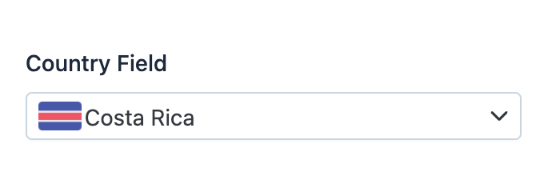

EasyAdmin Country Field
=======================

This field is used to represent the name and/or flag that corresponds to the
country code stored in some property.

In :ref:`form pages (edit and new) <crud-pages>` it looks like this:

Basic Information
-----------------

* **PHP Class**: ``EasyCorp\Bundle\EasyAdminBundle\Field\CountryField``
* **Doctrine DBAL Type** used to store this value: ``string``
* **Symfony Form Type** used to render the field: `CountryType`_
* **Rendered as**:

  .. code-block:: html

    <select> ... </select>

.. tip::

    EasyAdmin includes all the valid country flags as SVG files. You don't have
    to do anything to make the backend render those flags. However, if you want
    to render flags in your own custom templates, you can use the
    :doc:`Flag component </components>` included in EasyAdmin as follows:

    .. code-block:: twig

        <twig:ea:Flag countryCode="CR" height="{{ 18 }}"/>

        {# use 'showName' to display the localized country name next to the flag #}
        <twig:ea:Flag countryCode="CR" showName/>

        {# any other HTML attribute is applied to the element that wraps the flag #}
        <twig:ea:Flag countryCode="CR" class="rounded shadow-sm" title="Shipping destination"/>

        {# when the flag of the given country is not available, EasyAdmin renders
           a generic red flag; use the 'fallback' block to customize it #}
        <twig:ea:Flag countryCode="{{ some_var.country }}">
            <twig:block name="fallback">🏳️</twig:block>
        </twig:ea:Flag>

Options
-------

``allowMultipleChoices``
~~~~~~~~~~~~~~~~~~~~~~~~

By default, the country selector allows you to select zero (if the property is nullable)
or one value. Call this method if you want to allow selecting any number of
values::

    yield CountryField::new('...')->allowMultipleChoices();

If you allow choosing multiple values, you might need to change your current
entity because EasyAdmin will try to get/set an array with the country codes
instead of a string with only one country code. You could use a Doctrine property
of type ``array`` or you could keep using a string property and handle the array
to string conversion manually::

    class MyEntity
    {
        // ...

        public function getCountry(): ?array
        {
            return '' === $this->country ? null : explode('|', $this->country);
        }

        public function setCountry(?array $countryCodes): self
        {
            $this->country = null === $countryCodes ? '' : implode('|', $countryCodes);

            return $this;
        }
    }

``includeOnly``
~~~~~~~~~~~~~~~

By default, the country selector displays all the countries/regions defined by
the `ICU project`_, the same one used by Symfony and many other projects.
Use this option to only display the given country codes::

    yield CountryField::new('...')->includeOnly(['AR', 'BR', 'ES', 'PT']);

``remove``
~~~~~~~~~~

Use this option to remove the given countries/regions codes from the list of
countries displayed by the country selector::

    yield CountryField::new('...')->remove(['AF', 'KP']);

``showFlag``
~~~~~~~~~~~~

By default, the country flag is displayed both in read-only pages (``index`` and
``detail``) and in the selector used in form pages. Use this option if you want
to hide the flag::

    yield CountryField::new('...')->showFlag(false);

    // hide it in form pages only
    yield CountryField::new('...')->showFlag(Crud::PAGE_NEW !== $pageName && Crud::PAGE_EDIT !== $pageName);

``showName``
~~~~~~~~~~~~

By default, the country name is displayed both in read-only pages (``index`` and
``detail``) and in the selector used in form pages. Use this option if you want
to hide the name::

    yield CountryField::new('...')->showName(false);

    // show it only in form pages
    yield CountryField::new('...')->showName(Crud::PAGE_NEW === $pageName || Crud::PAGE_EDIT === $pageName);

``useAlpha3Codes``
~~~~~~~~~~~~~~~~~~

By default, the field expects that the given country code is a 2-letter value
following the `ISO 3166-1 alpha-2`_ format. Use this option if you store the
country code using the 3-letter value of the `ISO 3166-1 alpha-3`_ format::

    yield CountryField::new('...')->useAlpha3Codes();

.. _`CountryType`: https://symfony.com/doc/current/reference/forms/types/country.html
.. _`ICU project`: https://icu.unicode.org/
.. _`ISO 3166-1 alpha-2`: https://en.wikipedia.org/wiki/ISO_3166-1_alpha-2
.. _`ISO 3166-1 alpha-3`: https://en.wikipedia.org/wiki/ISO_3166-1_alpha-3
