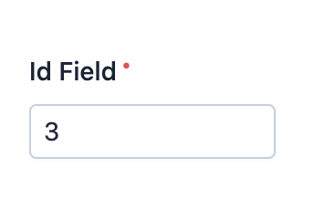

EasyAdmin ID Field
==================

This field is used to represent the primary key of an integer, no matter if it's
a traditional auto-increment numeric value or a UID value.

In :ref:`form pages (edit and new) <crud-pages>` it looks like this:

Basic Information
-----------------

* **PHP Class**: ``EasyCorp\Bundle\EasyAdminBundle\Field\IdField``
* **Doctrine DBAL Type** used to store this value: ``integer``, ``bigint`` or ``string``
* **Symfony Form Type** used to render the field: `TextType`_
* **Rendered as**:

  .. code-block:: html

    <input type="text" value="...">

Options
-------

``setMaxLength``
~~~~~~~~~~~~~~~~

By default, this value is truncated in ``index`` page to a maximum of 7 characters
because usually there's not enough space to display full UID values. If you prefer
to not truncate this value or to do it at different length, use this option:

    // set this value to -1 to not truncate the value
    yield IdField::new('...')->setMaxLength(16);

.. _`TextType`: https://symfony.com/doc/current/reference/forms/types/text.html
