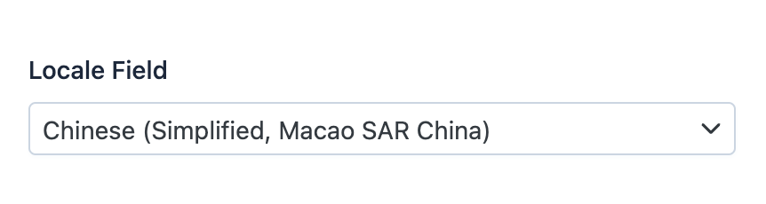

EasyAdmin LocaleField
=====================

This field is used to represent the name of a locale stored in a property as
a valid `ICU project`_ locale code (the same which is used by Symfony and many
other tech projects).

In :ref:`form pages (edit and new) <crud-pages>` it looks like this:

Basic Information
-----------------

* **PHP Class**: ``EasyCorp\Bundle\EasyAdminBundle\Field\LocaleField``
* **Doctrine DBAL Type** used to store this value: ``string``
* **Symfony Form Type** used to render the field: `LocaleType`_
* **Rendered as**:

  .. code-block:: html

    <select> ... </select>

Options
-------

``includeOnly``
~~~~~~~~~~~~~~~

By default, the locale selector displays all the locales defined by
the `ICU project`_, the same which is used by Symfony and many other tech projects.
Use this option to only display the given locale codes::

    yield LocaleField::new('...')->includeOnly(['en', 'fr', 'pl']);

``remove``
~~~~~~~~~~

By default, the locale selector displays all the locales defined by
the `ICU project`_, the same which is used by Symfony and many other tech projects.
Use this option to remove the given locale codes from that list::

    yield LocaleField::new('...')->remove(['fr', 'pl']);

``showCode``
~~~~~~~~~~~~

By default, in read-only pages (``index`` and ``show``) this field displays the
full name of the locale (e.g. ``Somali (Djibouti)``, ``Uyghur (China)``,
``Ukrainian``, etc.)

Use this option if you want to display the locale code (e.g. ``so_DJ``,
``ug_CN``, ``uk``, etc.) instead of or in addition to the locale name::

    yield LocaleField::new('...')->showCode();

``showName``
~~~~~~~~~~~~

By default, in read-only pages (``index`` and ``show``) this field displays the
full name of the locale (e.g. ``Somali (Djibouti)``, ``Uyghur (China)``,
``Ukrainian``, etc.)

Use this option if you want to hide this name and display instead the locale
code (e.g. ``so_DJ``, ``ug_CN``, ``uk``, etc.)::

    yield LocaleField::new('...')->showName(false);

.. _`LocaleType`: https://symfony.com/doc/current/reference/forms/types/locale.html
.. _`ICU project`: https://icu.unicode.org/
