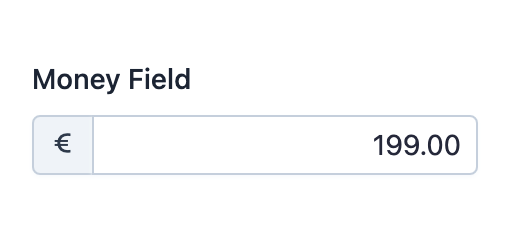

EasyAdmin Money Field
=====================

This field is used to represent the value of properties that store amounts of
money.

In :ref:`form pages (edit and new) <crud-pages>` it looks like this:

Basic Information
-----------------

* **PHP Class**: ``EasyCorp\Bundle\EasyAdminBundle\Field\MoneyField``
* **Doctrine DBAL Type** used to store this value: ``decimal``, ``float`` or
  ``integer``
* **Symfony Form Type** used to render the field: `MoneyType`_ (or
  ``EaMoneyType``, a custom form type created by EasyAdmin based on it, when
  using the ``useMoneyObject()`` option)
* **Rendered as**:

  .. code-block:: html

    <input type="number">

Options
-------

``setCurrency``
~~~~~~~~~~~~~~~

The currency associated with the amount of money is needed to format the field
value in read-only pages (``index`` and ``detail``). If the currency is known and
the same for all values of the field, use this option (otherwise, use the
``setCurrencyPropertyPath`` option).

The method argument must be a valid `ISO 4217 standard`_ currency code (the
same codes used by :doc:`CurrencyField </fields/CurrencyField>`)::

    // e.g. 'INR' = 'Indian Rupee'
    yield MoneyField::new('...')->setCurrency('INR');

Every money field must define its currency with either this option or
``setCurrencyPropertyPath()``, and the given code must be known to ICU;
otherwise EasyAdmin throws an ``\InvalidArgumentException``. Use the
``CurrencyField::CURRENCY_NONE`` constant (the ISO 4217 ``'XXX'`` code) for
amounts that don't belong to any currency.

.. note::

    In form pages, the currency symbol is displayed inside the form input using
    the same :ref:`addons created with the prepend() and append() methods
    <field-prepend-append>`, so you can combine the currency symbol with your
    own addon contents.

``setCurrencyPropertyPath``
~~~~~~~~~~~~~~~~~~~~~~~~~~~

The currency associated with the amount of money is needed to format the field
value in read-only pages (``index`` and ``detail``). If the currency changes
for each field value, you'll probably store that currency code (following the
`ISO 4217 standard`_) as a property of the entity.

Use this option to tell EasyAdmin which is the property that stores the currency
code. The method argument is any valid `Symfony PropertyAccess`_ expression::

    yield MoneyField::new('...')->setCurrencyPropertyPath('currency');
    yield MoneyField::new('...')->setCurrencyPropertyPath('currencyCode');
    yield MoneyField::new('...')->setCurrencyPropertyPath('currency.code');

``setNumDecimals``
~~~~~~~~~~~~~~~~~~

By default, money amounts are displayed formatted with 2 decimal numbers. Use
this option if you want to format values with a different number of decimals::

    yield MoneyField::new('...')->setNumDecimals(0);

``setStoredAsCents``
~~~~~~~~~~~~~~~~~~~~

By default, EasyAdmin assumes that your database stores money amounts as cents.
For example, "5 euros" is stored as the integer ``500`` (5 x 100 cents) and
"349.99 euros" is stored as the integer ``34999``.

This is the recommended way to store money amounts in the database, even if it
seems complicated at first. Doing this prevents rounding errors that commonly
occur when storing money amounts using float or decimal numbers.

.. tip::

    In Symfony/PHP applications you can use the `Money PHP`_ library to handle
    the conversion of money amounts from/into cents.

If you do not store money amounts in cents, set this option to ``false``::

    yield MoneyField::new('...')->setStoredAsCents(false);

.. note::

    When this option is enabled, the ``divisor`` is set at ``100`` automatically.
    However, if you've defined your own custom divisor with the
    ``setFormTypeOption('divisor', ...)`` method, the custom divisor will be used.

``useMoneyObject``
~~~~~~~~~~~~~~~~~~

If your entity stores money amounts as ``Money\Money`` objects from the
`Money PHP`_ library, EasyAdmin can handle them directly. First, install the
library:

.. code-block:: terminal

    $ composer require moneyphp/money

When the property value is already a ``Money`` object (e.g. on ``edit`` and
``detail`` pages), EasyAdmin detects it automatically and no extra configuration
is needed. On ``new`` pages, where the value is ``null``, you must enable this
option explicitly::

    yield MoneyField::new('price')->useMoneyObject();

The currency is read from the ``Money`` object by default, but you can override
it with ``setCurrency()`` or ``setCurrencyPropertyPath()``::

    yield MoneyField::new('price')->useMoneyObject()->setCurrency('EUR');

.. note::

    ``Money`` objects always store amounts in the smallest currency unit, so
    ``setStoredAsCents()`` has no effect when using this option. The divisor is
    derived from the number of fraction digits that ICU defines for the
    currency (e.g. ``100`` for EUR and USD, ``1`` for JPY and ``1000`` for BHD).

.. _`MoneyType`: https://symfony.com/doc/current/reference/forms/types/money.html
.. _`ISO 4217 standard`: https://en.wikipedia.org/wiki/ISO_4217
.. _`Symfony PropertyAccess`: https://symfony.com/doc/current/components/property_access.html
.. _`Money PHP`: https://github.com/moneyphp/money
