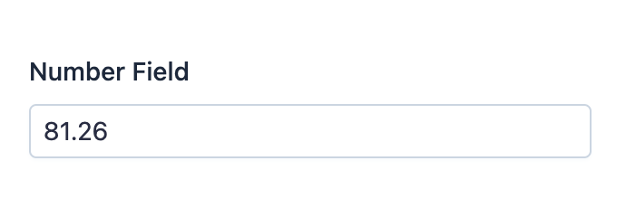

EasyAdmin Number Field
======================

This field is used to represent the value of properties that store numbers of
any type (integers or decimals).

In :ref:`form pages (edit and new) <crud-pages>` it looks like this:

Basic Information
-----------------

* **PHP Class**: ``EasyCorp\Bundle\EasyAdminBundle\Field\NumberField``
* **Doctrine DBAL Type** used to store this value: ``decimal``, ``float`` or
  ``string``
* **Symfony Form Type** used to render the field: `NumberType`_
* **Rendered as**:

  .. code-block:: html

    <!-- the type of element used is configurable -->
    <input type="number"> or <input type="text">

Options
-------

setDecimalSeparator
~~~~~~~~~~~~~~~~~~~

The numeric values show the default decimal separator used by PHP (e.g. 1/10 is
shown as ``0.1``). Use this option to set a different character to separate the
decimal part of the number::

    // this would display '12345.67' as '12345,67'
    yield NumberField::new('...')->setDecimalSeparator(',');

setNumberFormat
~~~~~~~~~~~~~~~

By default, numbers are displayed "as is". If you prefer to format the value in
any way, use this option and pass any formatting string valid as an argument of
the ``sprintf()`` function::

    // this would display numbers in scientific notation (e.g. 123456.7890 = '1.234568e+5')
    yield NumberField::new('...')->setNumberFormat('%e');

.. caution::

    Using this option will make EasyAdmin to ignore the options ``setNumDecimals``
    and ``setRoundingMode``.

setNumDecimals
~~~~~~~~~~~~~~

By default, numbers are displayed "as is" without adding or removing any decimals
to it. Use this option if you want to format values with a certain number of
decimals::

    // this would format 3 as 3.00 and 5.123 as 5.12
    yield NumberField::new('...')->setNumDecimals(2);

setRoundingMode
~~~~~~~~~~~~~~~

By default, when some value must be rounded to reduce the number of decimals,
the field uses PHP ``\NumberFormatter::ROUND_HALFUP`` strategy. Use this option
to change the rounding strategy and pass as its arguments any of the ``ROUND_*``
constants of `PHP NumberFormatter class`_::

    yield NumberField::new('...')->setRoundingMode(\NumberFormatter::ROUND_CEILING);

setStoredAsString
~~~~~~~~~~~~~~~~~

By default, this field assumes that you store the value as a numeric property.
If you store the value as a string (e.g. because it's a very large number) use
this option to also display a ``<input type="text">`` element instead of the
default ``<input type="number">`` element::

    yield NumberField::new('...')->setStoredAsString();

setThousandsSeparator
~~~~~~~~~~~~~~~~~~~~~

By default, the numeric value doesn't separate each thousands group in any way
(e.g. ``12345.67`` is displayed like that, instead of ``12,345.67``). Use this option
to set the character to use to separate each thousands group::

    // this would display '12345.67' as '12 345.67'
    yield NumberField::new('...')->setThousandsSeparator(' ');

.. _`NumberType`: https://symfony.com/doc/current/reference/forms/types/number.html
.. _`PHP NumberFormatter class`: https://www.php.net/manual/en/class.numberformatter.php
