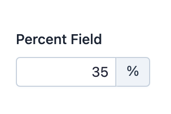

EasyAdmin Percent Field
=======================

This field is used to represent the value of properties that store percentages.

In :ref:`form pages (edit and new) <crud-pages>` it looks like this:

Basic Information
-----------------

* **PHP Class**: ``EasyCorp\Bundle\EasyAdminBundle\Field\PercentField``
* **Doctrine DBAL Type** used to store this value: ``decimal``, ``float`` or
  ``integer``
* **Symfony Form Type** used to render the field: `PercentType`_
* **Rendered as**:

  .. code-block:: html

    <input type="text">

Options
-------

setNumDecimals
~~~~~~~~~~~~~~

By default, percentages are displayed "as is" without adding or removing any
decimals to it. Use this option if you want to format values with a certain
number of decimals::

    // this would format 3 as 3.00 and 5.123 as 5.12
    yield PercentField::new('...')->setNumDecimals(2);

setRoundingMode
~~~~~~~~~~~~~~~

By default, when some value must be rounded to reduce the number of decimals,
the field uses PHP ``\NumberFormatter::ROUND_HALFUP`` strategy. Use this option
to change the rounding strategy and pass as its arguments any of the ``ROUND_*``
constants of `PHP NumberFormatter class`_::

    yield PercentField::new('...')->setRoundingMode(\NumberFormatter::ROUND_CEILING);

setStoredAsFractional
~~~~~~~~~~~~~~~~~~~~~

By default, percentages are stored as fractional values from ``0`` to ``1``
(e.g. 15% is stored as ``0.15`` and 67.84% is stored as ``0.6784``). If you
prefer to store percentages as integer values from ``0`` to ``100``, set this
option to ``false``:

    // if your percentages can have decimals, you must store them as fractional values
    yield PercentField::new('...')->setStoredAsFractional(false);

Regardless of how you store these values, EasyAdmin always display percentages
as values from ``0`` to ``100`` (e.g. even if you store 15% as ``0.15`` in the
database, forms and listings will always display ``15%``).

setSymbol
~~~~~~~~~

By default, values display a ``%`` next to them to make them easier to understand.
Use this option and pass ``false`` to not display any symbol or pass any other
string to use that as the symbol::

    // this won't display any symbol
    yield PercentField::new('...')->setSymbol(false);

    // this will display the "per mille" (per thousand) symbol next to values
    yield PercentField::new('...')->setSymbol('‰');

.. _`PercentType`: https://symfony.com/doc/current/reference/forms/types/percent.html
.. _`PHP NumberFormatter class`: https://www.php.net/manual/en/class.numberformatter.php
