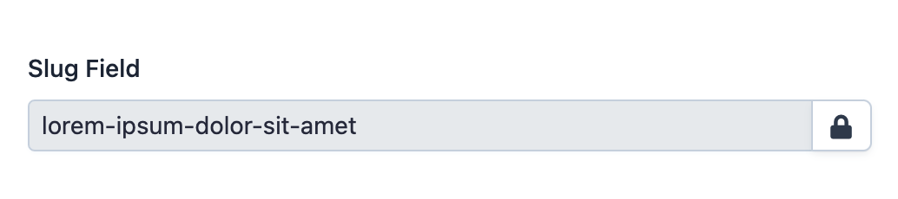

EasyAdmin Slug Field
====================

This field is used to dynamically generate the slug of another text field. The
slug of a text is a simplified version which is safe to include in URLs and file
names. For example, the slug of ``Lorem Ipsum Dolor Sit Amet`` is usually
something like ``lorem-ipsum-dolor-sit-amet``.

In :ref:`form pages (edit and new) <crud-pages>` it looks like this:

Basic Information
-----------------

* **PHP Class**: ``EasyCorp\Bundle\EasyAdminBundle\Field\SlugField``
* **Doctrine DBAL Type** used to store this value: ``string`` or ``ascii_string``
* **Symfony Form Type** used to render the field: ``SlugType``, a custom form
  type created by EasyAdmin based on Symfony's `TextType`_
* **Rendered as**:

  .. code-block:: html

    <input type="text" value="...">

Options
-------

``setTargetFieldName``
~~~~~~~~~~~~~~~~~~~~~~

This field uses JavaScript to generate the slug dynamically based on the contents
of another field. This option defines the name of the entity property that is
associated to that field::

    yield SlugField::new('...')->setTargetFieldName('title');

You can pass multiple field names to generate the slug concatenating the slugs
of all those fields (they are concatenated in the same order as you defined the
fields)::

    // the slugs are concatenated in the same order (e.g. '2023-news-lorem-ipsum')
    yield SlugField::new('...')->setTargetFieldName(['year', 'type', 'title']);

``setUnlockConfirmationMessage``
~~~~~~~~~~~~~~~~~~~~~~~~~~~~~~~~

By default, both the slug and the other field are in sync and the slug text
changes when the other field contents change. However, users can click on the
lock icon of this field to stop syncing the contents, which is needed to
customize the slug text.

Use this option if you want to customize the message displayed when stopping
the sync of contents::

    yield SlugField::new('...')->setUnlockConfirmationMessage(
        'It is highly recommended to use the automatic slugs, but you can customize them'
    );

.. _`TextType`: https://symfony.com/doc/current/reference/forms/types/text.html
