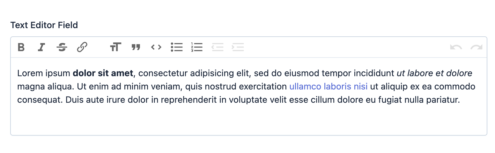

EasyAdmin Text Editor Field
===========================

This field creates a JavaScript-based WYSIWYG editor based on the `Trix editor`_
to manage long texts.

In :ref:`form pages (edit and new) <crud-pages>` it looks like this:

Basic Information
-----------------

* **PHP Class**: ``EasyCorp\Bundle\EasyAdminBundle\Field\TextEditorField``
* **Doctrine DBAL Type** used to store this value: `text`
* **Symfony Form Type** used to render the field: `TextEditorType`_, which is
  based on Symfony's `TextareaType`_
* **Rendered as**:

  .. code-block:: html

    <!-- when loading the page this is transformed into a WYSIWYG editor via JavaScript -->
    <textarea> ... </textarea>

.. tip::

    EasyAdmin provides other fields for long text contents:
    :doc:`TextAreaField </fields/TextareaField>` is ideal for long contents that
    don't need any formatting; :doc:`CodeEditorField </fields/CodeEditorField>`
    is ideal to edit and store any kind of source code.

Options
-------

``setNumOfRows``
~~~~~~~~~~~~~~~~

The height of the editor used in form pages (``new`` and ``edit``) is as large
as needed to display its contents. This height also grows dynamically (via JavaScript)
to always match the number of rows of its contents.

This option sets the number of rows displayed when the field contents are empty.
By default, the initial height is small, so it's a good idea to increase this
value when the expected content is much longer (e.g. a blog post)::

    yield TextEditorField::new('...')->setNumOfRows(30);

.. _`Trix editor`: https://github.com/basecamp/trix
.. _`TextEditorType`: https://github.com/EasyCorp/EasyAdminBundle/blob/4.x/src/Form/Type/TextEditorType.php
.. _`TextareaType`: https://symfony.com/doc/current/reference/forms/types/textarea.html
