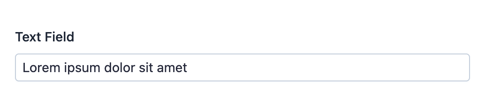

EasyAdmin Text Field
====================

This field is used to represent any kind of short text content. For long text
contents, use :doc:`TextareaField </fields/TextareaField>`,
:doc:`TextEditorField </fields/TextEditorField>` or :doc:`CodeEditorField </fields/CodeEditorField>`.

In :ref:`form pages (edit and new) <crud-pages>` it looks like this:

.. tip::

    If the text content represents some special kind of data (e.g. a telephone
    number or an email address) there are many other specific EasyAdmin fields that
    you can use: :doc:`AvatarField </fields/AvatarField>`, :doc:`ColorField </fields/ColorField>`,
    :doc:`CountryField </fields/CountryField>`, :doc:`CurrencyField </fields/CurrencyField>`,
    :doc:`EmailField </fields/EmailField>`, :doc:`IdField </fields/IdField>`,
    :doc:`ImageField </fields/ImageField>`, :doc:`LanguageField </fields/LanguageField>`,
    :doc:`LocaleField </fields/LocaleField>`, :doc:`SlugField </fields/SlugField>`,
    :doc:`TelephoneField </fields/TelephoneField>`, :doc:`TimezoneField </fields/TimezoneField>`
    and :doc:`UrlField </fields/UrlField>`.

Basic Information
-----------------

* **PHP Class**: ``EasyCorp\Bundle\EasyAdminBundle\Field\TextField``
* **Doctrine DBAL Type** used to store this value: ``string`` or ``ascii_string``
* **Symfony Form Type** used to render the field: `TextType`_
* **Rendered as**:

  .. code-block:: html

    <input type="text" value="...">

Options
-------

``renderAsHtml``
~~~~~~~~~~~~~~~~

In read-only pages (``index`` and ``detail``), text contents are escaped (using
``htmlspecialchars()``) before displaying them. If you have some field where you
want to render HTML tags instead of escaping them, add this option::

    yield TextField::new('...')->renderAsHtml();

``setMaxLength``
~~~~~~~~~~~~~~~~

By default, text contents are displayed in full in the ``detail`` page and are
truncated to a maximum of ``64`` characters in ``index`` page. Use this option
to set the maximum in both ``detail`` and ``index`` pages::

    yield TextField::new('...')->setMaxLength(15);

    // inside configureFields() you have access to the current page name
    // use it to set different values per page
    yield TextField::new('...')->setMaxLength($pageName === Crud::PAGE_DETAIL ? 1024 : 32);

This option only has effect in read-only pages (``index`` and ``detail``). In form
pages (``new`` and ``edit``) contents are never truncated in length.

.. note::

    This option is ignored when also using the ``renderAsHtml()`` option, to
    avoid truncating contents in the middle of an opened HTML tag.

``stripTags``
~~~~~~~~~~~~~

By default, contents are escaped before displaying them. If you prefer, you can
strip HTML tags using this option (which internally calls to ``strip_tags()``
PHP function):

    // if original contents are `<strong>foo</strong>`, it only displays `foo`
    yield TextField::new('...')->stripTags();

.. _`TextType`: https://symfony.com/doc/current/reference/forms/types/text.html
