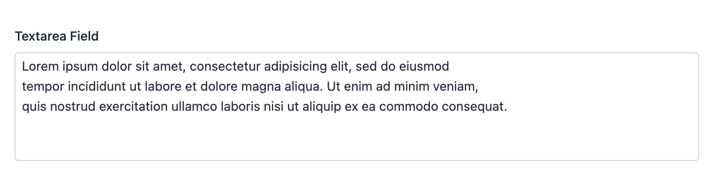

EasyAdmin Textarea Field
========================

This field is used to represent any kind of long text content. For short text
contents, use :doc:`/fields/TextField <TextField>`.

In :ref:`form pages (edit and new) <crud-pages>` it looks like this:

.. tip::

    EasyAdmin provides other fields for long text contents:
    :doc:`TextEditorField </fields/TextEditorField>` is ideal for contents such
    as blog posts or doc pages; :doc:`CodeEditorField </fields/CodeEditorField>`
    is ideal to edit and store any kind of source code.

Basic Information
-----------------

* **PHP Class**: ``EasyCorp\Bundle\EasyAdminBundle\Field\TextareaField``
* **Doctrine DBAL Type** used to store this value: ``text``
* **Symfony Form Type** used to render the field: `TextareaType`_
* **Rendered as**:

  .. code-block:: html

    <textarea> ... </textarea>

Options
-------

``renderAsHtml``
~~~~~~~~~~~~~~~~

In read-only pages (``index`` and ``detail``), text contents are escaped (using
``htmlspecialchars()``) before displaying them. If you have some field where you
want to render HTML tags instead of escaping them, add this option::

    yield TextareaField::new('...')->renderAsHtml();

``setMaxLength``
~~~~~~~~~~~~~~~~

By default, text contents are displayed in full in the ``detail`` page and are
truncated to a maximum of ``64`` characters in ``index`` page. Use this option
to set the maximum in both ``detail`` and ``index`` pages::

    yield TextareaField::new('...')->setMaxLength(15);

    // inside configureFields() you have access to the current page name
    // use it to set different values per page
    yield TextareaField::new('...')->setMaxLength($pageName === Crud::PAGE_DETAIL ? 1024 : 32);

This option only has effect in read-only pages (``index`` and ``detail``). In form
pages (``new`` and ``edit``) contents are never truncated in length.

.. note::

    This option is ignored when also using the ``renderAsHtml()`` option, to
    avoid truncating contents in the middle of an opened HTML tag.

``setNumOfRows``
~~~~~~~~~~~~~~~~

The height of the ``<textarea>`` element used in form pages (``new`` and
``edit``) is as large as needed to display its contents. This height also grows
dynamically (via JavaScript) to always match the number of rows of its contents.

This option sets the number of rows displayed when the field contents are empty.
By default, the initial height is small (``5`` rows), so it's a good idea to
increase this value when the expected content is much longer (e.g. a blog post)::

    yield TextareaField::new('...')->setNumOfRows(30);

``stripTags``
~~~~~~~~~~~~~

By default, contents are escaped before displaying them. If you prefer, you can
strip HTML tags using this option (which internally calls to ``strip_tags()``
PHP function):

    // if original contents are `<strong>foo</strong>`, it only displays `foo`
    yield TextareaField::new('...')->stripTags();

.. _`TextareaType`: https://symfony.com/doc/current/reference/forms/types/textarea.html
