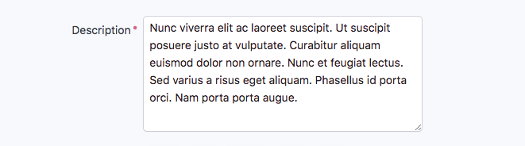
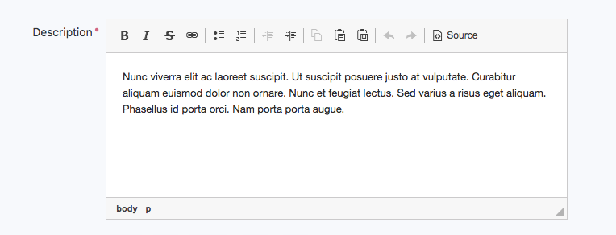
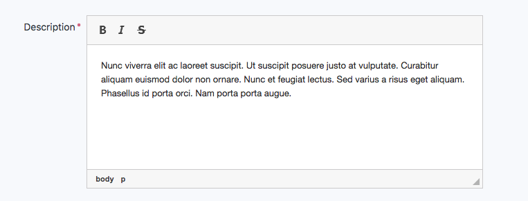

Integrating FOSCKEditorBundle to Create a WYSIWYG Editor
========================================================

.. note::

    Starting from 2.2.1 version, EasyAdmin provides a built-in and ready to use
    text editor based on the `Trix editor`_. It doesn't require installing or
    configuring anything and it covers the needs of most applications.
    :ref:`Learn more about the built-in text editor <form-type-text-editor>`
    and if it doesn't fit your needs, keep reading this article.

EasyAdmin uses a ``<textarea>`` form field to render long text properties:

However, sometimes you need to provide to your users a rich editor, commonly
named *WYSIWYG editor*. Although EasyAdmin doesn't provide any built-in rich text
editor, you can integrate one very easily.

Installing the Rich Text Editor
-------------------------------

The recommended WYSIWYG editor is called `CKEditor`_ and you can integrate it
thanks to the `FOSCKEditorBundle`_:

1) Install the bundle:

.. code-block:: terminal

    $ composer require friendsofsymfony/ckeditor-bundle

2) Install CKEditor:

.. code-block:: terminal

    $ php bin/console ckeditor:install

3) Install the JavaScript/CSS files used by the bundle:

.. code-block:: terminal

    $ php bin/console assets:install --symlink

Finally, add the ``ckeditor_widget.html.twig`` form theme to the list of form
themes used by EasyAdmin so the ``<textarea>`` elements used by the editor are
properly designed:

.. code-block:: yaml

    # config/packages/easy_admin.yaml
    easy_admin:
        design:
            form_theme:
                - '@EasyAdmin/form/bootstrap_4.html.twig'
                - '@FOSCKEditor/Form/ckeditor_widget.html.twig'

Using the Rich Text Editor
--------------------------

FOSCKEditorBundle provides a new form type called ``fos_ckeditor``. Set the
``type`` option of any property to this value to display its contents using a
rich text editor:

.. code-block:: yaml

    # config/packages/easy_admin.yaml
    easy_admin:
        entities:
            Product:
                # ...
                form:
                    fields:
                        # ...
                        - { property: 'description', type: 'fos_ckeditor' }

.. tip::

    Even if your application uses Symfony 3 there is no need to use the FQCN of
    the ``CKEditorType`` (``type: 'FOS\CKEditorBundle\Form\Type\CKEditorType'``)
    because EasyAdmin supports the short types for some popular third-party bundles.

Now, the ``description`` property will be rendered as a rich text editor and not as
a simple ``<textarea>``:

Customizing the Rich Text Editor
--------------------------------

EasyAdmin tweaks some CKEditor settings to improve the user experience. In case
you need further customization, configure the editor globally in your Symfony
application under the ``fos_ck_editor`` option. For example:

.. code-block:: yaml

    # config/packages/fos_ck_editor.yaml
    fos_ck_editor:
        input_sync: true
        default_config: base_config
        configs:
            base_config:
                toolbar:
                    - { name: "styles", items: ['Bold', 'Italic', 'BulletedList', 'Link'] }

    # config/packages/easy_admin.yaml
    easy_admin:
        entities:
            Product:
                # ...
                form:
                    fields:
                        # ...
                        - { property: 'description', type: 'fos_ckeditor' }

In this example, the toolbar is simplified to display just a few common options:

Alternatively, you can also define the editor options in the ``type_options``
setting of the property:

.. code-block:: yaml

    # config/packages/easy_admin.yaml
    easy_admin:
        entities:
            Product:
                # ...
                form:
                    fields:
                        # ...
                        - { property: 'description', type: 'fos_ckeditor', type_options: { 'config': { 'toolbar': [ { name: 'styles', items: ['Bold', 'Italic', 'BulletedList', 'Link'] } ] } } }

This inline configuration is very hard to maintain, so it's recommended to use
the global configuration instead. You can even combine both to define the toolbars
globally and then select the toolbar to use in each property:

.. code-block:: yaml

    # config/packages/fos_ck_editor.yaml
    fos_ck_editor:
        input_sync: true
        default_config: simple_config
        configs:
            simple_config:
                toolbar:
                    # ...
            advanced_config:
                toolbar:
                    # ...

    # config/packages/easy_admin.yaml
    easy_admin:
        entities:
            Product:
                # ...
                form:
                    fields:
                        # ...
                        - { property: 'excerpt', type: 'fos_ckeditor',
                            type_options: { config_name: 'simple_config' } }
                        - { property: 'description', type: 'fos_ckeditor',
                            type_options: { config_name: 'advanced_config' } }

Check out the original CKEditor documentation to get
`its full list of configuration options`_.

Integrating CKFinder
--------------------

`CKFinder`_ is a file manager plugin developed for CKEditor. First, follow its
documentation to download and install the "CKFinder PHP Connector" somewhere in
your Symfony application. Then, read the `CKEditor integration docs`_ and create
a JavaScript file to store the needed code (e.g. ``web/js/setup-ckfinder.js``).

Finally, use the ``design.assets.js`` config option to include that file in every
page loaded by EasyAdmin:

.. code-block:: yaml

    # config/packages/ivory_ck_editor.yaml
    easy_admin:
        design:
            assets:
                js:
                    - '/bundles/cksourceckfinder/ckfinder/ckfinder.js'
                    - '/js/setup-ckfinder.js'
                    # ...

.. _`CKEditor`: http://ckeditor.com/
.. _`FOSCKEditorBundle`: https://github.com/FriendsOfSymfony/FOSCKEditorBundle
.. _`its full list of configuration options`: http://docs.cksource.com/ckeditor_api/symbols/CKEDITOR.config.html
.. _`CKFinder`: https://cksource.com/ckfinder
.. _`CKEditor integration docs`: https://docs.ckeditor.com/ckeditor4/docs/#!/guide/dev_ckfinder_integration
.. _`Trix editor`: https://trix-editor.org/
