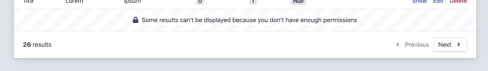

Security
========

EasyAdmin relies on `Symfony Security`_ for everything related to security.
That's why before restricting access to some parts of the backend, you need
to properly setup security in your Symfony application:

#. `Create users`_ in your application and assign them proper permissions
   (e.g. ``ROLE_ADMIN``);
#. `Define a firewall`_ that covers the URL of the backend.

Logged in User Information
--------------------------

When accessing a protected backend, EasyAdmin displays the details of the user
who is logged in the application and a menu with some options like "logout".
Read the :ref:`user menu reference <dashboards-user-menu>` for more details.

.. _security-entire-backend:

Restrict Access to the Entire Backend
-------------------------------------

Using the `access_control option`_, you can tell Symfony to require certain
permissions to browse the URL associated to the backend. This is simple to do
because :ref:`each dashboard only uses a single URL <dashboard-route>`:

.. code-block:: yaml

    # config/packages/security.yaml
    security:
        # ...

        access_control:
            # change '/admin' by the URL used by your Dashboard
            - { path: ^/admin, roles: ROLE_ADMIN }
            # ...

Another option is to `add security annotations`_ to the dashboard controller::

    // app/Controller/Admin/DashboardController.php
    use EasyCorp\Bundle\EasyAdminBundle\Config\Dashboard;
    use EasyCorp\Bundle\EasyAdminBundle\Controller\AbstractDashboardController;
    use Sensio\Bundle\FrameworkExtraBundle\Configuration\IsGranted;

    /**
     * @IsGranted("ROLE_ADMIN")
     */
    class DashboardController extends AbstractDashboardController
    {
        // ...
    }

.. _security-menu:

Restrict Access to Menu Items
-----------------------------

Use the ``setPermission()`` method to define the security permission that the
user must have in order to see the menu item::

    public function configureMenuItems(): iterable
    {
        return [
            // ...

            MenuItem::linkToCrud('Blog Posts', null, BlogPost::class)
                ->setPermission('ROLE_EDITOR'),
        ];
    }

.. note::

    This permission only shows/hides menu items. The actions associated to those
    menu items are still executable, even if the user can't see the menu items.
    Use the :ref:`actions permissions <security-permissions-actions>` to also
    restrict the access to those actions.

If your needs are more advanced, remember that the dashboard class is a regular
Symfony controller, so you can use any service related to security to evaluate
complex expressions. In those cases, it's more convenient to use the alternative
menu item definition to not have to deal with array merges::

    public function configureMenuItems(): iterable
    {
        yield MenuItem::linkToDashboard('Dashboard', 'fa fa-home');

        if ($this->isGranted('ROLE_EDITOR') && '...') {
            yield MenuItem::linkToCrud('Blog Posts', null, BlogPost::class);
        }

        // ...
    }

.. _security-permissions-actions:

Restrict Access to Actions
--------------------------

Use the ``setPermission()`` method to define the security permission required to
see the action link/button::

    use EasyCorp\Bundle\EasyAdminBundle\Config\Action;
    use EasyCorp\Bundle\EasyAdminBundle\Config\Actions;
    use EasyCorp\Bundle\EasyAdminBundle\Config\Crud;

    public function configureActions(Actions $actions): Actions
    {
        $viewInvoice = Action::new('invoice', 'View invoice', 'fa fa-file-invoice')
            ->linkToCrudAction('renderInvoice');

        return $actions
            // ...
            ->add(Crud::PAGE_DETAIL, $viewInvoice)
            // use the 'setPermission()' method to set the permission of actions
            // (the same permission is granted to the action on all pages)
            ->setPermission('invoice', 'ROLE_FINANCE')

            // you can set permissions for built-in actions in the same way
            ->setPermission(Action::NEW, 'ROLE_ADMIN')
        ;
    }

.. _security-fields:

Restrict Access to Fields
-------------------------

There are several options to restrict the information displayed in the page
depending on the logged in user. First, you can show/hide the entire field with
the ``setPermission()`` method::

    public function getFields(string $action): iterable
    {
        return [
            IdField::new('id'),
            TextField::new('price'),
            IntegerField::new('stock'),
            // users must have this permission/role to see this field
            IntegerField::new('sales')->setPermission('ROLE_ADMIN'),
            FloatField::new('commission')->setPermission('ROLE_FINANCE'),
            // ...
        ];
    }

You can also restrict which items users can see in the ``index`` and ``detail``
pages thanks to the ``setEntityPermission()`` method. This value is passed as
the first argument of the call to ``is_granted($permissions, $item)`` function
to decide if the current user can see the given item::

    namespace App\Controller\Admin;

    use EasyCorp\Bundle\EasyAdminBundle\Config\Crud;
    use EasyCorp\Bundle\EasyAdminBundle\Controller\AbstractCrudController;

    class ProductCrudController extends AbstractCrudController
    {
        // ...

        public function configureCrud(Crud $crud): Crud
        {
            return $crud
                ->setEntityPermission('ROLE_ADMIN')
                // ...
            ;
        }
    }

In the ``detail`` page, if the user doesn't have permission they will see an
appropriate error message (and you'll see a detailed error message in the
application logs).

In the ``index`` page, to avoid confusion and pagination errors, if the user
doesn't have permission to see some items, an empty row will be displayed at the
bottom of the list with a message explaining that they don't have enough
permissions to see some items:

Custom Security Voters
----------------------

EasyAdmin implements a Symfony `security voter`_ to check the permissions
defined for actions, entities, menu items, etc. The actual security permissions
are defined as constants in the ``EasyCorp\Bundle\EasyAdminBundle\Security\Permission``
class (e.g. ``Permission::EA_EXECUTE_ACTION``, ``Permission::EA_VIEW_MENU_ITEM``, etc.)

If you define a custom security voter for the backend, consider changing the
`access decision strategy`_ used by your application. The default strategy,
called ``affirmative``, grants access as soon as one voter grants access (if
EasyAdmin voter grants access, your custom voter won't be able to deny it).

That's why you should change the default strategy to ``unanimous``, which
grants access only if there are no voters denying access:

.. code-block:: yaml

    # config/packages/security.yaml
    security:
        access_decision_manager:
            strategy: unanimous

.. _`Symfony Security`: https://symfony.com/doc/current/security.html
.. _`Create users`: https://symfony.com/doc/current/security.html#a-create-your-user-class
.. _`Define a firewall`: https://symfony.com/doc/current/security.html#a-authentication-firewalls
.. _`add security annotations`: https://symfony.com/doc/current/bundles/SensioFrameworkExtraBundle/annotations/security.html
.. _`access_control option`: https://symfony.com/doc/current/security/access_control.html
.. _`security voter`: https://symfony.com/doc/current/security/voters.html
.. _`access decision strategy`: https://symfony.com/doc/current/security/voters.html#changing-the-access-decision-strategy
