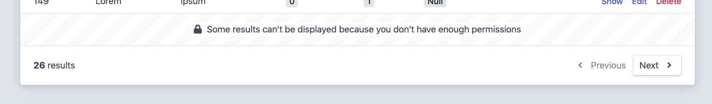

Security
========

EasyAdmin relies on `Symfony Security`_ for everything related to security.
That's why before restricting access to some parts of the backend, you need
to properly set up security in your Symfony application:

#. `Create users`_ in your application and assign them proper permissions
   (e.g. ``ROLE_ADMIN``);
#. `Define a firewall`_ that covers the URL of the backend.

Logged-in User Information
--------------------------

When accessing a protected backend, EasyAdmin displays the details of the user
who is logged in to the application and a menu with some options like "logout".
Read the :ref:`user menu reference <dashboards-user-menu>` for more details.

.. _security-entire-backend:

Restrict Access to the Entire Backend
-------------------------------------

All the routes belonging to a given dashboard :ref:`share a common prefix <dashboard-route>`
(e.g. ``/admin``). This makes it straightforward to secure the backend because
you can use the `access_control option`_ to tell Symfony to require certain
permissions when browsing that URL path:

.. code-block:: yaml

    # config/packages/security.yaml
    security:
        # ...

        access_control:
            # change '/admin' to the prefix used by your Dashboard URLs
            - { path: ^/admin, roles: ROLE_ADMIN }
            # ...

.. _security-controllers:

Restrict Access to Some CRUD Controllers
----------------------------------------

When using more than one :doc:`Dashboard </dashboards>` you might need to restrict
which :doc:`CRUD controllers </crud>` are accessible for each of them.

Consider that in your application you have two dashboards (``DashboardController``
used by your employees and ``GuestDashboardController`` used by external collaborators).
In the guest dashboard you only want to allow certain actions related to your blog.

By default, EasyAdmin generates routes for all CRUD controllers in all dashboards. This means that
there will be undesired routes like ``admin_guest_invoice``, ``admin_guest_user_detail``, etc.
The best way to restrict which CRUD controllers are accessible via each dashboard
is to use the ``#[AdminDashboard]`` attribute::

    // app/Controller/Admin/DashboardController.php
    use EasyCorp\Bundle\EasyAdminBundle\Attribute\AdminDashboard;
    use EasyCorp\Bundle\EasyAdminBundle\Controller\AbstractDashboardController;

    #[AdminDashboard(routePath: '/admin', routeName: 'admin', allowedControllers: [
        BlogPostCrudController::class,
        BlogCategoryCrudController::class,
    ])]
    class DashboardController extends AbstractDashboardController
    {
        // ...
    }

The ``allowedControllers`` option defines the only CRUD controllers that will be
available in the dashboard via Symfony routes. In practice, the above configuration
will make EasyAdmin to only generate the routes ``admin_guest_blog_post_*`` and
``admin_guest_blog_category_*``, skipping all the other routes that would have
allowed to access the other controllers.

.. tip::

    You can also define the opposite option (``deniedControllers``) to allow all
    controllers except the ones included in that list.

.. _security-menu:

Restrict Access to Menu Items
-----------------------------

Use the ``setPermission()`` method to define the security permission that the
user must have to see the menu item::

    public function configureMenuItems(): iterable
    {
        return [
            // ...

            MenuItem::linkTo(BlogPostCrudController::class, 'Blog Posts')
                ->setPermission('ROLE_EDITOR'),
        ];
    }

.. note::

    This permission only shows/hides menu items. The actions associated to those
    menu items are still executable, even if the user can't see the menu items.
    Use the :ref:`actions permissions <security-permissions-actions>` to also
    restrict the access to those actions.

If your needs are more advanced, remember that the dashboard class is a regular
Symfony controller, so you can use any service related to security to evaluate
complex expressions. In those cases, it's more convenient to use the alternative
menu item definition to not have to deal with array merges::

    public function configureMenuItems(): iterable
    {
        yield MenuItem::linkToDashboard('Dashboard', 'fa fa-home');

        if ($this->isGranted('ROLE_EDITOR') && '...') {
            yield MenuItem::linkTo(BlogPostCrudController::class, 'Blog Posts');
        }

        // ...
    }

.. _security-permissions-actions:

Restrict Access to Actions
--------------------------

Use the ``setPermission()`` method to define the security permission required to
see the action link/button::

    use EasyCorp\Bundle\EasyAdminBundle\Config\Action;
    use EasyCorp\Bundle\EasyAdminBundle\Config\Actions;
    use EasyCorp\Bundle\EasyAdminBundle\Config\Crud;

    public function configureActions(Actions $actions): Actions
    {
        $viewInvoice = Action::new('invoice', 'View invoice', 'fa fa-file-invoice')
            ->linkToCrudAction('renderInvoice');

        return $actions
            // ...
            ->add(Crud::PAGE_DETAIL, $viewInvoice)
            // use the 'setPermission()' method to set the permission of actions
            // (the same permission is granted to the action on all pages)
            ->setPermission('invoice', 'ROLE_FINANCE')

            // you can set permissions for built-in actions in the same way
            ->setPermission(Action::NEW, 'ROLE_ADMIN')
        ;
    }

.. _security-permissions-other-crud:

Check the Permissions of Another CRUD Controller
------------------------------------------------

EasyAdmin applies the ``setPermission()`` and ``setEntityPermission()``
configuration of a CRUD controller before rendering a link to it (for example,
the link of an ``AssociationField`` to the related entity). If your own code
renders links or embedded blocks that belong to another CRUD controller (e.g. in
a custom field configurator), use the ``CrudPermissionCheckerInterface`` service
to apply the same rules instead of duplicating the permission names::

    use EasyCorp\Bundle\EasyAdminBundle\Config\Action;
    use EasyCorp\Bundle\EasyAdminBundle\Context\AdminContext;
    use EasyCorp\Bundle\EasyAdminBundle\Contracts\Security\CrudPermissionCheckerInterface;
    use EasyCorp\Bundle\EasyAdminBundle\Dto\EntityDto;
    use EasyCorp\Bundle\EasyAdminBundle\Dto\FieldDto;

    final class InvoicePreviewConfigurator implements FieldConfiguratorInterface
    {
        public function __construct(
            private CrudPermissionCheckerInterface $permissionChecker,
        ) {
        }

        public function configure(FieldDto $field, EntityDto $entityDto, AdminContext $context): void
        {
            $invoiceDto = // ... the EntityDto of the related invoice

            // TRUE only if the user can run the 'detail' action of InvoiceCrudController
            // for this invoice, according to that controller's own permissions
            if (!$this->permissionChecker->isGranted($context, InvoiceCrudController::class, Action::DETAIL, $invoiceDto)) {
                // ... hide the field or render a notice instead of the preview
            }
        }

        // ...
    }

Pass the ``EntityDto`` of the target entity whenever you have it: the
``setEntityPermission()`` check needs the entity instance. When you pass
``null``, only the action-level permission is checked.

.. _security-fields:

Restrict Access to Fields
-------------------------

There are several options to restrict the information displayed in the page
depending on the logged in user. First, you can show/hide the entire field with
the ``setPermission()`` method::

    public function getFields(string $action): iterable
    {
        return [
            IdField::new('id'),
            TextField::new('price'),
            IntegerField::new('stock'),
            // users must have this permission/role to see this field
            IntegerField::new('sales')->setPermission('ROLE_ADMIN'),
            FloatField::new('commission')->setPermission('ROLE_FINANCE'),
            // ...
        ];
    }

You can also restrict which items users can see in the ``index`` and ``detail``
pages thanks to the ``setEntityPermission()`` method. This value is passed as
the first argument of the call to ``is_granted($permissions, $item)`` function
to decide whether the current user can see the given item::

    namespace App\Controller\Admin;

    use EasyCorp\Bundle\EasyAdminBundle\Config\Crud;
    use EasyCorp\Bundle\EasyAdminBundle\Controller\AbstractCrudController;

    class ProductCrudController extends AbstractCrudController
    {
        // ...

        public function configureCrud(Crud $crud): Crud
        {
            return $crud
                ->setEntityPermission('ROLE_ADMIN')
                // ...
            ;
        }
    }

In the ``detail`` page, if the user doesn't have permission they will see an
appropriate error message (and you'll see a detailed error message in the
application logs).

In the ``index`` page, to avoid confusion and pagination errors, if the user
doesn't have permission to see some items, an empty row will be displayed at the
bottom of the list with a message explaining that they don't have enough
permissions to see some items:

.. _security-expressions:

Restricting Access with Expressions
-----------------------------------

The `Symfony ExpressionLanguage component`_ allows you to define complex configuration
logic using simple expressions. In EasyAdmin, all ``setPermission()`` methods
allow you to pass not only a string with some security role name (e.g. ``ROLE_ADMIN``)
but also a full ``Expression`` object.

First, install the component in your project using Composer:

.. code-block:: terminal

    $ composer require symfony/expression-language

Now, you can pass a Symfony Expression object to any ``setPermission()`` method
like this::

    use Symfony\Component\ExpressionLanguage\Expression;

    MenuItem::linkTo(ExampleCrudController::class, 'Restricted menu-item')
        ->setPermission(new Expression('"ROLE_DEVELOPER" in role_names and "ROLE_EXTERNAL" not in role_names'));

Expressions enable the definition of much more detailed permissions, based on
several role names, user attributes, or the given subject. The expressions can
include any of these variables:

* ``user`` - the current user object
* ``role_names`` - all the roles of current user as an array
* ``subject`` or ``object`` - the current subject being checked
* ``token`` - the authentication token
* ``trust_resolver`` - the authentication trust resolver
* ``auth_checker`` - an instance of the authorization checker service

Custom Security Voters
----------------------

EasyAdmin implements a Symfony `security voter`_ to check the permissions
defined for actions, entities, menu items, etc. The actual security permissions
are defined as constants in the ``EasyCorp\Bundle\EasyAdminBundle\Security\Permission``
class (e.g. ``Permission::EA_EXECUTE_ACTION``, ``Permission::EA_VIEW_MENU_ITEM``, etc.)

If you define a custom security voter for the backend, consider changing the
`access decision strategy`_ used by your application. The default strategy,
called ``affirmative``, grants access as soon as one voter grants access (if
EasyAdmin voter grants access, your custom voter won't be able to deny it).

That's why you should change the default strategy to ``unanimous``, which
grants access only if there are no voters denying access:

.. code-block:: yaml

    # config/packages/security.yaml
    security:
        access_decision_manager:
            strategy: unanimous

.. _`Symfony Security`: https://symfony.com/doc/current/security.html
.. _`Create users`: https://symfony.com/doc/current/security.html#a-create-your-user-class
.. _`Define a firewall`: https://symfony.com/doc/current/security.html#a-authentication-firewalls
.. _`access_control option`: https://symfony.com/doc/current/security/access_control.html
.. _`security voter`: https://symfony.com/doc/current/security/voters.html
.. _`access decision strategy`: https://symfony.com/doc/current/security/voters.html#changing-the-access-decision-strategy
.. _`Symfony ExpressionLanguage component`: https://symfony.com/doc/current/components/expression_language.html
